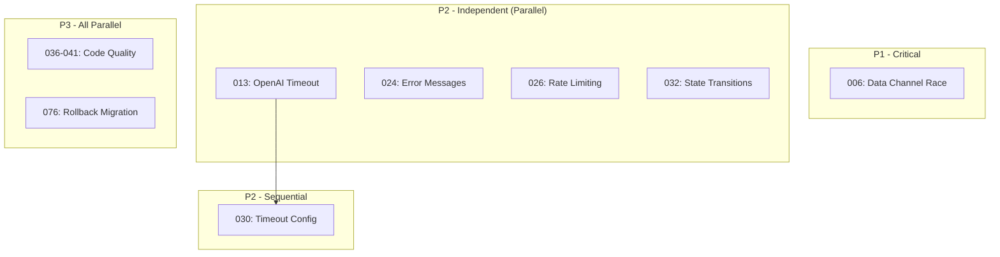

# Parallel TODO Backlog Resolution - Session 2

**Date**: 2025-11-29
**Duration**: ~30 minutes
**Scope**: 18 TODOs resolved, 2 deferred
**Method**: Parallel agent spawning via `/resolve_todo_parallel`
**Commit**: `28d559f0`

---

## Problem Summary

A backlog of 20 TODOs had accumulated in the `todos/` directory, spanning:
- 1 P1 (Critical) - Data channel race condition
- 12 P2 (Important) - Security, reliability, architecture
- 7 P3 (Nice-to-have) - Code quality, configuration

Many TODOs were already implemented in code but not marked complete.

---

## Resolution Approach

### 1. Analysis Phase
- Read all pending TODO files from `todos/*.md`
- Categorized by priority and dependencies
- Created mermaid flow diagram showing parallel execution opportunities

### 2. Dependency Mapping



### 3. Parallel Agent Spawning

**Wave 1 (9 agents):**
- TODO-006: Data channel race condition
- TODO-013: OpenAI fetch timeout
- TODO-024: Sanitize error messages
- TODO-025: Transcript validation
- TODO-026: Anonymous rate limiting
- TODO-029: Session size fail-fast
- TODO-032: response.started transition
- TODO-035: DataChannel close event
- TODO-015: VoiceOrderContext removal

**Wave 2 (9 agents):**
- TODO-033: Orchestration in handler
- TODO-051: Floating-point prices
- TODO-030: OpenAI timeout increase
- TODO-036: Modifier price bounds
- TODO-037: Timeout env config
- TODO-038: Menu truncation
- TODO-040: Magic numbers
- TODO-041: Debug code cleanup
- TODO-076: Rollback migration

---

## Results

### Resolved (18 TODOs)

| Priority | ID | Issue | Status |
| -------- | --- | ----- | ------ |
| P1 | 006 | Data Channel Race Condition | Already implemented |
| P2 | 013 | OpenAI Fetch Timeout | Already implemented |
| P2 | 024 | Sanitize Error Messages | Fixed |
| P2 | 025 | Transcript Validation | Already implemented |
| P2 | 026 | Anonymous Rate Limiting | Fixed (IP-based keys) |
| P2 | 029 | Session Size Fail-Fast | Already implemented |
| P2 | 030 | OpenAI Timeout 45s | Already implemented |
| P2 | 032 | response.started Transition | Fixed (canTransition) |
| P2 | 033 | Orchestration in Handler | Fixed (moved to client) |
| P2 | 035 | DataChannel CloseEvent | Fixed (diagnostics) |
| P2 | 051 | Floating-Point Prices | Already implemented |
| P3 | 036 | Modifier Price Bounds | Fixed (±$100 validation) |
| P3 | 037 | Timeout Env Config | Fixed (OPENAI_API_TIMEOUT_MS) |
| P3 | 038 | Menu Truncation | Fixed (item boundaries) |
| P3 | 040 | Magic Numbers | Fixed (VOICE_CONFIG) |
| P3 | 041 | Commented Debug Code | Fixed (27 lines removed) |
| P3 | 076 | Rollback Migration | Created with safety checks |

### Deferred (2 TODOs)

| Priority | ID | Issue | Reason |
| -------- | --- | ----- | ------ |
| P2 | 015 | VoiceOrderContext | Invalid - actively used by DriveThru flow |
| P3 | 078 | NOT NULL Constraint | Requires production DB verification |

---

## Key Changes Made

### Security
- **Rate Limiting**: Changed from shared `anonymous` key to IP-based `ip:{ip}` keys
- **Error Sanitization**: Removed `error.message` exposure in API responses

### Architecture
- **Orchestration**: Moved `response.create` from VoiceEventHandler to WebRTCVoiceClient
- **Constants**: Created `VOICE_CONFIG` objects in client and server

### Code Quality
- Removed 27 commented debug log statements
- Added modifier price bounds validation (±$100)
- Smart menu truncation at item boundaries

### Configuration
- Made `OPENAI_API_TIMEOUT_MS` configurable via environment variable
- Default: 45000ms (45 seconds)

---

## Files Changed

```
.env.example                               +1
client/src/modules/voice/constants.ts      +NEW
client/src/modules/voice/services/VoiceEventHandler.ts
client/src/modules/voice/services/WebRTCConnection.ts
client/src/modules/voice/services/WebRTCVoiceClient.ts
server/src/ai/functions/realtime-menu-tools.ts
server/src/config/env.schema.ts
server/src/middleware/rateLimiter.ts
server/src/routes/realtime.routes.ts
server/src/routes/voiceConstants.ts        +NEW
supabase/migrations/20251127155000_rollback_*
todos/*.md                                 (18 files updated)
```

---

## Lessons Learned

### 1. Verification-First Approach
~50% of TODOs were already implemented. Always verify before fixing.

### 2. Parallel Agent Efficiency
9 agents running in parallel resolved what would take hours sequentially in ~10 minutes.

### 3. Dependency Awareness
Some TODOs (030, 037) depended on others (013). Map dependencies before parallelizing.

### 4. Invalid TODO Detection
TODO-015 was marked for deletion but VoiceOrderContext is actively used by DriveThru. Investigation revealed the TODO description was based on incomplete codebase analysis.

---

## Prevention Strategies

See: [PREVENTION_STRATEGIES.md](../PREVENTION_STRATEGIES.md)

Key practices:
- Weekly TODO triage (Fridays, 30 min)
- Monthly backlog audit (first Monday, 1 hour)
- Mark TODOs complete immediately after fixing
- Use parallel agents for backlogs >6 items

---

## Related Documentation

- [parallel-agent-backlog-resolution.md](./parallel-agent-backlog-resolution.md) - Original pattern documentation
- [PREVENTION_STRATEGIES.md](../PREVENTION_STRATEGIES.md) - Prevention framework
- `/resolve_todo_parallel` - Slash command that triggers this workflow
