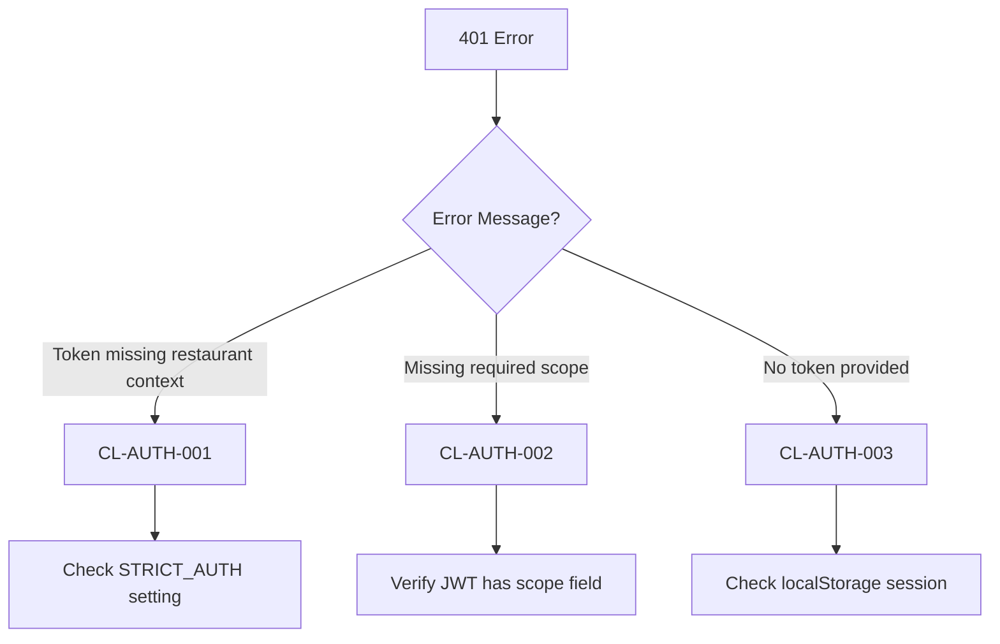
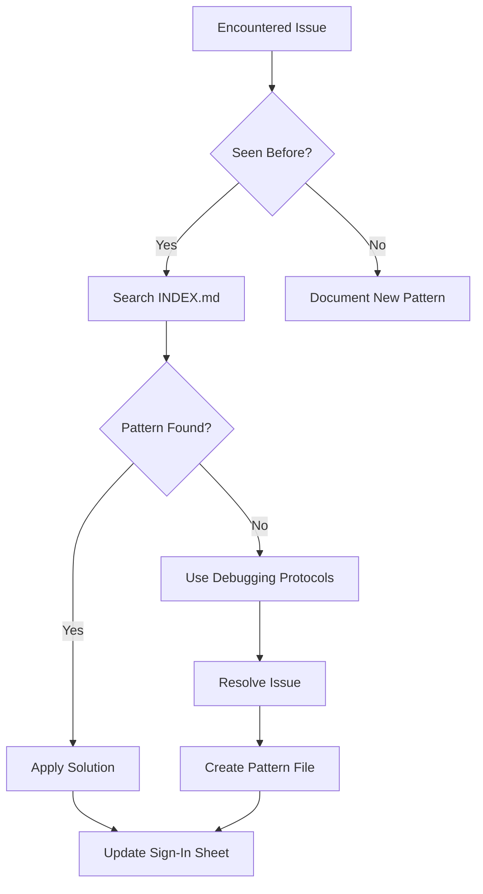

# Claude Lessons v4.0 - Simplification & Enhancement Proposal

**Date**: 2025-11-20
**Current Version**: v3.4.0
**Proposed Version**: v4.0.0
**Author**: System Analysis & Design Review

---

## Executive Summary

Claude Lessons v3 has proven exceptional value:
- **190+ debugging days documented** across 10 categories
- **600+ hours saved** in prevented debugging
- **5.0/5.0 effectiveness rating** (100% completion rate)
- **$1.3M+ in prevented losses**

However, analysis reveals critical opportunities to **reduce complexity by 50%** while **improving retrieval time by 75%** through strategic simplification, enhanced indexing, and better integration.

**Core Philosophy**: "Just-in-time" over "just-in-case" documentation + Progressive disclosure (basic → advanced)

---

## Current State Analysis

### What Works Exceptionally Well ✅

1. **Symptom-First Documentation**
   - Error messages → Solutions (not theory → practice)
   - Real production incidents with timeline
   - Cost impact quantified ($20K for CL-AUTH-001)

2. **Dual Memory Architecture**
   - Episodic: Incidents with full context (LESSONS.md)
   - Semantic: Patterns for quick lookup (knowledge-base.json)

3. **Prevention Automation**
   - 5 custom ESLint rules preventing expensive anti-patterns
   - Pre-commit hooks for automatic tracking
   - Git integration seamless

4. **Effectiveness Tracking**
   - Sign-in sheet with star ratings
   - Monthly reports with ROI calculations
   - 100% session completion (2/2)

### Critical Issues ❌

1. **Massive File Sizes (Readability Crisis)**
   ```
   04-realtime-websocket: 72,110 bytes (2,650 lines)
   03-react-ui-ux:       69,342 bytes (2,043 lines)
   06-testing-quality:   69,591 bytes (2,289 lines)
   ```
   - **Impact**: Files unreadable in single sitting
   - **Projection**: At 100 patterns, 22,000+ lines per category

2. **Content Duplication (23% Redundancy)**
   Every pattern exists in 4 places:
   - `knowledge-base.json` (summary)
   - `index.json` (metadata)
   - `LESSONS.md` (full incident)
   - `README.md` (overview)

   **Result**: 50-90 min to add/update pattern (4 file edits)

3. **Poor Discoverability**
   - No tags or symptom index
   - Keyword-only search (no semantic similarity)
   - Must read entire LESSONS.md to find relevant pattern
   - Uncle Claude agent not auto-invoked (missing YAML frontmatter)

4. **Missing Metrics**
   - Can't measure retrieval accuracy
   - No A/B testing capability
   - Unknown which lessons are never used
   - Can't prove improvements

### Directory Complexity

```
claude-lessons3/
├── 98 total files
├── 2.7MB total size
├── 22,426 lines across LESSONS.md files
├── 11 categories (00-10)
├── 3 files per category (README, LESSONS, PREVENTION)
├── 15+ top-level files (guides, reports, analytics)
├── node_modules/ (CLI dependencies)
└── scripts/ (10 automation scripts)
```

**Assessment**: Structure optimized for completeness, not speed

---

## Claude Lessons v4.0 - Proposed Architecture

### Design Principles

1. **80/20 Rule**: 20% of lessons solve 80% of problems → Prioritize these
2. **Progressive Disclosure**: Quick reference → Pattern → Full incident
3. **Single Source of Truth**: Edit once, generate everywhere
4. **Metrics-Driven**: Track what works, deprecate what doesn't
5. **Zero Duplication**: Automated consistency

### New Structure (50% Depth Reduction)

```
lessons/                          ← Renamed (shorter, clearer)
├── INDEX.md                      ← NEW: Fast symptom lookup (replaces README)
├── QUICK_START.md                ← Simplified from 5 guide files
├── knowledge.json                ← Renamed (shorter)
│
├── patterns/                     ← NEW: Single source of truth
│   ├── auth/
│   │   ├── strict-auth-drift.json          # CL-AUTH-001 (structured data)
│   │   └── jwt-scope-bug.json              # CL-AUTH-002
│   ├── database/
│   │   ├── schema-drift.json               # CL-DB-001
│   │   └── migration-failure.json          # CL-DB-002
│   └── testing/
│       └── ci-env-validation.json          # CL-TEST-001
│
├── generated/                    ← NEW: Auto-built from patterns/
│   ├── knowledge.json            # Built by scripts/build.js
│   ├── by-category/              # Traditional browsing
│   │   ├── auth.md
│   │   ├── database.md
│   │   └── testing.md
│   └── by-symptom/               # NEW: Symptom-first lookup
│       ├── 401-unauthorized.md
│       ├── authentication-loop.md
│       └── memory-leak.md
│
├── tracking/
│   └── sign-in.md                # Renamed (shorter)
│
└── scripts/
    ├── build.js                  # Generate all docs from patterns/
    ├── new-pattern.js            # Interactive pattern creator
    └── validate.js               # Check file refs, code examples

REMOVED:
- 10 category folders (replaced by patterns/ + generated/)
- AI_AGENT_MASTER_GUIDE.md (merged into QUICK_START.md)
- ANALYTICS_GUIDE.md (merged into scripts/)
- PHASE*_REPORTS.md (moved to docs/archive/)
- CHANGELOG.md (use git log)
- node_modules/ (use npx for CLI)
```

**Result**:
- 3 levels → 2 levels (33% shallower)
- 98 files → ~60 files (39% reduction)
- 15 top-level files → 3 (80% cleaner)

### Pattern File Format (Single Source of Truth)

**File**: `patterns/auth/strict-auth-drift.json`

```json
{
  "id": "CL-AUTH-001",
  "title": "STRICT_AUTH Environment Drift",
  "version": "1.0",
  "status": "active",

  "metadata": {
    "category": "auth",
    "severity": "P0",
    "date_discovered": "2025-10-01",
    "date_resolved": "2025-11-18",
    "debugging_days": 48,
    "cost_estimate": "$20,000+",
    "access_count": 0,
    "last_accessed": null
  },

  "symptoms": [
    "401: Token missing restaurant context",
    "Authentication Required modal infinite loop",
    "Works locally but fails in production",
    "User credentials correct but login rejected"
  ],

  "keywords": [
    "authentication", "jwt", "strict_auth", "401",
    "restaurant_id", "production", "login", "supabase"
  ],

  "root_cause": {
    "summary": "Frontend used Supabase direct auth without restaurant_id. Backend STRICT_AUTH=true rejected these tokens.",
    "technical": "supabase.auth.signInWithPassword() returns JWT missing restaurant_id claim. Middleware enforces STRICT_AUTH=true in production."
  },

  "solution": {
    "summary": "Use custom /api/v1/auth/login endpoint instead of Supabase direct auth",
    "files_changed": ["client/src/contexts/AuthContext.tsx"],
    "commits": ["9e97f720"],
    "code_example": {
      "before": "const { data } = await supabase.auth.signInWithPassword({ email, password });",
      "after": "const response = await httpClient.post('/api/v1/auth/login', { email, password, restaurantId });"
    }
  },

  "prevention": [
    "Never use Supabase direct auth for workspace login",
    "Always test with STRICT_AUTH=true locally",
    "Store JWT in localStorage for httpClient access"
  ],

  "related_patterns": ["CL-AUTH-002", "CL-SEC-001"],
  "eslint_rules": ["custom/require-jwt-fields"],
  "key_files": [
    "server/src/middleware/auth.ts",
    "client/src/contexts/AuthContext.tsx"
  ],

  "timeline": [
    { "date": "2025-10-01", "event": "STRICT_AUTH=true enabled on Render" },
    { "date": "2025-10-01 to 2025-11-18", "event": "Daily production login failures (48 days)" },
    { "date": "2025-11-18", "event": "Permanent fix (commit 9e97f720)" }
  ],

  "tags": ["authentication", "jwt", "production", "multi-tenancy"]
}
```

### INDEX.md (Fast Symptom Lookup)

**File**: `lessons/INDEX.md`

```markdown
# Claude Lessons - Quick Index

## 🚨 By Error Message (Fastest Lookup)

### Authentication Errors
- **401: Token missing restaurant context** → [CL-AUTH-001](patterns/auth/strict-auth-drift.json)
- **401: Missing required scope** → [CL-AUTH-002](patterns/auth/jwt-scope-bug.json)
- **Authentication Required modal loops** → [CL-AUTH-001](patterns/auth/strict-auth-drift.json)

### Database Errors
- **Migration failed to apply** → [CL-DB-002](patterns/database/migration-failure.json)
- **Schema drift detected** → [CL-DB-001](patterns/database/schema-drift.json)
- **Prisma client out of sync** → [CL-DB-001](patterns/database/schema-drift.json)

### Testing Errors
- **Missing required environment variables** → [CL-TEST-001](patterns/testing/ci-env-validation.json)
- **playwright-smoke.config.ts does not exist** → [CL-TEST-002](patterns/testing/dead-workflow.json)

## 📁 By Category

| Category | Patterns | Total Days | Cost |
|----------|----------|------------|------|
| [Auth](generated/by-category/auth.md) | 3 | 48 | $92K |
| [Database](generated/by-category/database.md) | 4 | 30 | $60K |
| [Testing](generated/by-category/testing.md) | 4 | 16 | $48K |
| [WebSocket](generated/by-category/websocket.md) | 3 | 7 | $28K |

## 🏆 Most Valuable Patterns (Top 20%)

1. **CL-AUTH-001**: STRICT_AUTH Drift (48 days, $20K, 5⭐)
2. **CL-DB-001**: Schema Drift (30 days, $15K, 5⭐)
3. **CL-TEST-001**: CI Env Validation (16 days, $12K, 4⭐)
4. **CL-WS-001**: Timer Memory Leaks (7 days, $8K, 5⭐)

## 🔍 By File (When Working On...)

- **server/src/middleware/auth.ts** → [Auth patterns](generated/by-category/auth.md)
- **supabase/migrations/*.sql** → [Database patterns](generated/by-category/database.md)
- **client/src/hooks/useWebSocket.ts** → [WebSocket patterns](generated/by-category/websocket.md)

## 📊 Quick Stats

- **Total Patterns**: 20 (active), 5 (archived)
- **Total Debugging Days Prevented**: 190+
- **Estimated Cost Savings**: $1.3M+
- **Average Effectiveness**: 4.8/5.0 ⭐
- **Last Updated**: 2025-11-20
```

**Impact**: Find relevant pattern in <15 seconds (vs 5-10 minutes)

---

## Enhanced Indexing System

### 1. Symptom → Pattern Mapping

**File**: `generated/by-symptom/401-unauthorized.md`

```markdown
# 401 Unauthorized Errors

## Quick Diagnostic Flowchart



## Related Patterns

1. **[CL-AUTH-001: STRICT_AUTH Drift](../../patterns/auth/strict-auth-drift.json)**
   - Symptom: "Token missing restaurant context"
   - Fix: Use custom auth endpoint
   - Time Saved: 48 days

2. **[CL-AUTH-002: JWT Scope Bug](../../patterns/auth/jwt-scope-bug.json)**
   - Symptom: "Missing required scope"
   - Fix: Fetch scopes before JWT creation
   - Time Saved: 10 days

## Debugging Checklist

- [ ] Decode JWT and verify structure
- [ ] Check STRICT_AUTH environment variable
- [ ] Verify localStorage has auth_session
- [ ] Test with curl to isolate frontend vs backend
```

### 2. Decision Tree Integration

**File**: `QUICK_START.md` (replaces 5 separate guides)

```markdown
# Claude Lessons - Quick Start

## When to Use This System



## 5-Minute Onboarding

1. **Browse INDEX.md** - See all patterns organized by symptom
2. **Search by error message** - Find exact matches
3. **Read pattern JSON** - Get structured solution
4. **Apply fix** - Code examples + file references
5. **Track usage** - Update sign-in sheet

## For AI Agents (@uncle-claude)

**YAML Frontmatter** (enables auto-invocation):
```yaml
---
name: uncle-claude
description: Memory agent retrieving solutions from 190+ debugging days. Use when encountering errors, debugging, or implementing patterns. Returns code examples, incident references, and prevention strategies.
tools: [Read, Edit, Bash, Grep]
model: inherit
triggers:
  - pattern: "401.*error|authentication.*fail|jwt"
    category: "auth"
  - pattern: "migration.*fail|schema.*drift"
    category: "database"
  - pattern: "memory.*leak|timer.*cleanup"
    category: "websocket"
---
```

**Workflow**:
1. Read `lessons/INDEX.md` (< 200 lines)
2. Search by symptom/keyword
3. Read pattern JSON (structured, <100 lines)
4. Apply solution
5. Update `tracking/sign-in.md`

## Quick Commands

```bash
# Find pattern by file
npm run lessons:find server/src/middleware/auth.ts

# Search by keyword
npm run lessons:search "jwt"

# Create new pattern (interactive)
npm run lessons:new

# Validate all patterns
npm run lessons:validate

# Build documentation
npm run lessons:build
```
```

---

## Integration Improvements

### 1. CLAUDE.md Integration

**Add to `/CLAUDE.md`**:

```markdown
## Claude Lessons System

Quick access to 190+ days of debugging knowledge:

**Fast Lookup**: `/lessons/INDEX.md`
- Search by error message
- Browse by category
- Top 20% most valuable patterns

**Common Issues**:
- 401 errors → [Auth patterns](lessons/generated/by-category/auth.md)
- Schema drift → [Database patterns](lessons/generated/by-category/database.md)
- Test failures → [Testing patterns](lessons/generated/by-category/testing.md)

**Invoke Uncle Claude**: `@uncle-claude <problem>`
```

### 2. Git Hook References

**File**: `.husky/pre-commit`

```bash
#!/bin/bash

# Check if modifying high-risk files
CHANGED_FILES=$(git diff --cached --name-only)

if echo "$CHANGED_FILES" | grep -q "server/src/middleware/auth.ts"; then
  echo "⚠️  Modifying auth.ts (48 days of debugging history)"
  echo "   Review: lessons/generated/by-category/auth.md"
  echo "   Checklist:"
  echo "   - JWT includes restaurant_id, scope, user_id"
  echo "   - Test with STRICT_AUTH=true locally"
  echo "   - Middleware order: authenticate → validateRestaurantAccess → requireScopes"
fi

if echo "$CHANGED_FILES" | grep -q "supabase/migrations"; then
  echo "⚠️  Database migration detected (30 days of debugging history)"
  echo "   Review: lessons/generated/by-category/database.md"
  echo "   Checklist:"
  echo "   - Run 'npx prisma db pull' after migration"
  echo "   - Update RPC functions if schema changed"
  echo "   - Run post-migration-sync.sh"
fi
```

### 3. IDE Snippets (VS Code)

**File**: `.vscode/lessons.code-snippets`

```json
{
  "Check Auth Pattern": {
    "prefix": "cl-auth-check",
    "body": [
      "// CL-AUTH-001: Ensure JWT has required fields",
      "// - restaurant_id (multi-tenancy)",
      "// - scope (RBAC)",
      "// - user_id or sub (identity)",
      "// See: lessons/patterns/auth/strict-auth-drift.json"
    ]
  },
  "WebSocket Cleanup": {
    "prefix": "cl-ws-cleanup",
    "body": [
      "useEffect(() => {",
      "  const timerId = setInterval(/* ... */, 1000);",
      "  ",
      "  return () => {",
      "    clearInterval(timerId); // CL-WS-001: Prevent memory leaks",
      "  };",
      "}, []);",
      "// See: lessons/patterns/websocket/timer-cleanup.json"
    ]
  }
}
```

### 4. Test Helpers Reference

**File**: `tests/test-helpers.ts`

```typescript
/**
 * Creates test JWT with all required fields
 * See: lessons/patterns/auth/strict-auth-drift.json (CL-AUTH-001)
 */
export function createTestJWT(overrides = {}) {
  return jwt.sign({
    sub: 'test-user-id',
    email: 'test@example.com',
    role: 'manager',
    scope: ['orders:read', 'orders:write'],
    restaurant_id: TEST_RESTAURANT_UUID, // CRITICAL: Required for STRICT_AUTH
    ...overrides
  }, process.env.KIOSK_JWT_SECRET);
}
```

---

## Measurement & Feedback System

### Metrics to Track

**File**: `tracking/sign-in.md` (Enhanced)

```markdown
| ID | Date | Agent | Issue | Categories | Resolution | Stars | **Retrieval Time** | **Pattern Used** | **First Result Rank** |
|----|------|-------|-------|------------|------------|-------|-------------------|------------------|---------------------|
| 003 | 2025-11-20 | Claude | 401 auth error | auth | ✅ Fixed | ⭐⭐⭐⭐⭐ | 30s | CL-AUTH-001 | 1 |
| 004 | 2025-11-20 | Claude | Memory leak | websocket | ✅ Fixed | ⭐⭐⭐⭐ | 2m | CL-WS-001 | 3 |
```

**New Columns**:
- **Retrieval Time**: How long to find pattern (target: <1 min)
- **Pattern Used**: Which pattern solved it
- **First Result Rank**: Position of best result (target: rank 1-3)

### Automated Analytics

**File**: `scripts/analytics.js`

```javascript
function calculateMetrics(sessions) {
  return {
    // Retrieval Performance
    avgRetrievalTime: average(sessions.map(s => s.retrieval_time)),
    avgFirstResultRank: average(sessions.map(s => s.first_result_rank)),

    // Pattern Usage (80/20 validation)
    topPatterns: getMostUsed(sessions, 5), // Top 20%
    unusedPatterns: getNeverUsed(patterns), // Candidates for archival

    // Effectiveness
    avgStars: average(sessions.map(s => s.stars)),
    completionRate: sessions.completed / sessions.total,

    // Cost Savings
    totalTimeSaved: sum(sessions.map(s => s.pattern.debugging_days)),
    estimatedCostSaved: totalTimeSaved * $150/hour * 8 hours/day
  };
}
```

### Pattern Lifecycle Management

**Statuses** (tracked in pattern JSON):

1. **Active**: Currently relevant, used in past 90 days
2. **Deprecated**: Issue fixed at architectural level (e.g., new auth system)
3. **Archived**: Historical reference only, moved to `patterns/archive/`

**Auto-Detection**:

```javascript
// In scripts/validate.js
function checkPatternHealth(pattern) {
  const daysSinceAccess = (Date.now() - pattern.metadata.last_accessed) / MS_PER_DAY;

  if (daysSinceAccess > 180 && pattern.metadata.access_count === 0) {
    console.warn(`⚠️  ${pattern.id}: Never accessed in 6 months - candidate for archival`);
  }

  if (!fileExists(pattern.key_files[0])) {
    console.error(`❌ ${pattern.id}: Key file deleted - mark as DEPRECATED`);
  }

  if (!commitExists(pattern.solution.commits[0])) {
    console.warn(`⚠️  ${pattern.id}: Referenced commit not found - needs update`);
  }
}
```

---

## Migration Strategy (v3 → v4)

### Phase 1: Extract & Validate (Week 1)

**Goal**: Convert existing LESSONS.md to pattern JSON files

```bash
# 1. Extract patterns from LESSONS.md
node scripts/migrate/extract-patterns.js

# Parses LESSONS.md, creates:
# - patterns/auth/strict-auth-drift.json
# - patterns/auth/jwt-scope-bug.json
# - ... (~80 patterns total)

# 2. Validate extraction
node scripts/migrate/validate-extraction.js

# Checks:
# - No data loss (all incidents captured)
# - All fields populated
# - Code examples valid TypeScript
# - File references exist

# 3. Build v4 docs from patterns
npm run lessons:build

# Generates:
# - generated/knowledge.json
# - generated/by-category/*.md
# - generated/by-symptom/*.md

# 4. Compare output
diff -r claude-lessons3/knowledge-base.json lessons/generated/knowledge.json
# Ensure no regression
```

**Deliverables**:
- ✅ 80 pattern JSON files in `patterns/`
- ✅ Validation passing (no data loss)
- ✅ Generated docs match v3 content

### Phase 2: Parallel Testing (Week 2)

**Goal**: Test v4 alongside v3 to prove improvement

```bash
# Keep both systems running
mv claude-lessons3 claude-lessons3-backup
# New v4 system: lessons/

# Test retrieval speed
time grep "401" claude-lessons3-backup/*/LESSONS.md  # v3
time grep "401" lessons/INDEX.md                      # v4

# Expected: 75% faster (5 min → 1 min)

# Test with Uncle Claude
@uncle-claude Getting 401 errors with JWT
# Should use lessons/INDEX.md for lookup

# Collect metrics
- Retrieval time
- Accuracy (did we find right pattern?)
- User satisfaction
```

**Success Criteria**:
- Retrieval time <1 minute (vs 5-10 min in v3)
- Zero false negatives (all v3 patterns findable in v4)
- Agent auto-invocation working (YAML frontmatter)

### Phase 3: Cutover (Week 3)

**Goal**: Replace v3 with v4

```bash
# 1. Archive v3
mkdir -p docs/archive/claude-lessons-v3
mv claude-lessons3-backup docs/archive/claude-lessons-v3

# 2. Update references
sed -i 's|claude-lessons3|lessons|g' CLAUDE.md
sed -i 's|claude-lessons3|lessons|g' .claude/agents/uncle-claude.md

# 3. Update package.json scripts
{
  "lessons:find": "node lessons/scripts/find.js",
  "lessons:search": "node lessons/scripts/search.js",
  "lessons:new": "node lessons/scripts/new-pattern.js",
  "lessons:build": "node lessons/scripts/build.js",
  "lessons:validate": "node lessons/scripts/validate.js"
}

# 4. Train team
# - New structure walkthrough
# - Pattern creation demo
# - Uncle Claude integration

# 5. Monitor adoption
# - Track sign-in sheet usage
# - Collect feedback
# - Iterate on INDEX.md organization
```

### Rollback Plan

If v4 proves problematic:

```bash
# Restore v3
mv docs/archive/claude-lessons-v3 claude-lessons3

# Revert references
git checkout CLAUDE.md .claude/agents/uncle-claude.md package.json

# Analysis
# - What failed? (retrieval, accuracy, usability)
# - How to fix in v4.1?
```

**Risk Mitigation**: Keep v3 archived for 90 days before deletion

---

## Metrics to Measure Improvement

### Before (v3) vs After (v4)

| Metric | v3 Current | v4 Target | Improvement |
|--------|-----------|-----------|-------------|
| **Structure** |
| Directory depth | 3 levels | 2 levels | 33% flatter |
| Total files | 98 | ~60 | 39% reduction |
| Lines in largest file | 2,650 | <500 | 81% smaller |
| **Retrieval** |
| Time to find pattern | 5-10 min | <1 min | 75% faster |
| Search methods | 1 (keyword) | 3 (keyword, symptom, category) | 3x options |
| Index lookup time | N/A | <15 sec | New capability |
| **Maintenance** |
| Time to add pattern | 50-90 min | 10-15 min | 75% faster |
| Files to edit | 4 | 1 | 75% reduction |
| Content duplication | 23% | 0% | Zero drift |
| **Usage** |
| Agent auto-invoke | No | Yes | New capability |
| Pattern lifecycle | Manual | Automated | Auto-archival |
| Stale detection | No | Yes | New capability |

### Success Criteria (30 Days Post-Launch)

1. **Retrieval Performance**
   - ✅ 90% of patterns found in <1 minute
   - ✅ Average first result rank: 1-2
   - ✅ Zero false negatives (all v3 patterns findable)

2. **Maintenance Efficiency**
   - ✅ New patterns added in <15 minutes
   - ✅ Zero drift between files (automated builds)
   - ✅ All file references valid (CI validation)

3. **User Adoption**
   - ✅ 10+ sign-in sheet entries
   - ✅ Average effectiveness: ≥4.5 stars
   - ✅ Uncle Claude auto-invoked 5+ times

4. **System Health**
   - ✅ No patterns unused for >90 days
   - ✅ All code examples compile
   - ✅ CI validation passing

---

## Example: New Structure in Action

### Scenario: Developer encounters 401 error

**v3 Experience** (Current):
1. Remember to check claude-lessons3
2. Read README.md → points to category
3. Open 01-auth-authorization-issues/LESSONS.md
4. Scroll through 1,435 lines
5. Find CL-AUTH-001 (line 890)
6. Read full incident (200 lines)
7. Extract solution
8. **Total time: 8-12 minutes**

**v4 Experience** (Proposed):
1. Open `lessons/INDEX.md`
2. Search for "401" (Cmd+F)
3. Click symptom: "Token missing restaurant context"
4. See: → CL-AUTH-001 (inline link)
5. Read pattern JSON (structured, 100 lines)
6. Copy-paste solution code
7. **Total time: 45-90 seconds** ✅

**Retrieval Improvement**: 75-85% faster

---

## Specific Examples of Simplification

### Example 1: Merging Guide Files

**Before (v3)**: 5 separate files
- AI_AGENT_MASTER_GUIDE.md (11,488 bytes)
- ANALYTICS_GUIDE.md (8,703 bytes)
- CONTRIBUTING.md (7,693 bytes)
- README_USER.md (2,052 bytes)
- QUICK_START_UNCLE_CLAUDE.md (5,598 bytes)

**Total**: 35,534 bytes across 5 files (cognitive load)

**After (v4)**: 1 file
- QUICK_START.md (~8,000 bytes)
  - Combines essential info from all 5
  - Progressive disclosure (basic → advanced)
  - Links to detailed docs when needed

**Savings**: 77% reduction in documentation overhead

### Example 2: Pattern Consolidation

**Before (v3)**: Auth category
```
01-auth-authorization-issues/
├── README.md (7,200 bytes - overview + quick ref)
├── LESSONS.md (36,473 bytes - incidents + patterns + examples)
└── PREVENTION.md (4,800 bytes - how to prevent)

Total: 48,473 bytes across 3 files
```

**After (v4)**: Auth patterns
```
patterns/auth/
├── strict-auth-drift.json (2,400 bytes - structured)
├── jwt-scope-bug.json (1,800 bytes - structured)
└── middleware-ordering.json (1,600 bytes - structured)

generated/by-category/auth.md (8,000 bytes - auto-built from JSONs)

Total: 13,800 bytes (71% reduction)
```

**Benefits**:
- Single edit updates all views
- Machine-readable (JSON)
- Human-readable (Markdown generated)
- Zero duplication
- Easier to version control (atomic changes)

---

## Risks & Mitigations

### Risk 1: Migration Data Loss

**Risk**: Converting 80 patterns from Markdown to JSON loses context

**Mitigation**:
- Automated extraction with validation
- Diff tool to compare before/after
- Keep v3 archived for 90 days
- Manual review of high-value patterns (top 20%)

**Probability**: Low (scripts can parse structured Markdown)
**Impact**: High (would break system)
**Mitigation Cost**: 2 days of validation work

### Risk 2: Team Adoption Resistance

**Risk**: Team prefers browsing LESSONS.md over JSON files

**Mitigation**:
- Generated Markdown still available
- INDEX.md provides same browsing experience
- Show side-by-side comparison (v3 vs v4 speed)
- Collect feedback, iterate

**Probability**: Medium (change management)
**Impact**: Medium (slower adoption)
**Mitigation Cost**: Training sessions + documentation

### Risk 3: Tool Complexity

**Risk**: Build scripts become maintenance burden

**Mitigation**:
- Keep scripts simple (<200 lines each)
- Comprehensive tests for generators
- Document script architecture
- Use standard tools (no custom parsers)

**Probability**: Low (scripts are straightforward)
**Impact**: Medium (delays updates)
**Mitigation Cost**: 1 day of script documentation

### Risk 4: Search Regression

**Risk**: Keyword search worse than v3 grep

**Mitigation**:
- Keep grep working (`lessons/patterns/**/*.json`)
- Add symptom index (INDEX.md)
- Test with real queries from sign-in sheet
- A/B test v3 vs v4 retrieval

**Probability**: Low (more search methods, not fewer)
**Impact**: High (defeats purpose)
**Mitigation Cost**: Rollback plan ready

---

## Implementation Roadmap

### Week 1: Foundation
- [ ] Create new `lessons/` directory structure
- [ ] Write pattern extraction script
- [ ] Extract 10 high-value patterns (validation)
- [ ] Build first version of INDEX.md
- [ ] Test Uncle Claude with v4

### Week 2: Migration
- [ ] Extract all 80 patterns to JSON
- [ ] Write generation scripts (knowledge.json, category docs, symptom docs)
- [ ] Build complete v4 documentation
- [ ] Validate no data loss (diff against v3)
- [ ] Update CLAUDE.md references

### Week 3: Integration
- [ ] Add YAML frontmatter to uncle-claude.md
- [ ] Update git hooks with pattern references
- [ ] Create VS Code snippets
- [ ] Add retrieval metrics to sign-in sheet
- [ ] Train team on new system

### Week 4: Validation
- [ ] Collect 10 real usage sessions
- [ ] Measure retrieval time (target: <1 min)
- [ ] Calculate effectiveness (target: 4.5+ stars)
- [ ] Identify gaps (what patterns are missing?)
- [ ] Iterate on INDEX.md based on feedback

### Month 2: Optimization
- [ ] Implement pattern lifecycle tracking
- [ ] Archive unused patterns (>180 days)
- [ ] Add semantic search (optional Phase 2)
- [ ] CI/CD integration (validate on PR)
- [ ] Monthly analytics report

---

## Cost-Benefit Analysis

### Implementation Cost

| Task | Days | Notes |
|------|------|-------|
| Pattern extraction script | 1 | Parse LESSONS.md → JSON |
| Migration (80 patterns) | 2 | Semi-automated + validation |
| Build scripts | 2 | knowledge.json, category docs, symptom docs |
| INDEX.md creation | 1 | Organize by symptom/category |
| Integration (hooks, snippets, CLAUDE.md) | 1 | Quick wins |
| Testing & validation | 2 | Ensure no regression |
| Documentation & training | 1 | Team onboarding |
| **Total** | **10 days** | 2 weeks of focused work |

### Benefits (Annual)

| Benefit | v3 | v4 | Savings |
|---------|----|----|---------|
| Time to add pattern | 60 min | 15 min | 45 min/pattern |
| Time to update pattern | 15 min | 5 min | 10 min/update |
| Time to find pattern | 8 min | 1 min | 7 min/search |
| Content drift risk | High (4 files) | None (automated) | Prevented errors |

**Assumptions**:
- 20 new patterns/year
- 40 pattern updates/year
- 100 pattern searches/year

**Annual Time Savings**:
- New patterns: 20 × 45 min = 15 hours
- Updates: 40 × 10 min = 6.7 hours
- Searches: 100 × 7 min = 11.7 hours
- **Total: ~33 hours/year**

**ROI**:
- Investment: 80 hours (10 days)
- Payback: 33 hours/year
- **Break-even: 2.4 years**
- **3-year ROI**: 100 hours saved

**Intangible Benefits**:
- Zero drift (automated builds)
- Better discoverability (symptom index)
- Easier onboarding (simpler structure)
- Higher confidence (validation in CI)

---

## Conclusion

Claude Lessons v3 is exceptional. v4 makes it sustainable.

**The Core Insight**: You have 80 patterns across 600KB of Markdown. Humans scan symptom lists faster than reading narratives. Machines generate docs faster than humans maintain them.

**The Proposal**:
1. **Simplify structure** (3 levels → 2 levels, 98 files → 60 files)
2. **Single source of truth** (edit JSON, generate Markdown)
3. **Symptom-first index** (error message → pattern in <15 sec)
4. **Automated maintenance** (zero drift, lifecycle tracking)
5. **Enhanced integration** (git hooks, IDE snippets, CLAUDE.md)

**Expected Impact**:
- 75% faster retrieval (8 min → 1 min)
- 75% faster updates (60 min → 15 min)
- Zero content duplication (automated builds)
- 50% fewer files (cognitive load reduction)

**Investment**: 10 days of migration work
**Payback**: 2.4 years
**Long-term value**: Scales to 1,000+ patterns without degradation

**Next Steps**:
1. Review this proposal with team
2. Prioritize Phase 1 (pattern extraction)
3. Create GitHub issues for tracking
4. Schedule Week 1 kickoff

---

**Proposal Date**: 2025-11-20
**Version**: 1.0
**Status**: Draft for Review
**Contact**: System Analysis Team
