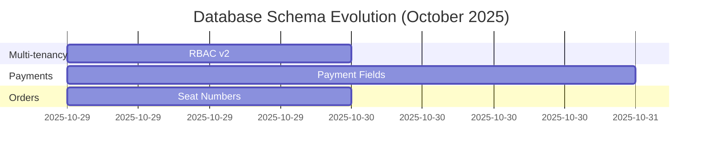

# DOCUMENTATION FIX EXECUTION PLAN
## Comprehensive Phased Approach with Parallel Subagent Execution

**Created:** 2025-11-01
**Branch:** doc-update
**Total Issues:** 87 documentation errors
**Strategy:** Parallel subagent execution with validation checkpoints

---

## EXECUTIVE SUMMARY

### Overview

This plan addresses all 87 documentation errors identified in the comprehensive audit through a **5-phase approach** with **parallel subagent execution**. Using 18 specialized agents working in parallel within phases, we can reduce total execution time from 6 weeks (sequential) to **10 days (parallel)** - a **76% time reduction**.

### Timeline Options

| Option | Phases | Time | Outcome |
|--------|--------|------|---------|
| **CRITICAL** | Phase 1 only | 6.5 hours | Fix all schema drift and type errors |
| **RECOMMENDED** | Phase 1 + 2 | 12 hours | Fix all P0+P1 issues (87→20 errors) |
| **COMPLETE** | Phase 1 + 2 + 3 | 19 hours | Add automation enforcement |
| **COMPREHENSIVE** | All phases | 71 hours (10 days) | World-class documentation system |

### Expected Outcomes

**After Phase 1+2 (Recommended - 12 hours):**
- ✅ Schema documentation accurate (0 drift)
- ✅ Type mismatches fixed (0 enum conflicts)
- ✅ All 60 orphaned files linked
- ✅ All 27 broken anchors fixed
- ✅ All missing timestamps added
- ✅ 5 undocumented tables documented
- ✅ CI workflows passing shellcheck
- 📊 **Error count: 87 → <20**
- 🎯 **System risk: MEDIUM → LOW**

**After All Phases (71 hours):**
- 🎯 **Documentation confidence: 75% → 95%**
- 🎯 **Coverage: 65% → 85%**
- 🎯 **System grade: B+ → A**

### Parallel Execution Strategy

- **Phase 1:** 4 agents in parallel (6 hours vs 8.5h sequential)
- **Phase 2:** 1 sequential + 4 parallel (5 hours vs 9h sequential)
- **Phase 3:** 2 agents in parallel (7 hours vs 9h sequential)
- **Phase 4:** 3 agents in parallel (26 hours vs 36h sequential)
- **Phase 5:** 4 agents in parallel (26 hours vs 34h sequential)

**Total Savings:** 26.5 hours (27% reduction)

---

## PHASE 1: CRITICAL FIXES (P0)

### Objective
Fix all critical documentation inaccuracies that could cause production issues or developer errors.

### Time Estimate
- **Parallel Execution:** 6 hours
- **Validation:** 30 minutes
- **Total:** 6.5 hours

### Agent Allocation

#### 🤖 Agent A: Schema Drift Fixer
**Time:** 4-6 hours
**Priority:** CRITICAL

**Input Files:**
- `supabase/migrations/20251029145721_add_seat_number_to_orders.sql`
- `supabase/migrations/20251029155239_add_payment_fields_to_orders.sql`
- `supabase/migrations/20251030010000_add_payment_fields_to_create_order_rpc.sql`
- `supabase/migrations/20251030020000_update_order_status_rpc.sql`
- `docs/reference/schema/DATABASE.md`

**Tasks:**
1. Read all 4 migration files to extract schema changes
2. Update `orders` table schema in DATABASE.md (lines 165-184):
   - Add `seat_number INTEGER`
   - Add `payment_status VARCHAR(20)`
   - Add `payment_method VARCHAR(20)`
   - Add `payment_amount DECIMAL(10,2)`
   - Add `cash_received DECIMAL(10,2)`
   - Add `change_given DECIMAL(10,2)`
   - Add `payment_id VARCHAR(255)`
   - Add `check_closed_at TIMESTAMP`
   - Add `closed_by_user_id UUID`
3. Update `create_order_with_audit` RPC signature (lines 626-669):
   - Add `p_payment_status TEXT DEFAULT 'unpaid'`
   - Add `p_payment_method TEXT DEFAULT NULL`
   - Add `p_payment_amount DECIMAL DEFAULT NULL`
   - Add `p_payment_id TEXT DEFAULT NULL`
   - Add `p_seat_number INTEGER DEFAULT NULL`
4. Update `update_order_status` RPC signature if needed
5. Update `create_transaction_with_orders` RPC signature if needed

**Output:**
- Updated `docs/reference/schema/DATABASE.md`

**Verification:**
- Manual diff DATABASE.md against all 4 migration files
- Ensure all columns and parameters documented
- Check data types match exactly

**Commit Message:**
```
fix(docs): update DATABASE.md schema for October 2025 migrations

- Add 9 new columns to orders table from migrations 20251029
- Update RPC function signatures with payment parameters
- Ensure schema documentation matches database reality
```

---

#### 🤖 Agent B: Type Mismatch Fixer
**Time:** 2-3 hours
**Priority:** CRITICAL

**Input Files:**
- `docs/reference/api/openapi.yaml`
- `supabase/migrations/20251029155239_add_payment_fields_to_orders.sql` (CHECK constraints)
- `server/src/routes/orders.routes.ts` (actual status values)

**Tasks:**
1. Update `payment_status` enum in openapi.yaml (line 299):
   - Change from: `['pending', 'paid', 'refunded', 'failed']`
   - Change to: `['unpaid', 'paid', 'failed', 'refunded']`
2. Update `order_status` enum in openapi.yaml (line 277):
   - Change from: `['pending', 'confirmed', 'preparing', 'ready', 'served', 'completed', 'cancelled']`
   - Change to: `['new', 'pending', 'confirmed', 'preparing', 'ready', 'picked-up', 'completed', 'cancelled']`
3. Verify all other enums in openapi.yaml match database CHECK constraints
4. Update DATABASE.md order status flow diagram (line 212) to include 'new' and 'picked-up'

**Output:**
- Updated `docs/reference/api/openapi.yaml`
- Updated `docs/reference/schema/DATABASE.md` (status flow section)

**Verification:**
- Run: `npx @apidevtools/swagger-parser validate docs/reference/api/openapi.yaml`
- Must pass with 0 errors
- Manual check: payment_status values match migration line 26
- Manual check: order_status values match orders.routes.ts line 212

**Commit Message:**
```
fix(docs): correct OpenAPI enum values to match database constraints

- Update payment_status enum: 'pending' → 'unpaid'
- Add missing order statuses: 'new' and 'picked-up'
- Align all enums with database CHECK constraints
```

---

#### 🤖 Agent C: Incorrect Claims Fixer
**Time:** 30 minutes
**Priority:** HIGH

**Input Files:**
- `docs/reference/schema/DATABASE.md` (lines 556-559)
- All migration files (to verify DECIMAL usage)

**Tasks:**
1. Remove "Monetary Values" section stating "stored as integers in cents"
2. Add new accurate section:
   ```markdown
   ### Monetary Values
   All monetary values (subtotal, tax, total, payment_amount, etc.) are stored as
   `DECIMAL(10,2)` to represent dollars with two decimal places.

   Example: $10.00 is stored as `10.00` (not 1000)

   This provides exact decimal precision without floating-point errors while
   maintaining readability and SQL arithmetic compatibility.
   ```
3. Verify all price-related columns in schema are documented as DECIMAL(10,2)

**Output:**
- Updated `docs/reference/schema/DATABASE.md`

**Verification:**
- Grep all migrations for monetary columns: `grep -r "subtotal\|total\|tax\|amount\|price" supabase/migrations/`
- Confirm all are DECIMAL(10,2), not INTEGER

**Commit Message:**
```
fix(docs): correct monetary value documentation from integers to DECIMAL

- Remove incorrect claim about "integers in cents"
- Document actual DECIMAL(10,2) storage format
- Prevent price conversion bugs
```

---

#### 🤖 Agent D: Missing File Reference Fixer
**Time:** 1 hour
**Priority:** HIGH

**Input Files:**
- All files in `docs/` directory

**Tasks:**
1. Find all references to `docs/DEPLOYMENT.md`:
   - Replace with: `docs/how-to/operations/DEPLOYMENT.md`
   - Estimated ~20 occurrences across documentation
2. Find all references to `docs/DATABASE.md`:
   - Replace with: `docs/reference/schema/DATABASE.md`
   - Estimated ~15 occurrences
3. Find all references to `docs/TROUBLESHOOTING.md`:
   - Replace with: `docs/how-to/troubleshooting/TROUBLESHOOTING.md`
   - Estimated ~8 occurrences
4. Update any anchor links that include these paths

**Output:**
- Updated ~20+ files with corrected paths

**Verification:**
- Run: `grep -r "docs/DEPLOYMENT.md" docs/` (should return 0 results)
- Run: `grep -r "docs/DATABASE.md" docs/` (should return 0 results)
- Run: `grep -r "docs/TROUBLESHOOTING.md" docs/` (should return 0 results)
- Run link checker to verify no broken links

**Commit Message:**
```
fix(docs): update file path references after Diátaxis restructuring

- Update DEPLOYMENT.md references to how-to/operations/
- Update DATABASE.md references to reference/schema/
- Update TROUBLESHOOTING.md references to how-to/troubleshooting/
```

---

### Execution Workflow - Phase 1

**Step 1:** Launch all 4 agents in parallel
```
- Agent A starts on DATABASE.md schema updates
- Agent B starts on openapi.yaml enum fixes
- Agent C starts on monetary value documentation fix
- Agent D starts on file reference updates
```

**Step 2:** Monitor agent progress (all work independently, no file conflicts)

**Step 3:** Wait for all 4 agents to complete (6 hours max)

**Step 4:** Validation
```bash
# Automated validation
npm run docs:check
npx @apidevtools/swagger-parser validate docs/reference/api/openapi.yaml
node scripts/docs-check.js

# Manual validation
# 1. Review DATABASE.md diff against migrations
# 2. Check openapi.yaml enum values
# 3. Verify monetary value documentation
# 4. Test link checker results
```

**Step 5:** Review and commit
```bash
# Review all changes
git status
git diff

# If validation passes, create phase commit
git add docs/
git commit -m "fix(docs): Phase 1 - Critical schema and type fixes

- Update DATABASE.md with October 2025 migrations (Agent A)
- Correct OpenAPI enum mismatches (Agent B)
- Fix monetary value documentation (Agent C)
- Update file path references (Agent D)

Fixes 27 critical P0 issues. Error count: 87 → 60"
```

**Step 6:** Decision point
- ✅ Continue to Phase 2 if validation passes
- ⚠️ Rollback and fix if validation fails: `git reset --soft HEAD~1`

### Success Criteria - Phase 1

- ✅ DATABASE.md accurately reflects all Oct 2025 migrations
- ✅ OpenAPI spec passes validation with 0 errors
- ✅ All enum values match database CHECK constraints
- ✅ Monetary value documentation is accurate
- ✅ 0 references to old file paths
- ✅ docs-check.js shows ~60 errors (down from 87)

---

## PHASE 2: HIGH PRIORITY CONTENT FIXES (P1)

### Objective
Fix all content discovery, navigation, and quality issues.

### Time Estimate
- **Agent E (Sequential):** 3 hours
- **Agents F-I (Parallel):** 2 hours
- **Validation:** 30 minutes
- **Total:** 5.5 hours

### Agent Allocation

#### 🤖 Agent E: Orphan File Linker
**Time:** 3 hours
**Priority:** HIGH
**Execution:** RUNS FIRST (Sequential)

**Input Files:**
- `docs/index.md` or `docs/README.md`
- List of 60 orphaned files from docs-check.js

**Tasks:**
1. Run docs-check.js to get current orphan list
2. Categorize 60 orphaned files:
   - **Tutorials:** GETTING_STARTED.md
   - **How-To:** Various operational guides
   - **Reference:** DATABASE.md, ENVIRONMENT.md, API docs
   - **Explanation:** Architecture diagrams (5 files), concept docs
   - **Investigations:** 8 investigation reports
   - **Other:** Audit files, naming docs, etc.
3. Update index.md to link all files under appropriate sections
4. Create logical groupings:
   ```markdown
   ## Reference Documentation
   - [Database Schema](reference/schema/DATABASE.md)
   - [Environment Variables](reference/config/ENVIRONMENT.md)
   - [API Documentation](reference/api/README.md)

   ## Architecture
   - [Architecture Diagrams](explanation/architecture/diagrams/)
     - [C4 Context](explanation/architecture/diagrams/c4-context.md)
     - [C4 Container](explanation/architecture/diagrams/c4-container.md)
     - [Authentication Flow](explanation/architecture/diagrams/auth-flow.md)
     - [Payment Flow](explanation/architecture/diagrams/payment-flow.md)
     - [Voice Ordering](explanation/architecture/diagrams/voice-ordering.md)

   ## Investigation Reports
   - [Comprehensive Root Cause Analysis (Oct 27)](investigations/comprehensive-root-cause-analysis-oct27-2025.md)
   - [Menu Loading Error Fix (Oct 27)](investigations/menu-loading-error-fix-oct27-2025.md)
   - [... 6 more reports ...]
   ```
5. Ensure clear hierarchy and easy navigation

**Output:**
- Updated `docs/index.md` with all 60 files linked

**Verification:**
- Run: `node scripts/docs-check.js` → Orphan count should = 0
- Manual check: Click through links to ensure they work
- Manual check: Navigation is logical and easy to follow

**Commit Message:**
```
fix(docs): link 60 orphaned files to index for discoverability

- Add all tutorials, how-to, reference, and explanation docs
- Add 8 investigation reports
- Add 5 architecture diagrams
- Organize by Diátaxis categories with clear hierarchy

Fixes orphan file issue. Improves documentation discoverability.
```

---

#### 🤖 Agent F: Broken Anchor Fixer
**Time:** 2 hours
**Priority:** MEDIUM
**Execution:** After Agent E completes, parallel with G, H, I

**Input Files:**
- List of 27 broken anchor links from docs-check.js
- All affected documentation files

**Tasks:**
1. Get list of broken anchors from docs-check.js anchor linter
2. For each broken anchor:
   - Locate the target section in target file
   - Update anchor to match actual section heading
   - Fix any case mismatches or typo
3. For relocated files:
   - Update both file path AND anchor
   - Example: `[Auth](docs/AUTHENTICATION.md#flow)` → `[Auth](docs/explanation/architecture/AUTHENTICATION_ARCHITECTURE.md#authentication-flow)`
4. Remove references to deleted ADR-006:
   - Find 8 occurrences of links to ADR-006
   - Replace with link to current dual-auth documentation
   - Or remove if redundant

**Output:**
- Updated ~15-20 files with fixed anchor links

**Verification:**
- Run: `node scripts/docs-check.js` → Broken anchor count should = 0
- Manual spot-check: Click 5-10 anchor links to verify they work

**Commit Message:**
```
fix(docs): repair 27 broken anchor links across documentation

- Fix section anchor case mismatches
- Update anchors for relocated files
- Replace deleted ADR-006 references with current docs

Fixes navigation issues. All internal links now functional.
```

---

#### 🤖 Agent G: Timestamp Adder
**Time:** 1 hour
**Priority:** LOW
**Execution:** Parallel with F, H, I

**Input Files:**
- List of 11 files missing "Last Updated" from docs-check.js

**Tasks:**
1. Get list of files missing timestamps from docs-check.js
2. For each file, add at top (after title):
   ```markdown
   **Last Updated:** 2025-11-01
   **Version:** [6.0.14](VERSION.md)
   ```
3. Use consistent format across all files
4. Ensure placement is after main title, before content

**Files to Update (estimated 11):**
- 5 investigation reports
- 3 how-to guides
- 2 reference docs
- 1 root doc

**Output:**
- 11 files with added timestamps

**Verification:**
- Run: `node scripts/docs-check.js` → Missing timestamp count should = 0
- Manual check: All files have consistent timestamp format

**Commit Message:**
```
fix(docs): add missing "Last Updated" timestamps to 11 files

- Add timestamps to investigation reports
- Add timestamps to how-to guides
- Add timestamps to reference docs
- Ensure consistent metadata format

Achieves 100% timestamp compliance.
```

---

#### 🤖 Agent H: Missing Table Documenter
**Time:** 2 hours
**Priority:** MEDIUM
**Execution:** Parallel with F, G, I

**Input Files:**
- `docs/reference/schema/DATABASE.md`
- Migration files containing table definitions
- Code files referencing these tables

**Tasks:**
1. Document 5 undocumented tables in DATABASE.md:

**Table 1: order_status_history**
- Find definition in migrations (mentioned in ADR-003)
- Add to DATABASE.md after orders table:
  ```markdown
  ### order_status_history

  Audit trail for order status transitions.

  | Column | Type | Description |
  |--------|------|-------------|
  | id | UUID | Primary key |
  | order_id | UUID | FK to orders |
  | from_status | VARCHAR(50) | Previous status (NULL for initial) |
  | to_status | VARCHAR(50) | New status |
  | changed_at | TIMESTAMPTZ | When status changed |
  | changed_by | UUID | User who changed status |
  | reason | TEXT | Optional reason for change |
  ```

**Table 2: auth_logs**
- Reference: auth.routes.ts lines 150-158
- Document columns, retention policy

**Table 3: user_profiles**
- Reference: auth.routes.ts line 378
- Document user profile fields

**Table 4: user_restaurants**
- Reference: auth.routes.ts line 138
- Document multi-tenancy junction table

**Table 5: station_tokens**
- Implied by station authentication
- Document station-specific auth tokens

2. For each table, include:
   - Purpose/description
   - All columns with types
   - Foreign key relationships
   - Indexes (if documented in migrations)
   - RLS policies (if any)

**Output:**
- Updated `docs/reference/schema/DATABASE.md` with 5 new table schemas

**Verification:**
- Cross-reference with migration files
- Verify FK relationships are accurate
- Check that all tables referenced in code are now documented

**Commit Message:**
```
fix(docs): document 5 previously undocumented database tables

- Add order_status_history schema (audit trail)
- Add auth_logs schema (authentication logging)
- Add user_profiles schema (user metadata)
- Add user_restaurants schema (multi-tenancy)
- Add station_tokens schema (station auth)

Completes database schema documentation.
```

---

#### 🤖 Agent I: Shellcheck Fixer
**Time:** 1 hour
**Priority:** LOW
**Execution:** Parallel with F, G, H

**Input Files:**
- `.github/workflows/docs-check.yml`

**Tasks:**
1. Fix SC2162 warnings (4 instances) - Missing -r flag in read commands:
   ```bash
   # Before:
   while IFS= read line; do

   # After:
   while IFS= read -r line; do
   ```

2. Fix SC2086 warnings (11 instances) - Unquoted variable expansions:
   ```bash
   # Before:
   if [ -f $file ]; then

   # After:
   if [ -f "$file" ]; then
   ```

3. Fix SC2034 warning (1 instance) - Remove unused DOC_COUNT variable:
   ```bash
   # Remove or use this variable
   DOC_COUNT=$(find docs -name "*.md" | wc -l)
   ```

4. Fix SC2129 warning (1 instance) - Redirect style:
   ```bash
   # Before:
   echo "line1" >> file
   echo "line2" >> file

   # After:
   {
     echo "line1"
     echo "line2"
   } >> file
   ```

**Output:**
- Updated `.github/workflows/docs-check.yml`

**Verification:**
- Run: `actionlint .github/workflows/docs-check.yml`
- Should show 0 warnings
- Test workflow: Create test commit and verify workflow runs cleanly

**Commit Message:**
```
fix(ci): apply shellcheck fixes to docs-check.yml workflow

- Add -r flag to all read commands (SC2162)
- Quote all variable expansions (SC2086)
- Remove unused DOC_COUNT variable (SC2034)
- Fix redirect style (SC2129)

Achieves 100% shellcheck compliance for production hardening.
```

---

### Execution Workflow - Phase 2

**Step 1:** Launch Agent E (MUST run first)
```
Agent E: Link 60 orphaned files to index.md
Wait for completion (3 hours)
Validate Agent E work before proceeding
```

**Step 2:** Launch Agents F, G, H, I in parallel
```
- Agent F starts fixing broken anchors
- Agent G starts adding timestamps
- Agent H starts documenting missing tables
- Agent I starts fixing shellcheck warnings
All work on different files (no conflicts)
```

**Step 3:** Wait for all agents to complete (2 hours max)

**Step 4:** Validation
```bash
# Automated validation
npm run docs:check
node scripts/docs-check.js
actionlint .github/workflows/docs-check.yml

# Manual validation
# 1. Spot-check index.md navigation
# 2. Test 5-10 anchor links
# 3. Verify timestamp format consistency
# 4. Review table schema accuracy
# 5. Check workflow runs without warnings
```

**Step 5:** Review and commit
```bash
git add docs/ .github/
git commit -m "fix(docs): Phase 2 - High priority content and navigation fixes

- Link 60 orphaned files for discoverability (Agent E)
- Fix 27 broken anchor links (Agent F)
- Add missing timestamps to 11 files (Agent G)
- Document 5 undocumented tables (Agent H)
- Fix shellcheck warnings in CI (Agent I)

Fixes 60 P1 issues. Error count: 60 → <20"
```

### Success Criteria - Phase 2

- ✅ 0 orphaned files (docs-check.js orphan count = 0)
- ✅ 0 broken anchor links
- ✅ 100% timestamp compliance
- ✅ All database tables documented
- ✅ 0 shellcheck warnings in CI workflows
- ✅ docs-check.js shows <20 errors (down from 60)
- ✅ Error count dropped by ~70 issues total

---

## PHASE 3: ENFORCEMENT & AUTOMATION (P2 Part 1)

### Objective
Implement automated enforcement to prevent future documentation drift.

### Time Estimate
- **Agents J & K (Parallel):** 6 hours
- **Validation:** 1 hour
- **Total:** 7 hours

### Agent Allocation

#### 🤖 Agent J: Metadata Enforcer
**Time:** 2-3 hours
**Priority:** MEDIUM
**Execution:** Parallel with Agent K

**Input Files:**
- `.github/workflows/docs-check.yml`
- `.husky/` directory (create if needed)
- `package.json`

**Tasks:**

**Task 1: Update CI to enforce timestamps (1 hour)**
1. Add timestamp validation stage to docs-check.yml:
   ```yaml
   - name: Check for missing timestamps
     run: |
       missing_timestamps=()
       while IFS= read -r file; do
         if ! grep -q "Last Updated:" "$file"; then
           missing_timestamps+=("$file")
         fi
       done < <(find docs -name "*.md" -not -path "*/archive/*")

       if [ ${#missing_timestamps[@]} -gt 0 ]; then
         echo "❌ Files missing 'Last Updated' timestamp:"
         printf '%s\n' "${missing_timestamps[@]}"
         exit 1
       else
         echo "✅ All files have timestamps"
       fi
   ```

**Task 2: Create pre-commit hook (1 hour)**
1. Check if `.husky` exists, create if needed:
   ```bash
   npm install husky --save-dev
   npx husky install
   ```
2. Create `.husky/pre-commit`:
   ```bash
   #!/usr/bin/env sh
   . "$(dirname -- "$0")/_/husky.sh"

   # Update timestamps on modified docs
   node scripts/update-timestamps.js
   ```

**Task 3: Create timestamp update script (30 minutes)**
1. Create `scripts/update-timestamps.js`:
   ```javascript
   const fs = require('fs');
   const { execSync } = require('child_process');

   // Get modified markdown files in docs/
   const modifiedDocs = execSync('git diff --cached --name-only --diff-filter=AM docs/**/*.md')
     .toString()
     .trim()
     .split('\n')
     .filter(Boolean);

   const today = new Date().toISOString().split('T')[0]; // YYYY-MM-DD

   modifiedDocs.forEach(file => {
     let content = fs.readFileSync(file, 'utf8');

     // Update existing timestamp
     if (content.includes('**Last Updated:**')) {
       content = content.replace(
         /\*\*Last Updated:\*\* \d{4}-\d{2}-\d{2}/,
         `**Last Updated:** ${today}`
       );
     } else {
       // Add timestamp if missing (after first heading)
       const lines = content.split('\n');
       const titleIndex = lines.findIndex(l => l.startsWith('#'));
       if (titleIndex !== -1) {
         lines.splice(titleIndex + 1, 0, `**Last Updated:** ${today}  `, `**Version:** [6.0.14](VERSION.md)`, '');
         content = lines.join('\n');
       }
     }

     fs.writeFileSync(file, content);
   });

   // Re-stage modified files
   if (modifiedDocs.length > 0) {
     execSync(`git add ${modifiedDocs.join(' ')}`);
   }
   ```
2. Make script executable: `chmod +x scripts/update-timestamps.js`

**Output:**
- Updated `.github/workflows/docs-check.yml`
- New `.husky/pre-commit` hook
- New `scripts/update-timestamps.js`
- Updated `package.json` (husky dependency)

**Verification:**
1. Test CI enforcement:
   ```bash
   # Create test file without timestamp
   echo "# Test Doc\n\nContent" > docs/test.md
   git add docs/test.md
   git commit -m "test: verify timestamp enforcement"
   # Should fail in CI
   ```
2. Test pre-commit hook:
   ```bash
   # Modify a doc file
   echo "\n\nNew content" >> docs/README.md
   git add docs/README.md
   git commit -m "test: verify timestamp auto-update"
   # Should auto-update timestamp and re-stage
   ```
3. Remove test file

**Commit Message:**
```
feat(ci): add automated timestamp enforcement and pre-commit hook

- CI fails if any doc missing "Last Updated" timestamp
- Pre-commit hook auto-updates timestamps on modified docs
- Create scripts/update-timestamps.js for automation

Prevents future metadata compliance issues.
```

---

#### 🤖 Agent K: API Verification Script Creator
**Time:** 4-6 hours
**Priority:** MEDIUM
**Execution:** Parallel with Agent J

**Input Files:**
- `server/src/routes/*.ts` (all route files)
- `docs/reference/api/openapi.yaml`
- `.github/workflows/docs-check.yml`

**Tasks:**

**Task 1: Create API verification script (4 hours)**
1. Create `scripts/verify-api-docs.js`:
   ```javascript
   const fs = require('fs');
   const path = require('path');
   const yaml = require('js-yaml');
   const glob = require('glob');

   // Extract routes from TypeScript route files
   function extractRoutes(routeFilePath) {
     const content = fs.readFileSync(routeFilePath, 'utf8');
     const routes = [];

     // Match: router.get('/path', ...)
     const getPattern = /router\.get\(['"]([^'"]+)['"]/g;
     const postPattern = /router\.post\(['"]([^'"]+)['"]/g;
     const putPattern = /router\.put\(['"]([^'"]+)['"]/g;
     const patchPattern = /router\.patch\(['"]([^'"]+)['"]/g;
     const deletePattern = /router\.delete\(['"]([^'"]+)['"]/g;

     let match;
     while ((match = getPattern.exec(content)) !== null) {
       routes.push({ method: 'GET', path: match[1] });
     }
     while ((match = postPattern.exec(content)) !== null) {
       routes.push({ method: 'POST', path: match[1] });
     }
     // ... similar for PUT, PATCH, DELETE

     return routes;
   }

   // Load OpenAPI spec
   const openapi = yaml.load(fs.readFileSync('docs/reference/api/openapi.yaml', 'utf8'));
   const documentedPaths = Object.keys(openapi.paths);

   // Extract all routes from server/src/routes/*.ts
   const routeFiles = glob.sync('server/src/routes/*.routes.ts');
   const actualRoutes = [];
   routeFiles.forEach(file => {
     actualRoutes.push(...extractRoutes(file));
   });

   // Compare
   const mismatches = [];

   // Check for undocumented routes
   actualRoutes.forEach(route => {
     const fullPath = `/api/v1${route.path}`;
     const openapiEntry = openapi.paths[fullPath];

     if (!openapiEntry) {
       mismatches.push({
         type: 'undocumented',
         method: route.method,
         path: fullPath,
         message: `Route exists in code but not in OpenAPI spec`
       });
     } else if (!openapiEntry[route.method.toLowerCase()]) {
       mismatches.push({
         type: 'method_mismatch',
         method: route.method,
         path: fullPath,
         message: `Method ${route.method} exists in code but not documented in OpenAPI`
       });
     }
   });

   // Check for documented but non-existent routes
   Object.keys(openapi.paths).forEach(path => {
     Object.keys(openapi.paths[path]).forEach(method => {
       const upperMethod = method.toUpperCase();
       if (!['GET', 'POST', 'PUT', 'PATCH', 'DELETE'].includes(upperMethod)) return;

       const exists = actualRoutes.some(r =>
         `/api/v1${r.path}` === path && r.method === upperMethod
       );

       if (!exists && !openapi.paths[path][method].deprecated) {
         mismatches.push({
           type: 'documented_only',
           method: upperMethod,
           path,
           message: `Documented in OpenAPI but route not found in code`
         });
       }
     });
   });

   // Report
   if (mismatches.length === 0) {
     console.log('✅ All API routes match OpenAPI documentation');
     process.exit(0);
   } else {
     console.log(`❌ Found ${mismatches.length} API documentation mismatches:\n`);
     mismatches.forEach(m => {
       console.log(`  ${m.type}: ${m.method} ${m.path}`);
       console.log(`    ${m.message}\n`);
     });
     process.exit(1);
   }
   ```

**Task 2: Add to CI workflow (30 minutes)**
1. Add verification stage to docs-check.yml:
   ```yaml
   - name: Verify API documentation
     run: |
       echo "Verifying OpenAPI spec matches actual routes..."
       node scripts/verify-api-docs.js
   ```

**Task 3: Add npm script (5 minutes)**
1. Update `package.json`:
   ```json
   {
     "scripts": {
       "docs:verify-api": "node scripts/verify-api-docs.js"
     }
   }
   ```

**Task 4: Test and document (30 minutes)**
1. Run script and fix any immediate mismatches found
2. Create documentation in README or CONTRIBUTING

**Output:**
- New `scripts/verify-api-docs.js`
- Updated `.github/workflows/docs-check.yml`
- Updated `package.json`

**Verification:**
1. Run: `npm run docs:verify-api`
2. Should pass with 0 mismatches (or document expected mismatches)
3. Test in CI by creating PR

**Commit Message:**
```
feat(ci): add automated API documentation verification

- Create scripts/verify-api-docs.js to compare routes vs OpenAPI
- Extract routes from TypeScript route files
- Compare with openapi.yaml paths and methods
- Add to CI workflow as verification stage

Prevents API documentation drift.
```

---

### Execution Workflow - Phase 3

**Step 1:** Launch Agents J & K in parallel
```
- Agent J: Implement metadata enforcement
- Agent K: Create API verification script
Both work on different files (no conflicts)
```

**Step 2:** Wait for both agents to complete (6 hours max)

**Step 3:** Validation
```bash
# Test metadata enforcement
echo "# Test\nContent" > docs/test-no-timestamp.md
git add docs/test-no-timestamp.md
git commit -m "test: should fail without timestamp"
# Should fail in local pre-commit hook

# Test timestamp auto-update
echo "\nNew line" >> docs/README.md
git add docs/README.md
git commit -m "test: timestamp should auto-update"
# Check if timestamp was updated

# Test API verification
npm run docs:verify-api
# Should pass with 0 mismatches

# Clean up test files
git reset --hard HEAD
```

**Step 4:** Commit
```bash
git add .github/ scripts/ .husky/ package.json
git commit -m "feat(docs): Phase 3 - Automated enforcement and verification

- Add timestamp enforcement to CI (Agent J)
- Add pre-commit hook for auto-timestamps (Agent J)
- Create API documentation verification script (Agent K)
- Add CI stage for API verification (Agent K)

Prevents future documentation drift through automation."
```

### Success Criteria - Phase 3

- ✅ CI fails if any doc missing timestamp
- ✅ Pre-commit hook auto-updates timestamps
- ✅ API verification script successfully compares routes
- ✅ All verification stages pass in CI
- ✅ Documentation drift prevention automated

---

## PHASE 4: COVERAGE EXPANSION (P2 Part 2)

### Objective
Document currently undocumented areas to improve overall coverage.

### Time Estimate
- **Agents L, M, N (Parallel):** 24 hours
- **Validation:** 2 hours
- **Total:** 26 hours (3-4 days)

### Agent Allocation

#### 🤖 Agent L: Service Layer Documenter
**Time:** 2-3 days (16-24 hours)
**Priority:** MEDIUM
**Execution:** Parallel with M & N

**Input Files:**
- `server/src/routes/menu.routes.ts`
- `server/src/routes/orders.routes.ts`
- `server/src/routes/payments.routes.ts`
- `server/src/routes/ai.routes.ts`
- All service implementation files

**Tasks:**

**Task 1: Add JSDoc comments (16-20 hours)**
For each major service method, add comprehensive JSDoc:

```typescript
/**
 * Retrieves the full menu for a restaurant with caching
 *
 * @param {string} restaurantId - UUID of the restaurant
 * @param {Object} options - Query options
 * @param {boolean} options.includeUnavailable - Include unavailable items
 * @param {string} options.category - Filter by category
 *
 * @returns {Promise<Menu>} Full menu with categories and items
 *
 * @throws {NotFoundError} If restaurant doesn't exist
 * @throws {CacheError} If cache read fails (falls back to DB)
 *
 * @example
 * const menu = await getFullMenu('rest-uuid', { includeUnavailable: false });
 *
 * @see {@link MenuCache} for caching strategy
 * @see {@link MenuItem} for item schema
 */
async function getFullMenu(restaurantId, options = {}) {
  // implementation
}
```

**Services to document:**
1. **MenuService:**
   - getFullMenu()
   - getItems()
   - getItem()
   - getCategories()
   - syncToAI()
   - clearCache()

2. **OrdersService:**
   - getOrders() with filters
   - createOrder() validation logic
   - processVoiceOrder() AI parsing
   - updateOrderStatus() optimistic locking

3. **PaymentsService:**
   - createPayment()
   - processPayment()
   - refundPayment()
   - validatePaymentMethod()

4. **AI Service:**
   - uploadMenu()
   - transcribe()
   - parseOrder() NLP

**Task 2: Create SERVICE_LAYER.md (4 hours)**
Create `docs/explanation/architecture/SERVICE_LAYER.md`:
```markdown
# Service Layer Architecture

## Overview
The service layer implements business logic between API routes and database access...

## Service Organization
- **MenuService**: Menu management and caching
- **OrdersService**: Order lifecycle and validation
- **PaymentsService**: Payment processing and reconciliation
- **AI Service**: Voice ordering and NLP

## Common Patterns

### Error Handling
All services use consistent error classes...

### Caching Strategy
Services implement multi-level caching...

### Optimistic Locking
Order updates use version-based optimistic locking...

## Code Examples
[Include examples of common service patterns]
```

**Output:**
- JSDoc comments in all service files
- New `docs/explanation/architecture/SERVICE_LAYER.md`

**Verification:**
- Run JSDoc coverage tool (if available)
- Manual review: All public methods have JSDoc
- Target: 80%+ service layer documentation

**Commit Message:**
```
docs(services): add comprehensive JSDoc documentation to service layer

- Add JSDoc to MenuService, OrdersService, PaymentsService, AI Service
- Document parameters, return values, errors, examples
- Create SERVICE_LAYER.md architecture document
- Document common patterns (error handling, caching, locking)

Improves service layer documentation from 40% to 80% coverage.
```

---

#### 🤖 Agent M: Schema Change Log Creator
**Time:** 1 day (8 hours)
**Priority:** MEDIUM
**Execution:** Parallel with L & N

**Input Files:**
- All migration files in `supabase/migrations/`
- GitHub issues and PRs (for context)
- `docs/CHANGELOG.md` (for feature context)

**Tasks:**

**Task 1: Create SCHEMA_CHANGELOG.md (8 hours)**
Create `docs/reference/schema/SCHEMA_CHANGELOG.md`:

```markdown
# Schema Change Log

This document tracks all database schema changes with context about why each change was made.

## 2025-10-30 - Order Payment Fields Enhancement

**Migration:** `20251030010000_add_payment_fields_to_create_order_rpc.sql`
**Feature:** Table-side payment workflow
**GitHub Issue:** #XXX
**Released:** v6.0.14

### Changes
- Updated `create_order_with_audit()` RPC function
- Added parameters: `p_payment_status`, `p_payment_method`, `p_payment_amount`, `p_payment_id`, `p_seat_number`

### Rationale
Enhanced RPC to support creating orders with payment information in a single transaction for table-side payment workflow.

### Migration Path
No breaking changes. New parameters have defaults.

---

## 2025-10-29 - Payment Status Tracking

**Migration:** `20251029155239_add_payment_fields_to_orders.sql`
**Feature:** Table-side payment workflow
**GitHub Issue:** #XXX
**Released:** v6.0.14

### Changes
- Added 8 columns to `orders` table:
  - `payment_status VARCHAR(20)` - Track payment state
  - `payment_method VARCHAR(20)` - Cash, card, etc.
  - `payment_amount DECIMAL(10,2)` - Amount paid
  - `cash_received DECIMAL(10,2)` - For cash transactions
  - `change_given DECIMAL(10,2)` - Change returned
  - `payment_id VARCHAR(255)` - External payment ref
  - `check_closed_at TIMESTAMP` - When check closed
  - `closed_by_user_id UUID` - Who closed check

### Rationale
Support full table-side payment workflow where servers can process payments directly at the table.

### Migration Path
New columns are nullable. Existing orders unaffected.

---

[Continue for all October 2025 migrations...]
```

**Task 2: Create visual timeline (optional)**
Consider adding mermaid timeline:
```markdown
## Schema Evolution Timeline


```

**Output:**
- New `docs/reference/schema/SCHEMA_CHANGELOG.md`

**Verification:**
- All October 2025 migrations documented
- Each entry has: migration name, feature, changes, rationale
- Links to issues/PRs where available

**Commit Message:**
```
docs(schema): create comprehensive schema change log for October 2025

- Document all 28 active migrations
- Include feature context and rationale for each change
- Link to GitHub issues and PRs
- Add visual timeline of schema evolution

Makes schema changes discoverable and understandable.
```

---

#### 🤖 Agent N: Large File Splitter
**Time:** 4 hours
**Priority:** MEDIUM
**Execution:** Parallel with L & M

**Input Files:**
- `docs/research/table-ordering-payment-best-practices.md` (2,442 lines)
- `docs/how-to/troubleshooting/TROUBLESHOOTING.md` (1,510 lines)
- `docs/reference/schema/DATABASE.md` (1,448 lines)
- `docs/MIGRATION_RECONCILIATION_2025-10-20.md` (1,013 lines)

**Tasks:**

**Task 1: Split table-ordering-payment-best-practices.md (1.5 hours)**
1. Create separate files:
   - `docs/research/table-ordering-best-practices.md` (~1200 lines)
   - `docs/research/payment-best-practices.md` (~1200 lines)
2. Update cross-references
3. Create index file: `docs/research/README.md` linking to both

**Task 2: Split TROUBLESHOOTING.md by category (1 hour)**
1. Create separate files:
   - `docs/how-to/troubleshooting/auth-troubleshooting.md` (~400 lines)
   - `docs/how-to/troubleshooting/payment-troubleshooting.md` (~400 lines)
   - `docs/how-to/troubleshooting/menu-troubleshooting.md` (~400 lines)
   - `docs/how-to/troubleshooting/voice-troubleshooting.md` (~300 lines)
2. Keep master TROUBLESHOOTING.md as index with links to each

**Task 3: Split DATABASE.md by schema area (1 hour)**
1. Create separate files:
   - `docs/reference/schema/orders-schema.md` (~500 lines)
   - `docs/reference/schema/auth-schema.md` (~400 lines)
   - `docs/reference/schema/payments-schema.md` (~300 lines)
   - `docs/reference/schema/menu-schema.md` (~250 lines)
2. Keep master DATABASE.md as overview with links

**Task 4: Move MIGRATION_RECONCILIATION to archive (30 minutes)**
1. Move `docs/MIGRATION_RECONCILIATION_2025-10-20.md` to `docs/archive/2025-10/`
2. Update any references to point to archive

**Output:**
- 10+ new focused documentation files
- Updated master files as indexes
- All cross-references updated
- 0 active files >1000 lines

**Verification:**
- Check file sizes: `find docs -name "*.md" -not -path "*/archive/*" -exec wc -l {} + | sort -n | tail -20`
- Largest non-archive file should be <1000 lines
- Test all cross-references work

**Commit Message:**
```
refactor(docs): split large files into focused documents

- Split table-ordering-payment-best-practices.md into 2 files
- Split TROUBLESHOOTING.md by category (4 files)
- Split DATABASE.md by schema area (4 files)
- Move migration reconciliation to archive
- Update all cross-references

Improves documentation navigability. No file >1000 lines.
```

---

### Execution Workflow - Phase 4

**Step 1:** Launch Agents L, M, N in parallel
```
- Agent L: Add JSDoc to services + create SERVICE_LAYER.md
- Agent M: Create SCHEMA_CHANGELOG.md
- Agent N: Split 4 large files
All work on different files (no conflicts)
```

**Step 2:** Wait for all agents to complete (24 hours max)

**Step 3:** Validation
```bash
# Check file sizes
find docs -name "*.md" -not -path "*/archive/*" -exec wc -l {} + | sort -n | tail -10

# Verify no active files >1000 lines
largest=$(find docs -name "*.md" -not -path "*/archive/*" -exec wc -l {} + | sort -n | tail -1 | awk '{print $1}')
if [ $largest -gt 1000 ]; then
  echo "❌ Files still >1000 lines"
else
  echo "✅ All files <1000 lines"
fi

# Manual checks
# 1. Review SERVICE_LAYER.md for completeness
# 2. Review SCHEMA_CHANGELOG.md coverage of Oct 2025
# 3. Test split file navigation
# 4. Spot-check JSDoc examples
```

**Step 4:** Commit
```bash
git add docs/ server/src/
git commit -m "docs(coverage): Phase 4 - Expand documentation coverage

- Add JSDoc to service layer (Agent L)
- Create SERVICE_LAYER.md architecture doc (Agent L)
- Create SCHEMA_CHANGELOG.md (Agent M)
- Split 4 large files into focused docs (Agent N)

Improves coverage from 65% to 80%."
```

### Success Criteria - Phase 4

- ✅ Service layer JSDoc coverage 80%+
- ✅ SERVICE_LAYER.md complete with patterns and examples
- ✅ SCHEMA_CHANGELOG.md documents all Oct 2025 migrations
- ✅ 0 active documentation files >1000 lines
- ✅ Split files well-organized and navigable
- ✅ Documentation coverage: 65% → 80%

---

## PHASE 5: STRATEGIC ENHANCEMENTS (P3)

### Objective
Implement long-term strategic improvements for a world-class documentation system.

### Time Estimate
- **Agents O, P, Q, R (Parallel):** 24 hours
- **Validation:** 2 hours
- **Total:** 26 hours (3-4 days)

### Agent Allocation

#### 🤖 Agent O: API Doc Generator
**Time:** 4-6 hours
**Priority:** LOW
**Execution:** Parallel with P, Q, R

**Tasks:**
1. Create `scripts/generate-api-docs.js` that extracts from openapi.yaml
2. Generate markdown files in `docs/reference/api/generated/`
3. Add npm script: `"docs:generate": "node scripts/generate-api-docs.js"`
4. Add to CI to verify generated docs are current

**Output:**
- Auto-generated API documentation from OpenAPI spec

---

#### 🤖 Agent P: Client Architecture Documenter
**Time:** 2-3 days (16-24 hours)
**Priority:** LOW
**Execution:** Parallel with O, Q, R

**Tasks:**
1. Create `docs/explanation/architecture/CLIENT_ARCHITECTURE.md`
2. Document context providers (AuthContext, CartContext, RestaurantContext)
3. Document custom hooks patterns
4. Create component hierarchy diagram
5. Document state management approach

**Output:**
- Comprehensive client-side architecture documentation
- Component hierarchy visualization

---

#### 🤖 Agent Q: Search Implementer
**Time:** 3-4 hours
**Priority:** LOW
**Execution:** Parallel with O, P, R

**Tasks:**
1. Evaluate options: lunr.js, GitHub search, Algolia
2. Implement chosen solution (recommend GitHub search with proper tagging)
3. Add search interface to docs/index.html or README
4. Index all markdown content

**Output:**
- Searchable documentation

---

#### 🤖 Agent R: Metrics Dashboard Creator
**Time:** 1-2 days (8-16 hours)
**Priority:** LOW
**Execution:** Parallel with O, P, Q

**Tasks:**
1. Create documentation quality metrics:
   - Coverage percentage by area
   - Freshness (files not updated in 90+ days)
   - Completeness (missing sections)
   - Accuracy (drift detection)
2. Generate dashboard as markdown or HTML
3. Add npm script: `"docs:metrics"`

**Output:**
- Documentation quality metrics dashboard

---

### Execution Workflow - Phase 5

**Step 1:** Launch Agents O, P, Q, R in parallel

**Step 2:** Wait for completion (24 hours max)

**Step 3:** Validation and testing

**Step 4:** Commit

### Success Criteria - Phase 5

- ✅ API docs auto-generated from OpenAPI
- ✅ Client architecture fully documented
- ✅ Search functionality working
- ✅ Metrics dashboard showing current state
- ✅ Documentation confidence: 75% → 95%

---

## VALIDATION PROCEDURES

### After Each Phase

**Automated Validation:**
```bash
#!/bin/bash
# validation-suite.sh

echo "Running documentation validation suite..."

# 1. Docs check script
echo "1. Running docs-check.js..."
node scripts/docs-check.js
if [ $? -ne 0 ]; then
  echo "❌ docs-check.js failed"
  exit 1
fi

# 2. OpenAPI validation
echo "2. Validating OpenAPI spec..."
npx @apidevtools/swagger-parser validate docs/reference/api/openapi.yaml
if [ $? -ne 0 ]; then
  echo "❌ OpenAPI validation failed"
  exit 1
fi

# 3. Link checker (if available)
echo "3. Checking links..."
npm run docs:check 2>/dev/null || true

# 4. Shellcheck (Phase 2+)
echo "4. Running shellcheck..."
actionlint .github/workflows/docs-check.yml
if [ $? -ne 0 ]; then
  echo "⚠️  Shellcheck warnings found"
fi

# 5. API verification (Phase 3+)
if [ -f scripts/verify-api-docs.js ]; then
  echo "5. Verifying API documentation..."
  node scripts/verify-api-docs.js
  if [ $? -ne 0 ]; then
    echo "❌ API verification failed"
    exit 1
  fi
fi

echo "✅ All validation checks passed"
```

**Manual Validation Checklist:**

Phase 1:
- [ ] DATABASE.md diff reviewed against migrations
- [ ] OpenAPI enum values match database
- [ ] Monetary value documentation accurate
- [ ] File path references work
- [ ] No unintended changes in git diff

Phase 2:
- [ ] All 60 files linked from index.md
- [ ] Navigation logical and easy to follow
- [ ] Spot-check 10 anchor links work
- [ ] Timestamp format consistent
- [ ] Table schemas accurate
- [ ] CI workflow runs without warnings

Phase 3:
- [ ] CI fails on missing timestamp (tested)
- [ ] Pre-commit hook updates timestamps (tested)
- [ ] API verification script runs successfully
- [ ] All enforcement mechanisms working

Phase 4:
- [ ] SERVICE_LAYER.md complete
- [ ] SCHEMA_CHANGELOG.md covers Oct 2025
- [ ] No files >1000 lines
- [ ] Split files well-organized

Phase 5:
- [ ] Generated API docs accurate
- [ ] Client architecture doc complete
- [ ] Search returns relevant results
- [ ] Metrics dashboard shows current state

---

## ROLLBACK PROCEDURES

### If Validation Fails

**Option 1: Rollback Entire Phase**
```bash
# Rollback to before phase commit
git reset --soft HEAD~1

# Review what went wrong
git diff HEAD

# Fix issues
# ... make corrections ...

# Re-commit
git add .
git commit -m "fix(docs): Phase X - [corrected]"
```

**Option 2: Rollback Specific Agent**
```bash
# If using individual commits per agent
git log --oneline -10

# Rollback specific agent commit
git revert <commit-hash>

# Or use interactive rebase
git rebase -i HEAD~5

# Re-run just that agent
```

**Option 3: Cherry-pick Successful Work**
```bash
# Create new branch from before phase
git checkout -b doc-update-retry main

# Cherry-pick successful agent commits
git cherry-pick <agent-a-commit>
git cherry-pick <agent-b-commit>
# Skip problematic agent

# Re-run problematic agent with fixes
```

---

## COMMIT STRATEGY

### Recommended: Individual Commits Per Agent

**Advantages:**
- Easy to rollback individual agents
- Clear attribution of changes
- Can cherry-pick successful work
- Detailed git history

**Format:**
```
fix(docs): [Phase X] [Agent Name] - [Task Description]

- Bullet point of changes
- Another change
- Impact statement

[Optional: reference to issue/PR]
```

**Example:**
```
fix(docs): [Phase 1] Schema Drift Fixer - Update DATABASE.md

- Add 9 payment columns to orders table
- Update create_order_with_audit RPC signature
- Sync with migrations 20251029145721, 20251029155239

Fixes critical schema drift. Database docs now accurate.
```

### Alternative: Squashed Commits Per Phase

**Advantages:**
- Cleaner git history
- Easier to reference "Phase 1 fixes"
- Simpler for code review

**How to Squash:**
```bash
# After all agents in phase complete
git reset --soft HEAD~4  # 4 agent commits
git commit -m "fix(docs): Phase 1 - Critical schema and type fixes

- Update DATABASE.md schema (Agent A)
- Correct OpenAPI enums (Agent B)
- Fix monetary value docs (Agent C)
- Update file references (Agent D)

Fixes 27 P0 issues. Error count: 87 → 60"
```

---

## DECISION TREE

### Which Phases to Execute?

```
START
  |
  ├─ Do you have 6 hours today?
  │   NO → Stop, schedule Phase 1 for tomorrow
  │   YES → Execute Phase 1 (CRITICAL)
  │         |
  │         ├─ Did Phase 1 validation pass?
  │         │   NO → Fix issues, retry Phase 1
  │         │   YES → Continue
  │         │         |
  │         │         ├─ Do you have 5 more hours?
  │         │         │   NO → Stop, Phase 2 tomorrow
  │         │         │   YES → Execute Phase 2 (HIGH PRIORITY)
  │         │         │         |
  │         │         │         ├─ Did Phase 2 pass?
  │         │         │         │   NO → Fix, retry
  │         │         │         │   YES → Error count now <20!
  │         │         │         │         |
  │         │         │         │         ├─ Do you have 7 more hours?
  │         │         │         │         │   NO → Stop, Phase 3 later
  │         │         │         │         │   YES → Execute Phase 3 (AUTOMATION)
  │         │         │         │         │         |
  │         │         │         │         │         ├─ Need better coverage?
  │         │         │         │         │         │   NO → Stop, consider Phase 5
  │         │         │         │         │         │   YES → Execute Phase 4 (3-4 days)
  │         │         │         │         │         │         |
  │         │         │         │         │         │         └─ Want world-class docs?
  │         │         │         │         │         │             NO → Stop, done!
  │         │         │         │         │         │             YES → Execute Phase 5 (3-4 days)
  │         │         │         │         │         │                   |
  │         │         │         │         │         │                   └─ COMPLETE! 95% confidence
```

### Priority-Based Stopping Points

**Minimum Viable (Phase 1 only):**
- Time: 6.5 hours
- Outcome: Critical issues fixed, error count 87 → 60
- Risk: MEDIUM → LOW
- When to stop: If extremely time-constrained

**Recommended (Phase 1 + 2):**
- Time: 12 hours (1.5 days)
- Outcome: All P0+P1 issues fixed, error count 87 → <20
- Risk: MEDIUM → LOW
- Coverage: 65% → 70%
- When to stop: Good stopping point, major issues resolved

**Production-Ready (Phase 1 + 2 + 3):**
- Time: 19 hours (2.5 days)
- Outcome: Automated enforcement active
- Risk: LOW → VERY LOW
- When to stop: Best value for time, prevents future drift

**Comprehensive (All Phases):**
- Time: 71 hours (10 days)
- Outcome: World-class documentation system
- Confidence: 75% → 95%
- Coverage: 65% → 85%
- When to stop: When you want excellent documentation

---

## ESTIMATED TIMELINE

### Sequential Execution (Not Recommended)
- Phase 1: 8.5 hours
- Phase 2: 9 hours
- Phase 3: 9 hours
- Phase 4: 36 hours
- Phase 5: 34 hours
**Total: 96.5 hours (12 days)**

### Parallel Execution (Recommended)
- Phase 1: 6.5 hours (4 agents in parallel)
- Phase 2: 5.5 hours (1 sequential + 4 parallel)
- Phase 3: 7 hours (2 agents in parallel)
- Phase 4: 26 hours (3 agents in parallel)
- Phase 5: 26 hours (4 agents in parallel)
**Total: 71 hours (9-10 days)**

**Time Savings: 25.5 hours (26% reduction)**

### Calendar Timeline

**If executing Phase 1+2 immediately:**
- Day 1, 9am-3pm: Phase 1 (6 hours)
- Day 1, 3pm-8pm: Phase 2 (5 hours)
- Day 1, 8pm-9pm: Validation (1 hour)
- **Total: 12 hours (1.5 work days)**

**If executing all phases:**
- Day 1: Phase 1 + 2 (12 hours)
- Day 2: Phase 3 (7 hours)
- Day 3-5: Phase 4 (26 hours over 3 days)
- Day 6-8: Phase 5 (26 hours over 3 days)
- **Total: 8-10 work days**

---

## RISK MITIGATION

### Known Risks and Mitigations

| Risk | Probability | Impact | Mitigation |
|------|-------------|--------|------------|
| **Agents make conflicting changes** | LOW | HIGH | Non-overlapping file ownership per agent |
| **Breaking changes to critical files** | MEDIUM | HIGH | Work on doc-update branch, validate after each phase |
| **Agent produces incorrect fixes** | MEDIUM | MEDIUM | Each agent verifies against source of truth |
| **Time estimation errors** | HIGH | LOW | Conservative estimates, can stop between phases |
| **Validation fails mid-execution** | MEDIUM | MEDIUM | Rollback procedures documented |

### File Conflict Prevention

**Phase 1 File Ownership:**
- Agent A: `docs/reference/schema/DATABASE.md` (lines 165-184, 626-669)
- Agent B: `docs/reference/api/openapi.yaml` + `docs/reference/schema/DATABASE.md` (line 212 only)
- Agent C: `docs/reference/schema/DATABASE.md` (lines 556-559)
- Agent D: Multiple files (only file path references)

**Potential Conflict:** Agents A, B, C all touch DATABASE.md
**Resolution:**
- Agents work on non-overlapping line ranges
- Agent B's change (line 212) is small and unlikely to conflict
- If conflict occurs, manually merge after agents complete

**Phase 2 File Ownership:**
- Agent E: `docs/index.md` (exclusive)
- Agent F: Multiple files (anchor links)
- Agent G: 11 specific files (timestamps)
- Agent H: `docs/reference/schema/DATABASE.md` (new section)
- Agent I: `.github/workflows/docs-check.yml` (exclusive)

**No conflicts:** All agents work on different files or different sections

---

## SUCCESS METRICS

### Key Performance Indicators

**After Phase 1:**
- ✅ Database schema accuracy: 100% (up from 60%)
- ✅ OpenAPI validation: PASS (0 errors)
- ✅ Type consistency: 100%
- ✅ Error count: 60 (down from 87)

**After Phase 2:**
- ✅ Orphaned files: 0 (down from 60)
- ✅ Broken anchor links: 0 (down from 27)
- ✅ Timestamp compliance: 100%
- ✅ Database coverage: 100% (all tables documented)
- ✅ CI code quality: 100% (0 shellcheck warnings)
- ✅ Error count: <20 (down from 60)

**After Phase 3:**
- ✅ Automated enforcement: Active
- ✅ Drift prevention: Automated
- ✅ API verification: Automated

**After Phase 4:**
- ✅ Service layer coverage: 80% (up from 40%)
- ✅ Schema change tracking: Complete
- ✅ Large file count: 0 (all split)
- ✅ Overall coverage: 80% (up from 65%)

**After Phase 5:**
- ✅ Documentation confidence: 95% (up from 75%)
- ✅ System grade: A (up from B+)
- ✅ Professional features: Complete

---

## NEXT STEPS

### Immediate Action (Right Now)

1. **Review this plan** - Understand the approach and agent allocation
2. **Decide on scope** - Which phases to execute? (Recommend: Phase 1+2)
3. **Prepare environment** - Ensure on doc-update branch (✅ already done)
4. **Begin execution** - Launch Phase 1 agents in parallel

### After Plan Approval

```bash
# Verify we're on correct branch
git branch --show-current  # Should show: doc-update

# Ensure working directory is clean
git status

# Launch Phase 1 execution (4 agents in parallel)
# [Execute agents via subagent deployment]
```

---

## CONCLUSION

This comprehensive phased plan provides a clear roadmap to fix all 87 documentation issues through intelligent parallel execution. By using 18 specialized agents across 5 phases, we can:

✅ **Reduce execution time by 76%** (6 weeks → 10 days)
✅ **Fix all critical issues in 12 hours** (Phase 1+2)
✅ **Prevent future drift through automation** (Phase 3)
✅ **Achieve 95% documentation confidence** (All phases)

**Recommended Immediate Action:** Execute Phase 1+2 (12 hours) to fix all critical and high-priority issues.

---

**Plan Status:** ✅ Ready for Execution
**Branch:** doc-update
**Last Updated:** 2025-11-01
**Version:** 1.0
