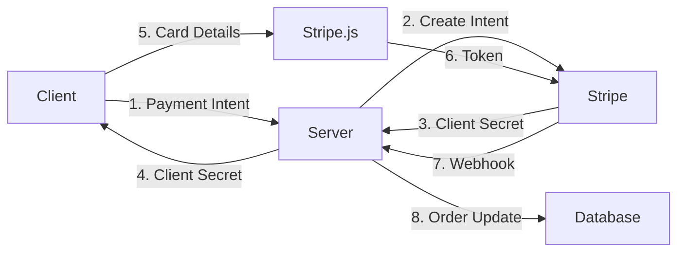

# Security Policy

## Overview

Restaurant OS implements multiple layers of security to protect customer data, payment information, and business operations.

## Authentication & Authorization

### JWT Authentication (Supabase)

- **Token Location**: Authorization header
- **Format**: `Bearer <jwt-token>`
- **Expiration**: 1 hour (refreshable)
- **Validation**: Every API request
- **Signing**: RS256 algorithm

```javascript
// Token validation middleware
const token = req.headers.authorization?.replace('Bearer ', '');
const { data: user, error } = await supabase.auth.getUser(token);
```

### PIN Authentication (Staff)

- **Hashing**: bcrypt with 12 rounds + application pepper
- **Storage**: Hashed PIN in database, pepper in environment
- **Lockout**: 5 failed attempts → 15 minute lockout
- **Session**: 12 hours for service staff

```javascript
// PIN hashing with pepper
const pepper = process.env.PIN_PEPPER;
const pepperedPin = pin + pepper;
const hashedPin = await bcrypt.hash(pepperedPin, 12);
```

### Session Management

| Role | Session Duration | Refresh Policy |
|------|-----------------|----------------|
| Owner/Manager | 8 hours | Auto-refresh on activity |
| Server/Cashier | 12 hours | Manual refresh required |
| Kitchen/Expo | 24 hours | Device-bound, no refresh |
| Customer | Session-based | Expires on browser close |

### CSRF Protection

- **Token Storage**: httpOnly cookie
- **Token Transmission**: X-CSRF-Token header
- **Validation**: All non-GET requests
- **Regeneration**: On login/logout

```javascript
// CSRF validation
if (req.method !== 'GET') {
  const cookieToken = req.cookies.csrfToken;
  const headerToken = req.headers['x-csrf-token'];
  if (cookieToken !== headerToken) {
    throw new ForbiddenError('CSRF validation failed');
  }
}
```

### Role-Based API Scopes

- **Owner**: Full system access
- **Manager**: Restaurant operations, reports, staff management
- **Server**: `orders:create`, `payment:process`, `tables:manage`
- **Cashier**: `payment:process`, `orders:view`
- **Kitchen**: `orders:update_status`, `orders:view`
- **Expo**: `orders:complete`, `orders:view`

```javascript
// Role validation middleware
const requireScope = (scope) => async (req, res, next) => {
  const userRole = req.user.role;
  const hasScope = roleScopes[userRole]?.includes(scope);
  if (!hasScope) throw new ForbiddenError('Insufficient permissions');
  next();
};
```

### Restaurant Context Validation

Every request must include restaurant context:

```javascript
const restaurantId = req.headers['x-restaurant-id'];
// Validate user has access to this restaurant
const hasAccess = await validateRestaurantAccess(user.id, restaurantId);
```

## Data Protection

### Database Security

1. **Row-Level Security (RLS)**
   - Enabled on all tables
   - Policies enforce tenant isolation
   - Automatic filtering by restaurant_id

2. **Prepared Statements**
   - All queries use parameterized inputs
   - No string concatenation
   - SQL injection prevention

3. **Connection Security**
   - SSL/TLS required
   - Connection pooling
   - Credential rotation

### API Security

1. **Input Validation**
   - Schema validation (Zod)
   - Type checking
   - Sanitization

2. **Output Filtering**
   - Remove sensitive fields
   - PII masking in logs
   - Error message sanitization

3. **Rate Limiting**
   ```javascript
   const limits = {
     auth: { window: 15 * 60 * 1000, max: 5 },
     orders: { window: 60 * 1000, max: 100 },
     voice: { window: 60 * 1000, max: 30 }
   };
   ```

## Payment Security

### PCI Compliance

- No credit card data stored
- Tokenization via payment gateway
- TLS for all payment APIs
- Audit logging

### Payment Flow Security



## WebSocket Security

### Connection Security

1. **Authentication Required**
   ```javascript
   ws.on('connection', (socket) => {
     socket.on('auth', async (data) => {
       const valid = await validateToken(data.token);
       if (!valid) socket.close(1008, 'Invalid token');
     });
   });
   ```

2. **Message Validation**
   - Type checking
   - Restaurant context
   - Rate limiting

3. **Channel Isolation**
   - Restaurant-specific channels
   - Permission-based subscriptions

## Sensitive Data Handling

### Environment Variables

```bash
# Never commit .env files
# Use secret management in production
SUPABASE_SERVICE_KEY=***  # Server only
OPENAI_API_KEY=***         # Server only
STRIPE_SECRET_KEY=***      # Server only
```

### Logging

1. **PII Redaction**
   ```javascript
   logger.info('Order created', {
     orderId: order.id,
     customerPhone: maskPhone(order.customerPhone),
     amount: order.total
   });
   ```

2. **Audit Trail**
   - All authentication events logged (login, logout, failed attempts)
   - User ID and restaurant ID tracked for all operations
   - Payment events with amount and status
   - IP addresses and user agents recorded
   - Timestamp all events with ISO-8601 format
   
3. **Auth Event Logging**
   ```javascript
   // Comprehensive auth event logging
   auditLog.create({
     event_type: 'auth.login',
     user_id: user.id,
     restaurant_id: restaurantId,
     ip_address: req.ip,
     user_agent: req.headers['user-agent'],
     metadata: {
       auth_method: 'pin', // or 'email', 'station'
       session_duration: '12h',
       mfa_used: false
     }
   });
   ```

## Security Headers

```javascript
app.use(helmet({
  contentSecurityPolicy: {
    directives: {
      defaultSrc: ["'self'"],
      scriptSrc: ["'self'", "'unsafe-inline'"],
      styleSrc: ["'self'", "'unsafe-inline'"],
      imgSrc: ["'self'", "data:", "https:"],
      connectSrc: ["'self'", "wss:", "https:"],
    },
  },
  hsts: {
    maxAge: 31536000,
    includeSubDomains: true,
    preload: true
  }
}));
```

## Vulnerability Management

### Dependencies

- Regular dependency updates
- Automated vulnerability scanning
- `npm audit` in CI/CD

```bash
# Check for vulnerabilities
npm audit

# Auto-fix when possible
npm audit fix
```

### Security Testing

1. **Static Analysis**
   - ESLint security rules
   - TypeScript strict mode
   - Code reviews

2. **Dynamic Testing**
   - Penetration testing
   - OWASP Top 10 checks
   - API fuzzing

## Incident Response

### Severity Levels

| Level | Description | Response Time |
|-------|-------------|---------------|
| Critical | Data breach, service down | < 1 hour |
| High | Security vulnerability | < 4 hours |
| Medium | Potential issue | < 24 hours |
| Low | Best practice violation | < 1 week |

### Response Procedure

1. **Detection**
   - Monitoring alerts
   - User reports
   - Automated scans

2. **Containment**
   - Isolate affected systems
   - Disable compromised accounts
   - Block malicious IPs

3. **Eradication**
   - Patch vulnerabilities
   - Remove malware
   - Update configurations

4. **Recovery**
   - Restore services
   - Verify integrity
   - Monitor closely

5. **Lessons Learned**
   - Document incident
   - Update procedures
   - Implement preventions

## Reporting Security Issues

### Responsible Disclosure

Please report security vulnerabilities to:
- Email: security@restaurant-os.com
- PGP Key: [Public key]

**Do NOT**:
- Open public issues for security bugs
- Share exploits publicly
- Attack production systems

**Do**:
- Provide detailed reproduction steps
- Include version information
- Allow time for patching

### Bug Bounty Program

We offer rewards for responsibly disclosed vulnerabilities:

| Severity | Reward |
|----------|--------|
| Critical | $1000-5000 |
| High | $500-1000 |
| Medium | $100-500 |
| Low | $50-100 |

## Security Checklist

### Development

- [ ] Input validation on all endpoints
- [ ] Authentication required
- [ ] Authorization checked
- [ ] CSRF protection enabled
- [ ] Rate limiting configured
- [ ] Sensitive data masked in logs
- [ ] SQL injection prevented
- [ ] XSS protection enabled

### Deployment

- [ ] HTTPS enforced
- [ ] Security headers configured
- [ ] Secrets in environment variables
- [ ] Database encryption enabled
- [ ] Backups encrypted
- [ ] Monitoring configured
- [ ] Incident response plan ready

### Regular Audits

- [ ] Weekly: Dependency updates
- [ ] Monthly: Access review
- [ ] Quarterly: Security scan
- [ ] Annually: Penetration test

## Compliance

### Standards

- PCI DSS Level 4 (Payment Card Industry)
- GDPR (General Data Protection Regulation)
- CCPA (California Consumer Privacy Act)
- SOC 2 Type II

### Data Retention

| Data Type | Retention Period | Deletion Method |
|-----------|-----------------|-----------------|
| Orders | 7 years | Soft delete → hard delete |
| Customer PII | 3 years after last activity | Anonymization |
| Payment tokens | 1 year | Secure deletion |
| Logs | 90 days | Rotation → deletion |

---

**Last Updated**: February 1, 2025  
**Version**: 6.0.3  
**Security Contact**: security@restaurant-os.com