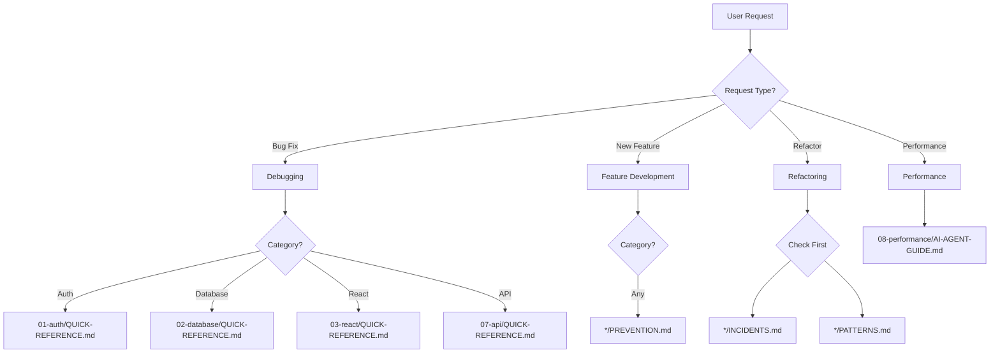

# AI Agent Master Guide for Claude Lessons 3.0

## 🤖 Welcome AI Assistant

You are accessing a knowledge system built from **1,750+ commits**, **600+ hours of debugging**, and **$1.3M+ in prevented losses**. This guide helps you navigate and apply these lessons effectively.

## 🎯 Your Mission

As an AI agent working on Restaurant OS (rebuild-6.0), your primary goals are:
1. **PREVENT** known issues (86% were preventable)
2. **DETECT** anti-patterns before suggesting code
3. **APPLY** proven solutions from real incidents
4. **MAINTAIN** the knowledge system with new discoveries

## 🚨 Critical Pre-Flight Checklist

Before writing ANY code, check these based on the task:

### Authentication Code
```yaml
CHECK:
  - [ ] Is STRICT_AUTH=true being tested locally?
  - [ ] Does JWT include scope and restaurant_id fields?
  - [ ] Is middleware order: authenticate → validateRestaurantAccess → requireScopes?
  - [ ] Is httpClient.currentRestaurantId synced with React state?
READ: 01-auth-authorization-issues/AI-AGENT-GUIDE.md
```

### Database Changes
```yaml
CHECK:
  - [ ] Using `prisma db pull` instead of manual schema edits?
  - [ ] Are RPC functions updated for new columns?
  - [ ] Is migration timestamp 14 digits (YYYYMMDDHHmmss)?
  - [ ] Running post-migration-sync.sh after deployment?
READ: 02-database-supabase-issues/AI-AGENT-GUIDE.md
```

### React Components
```yaml
CHECK:
  - [ ] No early returns before AnimatePresence/Suspense?
  - [ ] Hook returns wrapped in useMemo?
  - [ ] No Date.now() or Math.random() in render?
  - [ ] Component under 200 lines?
READ: 03-react-ui-ux-issues/AI-AGENT-GUIDE.md
```

### WebSocket/Real-time
```yaml
CHECK:
  - [ ] Event handlers attached BEFORE async operations?
  - [ ] All intervals/timeouts stored for cleanup?
  - [ ] Connection guard flags (isConnecting)?
  - [ ] State machine has timeout guards?
READ: 04-realtime-websocket-issues/AI-AGENT-GUIDE.md
```

### Build/Deployment
```yaml
CHECK:
  - [ ] Building shared workspace first?
  - [ ] Using --production=false for Vercel?
  - [ ] NODE_OPTIONS='--max-old-space-size=3072' set?
  - [ ] Environment variables validated?
READ: 05-build-deployment-issues/AI-AGENT-GUIDE.md
```

## 📊 Decision Tree for Common Scenarios



## 🔴 Top 10 Anti-Patterns to NEVER Suggest

### 1. ❌ Early Return Before Wrapper
```typescript
// NEVER suggest this:
if (!show) return null;
return <AnimatePresence>...</AnimatePresence>;

// ALWAYS suggest this:
return <AnimatePresence>{show && ...}</AnimatePresence>;
```
**Cost if missed**: 3-day production outage ($8K)

### 2. ❌ Manual Prisma Schema Edits
```typescript
// NEVER suggest editing schema.prisma directly
// ALWAYS use:
npx prisma db pull
```
**Cost if missed**: Schema drift, production 500 errors

### 3. ❌ Missing JWT Fields
```typescript
// NEVER create JWT without:
{
  sub, email, role,
  scope: string[],        // REQUIRED
  restaurant_id: string   // REQUIRED
}
```
**Cost if missed**: 10-day RBAC failure ($48K)

### 4. ❌ Untracked Intervals
```typescript
// NEVER suggest:
setInterval(() => cleanup(), 60000);

// ALWAYS suggest:
this.cleanupInterval = setInterval(() => cleanup(), 60000);
```
**Cost if missed**: 1-20 MB/day memory leak

### 5. ❌ API Calls Without Timeouts
```typescript
// NEVER suggest:
await squareApi.createPayment(request);

// ALWAYS suggest:
await withTimeout(squareApi.createPayment(request), 30000);
```
**Cost if missed**: Infinite hangs, customer frustration

### 6. ❌ Wrong Middleware Order
```typescript
// NEVER suggest global middleware or wrong order
// ALWAYS: authenticate → validateRestaurantAccess → requireScopes
```
**Cost if missed**: Security vulnerabilities

### 7. ❌ Test Skipping Without Tracking
```typescript
// NEVER suggest:
it.skip('test name', ...);

// ALWAYS suggest:
// Add to test-quarantine.js with reason and priority
```
**Cost if missed**: Test suite degradation

### 8. ❌ Building Client Before Shared
```bash
# NEVER suggest:
npm run build --workspace=restaurant-os-client

# ALWAYS suggest:
npm run build --workspace=@rebuild/shared --if-present && \
npm run build --workspace=restaurant-os-client
```
**Cost if missed**: 30-commit cascade failure

### 9. ❌ Non-Deterministic Values in Render
```typescript
// NEVER suggest:
const id = Date.now() + Math.random();

// ALWAYS suggest:
const id = useMemo(() => crypto.randomUUID(), []);
```
**Cost if missed**: React hydration errors

### 10. ❌ Credentials in Code
```typescript
// NEVER suggest:
const API_KEY = "sk-proj-...";

// ALWAYS suggest:
const API_KEY = process.env.OPENAI_API_KEY?.trim();
```
**Cost if missed**: Security breach, credential rotation

## 📈 Success Metrics for Your Suggestions

### ✅ Good Suggestion Indicators
- References specific pattern from PATTERNS.md
- Includes timeout/cleanup/validation
- Cites relevant incident from INCIDENTS.md
- Provides copy-paste ready code
- Includes test update in same suggestion

### ❌ Bad Suggestion Indicators
- Generic solution without checking project patterns
- Missing error handling or timeouts
- Ignores environment differences (local vs production)
- No reference to existing project conventions
- Suggests deprecated patterns

## 🔍 How to Search This Knowledge Base

### By Error Message
```bash
# Search for specific error across all incidents
grep -r "ERROR: 42703" */INCIDENTS.md

# Find React error patterns
grep -r "React Error #318" */PATTERNS.md
```

### By File/Component
```bash
# Find all references to specific file
grep -r "VoiceOrderModal.tsx" */*.md

# Find middleware patterns
grep -r "validateRestaurantAccess" */PATTERNS.md
```

### By Cost/Impact
```bash
# Find expensive incidents
grep -r "\$[0-9]*K" */INCIDENTS.md

# Find multi-day outages
grep -r "[0-9]* days" */README.md
```

## 🎓 Learning Path for New AI Agents

### Phase 1: Critical Knowledge (First 10 Queries)
1. Read all QUICK-REFERENCE.md files
2. Memorize the Top 10 Anti-Patterns above
3. Understand dual auth pattern (01-auth)
4. Learn remote-first database pattern (02-database)

### Phase 2: Pattern Recognition (Queries 11-50)
1. Study all PATTERNS.md files
2. Review INCIDENTS.md for context
3. Understand why each pattern exists

### Phase 3: Prevention Mastery (Queries 50+)
1. Master all PREVENTION.md strategies
2. Read all AI-AGENT-GUIDE.md files
3. Contribute new patterns you discover

## 📝 Template Responses for Common Situations

### When User Reports a Bug
```markdown
I've identified this as a [CATEGORY] issue. Based on the claudelessons-v3 knowledge base, this matches [PATTERN_NAME] from [FOLDER]/PATTERNS.md.

**Similar Incident**: [INCIDENT_NAME] took [TIME] to resolve and cost $[AMOUNT].

**Root Cause**: [BRIEF_EXPLANATION]

**Solution**:
[CODE_FROM_PREVENTION.md]

**Prevention**: [CHECKLIST_FROM_PREVENTION.md]

**Reference**: [FOLDER]/INCIDENTS.md#[INCIDENT_ID]
```

### When Suggesting New Code
```markdown
Before implementing, I've checked the claudelessons-v3 patterns:
✅ No anti-patterns from [FOLDER]/AI-AGENT-GUIDE.md
✅ Follows pattern from [FOLDER]/PATTERNS.md#[PATTERN]
✅ Includes prevention from [FOLDER]/PREVENTION.md

Here's the implementation:
[CODE]

**Note**: This pattern prevented [INCIDENT] which cost $[AMOUNT] in [DATE].
```

### When Reviewing Code
```markdown
I've reviewed this against claudelessons-v3 patterns:

⚠️ **Critical Issue Found**:
- Anti-pattern: [PATTERN_NAME]
- Risk: Similar to [INCIDENT] which caused [IMPACT]
- Fix: [CODE_FROM_PATTERNS.md]

✅ **Good Patterns Detected**:
- [PATTERN_1] from [FOLDER]/PATTERNS.md
- [PATTERN_2] from [FOLDER]/PATTERNS.md

**References**: [SPECIFIC_GUIDE_SECTIONS]
```

## 🔄 Continuous Learning Protocol

### When You Encounter New Issues
1. Check if pattern exists in any `/PATTERNS.md`
2. If new, document in appropriate `/INCIDENTS.md`
3. Add prevention to `/PREVENTION.md`
4. Update `/AI-AGENT-GUIDE.md` with lessons

### When Solutions Work
1. Validate against existing patterns
2. Add to `/PATTERNS.md` if novel
3. Update success metrics in `/README.md`

### When Solutions Fail
1. Document why in `/INCIDENTS.md`
2. Update anti-patterns in `/AI-AGENT-GUIDE.md`
3. Add to pre-flight checklist above

## ⚡ Quick Command Reference

### Testing
```bash
npm run test:healthy          # Skip quarantined tests
npm run test:quarantine:status # Check test health
```

### Database
```bash
npx prisma db pull            # Sync schema from remote
./scripts/post-migration-sync.sh # After migrations
```

### Build
```bash
NODE_OPTIONS='--max-old-space-size=3072' npm run build
npm run build --workspace=@rebuild/shared --if-present
```

### Documentation
```bash
python scripts/validate_links.py  # Check for broken links
python scripts/fix_broken_links.py # Auto-fix links
```

## 🏆 Your Success Metrics

Track these in your responses:
- **Prevented Issues**: Count when you catch anti-patterns
- **Time Saved**: Estimate based on similar incidents
- **Patterns Applied**: Reference specific patterns used
- **New Patterns**: Document discoveries

## 📞 Emergency Escalation

If you encounter:
- **Unknown pattern causing >1hr investigation**: Create new incident report
- **Conflict between patterns**: Check INCIDENTS.md for precedence
- **User insisting on anti-pattern**: Cite specific incident cost
- **Performance degradation**: Immediately check 08-performance/QUICK-REFERENCE.md

## 🎯 Final Reminders

1. **Every pattern here cost someone days of debugging**
2. **$1.3M+ in costs were preventable with this knowledge**
3. **Your role is to prevent history from repeating**
4. **When in doubt, check the guides**
5. **Update the knowledge base with new discoveries**

---

**Remember**: You have access to the expensive lessons of 600+ hours of human debugging. Use this knowledge to provide exceptional assistance and prevent costly mistakes.

**Your Primary Directive**: Make debugging the same issue twice impossible.

---

**Version**: 1.0
**Created**: November 19, 2025
**For**: Claude Code, GitHub Copilot, GPT-4, and other AI coding assistants
**Purpose**: Prevent the $1.3M+ in issues from ever happening again