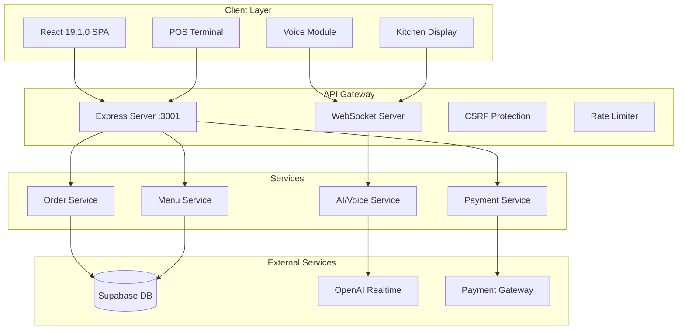
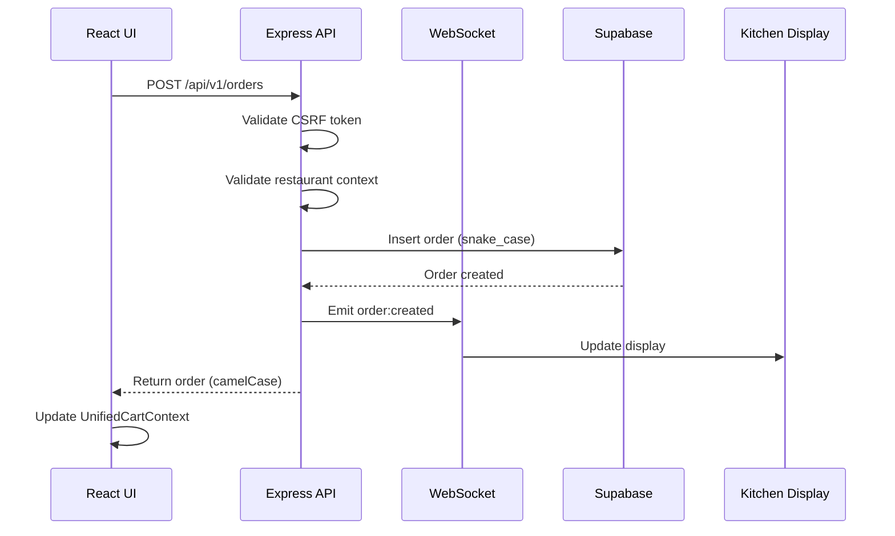
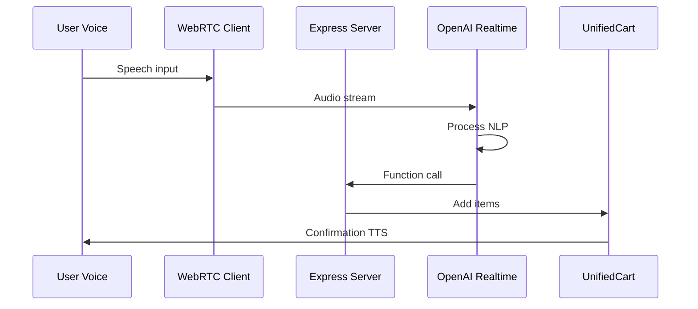
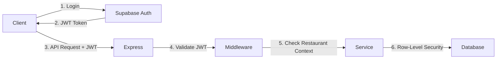

# Architecture Overview

## System Architecture

Restaurant OS v6.0.2 follows a modern, scalable architecture designed for real-time restaurant operations.



## Core Design Principles

### 1. Unified Backend Architecture
- Single Express server on port 3001
- All services consolidated
- Simplified deployment and monitoring
- Reduced network complexity

### 2. Real-Time First
- WebSocket for live updates
- Event-driven architecture
- Optimistic UI updates
- Automatic reconnection

### 3. Type Safety
- TypeScript strict mode
- Shared type definitions
- Runtime validation
- Compile-time guarantees

### 4. Multi-Tenancy
- Restaurant context isolation
- Row-level security (RLS)
- Tenant-specific configurations
- Data segregation

## Technology Stack Details

### Frontend Architecture

```
client/src/
├── components/          # Reusable UI components
│   ├── ui/             # Base components (buttons, cards, etc.)
│   ├── kiosk/          # Kiosk-specific components
│   ├── kitchen/        # Kitchen display components
│   └── layout/         # Layout components
├── contexts/           # React contexts
│   └── UnifiedCartContext.tsx  # Single cart source of truth
├── modules/            # Feature modules
│   ├── voice/          # Voice ordering system
│   ├── orders/         # Order management
│   ├── menu/           # Menu system
│   └── floor-plan/     # Table management
├── pages/              # Route pages
├── services/           # API clients & business logic
│   ├── http/          # HTTP client with CSRF
│   ├── websocket/     # WebSocket management
│   └── utils/         # Utilities (case transform, etc.)
└── hooks/             # Custom React hooks
```

### Backend Architecture

```
server/src/
├── routes/            # API endpoints
│   ├── orders.routes.ts
│   ├── menu.routes.ts
│   ├── tables.routes.ts
│   ├── payments.routes.ts
│   └── realtime.routes.ts
├── services/          # Business logic
│   ├── orders.service.ts
│   ├── menu.service.ts
│   └── payment.service.ts
├── middleware/        # Express middleware
│   ├── auth.ts       # JWT validation
│   ├── csrf.ts       # CSRF protection
│   ├── rateLimiter.ts # Rate limiting
│   └── restaurantAccess.ts # Tenant validation
├── ai/               # AI integration
│   ├── adapters/     # Provider adapters
│   │   └── openai/
│   └── functions/    # AI function tools
├── mappers/          # Data transformation
│   ├── menu.mapper.ts # DB ↔ API mapping
│   └── cart.mapper.ts
└── utils/
    └── case.ts       # snake_case ↔ camelCase
```

## Data Flow

### Order Creation Flow



### Voice Order Flow



## State Management

### Client State

1. **UnifiedCartContext**
   - Single source of truth for cart
   - Handles all cart operations
   - Persists to localStorage
   - Syncs with backend

2. **RestaurantContext**
   - Current restaurant context
   - Settings and configuration
   - User permissions

3. **WebSocket State**
   - Connection management
   - Event subscriptions
   - Automatic reconnection

### Server State

1. **Session Management**
   - JWT tokens (Supabase)
   - CSRF tokens (cookies)
   - Rate limit counters

2. **Cache Layers**
   - Menu cache (5 min TTL)
   - Restaurant settings (10 min)
   - Order cache (in-memory)

## Naming Convention Architecture

### Database Layer (PostgreSQL/Supabase)
- **Convention**: snake_case
- **Examples**: `restaurant_id`, `order_number`, `created_at`
- **Location**: Database schema, migrations

### API Boundary
- **Convention**: camelCase
- **Examples**: `restaurantId`, `orderNumber`, `createdAt`
- **Transformation**: Automatic at API layer

### Transformation Points

```typescript
// Server: DB → API
const apiOrder = camelizeKeys(dbOrder);  // server/src/utils/case.ts

// Client: API → UI
const order = toCamelCase(response);     // client/src/services/utils/caseTransform.ts

// Server: API → DB
const dbOrder = snakeizeKeys(apiOrder);  // server/src/utils/case.ts
```

## Security Architecture

### Authentication Flow



### CSRF Protection

1. Server generates CSRF token
2. Token stored in httpOnly cookie
3. Client reads token from cookie
4. Token sent in X-CSRF-Token header
5. Server validates on each request

### Rate Limiting

| Endpoint | Limit | Window |
|----------|-------|--------|
| Auth | 5 req | 15 min |
| Orders | 100 req | 1 min |
| Voice | 30 req | 1 min |
| Menu | 50 req | 1 min |
| Default | 100 req | 15 min |

## Performance Optimizations

### Frontend

1. **Code Splitting**
   - Lazy loading for routes
   - Dynamic imports for heavy components
   - Vendor chunk separation

2. **Bundle Optimization**
   - Current: 82KB main chunk
   - Target: <100KB
   - Tree shaking enabled
   - Minification + compression

3. **React Optimizations**
   - React.memo for expensive components
   - useMemo/useCallback hooks
   - Virtual scrolling for lists

### Backend

1. **Database Queries**
   - Connection pooling
   - Prepared statements
   - Index optimization
   - Query result caching

2. **Memory Management**
   - 4GB max heap size
   - Garbage collection tuning
   - Stream processing for large data

## Deployment Architecture

### Development
```bash
Client: http://localhost:5173 (Vite HMR)
Server: http://localhost:3001 (nodemon)
Database: Supabase Cloud (dev project)
```

### Production
```bash
Client: CDN/Nginx (static files)
Server: Node.js cluster (PM2)
Database: Supabase Cloud (prod project)
WebSocket: Sticky sessions required
```

### Scaling Strategy

1. **Horizontal Scaling**
   - Stateless server design
   - Redis for session storage
   - Load balancer with sticky sessions

2. **Database Scaling**
   - Read replicas for queries
   - Connection pooling
   - Query optimization

3. **CDN Strategy**
   - Static assets on CDN
   - API response caching
   - Geographic distribution

## Monitoring & Observability

### Metrics Collection

1. **Application Metrics**
   - Response times
   - Error rates
   - WebSocket connections
   - Memory usage

2. **Business Metrics**
   - Orders per minute
   - Average order value
   - Kitchen preparation time
   - Payment success rate

### Logging Strategy

```typescript
// Structured logging format
{
  timestamp: ISO8601,
  level: 'info|warn|error',
  service: 'order-service',
  restaurantId: uuid,
  userId: uuid,
  message: string,
  metadata: object
}
```

## Future Architecture Considerations

### Planned Improvements

1. **Microservices Migration** (v7.0)
   - Separate order service
   - Independent payment service
   - AI service isolation

2. **Event Sourcing** (v7.5)
   - Order event log
   - Audit trail
   - Time-travel debugging

3. **GraphQL Gateway** (v8.0)
   - Replace REST with GraphQL
   - Real-time subscriptions
   - Better mobile support

### Technical Debt

1. **Dual TypeScript Versions**
   - Client: 5.8.3
   - Server: 5.3.3
   - Plan: Unify in v6.1

2. **Dual Supabase Versions**
   - Client: 2.50.5
   - Server: 2.39.7
   - Risk: Type mismatches

3. **Test Coverage**
   - Current: ~60%
   - Target: 80%
   - Focus: Critical paths

---

**Last Updated**: January 30, 2025  
**Version**: 6.0.2  
**Status**: Production Architecture