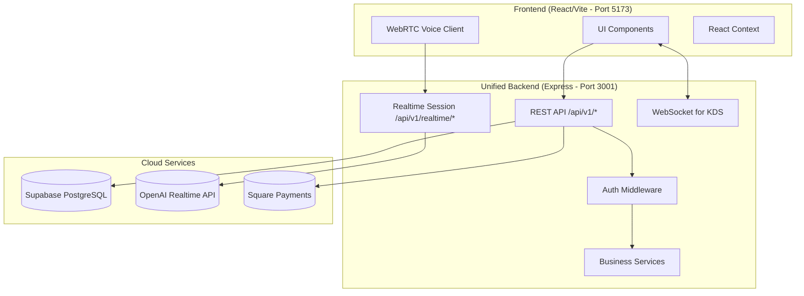
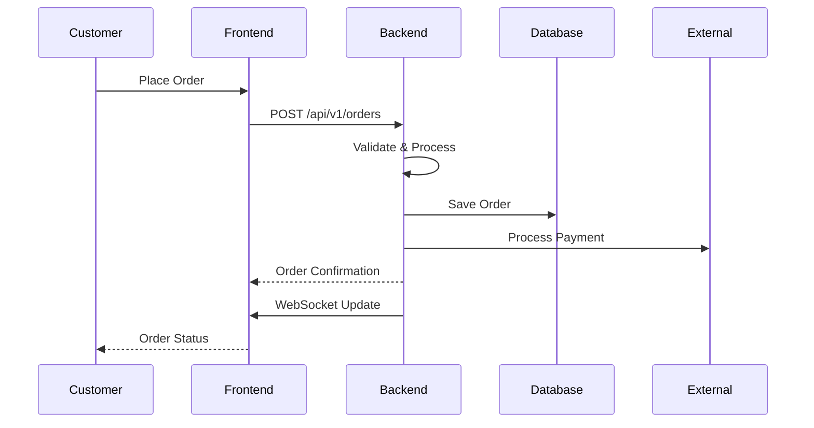

# Architecture Overview

## Core Principles

### Unified Backend Architecture

**Decision**: "For simplicity, let's put it all in the same backend" - Luis, Backend Architect

This is the fundamental architectural decision that drives the entire system:

- **ONE** backend service on port 3001 (includes API + AI + WebSocket)
- **ONE** frontend on port 5173
- **NO** microservices
- **NO** separate AI Gateway
- **NO** port 3002 (this port should not exist anywhere)

## System Architecture



## Technology Stack

### Frontend
- **Framework**: React 19.1.0
- **Language**: TypeScript 5.8.3
- **Build Tool**: Vite 5.4.19
- **Styling**: Tailwind CSS
- **State**: React Context API
- **Real-time**: WebSockets, WebRTC

### Backend
- **Runtime**: Node.js
- **Framework**: Express 4.18.2
- **Language**: TypeScript 5.3.3
- **Database**: Supabase (PostgreSQL)
- **Auth**: JWT with Supabase Auth
- **AI**: OpenAI Realtime API

### Infrastructure
- **Development**: Local with hot reload
- **Production**: Vercel (frontend), Render (backend)
- **Database**: Supabase cloud
- **CDN**: Vercel Edge Network

## Key Components

### 1. Frontend Applications

| Application | Path | Purpose |
|-------------|------|---------|
| **Kiosk** | `/kiosk` | Customer self-service ordering |
| **Drive-Thru** | `/drive-thru` | Voice-based ordering |
| **Kitchen Display** | `/kitchen` | Real-time order management |
| **POS Terminal** | `/pos` | Staff order entry |
| **Server View** | `/server` | Table management |
| **Admin Dashboard** | `/admin` | Analytics and configuration |

### 2. Backend Services

| Service | Endpoint | Purpose |
|---------|----------|---------|
| **Menu API** | `/api/v1/menu` | Menu items and categories |
| **Order API** | `/api/v1/orders` | Order creation and management |
| **Table API** | `/api/v1/tables` | Table status and assignments |
| **Payment API** | `/api/v1/payments` | Square integration |
| **Realtime API** | `/api/v1/realtime/*` | Voice session management |
| **WebSocket** | `ws://localhost:3001` | KDS real-time updates |

### 3. Data Flow



## Security Architecture

### Authentication Flow
1. User authenticates via Supabase Auth
2. JWT token issued and stored in httpOnly cookie
3. All API requests include JWT in Authorization header
4. Backend validates JWT on each request
5. Restaurant context enforced via JWT claims

### API Security
- **CORS**: Configured for specific origins
- **Rate Limiting**: 100 requests per minute per IP
- **Input Validation**: Zod schemas for all endpoints
- **SQL Injection**: Prevented via parameterized queries
- **XSS Protection**: React's built-in escaping + CSP headers

### Sensitive Data Handling
- **API Keys**: Server-side only, never exposed to client
- **Payment Data**: PCI compliance via Square SDK
- **User Data**: Encrypted at rest in Supabase
- **Passwords**: Handled by Supabase Auth (bcrypt)

## Multi-Tenancy

Each restaurant is isolated through:

1. **Restaurant ID**: Required in all data operations
2. **JWT Claims**: Restaurant context embedded in token
3. **Database RLS**: Row-level security in PostgreSQL
4. **API Middleware**: Automatic restaurant filtering
5. **WebSocket Rooms**: Isolated real-time channels

## Performance Considerations

### Optimizations Implemented
- **Code Splitting**: Lazy loading for routes (93KB main bundle)
- **Memoization**: React.memo for expensive components
- **Debouncing**: Search and filter operations
- **Virtualization**: Long lists in KDS
- **Caching**: API responses with React Query

### Monitoring
- **Health Checks**: `/api/v1/health` endpoint
- **Error Tracking**: Structured logging with Winston
- **Performance**: Bundle size analysis via Vite
- **Memory**: Limited to 4GB for builds

## Development Workflow

### Local Development
```bash
npm run dev  # Starts both frontend and backend
```

### Testing Strategy
- **Unit Tests**: Vitest for components
- **Integration**: API endpoint testing
- **E2E**: Playwright for critical paths
- **Coverage**: 60% minimum requirement

### Deployment Pipeline
1. **Development**: Local with hot reload
2. **Staging**: Preview deployments on Vercel
3. **Production**: Vercel (frontend) + Render (backend)

## Common Patterns

### API Request Pattern
```typescript
// Use the unified API client
import { apiClient } from '@/services/api';

const orders = await apiClient.get('/orders');
const newOrder = await apiClient.post('/orders', orderData);
```

### WebSocket Pattern
```typescript
// Real-time updates for KDS
const socket = io('http://localhost:3001');
socket.on('orderUpdate', (order) => {
  updateOrderDisplay(order);
});
```

### Error Handling Pattern
```typescript
try {
  const result = await apiCall();
} catch (error) {
  if (error.code === 'AUTH_REQUIRED') {
    redirectToLogin();
  } else {
    showErrorToast(error.message);
  }
}
```

## Known Limitations

1. **TypeScript Errors**: ~482 non-blocking errors exist
2. **WebSocket Scaling**: Single server limitation
3. **Voice Features**: Requires HTTPS in production
4. **Memory Usage**: 4GB required for builds
5. **Browser Support**: Modern browsers only (ES2020+)

## Future Considerations

- **GraphQL**: Potential migration for complex queries
- **Redis**: Session management and caching
- **Kubernetes**: Container orchestration for scaling
- **Event Sourcing**: Audit trail and replay capability
- **Federated Auth**: SSO integration for enterprise