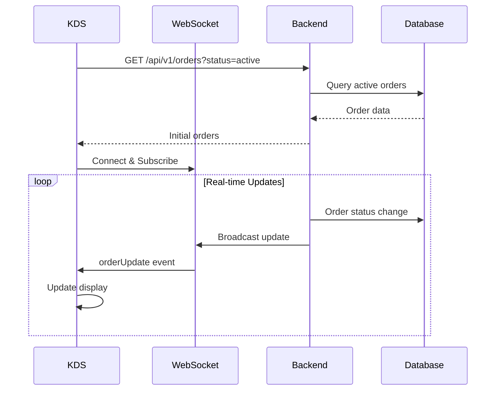

# Kitchen Display System (KDS)

## Overview

The Kitchen Display System provides real-time order management for kitchen staff, enabling efficient order preparation and tracking through a digital interface that replaces traditional paper tickets.

## Critical Requirements

### Status Handling

**ALL 7 order statuses MUST be handled**:
1. `new` - Just created
2. `pending` - Awaiting confirmation
3. `confirmed` - Payment confirmed
4. `preparing` - Being prepared
5. `ready` - Ready for pickup/delivery
6. `completed` - Delivered to customer
7. `cancelled` - Order cancelled

**Missing any status = Runtime errors = Application crash**

### Implementation Rules

```typescript
// ✅ CORRECT: Handle all statuses
const statusConfig = {
  new: { color: 'gray', label: 'New' },
  pending: { color: 'yellow', label: 'Pending' },
  confirmed: { color: 'blue', label: 'Confirmed' },
  preparing: { color: 'orange', label: 'Preparing' },
  ready: { color: 'green', label: 'Ready' },
  completed: { color: 'purple', label: 'Completed' },
  cancelled: { color: 'red', label: 'Cancelled' }
};

// ✅ CORRECT: Always include fallback
switch (order.status) {
  case 'new':
  case 'pending':
  case 'confirmed':
    return 'queued';
  case 'preparing':
    return 'active';
  case 'ready':
    return 'ready';
  case 'completed':
  case 'cancelled':
  default:  // ALWAYS include default
    return 'archived';
}
```

## Features

### Order Display
- **Grid Layout**: Orders organized by status
- **Color Coding**: Visual status indicators
- **Timer Display**: Elapsed time per order
- **Priority Sorting**: Rush orders first
- **Item Details**: Full order breakdown

### Real-time Updates
- **WebSocket Connection**: Live order updates
- **Auto-refresh**: Fallback polling every 30s
- **Optimistic Updates**: Immediate UI feedback
- **Conflict Resolution**: Server state wins

### Keyboard Shortcuts
| Key | Action | Context |
|-----|--------|---------|
| `Space` | Mark Ready | Order selected |
| `Enter` | Complete Order | Ready orders |
| `Esc` | Clear Selection | Any time |
| `1-9` | Quick Select | Order by position |
| `R` | Refresh | Force update |

## Architecture



## Configuration

### Display Settings
```typescript
const KDS_CONFIG = {
  // Timing
  refreshInterval: 30000,     // 30 seconds
  alertThreshold: 900000,     // 15 minutes
  criticalThreshold: 1800000, // 30 minutes
  
  // Display
  maxOrdersPerColumn: 10,
  columnsPerScreen: 4,
  fontSize: 'large',
  
  // Behavior
  autoAdvance: true,
  soundAlerts: true,
  flashUrgent: true
};
```

### Order Type Mapping
```typescript
// Database format -> Display format
const ORDER_TYPE_MAP = {
  'online': 'Online',
  'pickup': 'Takeout',
  'delivery': 'Delivery',
  'dine-in': 'Dine In',
  'drive-thru': 'Drive Thru',
  'kiosk': 'Kiosk',
  'voice': 'Voice'
};
```

## WebSocket Events

### Incoming Events

#### `orderUpdate`
```json
{
  "type": "orderUpdate",
  "data": {
    "id": "order-123",
    "status": "preparing",
    "restaurant_id": "11111111-1111-1111-1111-111111111111",
    "updated_at": "2025-01-26T12:00:00Z"
  }
}
```

#### `newOrder`
```json
{
  "type": "newOrder",
  "data": {
    "id": "order-456",
    "order_number": "A001",
    "items": [...],
    "restaurant_id": "11111111-1111-1111-1111-111111111111"
  }
}
```

### Outgoing Events

#### `updateStatus`
```json
{
  "type": "updateStatus",
  "data": {
    "order_id": "order-123",
    "status": "ready",
    "restaurant_id": "11111111-1111-1111-1111-111111111111"
  }
}
```

## Performance Optimization

### Memory Management
- **Virtual Scrolling**: For large order lists
- **Component Memoization**: Prevent unnecessary renders
- **Event Cleanup**: Proper WebSocket disposal
- **State Batching**: Group multiple updates

### Network Optimization
- **Connection Pooling**: Reuse WebSocket connections
- **Exponential Backoff**: Smart reconnection
- **Message Compression**: Reduce bandwidth
- **Delta Updates**: Send only changes

## Error Handling

### Common Issues

| Error | Cause | Solution |
|-------|-------|----------|
| Orders not updating | WebSocket disconnected | Check connection status |
| Missing orders | Restaurant ID mismatch | Verify context |
| Status errors | Unhandled status value | Add to status config |
| Performance lag | Too many orders | Enable virtualization |

### Debug Mode

Enable debug logging:
```javascript
localStorage.setItem('kds-debug', 'true');
```

Shows:
- WebSocket connection state
- Order update events
- Performance metrics
- Error details

## Testing

### Manual Testing
1. Create test order from Kiosk
2. Verify appears in KDS
3. Change status to "preparing"
4. Verify real-time update
5. Mark as "ready"
6. Complete order

### Automated Testing
```bash
npm run test:kds
```

## Best Practices

### Do's
- ✅ Handle all 7 statuses
- ✅ Include default cases
- ✅ Validate restaurant context
- ✅ Clean up WebSocket connections
- ✅ Use ErrorBoundary components

### Don'ts
- ❌ Skip status validation
- ❌ Trust client-side state
- ❌ Leave connections open
- ❌ Ignore restaurant context
- ❌ Assume order exists

## Multi-tenancy

All operations require restaurant context:

```typescript
// Every WebSocket message includes restaurant_id
const message = {
  type: 'orderUpdate',
  data: {
    ...orderData,
    restaurant_id: currentRestaurantId
  }
};

// Backend filters by restaurant
const orders = await db.orders.findAll({
  where: { 
    restaurant_id: req.headers['x-restaurant-id'],
    status: ['new', 'confirmed', 'preparing']
  }
});
```

## Future Enhancements

- **AI Predictions**: Prep time estimates
- **Station Routing**: Assign to specific stations
- **Voice Alerts**: Audio notifications
- **Analytics**: Performance metrics
- **Multi-screen**: Distributed displays