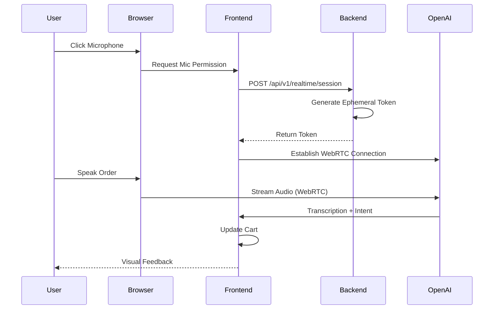
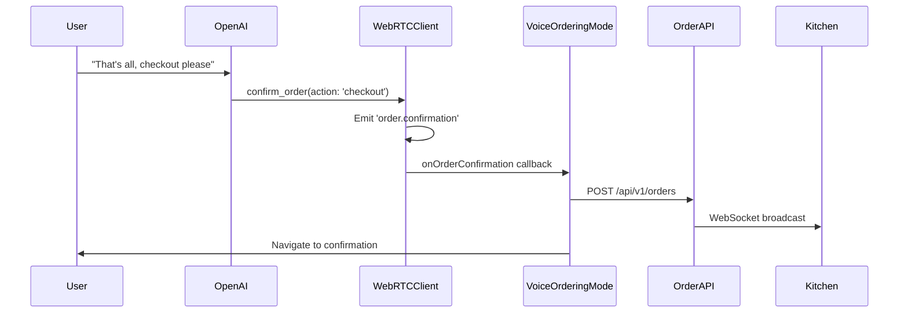

# Voice Ordering System

## Overview

The voice ordering system enables natural language food ordering through WebRTC and OpenAI's Realtime API. Customers can speak their orders naturally, and the system converts speech to structured order data in real-time.

## Architecture

### Unified Implementation

As of 2025-08-21, there is **ONE** voice implementation:

- **Technology**: WebRTC + OpenAI Realtime API
- **Client**: `client/src/modules/voice/services/WebRTCVoiceClient.ts`
- **Component**: `VoiceControlWebRTC` (used by all pages)
- **Backend**: `/api/v1/realtime/session` endpoint
- **No competing systems**: All WebSocket/blob-based voice removed



## Features

### Voice Capabilities

- **Natural Language**: "I'd like a Soul Bowl with extra feta"
- **Modifications**: "No onions", "Extra sauce", "Make it spicy"
- **Quantities**: "Two Greek Salads", "Three waters"
- **Corrections**: "Actually, make that a BLT instead"
- **Questions**: "What's in the Soul Bowl?"
- **Confirmation**: "That's all, checkout please"

### Supported Contexts

| Context | Path | Use Case |
|---------|------|----------|
| **Kiosk** | `/kiosk` | In-store self-service |
| **Drive-Thru** | `/drive-thru` | Vehicle ordering |
| **Expo Station** | `/expo` | Order verification |
| **Voice Test** | `/voice` | Development testing |

## Implementation

### Frontend Integration

```typescript
// Voice control is integrated via React Context
import { useVoice } from '@/contexts/VoiceContext';

function OrderingComponent() {
  const { 
    startListening, 
    stopListening, 
    isListening,
    transcript 
  } = useVoice();

  const handleVoiceOrder = async () => {
    if (isListening) {
      stopListening();
    } else {
      await startListening();
    }
  };

  return (
    <button onClick={handleVoiceOrder}>
      {isListening ? 'Stop' : 'Start'} Voice Order
    </button>
  );
}
```

### Backend Session Management

The backend provides ephemeral tokens for secure OpenAI connection:

```typescript
// Backend endpoint: /api/v1/realtime/session
POST /api/v1/realtime/session
Headers: {
  Authorization: "Bearer {jwt-token}"
}

Response: {
  client_secret: {
    value: "eph_token_xxx",
    expires_at: 1234567890
  }
}
```

### Menu Understanding

The system uses a structured menu prompt:

```typescript
const MENU_CONTEXT = `
You are taking orders for a restaurant with these items:
- Soul Bowl: $18 (Rice, black beans, chicken, feta, vegetables)
- Greek Bowl: $16 (Quinoa, chickpeas, olives, feta, cucumber)
- BLT Sandwich: $14 (Bacon, lettuce, tomato on sourdough)
...
`;
```

## Order Confirmation Flow

### How Voice Orders Reach the Kitchen

The system handles order confirmation through OpenAI function calls:



### Confirmation Actions

The `confirm_order` function supports three actions:

| Action | Trigger Phrases | Result |
|--------|----------------|---------|
| **checkout** | "That's all", "Checkout please", "I'm done" | Submits order to kitchen |
| **review** | "What's in my order?", "Review my order" | Shows order summary |
| **cancel** | "Cancel order", "Start over" | Clears cart |

### Event Chain

1. **Voice Input**: User speaks confirmation phrase
2. **Function Call**: OpenAI calls `confirm_order` with appropriate action
3. **Event Emission**: WebRTCVoiceClient emits `'order.confirmation'` event
4. **Handler Chain**:
   - `useWebRTCVoice` hook receives event
   - `VoiceControlWebRTC` component passes to callback
   - `VoiceOrderingMode` handles confirmation
5. **Order Submission**: `submitOrderAndNavigate` sends to API
6. **Kitchen Update**: WebSocket broadcasts to KDS
7. **User Feedback**: Navigate to confirmation page

## Configuration

### Required Environment Variables

```env
# Backend (server/.env)
OPENAI_API_KEY=sk-...  # Your OpenAI API key

# Frontend automatically configured
# No client-side API keys needed
```

### Browser Requirements

- **Microphone**: Permission required
- **WebRTC**: Modern browser support
- **HTTPS**: Required in production
- **Network**: Stable connection for streaming

## Security

### Key Security Measures

1. **No Client API Keys**: OpenAI key only on backend
2. **Ephemeral Tokens**: Short-lived, single-use
3. **Restaurant Context**: Enforced via JWT
4. **HTTPS Required**: For production deployment
5. **Input Sanitization**: All voice input validated

### Common Security Violations to Avoid

```javascript
// ❌ NEVER DO THIS
VITE_OPENAI_API_KEY=sk-xxx  // Client-side API key

// ✅ CORRECT APPROACH
// Backend manages all OpenAI communication
const { client_secret } = await fetch('/api/v1/realtime/session');
```

## Troubleshooting

### Common Issues

| Issue | Cause | Solution |
|-------|-------|----------|
| No audio input | Microphone permission denied | Check browser permissions |
| Connection failed | Network issues | Verify internet connection |
| No transcription | OpenAI API issues | Check API key and quota |
| Wrong items | Menu context outdated | Update menu prompt |
| High latency | Poor connection | Check network speed |
| Orders stall after confirmation | Missing event handler | Ensure order.confirmation listener exists |
| Checkout not triggered | Broken event chain | Verify VoiceOrderingMode handles confirmation |

### Debug Mode

Enable debug logging:

```typescript
// In development
localStorage.setItem('voice-debug', 'true');
```

This shows:
- WebRTC connection states
- Audio stream events
- OpenAI responses
- Error details

### Testing Voice Features

1. **Manual Test**:
   ```
   Navigate to /voice
   Click "Start Recording"
   Say: "I'd like a Soul Bowl with extra chicken"
   Verify order appears correctly
   ```

2. **Automated Test**:
   ```bash
   npm run test:voice
   ```

## Performance

### Optimizations

- **Connection Pooling**: Reuse WebRTC connections
- **Audio Compression**: Opus codec for efficiency
- **Debounced Updates**: Batch UI updates
- **Memory Management**: Clean up audio streams

### Metrics

| Metric | Target | Current |
|--------|--------|---------|
| Connection Time | <1s | ~800ms |
| First Byte | <500ms | ~400ms |
| Transcription Lag | <300ms | ~250ms |
| Order Parse Time | <100ms | ~80ms |

## Best Practices

### Do's
- ✅ Always check microphone permissions first
- ✅ Provide visual feedback during listening
- ✅ Show transcription in real-time
- ✅ Confirm order before submission
- ✅ Clean up resources on unmount

### Don'ts
- ❌ Don't expose API keys to client
- ❌ Don't skip error handling
- ❌ Don't leave streams open
- ❌ Don't process audio client-side
- ❌ Don't trust unvalidated input

## Future Enhancements

- **Multi-language Support**: Spanish, French, etc.
- **Voice Profiles**: Remember customer preferences
- **Emotion Detection**: Adjust responses to mood
- **Offline Mode**: Queue orders when disconnected
- **Voice Authentication**: Biometric verification