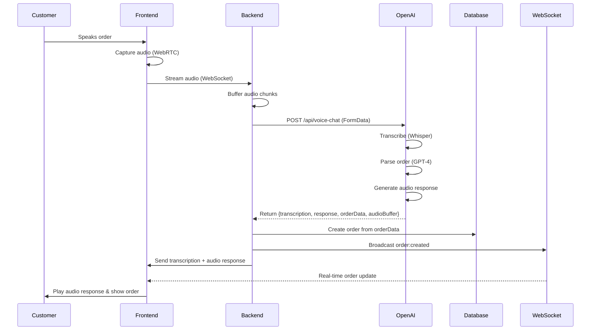
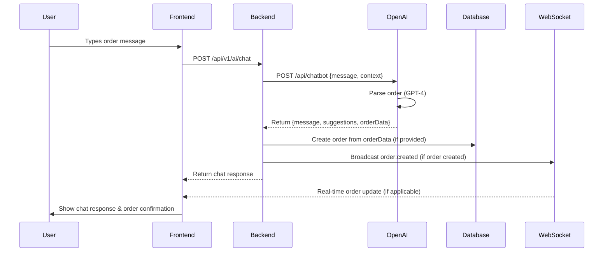
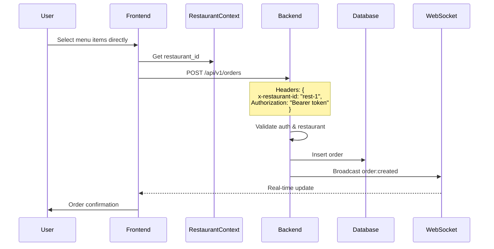
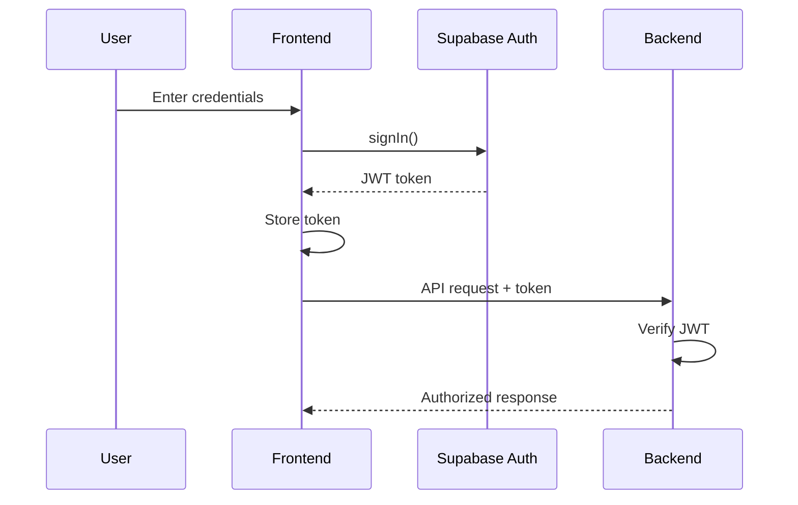
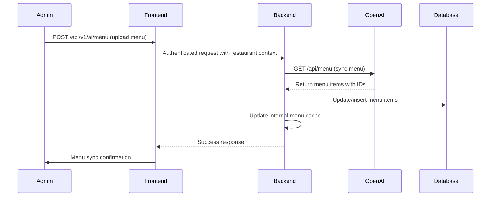
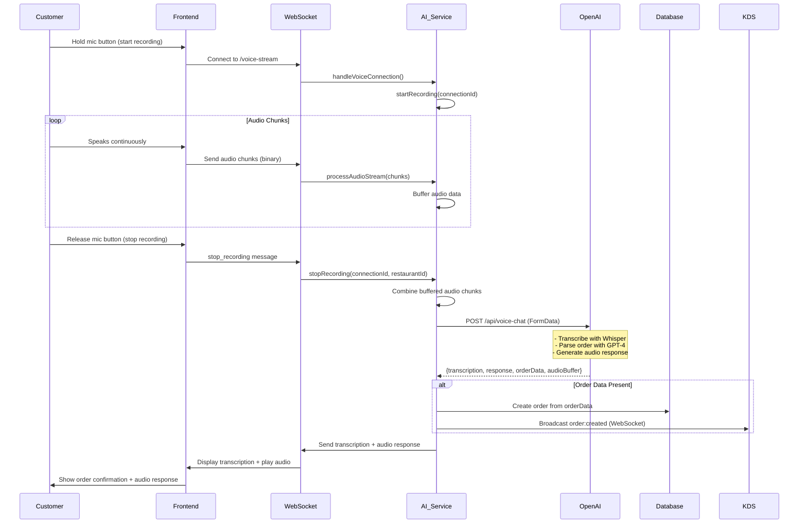
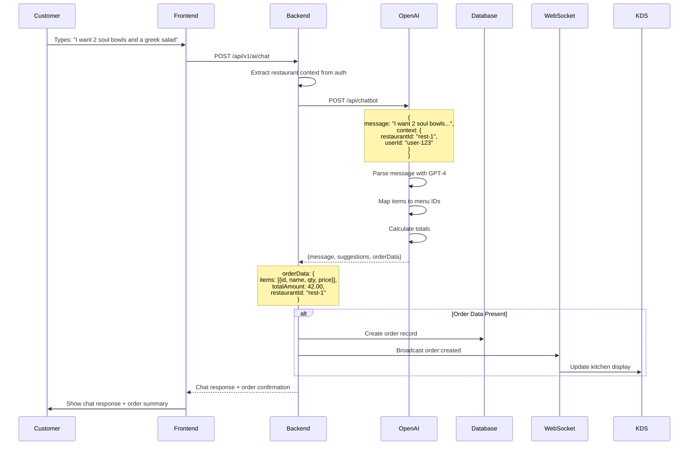
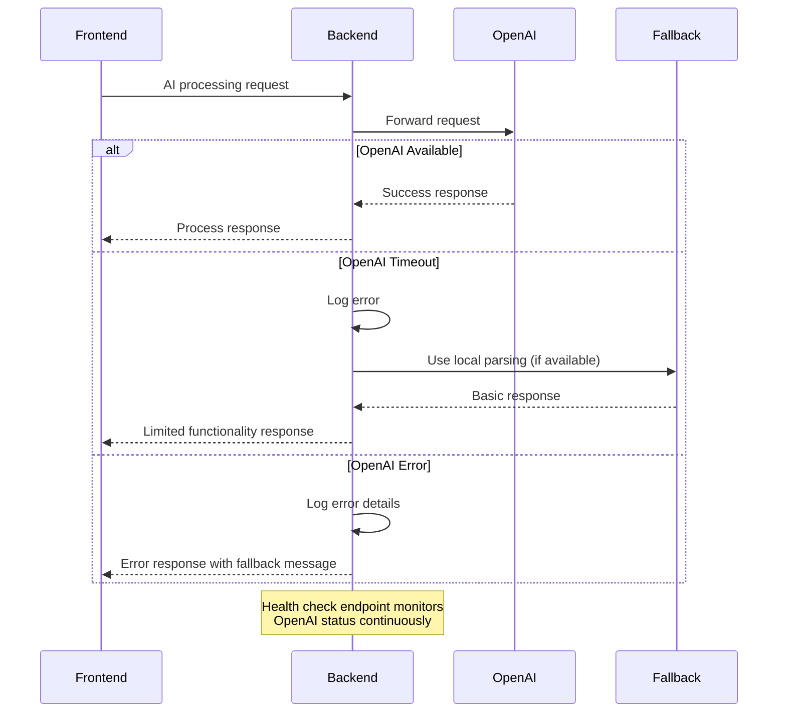

# Data Flow & Integration Documentation

## Table of Contents
1. [Architecture Overview](#architecture-overview)
2. [End-to-End Order Flow](#end-to-end-order-flow)
3. [Data Transformation Layers](#data-transformation-layers)
4. [Shared Types Architecture](#shared-types-architecture)
5. [Multi-Tenancy Implementation](#multi-tenancy-implementation)
6. [Authentication & Authorization Flow](#authentication--authorization-flow)
7. [ID Mapping System](#id-mapping-system)
8. [Real-Time Integration](#real-time-integration)
9. [System Integration Points](#system-integration-points)

## Architecture Overview

The Rebuild 6.0 system uses a **Unified Backend Architecture** with **OpenAI Integration** for AI processing. The Rebuild backend (port 3001) acts as a proxy to OpenAI (port 3003) for AI operations.

```
┌─────────────────────────────────────────────────────────────┐
│                      Frontend (React)                        │
│                         Port: 5173                          │
└──────────────────────┬──────────────────────────────────────┘
                       │ HTTP/WS
┌──────────────────────▼──────────────────────────────────────┐
│                  Unified Backend (Express.js)                │
│                         Port: 3001                          │
│  ┌─────────────┐  ┌─────────────┐  ┌──────────────────┐   │
│  │   API       │  │ OpenAI  │  │   WebSocket      │   │
│  │  Routes     │  │   Proxy     │  │    Server        │   │
│  └─────────────┘  └─────────────┘  └──────────────────┘   │
└──────────────────────┬──────────────────┬──────────────────┘
                       │                  │ HTTP Proxy
                       │           ┌──────▼──────┐
                       │           │ OpenAI  │
                       │           │   Port:     │
                       │           │    3003     │
                       │           └─────────────┘
┌──────────────────────▼──────────────────────────────────────┐
│                    Supabase (PostgreSQL)                     │
└─────────────────────────────────────────────────────────────┘
```

## End-to-End Order Flow

### 1. Voice Order Flow (via OpenAI)



### 2. Text Chat Order Flow (via OpenAI)



### 3. Direct UI Order Flow (Kiosk/POS)



## Data Transformation Layers

### 1. OpenAI → Backend Transformation

```typescript
// OpenAI Response Format
interface OpenAIOrderData {
  items: Array<{
    id: string;
    name: string;
    quantity: number;
    price: number;
    modifiers?: any[];
    notes?: string;
  }>;
  customerInfo?: {
    name?: string;
    phone?: string;
  };
  totalAmount: number;
  restaurantId: string;
}

// Backend transforms to database format
// server/src/services/buildpanel.service.ts
const orderRequest: OrderRequest = {
  items: buildPanelData.items,
  customerInfo: buildPanelData.customerInfo,
  totalAmount: buildPanelData.totalAmount,
  restaurantId: restaurantId,
  userId: userId
}

// Create order via OpenAI
const orderResponse = await buildPanel.createOrder(orderRequest)
```

### 2. Frontend → Backend Transformation (Direct Orders)

```typescript
// Frontend Service Layer (client/src/services/api.ts)
const orderData = {
  restaurant_id: restaurantContext.restaurant.id,
  type: 'kiosk' as OrderType,
  items: cartItems.map(item => ({
    menu_item_id: item.id,
    name: item.name,
    quantity: item.quantity,
    price: item.price,
    modifiers: item.modifiers
  }))
}

// Backend receives and transforms
// server/src/services/orders.service.ts
const newOrder = {
  restaurant_id: restaurantId,
  order_number: generateOrderNumber(),
  type: orderData.type,
  status: 'pending',
  items: transformItems(orderData.items), // UUID mapping
  subtotal: calculateSubtotal(),
  tax: calculateTax(),
  total_amount: calculateTotal()
}
```

### 2. Database → Frontend Transformation

```typescript
// Database Schema (snake_case)
{
  id: "uuid",
  restaurant_id: "rest-1",
  order_number: "20250130-0001",
  customer_name: "John Doe",
  created_at: "2025-01-30T10:00:00Z"
}

// Service Layer Transform (camelCase)
{
  id: "uuid",
  restaurantId: "rest-1",
  orderNumber: "20250130-0001",
  customerName: "John Doe",
  createdAt: "2025-01-30T10:00:00Z"
}

// Shared Type (consistent interface)
interface Order {
  id: string;
  restaurant_id: string;
  order_number: string;
  customer_name?: string;
  created_at: string;
}
```

## Shared Types Architecture

The shared types module (`shared/types/*`) provides a single source of truth for data structures across the entire system.

### Benefits

1. **Type Safety**: Consistent types across frontend and backend
2. **Maintainability**: Single location for type updates
3. **Developer Experience**: IntelliSense and type checking everywhere
4. **Contract Enforcement**: API contracts are typed

### Structure

```
shared/
├── types/
│   ├── index.ts          # Main export
│   ├── order.types.ts    # Order-related types
│   ├── menu.types.ts     # Menu-related types
│   ├── customer.types.ts # Customer types
│   ├── table.types.ts    # Table management
│   └── websocket.types.ts # Real-time events
└── cart.ts               # Shared cart logic
```

### Usage Example

```typescript
// Import in frontend
import { Order, OrderStatus } from '@rebuild/shared';

// Import in backend
import type { Order, CreateOrderDTO } from '@rebuild/shared';

// Type is identical in both environments
const processOrder = (order: Order): void => {
  // Type-safe operations
}
```

## Multi-Tenancy Implementation

Every API request includes restaurant context for data isolation:

### 1. Frontend Context

```typescript
// RestaurantContext provides restaurant_id
const { restaurant } = useRestaurant();

// Automatically included in API calls
api.defaults.headers.common['x-restaurant-id'] = restaurant.id;
```

### 2. Backend Validation

```typescript
// Middleware validates restaurant access
export function validateRestaurantAccess(req, res, next) {
  const restaurantId = req.headers['x-restaurant-id'] || 
                       req.user.restaurant_id ||
                       config.restaurant.defaultId;
  
  if (!restaurantId) {
    throw Unauthorized('Restaurant ID required');
  }
  
  req.restaurantId = restaurantId;
  next();
}
```

### 3. Database Queries

```typescript
// All queries filtered by restaurant_id
const orders = await supabase
  .from('orders')
  .select('*')
  .eq('restaurant_id', restaurantId);
```

## Authentication & Authorization Flow

### 1. Login Flow



### 2. JWT Structure

```typescript
// Decoded JWT contains:
{
  sub: "user-uuid",           // User ID
  email: "user@example.com",
  role: "admin",              // User role
  restaurant_id: "rest-1",    // Restaurant association
  exp: 1234567890,           // Expiration
  iat: 1234567890            // Issued at
}
```

### 3. WebSocket Authentication

```typescript
// WebSocket connection with auth
const ws = new WebSocket(
  `ws://localhost:3001?token=${authToken}`
);

// Server verification
const auth = await verifyWebSocketAuth(request);
if (auth) {
  ws.userId = auth.userId;
  ws.restaurantId = auth.restaurantId;
}
```

## ID Mapping System

The system handles both internal UUIDs and external IDs for menu items:

### 1. Menu Item Structure

```typescript
interface MenuItem {
  id: string;              // UUID (internal)
  external_id?: string;    // External system ID
  name: string;
  description?: string;    // May contain [ID:123]
}
```

### 2. ID Resolution Flow

```typescript
// Voice order with external ID
"I want a number 42" → external_id: "42"

// ID mapper resolves to UUID
const uuid = await menuIdMapper.getUuid("42");
// Returns: "550e8400-e29b-41d4-a716-446655440000"

// Order stored with UUID
order.items[0].menu_item_id = uuid;
```

### 3. Legacy Support

```typescript
// Supports old format in descriptions
description: "Delicious burger [ID:42]"

// Extracted by mapper
const externalId = extractExternalId(item);
// Returns: "42"
```

## Real-Time Integration

### 1. WebSocket Event Types

```typescript
type WebSocketEventType = 
  | 'order:created'      // New order
  | 'order:updated'      // Order modified
  | 'order:status_changed' // Status change
  | 'table:updated'      // Table status
  | 'menu:updated'       // Menu changes
  | 'notification';      // System notifications
```

### 2. Event Flow

```typescript
// Backend broadcasts event
broadcastOrderUpdate(wss, {
  type: 'order:status_changed',
  payload: {
    order_id: order.id,
    previous_status: 'pending',
    new_status: 'preparing',
    order: fullOrderObject
  },
  timestamp: new Date().toISOString(),
  restaurant_id: order.restaurant_id
});

// Frontend receives and processes
ws.onmessage = (event) => {
  const message = JSON.parse(event.data);
  if (message.type === 'order:status_changed') {
    updateOrderInUI(message.payload.order);
  }
};
```

### 3. Connection Management

```typescript
// Automatic reconnection
const connectWebSocket = () => {
  ws = new WebSocket(wsUrl);
  
  ws.onclose = () => {
    setTimeout(connectWebSocket, 5000); // Retry after 5s
  };
  
  ws.onerror = (error) => {
    console.error('WebSocket error:', error);
  };
};
```

## System Integration Points

### 1. API Endpoints

All endpoints follow RESTful conventions under `/api/v1/*`:

```
Standard API:
- GET    /api/v1/orders
- POST   /api/v1/orders
- PATCH  /api/v1/orders/:id
- GET    /api/v1/menu
- GET    /api/v1/tables

AI Integration (OpenAI Proxy):
- POST   /api/v1/ai/transcribe    → Transcribe audio via OpenAI
- POST   /api/v1/ai/parse-order   → Parse text order via OpenAI
- POST   /api/v1/ai/chat          → Chat with AI via OpenAI
- POST   /api/v1/ai/menu          → Sync menu from OpenAI
- GET    /api/v1/ai/menu          → Get current menu
- GET    /api/v1/ai/health        → Check AI service status

OpenAI Direct Endpoints:
- POST   /api/chatbot             → OpenAI chat endpoint
- POST   /api/voice-chat          → OpenAI voice processing
- GET    /api/menu                → OpenAI menu endpoint
- POST   /api/orders              → OpenAI order creation

WebSocket:
- ws://localhost:3001/voice-stream → Voice streaming to AI service
- ws://localhost:3001             → General real-time updates
```

### 2. Service Dependencies

```
Frontend Services:
├── api.ts           → HTTP client
├── websocket.ts     → Real-time updates
├── auth.ts          → Authentication
├── orders.ts        → Order management
└── orderIntegration.ts → Voice order parsing

Backend Services:
├── orders.service.ts    → Order logic
├── ai.service.ts        → AI coordination & WebSocket handling
├── buildpanel.service.ts → OpenAI API client
├── menu.service.ts      → Menu management
└── websocket.ts         → Real-time broadcast

OpenAI Integration:
├── /api/chatbot         → Text-based order processing
├── /api/voice-chat      → Voice order processing
├── /api/menu            → Menu synchronization
└── /api/orders          → Order creation
```

### 3. Environment Configuration

All configuration centralized in root `.env`:

```bash
# Frontend-safe (VITE_ prefix)
VITE_API_URL=http://localhost:3001
VITE_SUPABASE_URL=https://xxx.supabase.co
VITE_SUPABASE_ANON_KEY=xxx

# Backend-only (no prefix)
DATABASE_URL=postgresql://...
OPENAI_API_KEY=YOUR_OPENAI_API_KEY_HERE  # Required for AI features
JWT_SECRET=xxx
SERVICE_KEY=xxx

# OpenAI Integration
OPENAI_URL=http://localhost:3003     # OpenAI service URL
USE_OPENAI=true                      # Enable OpenAI integration
DEFAULT_RESTAURANT_ID=11111111-1111-1111-1111-111111111111
```

## OpenAI Integration Sequence Diagrams

### Menu Synchronization Flow



### Voice Processing Detailed Flow



### Chat Order Processing Flow



### Error Handling & Fallback Flow



## Data Flow Best Practices

1. **Always use shared types** for consistency
2. **Include restaurant_id** in all multi-tenant operations
3. **Transform at service boundaries** (snake_case ↔ camelCase)
4. **Validate data at entry points** (API routes)
5. **Use WebSocket for real-time updates** instead of polling
6. **Handle ID mapping** in service layer, not in routes
7. **Log all critical operations** with context
8. **Gracefully handle disconnections** in real-time connections
9. **Monitor OpenAI health** and implement fallback strategies
10. **Buffer audio efficiently** to prevent WebSocket overrun
11. **Preserve restaurant context** through all OpenAI calls
12. **Handle OpenAI timeouts** gracefully with user feedback