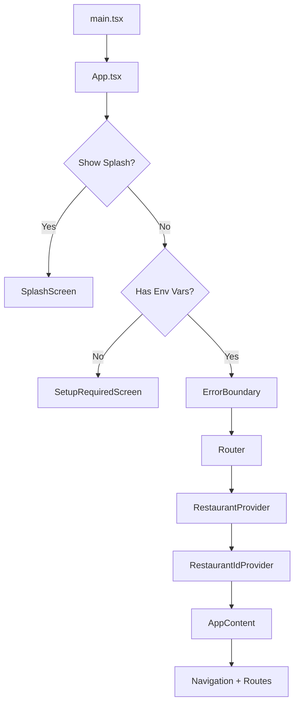
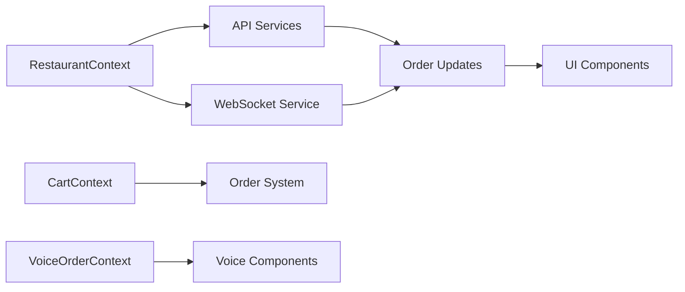
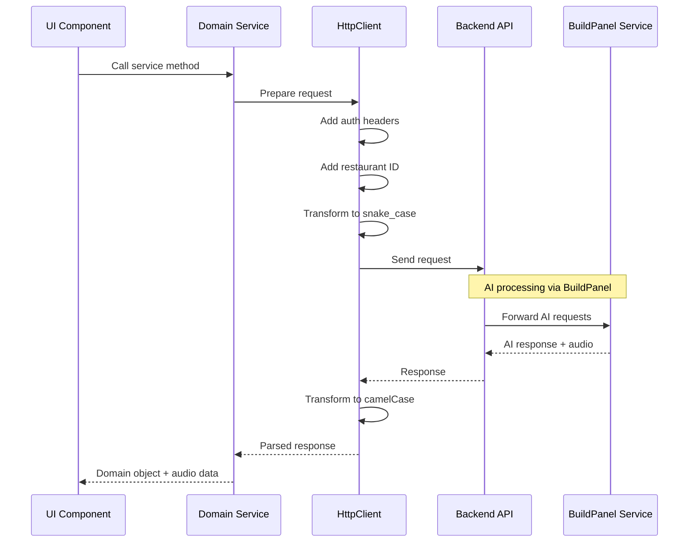
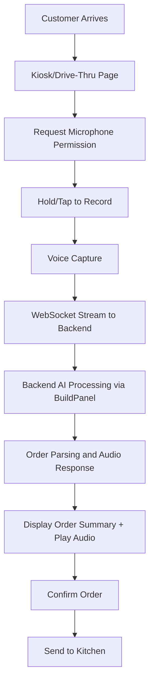
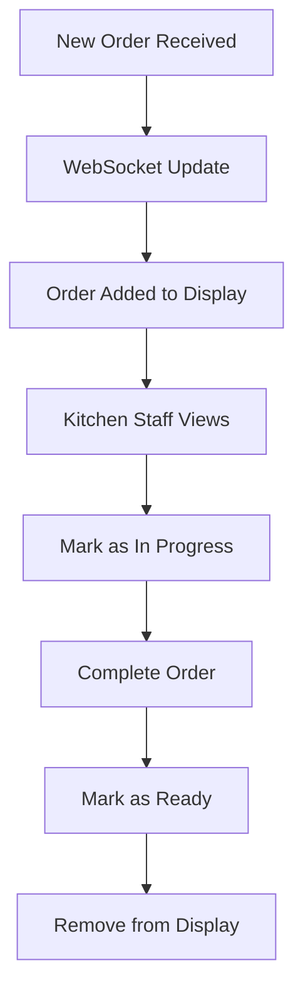
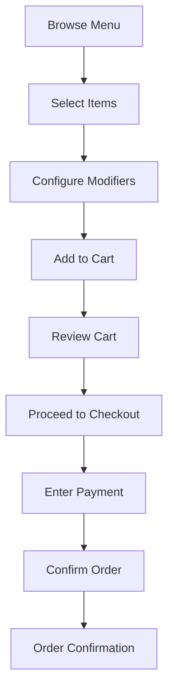

# Frontend Architecture Documentation

## Overview

The Rebuild 6.0 frontend is a modern React application built with TypeScript, Vite, and Tailwind CSS. It provides a comprehensive Restaurant Operating System interface with real-time capabilities, voice ordering, and multi-tenant support.

**Key Technologies:**
- **React 18** with TypeScript
- **Vite** for build tooling
- **React Router** for navigation
- **Tailwind CSS** for styling
- **Framer Motion** for animations
- **WebSocket** for real-time updates
- **Supabase** for authentication

## Application Structure

### Entry Points

```
client/
├── src/
│   ├── main.tsx              # Application entry point
│   ├── App.tsx               # Root component with auth & WebSocket setup
│   └── index.css            # Global styles
```

### Core Application Flow



## Component Hierarchy

### Layout Components

```
components/layout/
├── AppContent.tsx          # Main layout wrapper
├── AppRoutes.tsx          # Route configuration
└── Navigation.tsx         # Top navigation bar
```

### Page Components

```
pages/
├── HomePage.tsx               # Landing page with navigation cards
├── Dashboard.tsx              # Admin dashboard
├── KitchenDisplay.tsx        # Kitchen Display System (KDS)
├── KioskPage.tsx             # Voice ordering kiosk
├── DriveThruPage.tsx         # Drive-thru ordering interface
├── ServerView.tsx            # Server/waiter interface
├── OrderHistory.tsx          # Historical orders view
├── PerformanceDashboard.tsx  # Performance metrics
├── CheckoutPage.tsx          # Payment processing
└── OrderConfirmationPage.tsx # Order success screen
```

### Feature Modules

```
modules/
├── analytics/           # Analytics and metrics components
├── filters/            # Filtering and search components
├── floor-plan/         # Table management
├── kitchen/            # Kitchen display components
├── menu/               # Menu management
├── order-system/       # Customer ordering flow
├── orders/             # Order management
├── sound/              # Sound effects
└── voice/              # Voice ordering system
```

## State Management

### Context Providers

1. **RestaurantContext** (`core/RestaurantContext.tsx`)
   - Provides restaurant configuration
   - Manages multi-tenant context
   - Required for all API calls

2. **CartContext** (`modules/order-system/context/CartContext.tsx`)
   - Shopping cart state management
   - Local storage persistence
   - Cart calculations

3. **VoiceOrderContext** (`modules/voice/contexts/VoiceOrderContext.tsx`)
   - Voice recording state
   - Transcription results
   - Order processing from voice

### State Flow



## Service Layer Architecture

### API Integration

```
services/
├── api.ts                    # Legacy API wrapper
├── base/
│   ├── BaseService.ts       # Abstract service class
│   └── HttpServiceAdapter.ts # HTTP adapter pattern
├── http/
│   └── httpClient.ts        # Enhanced HTTP client
├── websocket/
│   ├── WebSocketService.ts  # Real-time connection
│   └── orderUpdates.ts      # Order update handler
└── [domain services]        # Order, Menu, Table services
```

### Service Communication Pattern



## Component Patterns

### 1. Order Card Pattern

Base component with specialized variants:
```
components/orders/
├── BaseOrderCard.tsx      # Shared order display logic
├── OrderCard.tsx          # Standard order card
└── KDSOrderCard.tsx       # Kitchen display variant
```

### 2. Voice Recording Pattern

Modular voice components:
```
components/voice/
├── UnifiedVoiceRecorder.tsx  # Main recorder component
├── UnifiedRecordButton.tsx   # Recording button
└── [Supporting components]    # Permission, indicators, etc.
```

### 3. Shared Components

Reusable UI elements:
```
components/shared/
├── LoadingSpinner.tsx
├── ErrorDisplay.tsx
├── EmptyState.tsx
└── [Domain components]
```

## Key User Flows

### 1. Voice Ordering Flow



### 2. Kitchen Display Flow



### 3. Customer Ordering Flow



## Integration Points

### 1. Backend API Integration

- **Base URL**: Configured via `VITE_API_BASE_URL`
- **Port**: 3001 (unified backend)
- **Authentication**: Supabase JWT tokens
- **Headers**: 
  - `Authorization: Bearer <token>`
  - `X-Restaurant-ID: <restaurant_id>`

### BuildPanel AI Integration

The frontend integrates with BuildPanel service through the backend:

**Voice Processing Flow:**
1. Frontend captures audio via WebSocket streaming
2. Backend buffers audio and forwards to BuildPanel (port 3003)
3. BuildPanel processes voice and returns transcription + AI audio response
4. Backend forwards both text and audio data to frontend
5. Frontend displays transcription and plays audio response

**Audio Response Handling:**
- BuildPanel responses may include audio data for voice feedback
- Frontend automatically plays audio responses using Web Audio API
- Audio playback is optional and can be muted by user preference
- Audio responses enhance user experience in drive-thru scenarios

### 2. WebSocket Integration

- **URL**: `ws://localhost:3001/ws`
- **Authentication**: Token in query params
- **Events**:
  - Order updates
  - Voice transcription results with audio responses
  - Real-time notifications
  - BuildPanel AI processing status

### 3. External Services

- **Supabase**: Authentication and data persistence
- **BuildPanel**: Voice transcription and AI processing (backend proxy)
- **Square**: Payment processing (optional)

## Performance Optimizations

### 1. Code Splitting

- Route-based splitting via React Router
- Lazy loading of heavy components
- Dynamic imports for feature modules

### 2. Performance Monitoring

- React Profiler integration
- Custom performance monitor service
- Web Vitals tracking
- Real-time performance overlay (dev mode)

### 3. Optimization Techniques

- Memoization of expensive computations
- Virtual scrolling for large lists
- Debounced search and filters
- Optimistic UI updates

## Design System

### 1. UI Components

Located in `components/ui/`:
- Typography system
- Button variants
- Card layouts
- Form controls
- Accessibility components

### 2. Theme Configuration

- Tailwind CSS custom configuration
- Macon brand colors
- Responsive breakpoints
- Shadow and spacing systems

### 3. Accessibility Features

- Skip navigation links
- ARIA live regions
- Keyboard navigation
- Screen reader announcements
- Focus management

## Error Handling

### 1. Error Boundaries

Multi-level error boundaries:
- App level (App.tsx)
- Page level (AppRoutes.tsx)
- Section level (feature modules)

### 2. Error Recovery

- Graceful WebSocket reconnection
- API request retry logic
- Fallback UI components
- User-friendly error messages

## Testing Infrastructure

### Test Organization

```
__tests__/          # Component tests
*.test.tsx          # Unit tests
*.e2e.test.tsx      # E2E tests
test-utils/         # Testing utilities
```

### Testing Patterns

- Component testing with React Testing Library
- Service mocking for API calls
- WebSocket mocking for real-time features
- Accessibility testing

## Development Workflow

### Local Development

```bash
# From root directory
npm install         # Install dependencies
npm run dev         # Start dev server (port 5173)
npm test           # Run tests
npm run lint:fix   # Fix linting issues
```

### Environment Configuration

Required environment variables in root `.env`:
```
VITE_API_BASE_URL=http://localhost:3001
VITE_SUPABASE_URL=<supabase-url>
VITE_SUPABASE_ANON_KEY=<supabase-key>
```

## Technical Debt & Improvements

### Current Issues

1. **Mock Data Usage**: RestaurantContext uses hardcoded data
2. **WebSocket Reliability**: Needs better error recovery
3. **State Persistence**: Limited to cart only
4. **Test Coverage**: Some modules lack comprehensive tests

### Recommended Improvements

1. **State Management**: Consider Redux/Zustand for complex state
2. **API Caching**: Implement React Query or SWR
3. **Component Library**: Formalize design system
4. **Performance**: Implement service workers for offline support
5. **Monitoring**: Add error tracking (Sentry)
6. **Documentation**: Add Storybook for component documentation

## Security Considerations

1. **Authentication**: All API calls include Supabase JWT
2. **Multi-tenancy**: Restaurant ID isolation
3. **Input Validation**: Client-side validation before submission
4. **Secure Storage**: No sensitive data in localStorage
5. **CORS**: Configured for specific origins only
6. **AI Service Isolation**: No direct frontend access to BuildPanel service
7. **Audio Data**: Voice recordings processed server-side only
8. **API Key Security**: All AI service keys isolated to backend/BuildPanel

## Deployment Considerations

1. **Build Process**: Vite production build
2. **Environment Variables**: Must be prefixed with `VITE_`
3. **Static Hosting**: Can be deployed to CDN
4. **API Proxy**: Configure for production backend
5. **Performance**: Enable compression and caching