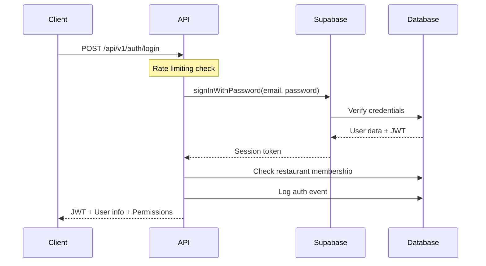
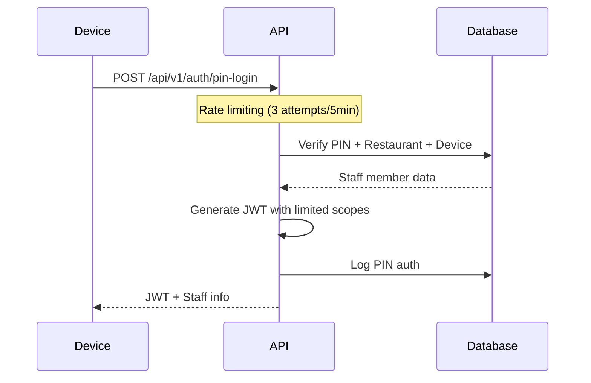
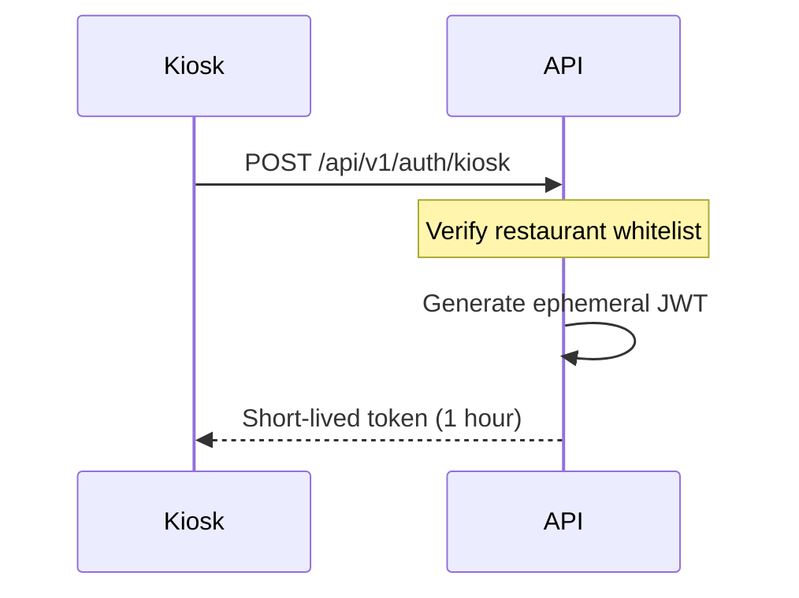
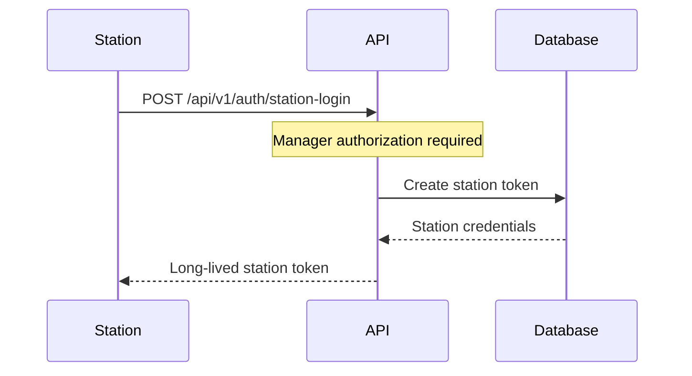
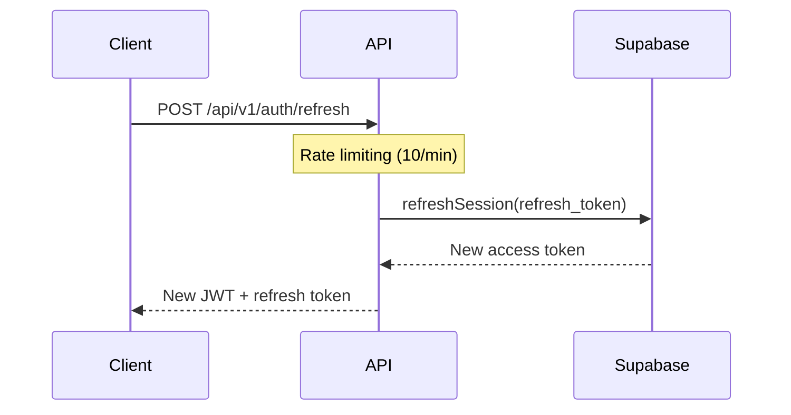

# JWT Authentication Flow Documentation

## Overview

Restaurant OS v6.0.6 uses a multi-layered JWT authentication system with different flows for different user types. This document describes the complete authentication flow, token structure, and verification process.

## Authentication Flows

### 1. Email/Password Login (Managers & Staff)



**Token Claims:**
```json
{
  "sub": "user-uuid",
  "email": "user@restaurant.com",
  "role": "manager",
  "restaurant_id": "restaurant-uuid",
  "scopes": ["orders:*", "menu:*", "staff:read"],
  "iat": 1234567890,
  "exp": 1234567890,
  "iss": "restaurant-os"
}
```

### 2. PIN Authentication (Service Staff)



**PIN Security:**
- Salted with `PIN_PEPPER` environment variable
- Device fingerprinting with `DEVICE_FINGERPRINT_SALT`
- Restaurant-scoped (PIN only valid for specific restaurant)
- Auto-lock after 3 failed attempts

### 3. Kiosk/Demo Mode



**Kiosk Token:**
- No user association
- Limited scopes: `menu:read`, `orders:create`, `payments:process`
- 1-hour expiration
- Restaurant-bound

### 4. Station Authentication (Kitchen/Expo)



## Token Verification Process

### Server-Side Verification

```typescript
// Middleware: authenticate
async function authenticate(req, res, next) {
  // 1. Extract token from Authorization header
  const token = req.headers.authorization?.replace('Bearer ', '');
  
  // 2. Verify token signature
  const decoded = jwt.verify(token, JWT_SECRET);
  
  // 3. Check token expiration
  if (decoded.exp < Date.now() / 1000) {
    throw new Error('Token expired');
  }
  
  // 4. Validate restaurant context
  const restaurantId = req.headers['x-restaurant-id'];
  if (restaurantId !== decoded.restaurant_id) {
    throw new Error('Restaurant context mismatch');
  }
  
  // 5. Check user status (not disabled)
  const user = await database.getUser(decoded.sub);
  if (!user.active) {
    throw new Error('User account disabled');
  }
  
  // 6. Attach user to request
  req.user = user;
  req.scopes = decoded.scopes;
  
  next();
}
```

### Token Refresh Flow



## Security Measures

### 1. Rate Limiting (v6.0.6+)

| Endpoint | Limit | Window | Action on Exceed |
|----------|-------|--------|------------------|
| `/auth/login` | 5 attempts | 15 min | Block for 15 min |
| `/auth/pin-login` | 3 attempts | 5 min | Lock account |
| `/auth/refresh` | 10 attempts | 1 min | Temporary block |
| `/auth/kiosk` | 20 attempts | 5 min | Temporary block |

### 2. Token Security

- **Signing Algorithm**: RS256 (asymmetric)
- **Secret Rotation**: Monthly rotation recommended
- **Token Storage**: 
  - Access token: Memory only (never localStorage)
  - Refresh token: HttpOnly secure cookie
- **CSRF Protection**: Double-submit cookie pattern

### 3. Multi-Factor Authentication (MFA)

Available for manager accounts:
1. Email verification on new device
2. SMS OTP (optional)
3. Authenticator app (TOTP)

### 4. Session Management

- **Idle Timeout**: 8 hours for managers, 12 hours for staff
- **Absolute Timeout**: 24 hours maximum
- **Concurrent Sessions**: Limited to 3 per user
- **Device Binding**: Optional PIN binding to specific devices

## Token Scopes

### Role-Based Scopes

| Role | Default Scopes |
|------|---------------|
| Owner | `*` (all permissions) |
| Manager | `orders:*`, `menu:*`, `staff:*`, `reports:read` |
| Server | `orders:create`, `orders:read`, `payments:process` |
| Cashier | `payments:*`, `orders:read` |
| Kitchen | `orders:read`, `orders:update:status` |
| Customer | `menu:read`, `orders:create:own` |

### Scope Validation

```typescript
// Middleware: requireScopes
function requireScopes(...required: string[]) {
  return (req, res, next) => {
    const userScopes = req.user.scopes || [];
    
    for (const scope of required) {
      // Check exact match or wildcard
      const hasScope = userScopes.some(s => 
        s === scope || 
        s === '*' ||
        s.endsWith(':*') && scope.startsWith(s.slice(0, -1))
      );
      
      if (!hasScope) {
        return res.status(403).json({
          error: 'Insufficient permissions',
          required: scope
        });
      }
    }
    
    next();
  };
}
```

## Common Issues & Solutions

### Issue 1: Token Expired
**Solution**: Implement automatic refresh using refresh token before expiration

### Issue 2: Restaurant Context Missing
**Solution**: Always include `X-Restaurant-ID` header in requests

### Issue 3: CORS Errors
**Solution**: Ensure `FRONTEND_URL` is correctly configured in environment

### Issue 4: Rate Limiting
**Solution**: Implement exponential backoff on client-side

## Security Best Practices

1. **Never expose JWT secrets** in client-side code
2. **Rotate secrets regularly** (at least quarterly)
3. **Monitor failed authentication** attempts
4. **Implement logout** on all devices feature
5. **Use HTTPS only** in production
6. **Validate all claims** not just signature
7. **Keep token lifetime short** (1 hour for access, 7 days for refresh)
8. **Audit authentication events** for anomalies

## Testing Authentication

### Manual Testing
```bash
# Login
curl -X POST http://localhost:3001/api/v1/auth/login \
  -H "Content-Type: application/json" \
  -d '{"email":"test@restaurant.com","password":"password123","restaurantId":"..."}'

# Use token
curl -X GET http://localhost:3001/api/v1/orders \
  -H "Authorization: Bearer <token>" \
  -H "X-Restaurant-ID: <restaurant-id>"
```

### Automated Testing
See `server/src/middleware/__tests__/auth.test.ts` for comprehensive test suite.

## Migration from v6.0.5

v6.0.6 adds:
- Enhanced rate limiting per auth type
- Request sanitization
- Suspicious activity tracking
- Automatic blocking after repeated failures

No breaking changes to JWT structure or verification process.