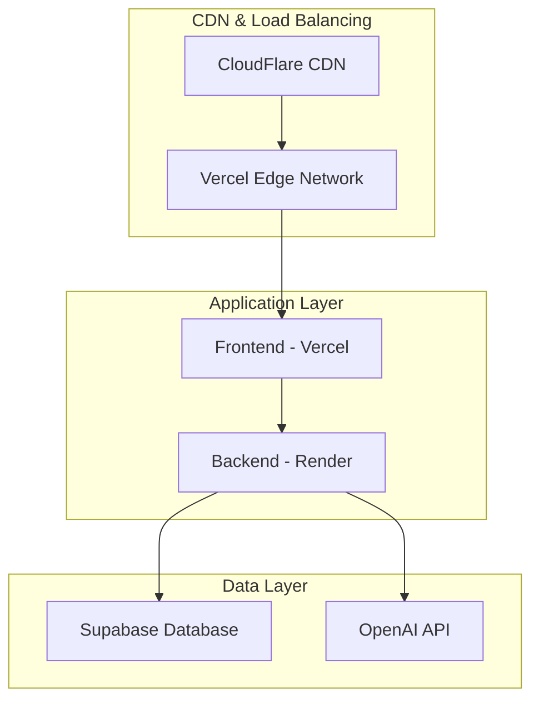

# Operations & Infrastructure Documentation

## Overview

This document outlines the operational procedures, infrastructure setup, and deployment strategies for the Rebuild 6.0 Restaurant Operating System. The system follows cloud-first principles with simplified deployment and monitoring.

## Deployment Architecture

### Production Environment



### Infrastructure Components

#### Frontend (Vercel)

- **Platform**: Vercel Edge Network
- **URL**: `https://july25-client.vercel.app`
- **Build**: Vite static site generation
- **CDN**: Global edge distribution
- **SSL**: Automatic HTTPS with Let's Encrypt

#### Backend (Render)

- **Platform**: Render Web Service
- **URL**: `https://july25.onrender.com`
- **Runtime**: Node.js 18+
- **Process**: Single unified Express.js server (port 3001)
- **Auto-deploy**: Git-based continuous deployment

#### Database (Supabase)

- **Platform**: Supabase Cloud
- **Type**: PostgreSQL with real-time subscriptions
- **Authentication**: Supabase Auth (JWT-based)
- **API**: Auto-generated REST and GraphQL APIs

#### External Services

- **OpenAI**: Speech transcription (Whisper) and language processing (GPT-4)
- **Monitoring**: Built-in health checks and metrics

## Deployment Process

### Automated Deployment

#### Frontend Deployment (Vercel)

```bash
# Automatic deployment on push to main branch
git push origin main

# Manual deployment
npm run build:client
vercel --prod
```

#### Backend Deployment (Render)

```bash
# Automatic deployment on push to main branch
git push origin main

# Manual build verification
npm run build:server
npm start
```

### Environment Variables

#### Frontend (.env)

```bash
VITE_API_BASE_URL=https://july25.onrender.com
VITE_SUPABASE_URL=your_supabase_url
VITE_SUPABASE_ANON_KEY=your_supabase_anon_key
```

#### Backend (.env)

```bash
PORT=3001
NODE_ENV=production
SUPABASE_URL=your_supabase_url
SUPABASE_SERVICE_KEY=your_supabase_service_key
OPENAI_API_KEY=your_openai_api_key
JWT_SECRET=your_jwt_secret
```

### Build Pipeline

#### CI/CD Workflow

1. **Code Push**: Developer pushes to main branch
2. **Build Trigger**: Vercel and Render detect changes
3. **Frontend Build**: Vite builds and optimizes client assets
4. **Backend Build**: TypeScript compilation (using tsx in production)
5. **Health Check**: Automated endpoint verification
6. **Deployment**: Rolling deployment to production

## Monitoring & Observability

### Health Monitoring

#### Application Health

- **Frontend**: Vercel function health checks
- **Backend**: `/api/v1/health` endpoint monitoring
- **Database**: Supabase connection status
- **External Services**: OpenAI API availability

#### Metrics Collection

```typescript
// Prometheus metrics (backend)
GET / api / v1 / metrics

// Available metrics:
// - http_requests_total
// - http_request_duration_ms
// - websocket_connections_active
// - order_processing_time_ms
// - ai_transcription_latency_ms
```

### Performance Monitoring

#### Key Performance Indicators

- **Page Load Time**: < 2 seconds (LCP)
- **API Response Time**: < 200ms (95th percentile)
- **Voice Processing**: < 3 seconds (transcription + parsing)
- **WebSocket Latency**: < 100ms (real-time updates)

#### Error Tracking

- **Frontend**: Browser console monitoring
- **Backend**: Winston structured logging
- **Database**: Supabase query performance
- **Voice Processing**: OpenAI API error rates

## Security & Compliance

### Security Measures

#### Authentication & Authorization

- **JWT Tokens**: Stateless authentication
- **Multi-tenancy**: Restaurant-level data isolation
- **Role-based Access**: Staff/admin/customer roles
- **Demo Mode**: Safe testing environment

#### API Security

- **Rate Limiting**: Express rate limiter middleware
- **CORS**: Configured for specific origins
- **Helmet**: Security headers enforcement
- **Input Validation**: Joi schema validation

#### Data Protection

- **Environment Variables**: Secure configuration management
- **HTTPS Enforcement**: SSL/TLS encryption
- **API Key Rotation**: Regular credential updates
- **Audit Logging**: Security event tracking

### Compliance

- **Data Privacy**: GDPR-compliant data handling
- **PCI Compliance**: Secure payment processing (future)
- **Restaurant Standards**: Food service industry requirements

## Backup & Recovery

### Database Backup

- **Automated**: Supabase automatic backups (daily)
- **Point-in-time Recovery**: 7-day retention
- **Manual Exports**: On-demand database exports
- **Migration Scripts**: Version-controlled schema changes

### Application Recovery

- **Zero-downtime Deployment**: Rolling updates
- **Rollback Strategy**: Git-based version rollback
- **Health Check Gates**: Deployment verification
- **Circuit Breakers**: External service failure handling

## Scaling Strategy

### Horizontal Scaling

#### Frontend Scaling

- **CDN**: Global edge caching
- **Static Assets**: Optimized delivery
- **Build Optimization**: Code splitting and lazy loading

#### Backend Scaling

- **Render Auto-scaling**: CPU/memory-based scaling
- **Database Scaling**: Supabase connection pooling
- **WebSocket Distribution**: Sticky session handling

### Performance Optimization

#### Frontend Optimization

- **Bundle Size**: < 1MB initial load
- **Image Optimization**: WebP format with fallbacks
- **Caching Strategy**: Service worker implementation
- **Progressive Loading**: Critical path optimization

#### Backend Optimization

- **Response Compression**: Gzip/Brotli compression
- **Database Indexing**: Query optimization
- **Memory Management**: Garbage collection tuning
- **Connection Pooling**: Database connection optimization

## Maintenance Procedures

### Regular Maintenance

#### Weekly Tasks

- Monitor system performance metrics
- Review error logs and alerts
- Update dependencies (security patches)
- Verify backup integrity

#### Monthly Tasks

- Performance optimization review
- Security audit and vulnerability scan
- Capacity planning assessment
- Documentation updates

#### Quarterly Tasks

- Infrastructure cost optimization
- Architecture review and improvements
- Disaster recovery testing
- Security policy review

### Emergency Procedures

#### Incident Response

1. **Detection**: Automated alerts or manual discovery
2. **Assessment**: Impact and severity evaluation
3. **Response**: Immediate mitigation steps
4. **Communication**: Stakeholder notification
5. **Resolution**: Root cause fix implementation
6. **Post-mortem**: Incident analysis and prevention

#### Rollback Procedure

```bash
# Emergency rollback (Vercel)
vercel --prod --prebuilt previous-build

# Emergency rollback (Render)
# Use Render dashboard to rollback to previous deployment

# Database rollback (if needed)
# Use Supabase point-in-time recovery
```

## Cost Management

### Infrastructure Costs

#### Current Tier (Beta)

- **Vercel**: Hobby plan (free tier)
- **Render**: Web service ($7/month)
- **Supabase**: Free tier (up to 500MB)
- **OpenAI**: Pay-per-use (voice processing)

#### Scaling Projections

- **Growth Tier**: Vercel Pro ($20/month), Render Standard ($25/month)
- **Enterprise Tier**: Custom pricing based on usage
- **Database**: Supabase Pro ($25/month) for higher limits

### Optimization Strategies

- **Resource Monitoring**: Track usage patterns
- **Caching Implementation**: Reduce API calls
- **Efficient Queries**: Optimize database operations
- **CDN Utilization**: Minimize bandwidth costs

## Documentation & Training

### Operational Documentation

- **Runbooks**: Step-by-step operational procedures
- **Troubleshooting Guides**: Common issue resolution
- **API Documentation**: Comprehensive endpoint reference
- **Architecture Diagrams**: System component relationships

### Team Training

- **Deployment Procedures**: Release management training
- **Monitoring Tools**: Metrics and alerting familiarization
- **Security Protocols**: Best practices and procedures
- **Emergency Response**: Incident handling training

---

_This operations guide provides comprehensive coverage of infrastructure management, deployment procedures, and maintenance protocols for the Rebuild 6.0 system._
