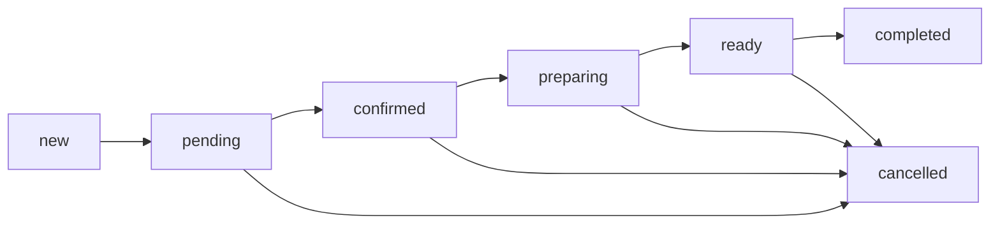

# Order Flow

## Overview

The Restaurant OS 6.0 order flow handles the complete lifecycle from creation through fulfillment. This document reflects the actual implementation in code.

## Order Lifecycle States

### 1. Order Status Progression

```typescript
type OrderStatus =
  | 'new' // Order just created, not yet acknowledged
  | 'pending' // Order received, awaiting confirmation
  | 'confirmed' // Order confirmed, ready for preparation
  | 'preparing' // Kitchen actively preparing order
  | 'ready' // Order ready for pickup/delivery
  | 'completed' // Order fulfilled and delivered
  | 'cancelled' // Order cancelled at any stage
```

### 2. State Transitions



## Implementation Details

### Order Creation Flow

1. **Customer Interface** (Kiosk/Web/Voice)

   ```typescript
   // Create order via API
   POST /api/v1/orders
   {
     restaurant_id: string,
     items: OrderItem[],
     customer_name?: string,
     table_number?: string,
     type: 'dine-in' | 'takeout' | 'delivery',
     payment_method: 'cash' | 'card' | 'terminal'
   }
   ```

2. **Server Processing**
   - Validates order data
   - Generates unique order_number
   - Calculates pricing (subtotal, tax, total)
   - Stores in database
   - Emits WebSocket event

3. **WebSocket Broadcast**
   ```typescript
   socket.emit('order:created', {
     type: 'order:created',
     order: Order,
     timestamp: string,
   })
   ```

### Voice Order Creation Flow

Voice orders follow a unique path through the system:

1. **Voice Input Processing**
   ```typescript
   // User speaks: "I'll have a burger and fries"
   OpenAI → add_to_order({ items: [...] })
   WebRTCVoiceClient → emit('order.detected', orderEvent)
   VoiceOrderingMode → addItem(menuItem, quantity)
   ```

2. **Order Confirmation**
   ```typescript
   // User speaks: "That's all, checkout please"
   OpenAI → confirm_order({ action: 'checkout' })
   WebRTCVoiceClient → emit('order.confirmation', { action })
   VoiceOrderingMode → handleOrderConfirmation()
   ```

3. **Order Submission**
   ```typescript
   // Customer mode: Payment required
   if (mode === 'customer') {
     VoicePaymentStrategy → acquireToken(total, restaurantId)
     // Shows QR or card form based on device
     orderData.payment_token = paymentToken
   }

   // Submit with or without token based on mode
   VoiceOrderingMode → submitOrderAndNavigate(cart.items)
   useKioskOrderSubmission → POST /api/v1/orders
   Navigate → /order-confirmation
   ```

4. **WebSocket Events for Voice Orders**
   - `order.detected`: Items detected from speech
   - `order.confirmation`: Confirmation action received
   - `order:created`: Standard order creation broadcast

### Kitchen Display System (KDS)

**Location**: `/kitchen`

**Responsibilities**:

- Display active orders (new, pending, confirmed, preparing)
- Allow status updates (preparing → ready)
- Group orders by table
- Show urgency indicators (time-based)

**Key Components**:

- `KitchenDisplaySimple.tsx` - Main display
- `useKitchenOrdersRealtime` - Real-time order hook
- `OrderCard` - Individual order display

**WebSocket Events Handled**:

- `order:created` - Add new order
- `order:updated` - Update existing order
- `order:status_changed` - Update order status

### Expo Station

**Location**: `/expo`

**Responsibilities**:

- Display preparing and ready orders
- Mark orders as completed
- Consolidate table orders
- Track fulfillment timing

**Key Components**:

- `ExpoPage.tsx` - Main expo display
- `TableGroupCard` - Table consolidation view
- Station completion indicators

**WebSocket Events Handled**:

- `order:status_changed` - Track ready orders
- `order:updated` - Update order details

## WebSocket Architecture

### Connection Establishment

```typescript
// Client connection
const webSocketService = new WebSocketService()
await webSocketService.connect()

// Authentication
socket.emit('authenticate', {
  token: authToken,
  restaurantId: restaurantId,
})
```

### Event Flow

1. **Order Creation**
   - Client → Server: HTTP POST
   - Server → Database: Store order
   - Server → WebSocket: Broadcast to restaurant

2. **Status Updates**
   - Client → Server: HTTP PATCH
   - Server → Database: Update status
   - Server → WebSocket: Broadcast change

3. **Real-time Sync**
   - WebSocket maintains persistent connection
   - Automatic reconnection with exponential backoff
   - Order sync on reconnection

## Payment Processing

### Supported Methods

1. **Cash Payment**
   - Order created immediately
   - Marked as pending payment
   - Completed at counter

2. **Card Payment**
   - Square Web Payments SDK
   - Tokenization on client
   - Processing via Square API

3. **Terminal Payment**
   - Square Terminal SDK
   - Polling for completion
   - Automatic order completion

### Payment Flow

```typescript
// KioskCheckoutPage.tsx
const handlePaymentSubmit = async () => {
  switch (paymentMethod) {
    case 'cash':
      const order = await createOrder()
      navigate('/order-confirmation')
      break
    case 'card':
      // Square SDK handles
      break
    case 'terminal':
      await terminal.processPayment()
      break
  }
}
```

## Error Handling

### Critical Error Points

1. **Order Creation Failures**
   - Network errors → Retry with exponential backoff
   - Validation errors → Show user feedback
   - Payment failures → Rollback order

2. **WebSocket Disconnections**
   - Automatic reconnection
   - Queue updates during disconnect
   - Sync on reconnection

3. **Status Update Conflicts**
   - Optimistic UI updates
   - Rollback on server rejection
   - Conflict resolution via timestamps

### Error Boundaries

```typescript
// PaymentErrorBoundary
<PaymentErrorBoundary>
  <KioskCheckoutPage />
</PaymentErrorBoundary>

// Kitchen Error Handling
<ErrorBoundary level="section">
  <KitchenDisplaySimple />
</ErrorBoundary>
```

## Testing Order Flow

### Manual Testing Steps

1. **Create Order**
   - Navigate to `/kiosk`
   - Add items to cart
   - Proceed to checkout
   - Select payment method
   - Complete order

2. **Kitchen Processing**
   - Navigate to `/kitchen`
   - Verify order appears
   - Change status to preparing
   - Mark as ready

3. **Expo Fulfillment**
   - Navigate to `/expo`
   - Verify ready orders appear
   - Mark as completed
   - Verify removal from display

### Automated Testing

```bash
# Run order flow tests
npm test -- order.flow.test.ts

# Test WebSocket connections
npm test -- websocket.test.ts

# Test payment processing
npm test -- payment.test.ts
```

## Monitoring & Debugging

### Key Metrics

- Order creation rate
- Average preparation time
- Status transition timing
- WebSocket connection stability
- Payment success rate

### Debug Tools

```typescript
// Enable debug logging
localStorage.setItem('DEBUG', 'true')

// Monitor WebSocket events
webSocketService.on('*', (event, data) => {
  console.log('WS Event:', event, data)
})

// Performance monitoring
performanceMonitor.trackOrderFlow()
```

## Common Issues & Solutions

### Issue: Orders Not Appearing in Kitchen

**Causes**:

- WebSocket disconnection
- Restaurant ID mismatch
- Authentication failure

**Solutions**:

1. Check WebSocket connection status
2. Verify restaurant_id in context
3. Check authentication token

### Issue: Status Updates Not Syncing

**Causes**:

- Network latency
- Optimistic update conflicts
- Server validation failures

**Solutions**:

1. Implement retry logic
2. Add loading states
3. Show error feedback

### Issue: Payment Processing Failures

**Causes**:

- Square API errors
- Network timeouts
- Invalid payment data

**Solutions**:

1. Implement proper error boundaries
2. Add retry mechanisms
3. Provide fallback payment options

## Performance Optimizations

### Current Optimizations

1. **Virtual Scrolling**
   - Handle 1000+ orders efficiently
   - React Window implementation
   - 60fps scrolling maintained

2. **WebSocket Batching**
   - Batch multiple updates
   - Debounce rapid changes
   - Reduce network overhead

3. **Optimistic Updates**
   - Immediate UI feedback
   - Background synchronization
   - Rollback on failure

### Bundle Size

- Main chunk: 97KB (target: <100KB)
- Code splitting for routes
- Lazy loading for modals

## Security Considerations

### Authentication

- JWT tokens for API requests
- WebSocket authentication required
- Restaurant context validation

### Data Validation

- Input sanitization
- Type validation (TypeScript)
- Server-side validation

### PCI Compliance

- No card data stored
- Square handles tokenization
- Secure payment flow

## Future Enhancements

1. **Predictive Ordering**
   - ML-based prep time estimates
   - Demand forecasting
   - Auto-routing to stations

2. **Advanced Analytics**
   - Real-time performance metrics
   - Bottleneck identification
   - Staff optimization

3. **Multi-location Support**
   - Centralized management
   - Cross-location reporting
   - Inventory synchronization
