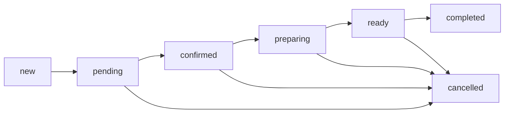

# Order Flow Documentation

**Last Updated**: October 11, 2025
**Version**: 6.0.7
**Status**: ✅ Production Ready

## Overview

The Restaurant OS 6.0 order flow is designed to handle the complete lifecycle of an order from creation through fulfillment. This document outlines the technical implementation and data flow for all order channels: online ordering, kiosk, voice ordering, and in-person.

## Table of Contents

- [Customer Online Ordering Journey](#customer-online-ordering-journey)
- [Order Lifecycle States](#order-lifecycle-states)
- [Implementation Details](#implementation-details)
- [Square Payment Integration](#square-payment-integration)
- [WebSocket Architecture](#websocket-architecture)
- [Error Handling](#error-handling)
- [Performance Optimizations](#performance-optimizations)

---

## Customer Online Ordering Journey

### Complete User Flow (Step-by-Step)

```
┌───────────────────────────────────────────────────────────────┐
│                   CUSTOMER ORDERING FLOW                       │
├───────────────────────────────────────────────────────────────┤
│                                                                │
│  1. Browse Menu     → GET /menu/items                         │
│  2. Add to Cart     → localStorage persistence                │
│  3. Review Cart     → CartDrawer component                    │
│  4. Checkout        → /checkout page                          │
│  5. Enter Info      → Email, phone, order type               │
│  6. Submit Order    → POST /orders (status: pending)         │
│  7. Process Payment → POST /payments/create                   │
│  8. Square Checkout → Redirect to Square                     │
│  9. Payment Complete→ Webhook → Order confirmed              │
│ 10. Confirmation    → /order-confirmation page               │
│                                                                │
└───────────────────────────────────────────────────────────────┘
```

### Step 1: Browse Menu

**URL**: `http://localhost:5173/order/:restaurantId`
**Component**: `/client/src/modules/order-system/components/CustomerOrderPage.tsx`

```typescript
// Component loads menu on mount
useEffect(() => {
  if (restaurantId) {
    loadMenuItems(restaurantId);
  }
}, [restaurantId]);

// API Call
GET /api/v1/menu/items?restaurantId=11111111-1111-1111-1111-111111111111

// Response
{
  "items": [
    {
      "id": "uuid",
      "name": "Fried Chicken Sandwich",
      "price": 12.99,
      "category": "Sandwiches",
      "imageUrl": "/images/menu/fried-chicken-sandwich.jpg",
      "modifiers": [...]
    }
  ]
}
```

**Key Files**:
- `CustomerOrderPage.tsx` - Entry point
- `MenuSections.tsx` - Category-based display
- `ItemCard.tsx` - Individual item cards

---

### Step 2: Add Item to Cart

**User Action**: Click menu item → Modal opens

**Component**: `/client/src/modules/menu/components/ItemDetailModal.tsx`

```typescript
// User selects modifiers
const selectedModifications = [
  { name: "No pickles", price: 0 },
  { name: "Extra cheese", price: 1.50 }
];

// User clicks "Add to Cart"
addItem(menuItem, quantity, selectedModifications);
```

**Cart State Management**: `/client/src/contexts/UnifiedCartContext.tsx`

```typescript
const addItem = (menuItem: MenuItem, quantity: number, modifications: Modification[]) => {
  const newItem: CartItem = {
    id: generateId(),
    menuItem,
    quantity,
    modifications
  };

  setItems([...items, newItem]);

  // Persist to localStorage
  localStorage.setItem('cart_current', JSON.stringify({
    items: [...items, newItem],
    restaurantId
  }));
};
```

**localStorage Key**: `cart_current`

---

### Step 3: View Cart

**Component**: `/client/src/components/cart/CartDrawer.tsx`

```tsx
<CartDrawer>
  {/* Cart Items */}
  {items.map(item => (
    <div key={item.id}>
      <span>{item.quantity}x {item.menuItem.name}</span>
      {item.modifications.map(mod => (
        <span>{mod.name} (+${mod.price})</span>
      ))}
      <span>${itemTotal}</span>
    </div>
  ))}

  {/* Cart Summary */}
  <div>
    <span>Subtotal: ${subtotal}</span>
    <span>Tax (8.25%): ${tax}</span>
    <span>Tip: ${tip}</span>
    <span>Total: ${total}</span>
  </div>

  <Button onClick={() => navigate('/checkout')}>
    Checkout
  </Button>
</CartDrawer>
```

**Calculations** (UnifiedCartContext.tsx:Lines 150-180):
```typescript
const subtotal = items.reduce((sum, item) => {
  const itemPrice = item.menuItem.price;
  const modifiersCost = item.modifications.reduce((sum, mod) => sum + mod.price, 0);
  return sum + ((itemPrice + modifiersCost) * item.quantity);
}, 0);

const tax = subtotal * 0.0825; // 8.25% tax rate
const total = subtotal + tax + tip;
```

---

### Step 4: Checkout Page

**URL**: `/checkout`
**Component**: `/client/src/pages/CheckoutPage.tsx:14-358`

```tsx
<form onSubmit={handleSubmit}>
  {/* Customer Information */}
  <input
    name="email"
    type="email"
    required
    pattern="[^@]+@[^@]+\.[^@]+"
  />
  <input
    name="phone"
    type="tel"
    required
    pattern="[0-9]{3}-[0-9]{3}-[0-9]{4}"
  />
  <input
    name="customerName"
    required
  />

  {/* Order Type */}
  <select name="orderType">
    <option value="takeout">Takeout</option>
    <option value="dine-in">Dine-In</option>
    <option value="delivery">Delivery</option>
  </select>

  {/* Conditional: Table number if dine-in */}
  {orderType === 'dine-in' && (
    <input name="tableNumber" type="number" />
  )}

  <Button type="submit">Place Order</Button>
</form>
```

---

### Step 5: Submit Order

**API Call**: `/server/src/routes/orders.routes.ts:38-55`

```typescript
// Client sends
POST /api/v1/orders
Content-Type: application/json
Authorization: Bearer {token}

{
  "restaurantId": "11111111-1111-1111-1111-111111111111",
  "items": [
    {
      "menuItemId": "uuid",
      "menuItemName": "Fried Chicken Sandwich",
      "quantity": 2,
      "price": 12.99,
      "modifications": ["No pickles", "Extra cheese"]
    }
  ],
  "orderType": "takeout",
  "customerInfo": {
    "email": "customer@example.com",
    "phone": "555-123-4567",
    "name": "John Doe"
  },
  "subtotal": 29.98,
  "tax": 2.47,
  "tip": 5.00,
  "total": 37.45
}
```

**Server Processing**:
```typescript
// 1. Validate input
if (!body.items || body.items.length === 0) {
  throw new Error('Order must have items');
}

// 2. Server-side total calculation (NEVER trust client)
const calculatedSubtotal = body.items.reduce((sum, item) => {
  const menuItem = await db.menuItems.findUnique({ where: { id: item.menuItemId } });
  return sum + (menuItem.price * item.quantity);
}, 0);

const calculatedTax = calculatedSubtotal * 0.0825;
const calculatedTotal = calculatedSubtotal + calculatedTax + body.tip;

// 3. Verify amounts match (1 cent tolerance for rounding)
if (Math.abs(calculatedTotal - body.total) > 0.01) {
  throw new Error('Total mismatch - possible tampering');
}

// 4. Generate order number (human-readable)
const orderNumber = await generateOrderNumber(restaurantId);

// 5. Create order in database
const order = await db.orders.create({
  data: {
    restaurantId: body.restaurantId,
    orderNumber: orderNumber,
    status: 'pending', // Initial status
    type: body.orderType,
    customerInfo: body.customerInfo,
    items: body.items,
    subtotal: calculatedSubtotal,
    tax: calculatedTax,
    tip: body.tip,
    total: calculatedTotal
  }
});

// 6. Return order
res.status(201).json({ order });
```

**Response**:
```json
{
  "order": {
    "id": "order-uuid",
    "orderNumber": "1234",
    "status": "pending",
    "type": "takeout",
    "total": 37.45,
    "createdAt": "2025-10-11T18:30:00Z"
  }
}
```

---

### Step 6: Payment Processing

**API Call**: POST `/api/v1/payments/create`

See [Square Integration Documentation](./SQUARE_INTEGRATION.md) for complete payment flow.

**Quick Summary**:
1. Client creates Square checkout
2. User redirected to Square hosted page
3. Customer enters card details
4. Square processes payment
5. Square webhook notifies our server
6. Order status: pending → confirmed

---

### Step 7: Order Confirmation

**URL**: `/order-confirmation?orderId={uuid}`
**Component**: `/client/src/pages/OrderConfirmationPage.tsx`

```tsx
<div className="confirmation">
  <h1>✅ Order Confirmed!</h1>

  <div className="order-details">
    <span>Order Number: {orderNumber}</span>
    <span>Status: {status}</span>
    <span>Estimated Time: 15-20 minutes</span>
  </div>

  <div className="order-items">
    {items.map(item => (
      <div>
        <span>{item.quantity}x {item.name}</span>
        <span>${item.price * item.quantity}</span>
      </div>
    ))}
  </div>

  <div className="order-total">
    <span>Total: ${total}</span>
  </div>
</div>
```

---

### API Sequence Diagram

```
Client                          Server                         Square
  |                               |                               |
  | GET /menu/items              |                               |
  |----------------------------->|                               |
  |<-----------------------------|                               |
  |   (Menu items)               |                               |
  |                               |                               |
  | [User adds items to cart]    |                               |
  | [localStorage persists]      |                               |
  |                               |                               |
  | POST /orders                 |                               |
  |----------------------------->|                               |
  |         order_id             | [Validates + Creates]         |
  |         status: pending      |                               |
  |<-----------------------------|                               |
  |                               |                               |
  | POST /payments/create        |                               |
  |----------------------------->|                               |
  |                               | POST /v2/online-checkout/... |
  |                               |----------------------------->|
  |                               |         checkout_url         |
  |                               |<-----------------------------|
  |    checkout_url redirect     |                               |
  |<-----------------------------|                               |
  |                               |                               |
  |                          [User completes payment]            |
  |------------------------------------------------------------->|
  |                               |                               |
  |                               |   payment.updated webhook    |
  |                               |<-----------------------------|
  |                               | [Updates order: confirmed]   |
  |                               | [Creates payment audit log]  |
  |                               | [Broadcasts WebSocket event] |
  |                               |                               |
  |                               | WebSocket: order_confirmed   |
  |<-----------------------------|                               |
  |                               |                               |
  | Navigate to /order-confirmation                              |
```

---

### Key Components Map

| Component | Location | Purpose |
|-----------|----------|---------|
| **CustomerOrderPage** | `client/src/modules/order-system/components/` | Menu browsing entry point |
| **MenuSections** | `client/src/modules/menu/components/` | Category-based menu display |
| **ItemDetailModal** | `client/src/modules/menu/components/` | Item details + modifier selection |
| **CartDrawer** | `client/src/components/cart/` | Cart review sidebar |
| **UnifiedCartContext** | `client/src/contexts/` | Cart state management + localStorage |
| **CheckoutPage** | `client/src/pages/` | Customer info + payment submission |
| **OrderConfirmationPage** | `client/src/pages/` | Success screen |

---

### localStorage Cart Persistence

**Key**: `cart_current`

**Structure**:
```json
{
  "restaurantId": "11111111-1111-1111-1111-111111111111",
  "items": [
    {
      "id": "cart-item-uuid",
      "menuItem": {
        "id": "menu-uuid",
        "name": "Fried Chicken Sandwich",
        "price": 12.99
      },
      "quantity": 2,
      "modifications": [
        {
          "name": "No pickles",
          "price": 0
        },
        {
          "name": "Extra cheese",
          "price": 1.50
        }
      ]
    }
  ],
  "lastUpdated": "2025-10-11T18:25:00Z"
}
```

**Why localStorage?**
- Survives page refresh
- Persists if user closes browser
- No server dependency for browsing
- Fast access (synchronous)

**When Cleared**:
- User clicks "Clear Cart"
- Order successfully completed
- User manually clears browser data

---

## Order Lifecycle States

### 1. Order Status Progression

```typescript
type OrderStatus =
  | 'new' // Order just created, not yet acknowledged
  | 'pending' // Order received, awaiting confirmation
  | 'confirmed' // Order confirmed, ready for preparation
  | 'preparing' // Kitchen actively preparing order
  | 'ready' // Order ready for pickup/delivery
  | 'completed' // Order fulfilled and delivered
  | 'cancelled' // Order cancelled at any stage
```

### 2. State Transitions



## Implementation Details

### Order Creation Flow

1. **Customer Interface** (Kiosk/Web/Voice)

   ```typescript
   // Create order via API
   POST /api/v1/orders
   {
     restaurant_id: string,
     items: OrderItem[],
     customer_name?: string,
     table_number?: string,
     type: 'dine-in' | 'takeout' | 'delivery',
     payment_method: 'cash' | 'card' | 'terminal'
   }
   ```

2. **Server Processing**
   - Validates order data
   - Generates unique order_number
   - Calculates pricing (subtotal, tax, total)
   - Stores in database
   - Emits WebSocket event

3. **WebSocket Broadcast**
   ```typescript
   socket.emit('order:created', {
     type: 'order:created',
     order: Order,
     timestamp: string,
   })
   ```

### Kitchen Display System (KDS)

**Location**: `/kitchen`

**Responsibilities**:

- Display active orders (new, pending, confirmed, preparing)
- Allow status updates (preparing → ready)
- Group orders by table
- Show urgency indicators (time-based)

**Key Components**:

- `KitchenDisplaySimple.tsx` - Main display
- `useKitchenOrdersRealtime` - Real-time order hook
- `OrderCard` - Individual order display

**WebSocket Events Handled**:

- `order:created` - Add new order
- `order:updated` - Update existing order
- `order:status_changed` - Update order status

### Expo Station

**Location**: `/expo`

**Responsibilities**:

- Display preparing and ready orders
- Mark orders as completed
- Consolidate table orders
- Track fulfillment timing

**Key Components**:

- `ExpoPage.tsx` - Main expo display
- `TableGroupCard` - Table consolidation view
- Station completion indicators

**WebSocket Events Handled**:

- `order:status_changed` - Track ready orders
- `order:updated` - Update order details

## WebSocket Architecture

### Connection Establishment

```typescript
// Client connection
const webSocketService = new WebSocketService()
await webSocketService.connect()

// Authentication
socket.emit('authenticate', {
  token: authToken,
  restaurantId: restaurantId,
})
```

### Event Flow

1. **Order Creation**
   - Client → Server: HTTP POST
   - Server → Database: Store order
   - Server → WebSocket: Broadcast to restaurant

2. **Status Updates**
   - Client → Server: HTTP PATCH
   - Server → Database: Update status
   - Server → WebSocket: Broadcast change

3. **Real-time Sync**
   - WebSocket maintains persistent connection
   - Automatic reconnection with exponential backoff
   - Order sync on reconnection

## Square Payment Integration

### Payment Methods Supported

1. **Online Payments** (Square Web SDK)
   - Hosted checkout page
   - Card tokenization
   - Redirect flow
   - See: [SQUARE_INTEGRATION.md](./SQUARE_INTEGRATION.md)

2. **Terminal Payments** (Square Terminal API)
   - Physical terminal device
   - Tap/chip/swipe
   - Polling-based status checks (every 2 seconds)
   - 5-minute timeout
   - See: [SQUARE_INTEGRATION.md](./SQUARE_INTEGRATION.md)

3. **Cash Payments** (Manual)
   - Order created with status 'pending'
   - Marked as confirmed at register
   - No Square integration required

### Quick Payment Flow

```typescript
// 1. Create order (status: pending)
POST /api/v1/orders
// Response: { order: { id, status: 'pending' } }

// 2. Create Square checkout
POST /api/v1/terminal/checkout
// Response: { checkout: { id, status: 'PENDING' } }

// 3. Poll status every 2 seconds
GET /api/v1/terminal/checkout/:checkoutId
// Response: { checkout: { status: 'COMPLETED' } }

// 4. Complete payment
POST /api/v1/terminal/checkout/:checkoutId/complete
// Response: { order: { status: 'confirmed' } }
```

**For complete payment integration details**, see:
- [Square Integration Documentation](./SQUARE_INTEGRATION.md)
- Server-side amount validation
- Payment audit trail
- Error handling strategies
- Testing procedures

## Error Handling

### Critical Error Points

1. **Order Creation Failures**
   - Network errors → Retry with exponential backoff
   - Validation errors → Show user feedback
   - Payment failures → Rollback order

2. **WebSocket Disconnections**
   - Automatic reconnection
   - Queue updates during disconnect
   - Sync on reconnection

3. **Status Update Conflicts**
   - Optimistic UI updates
   - Rollback on server rejection
   - Conflict resolution via timestamps

### Error Boundaries

```typescript
// PaymentErrorBoundary
<PaymentErrorBoundary>
  <KioskCheckoutPage />
</PaymentErrorBoundary>

// Kitchen Error Handling
<ErrorBoundary level="section">
  <KitchenDisplaySimple />
</ErrorBoundary>
```

## Testing Order Flow

### Manual Testing Steps

1. **Create Order**
   - Navigate to `/kiosk`
   - Add items to cart
   - Proceed to checkout
   - Select payment method
   - Complete order

2. **Kitchen Processing**
   - Navigate to `/kitchen`
   - Verify order appears
   - Change status to preparing
   - Mark as ready

3. **Expo Fulfillment**
   - Navigate to `/expo`
   - Verify ready orders appear
   - Mark as completed
   - Verify removal from display

### Automated Testing

```bash
# Run order flow tests
npm test -- order.flow.test.ts

# Test WebSocket connections
npm test -- websocket.test.ts

# Test payment processing
npm test -- payment.test.ts
```

## Monitoring & Debugging

### Key Metrics

- Order creation rate
- Average preparation time
- Status transition timing
- WebSocket connection stability
- Payment success rate

### Debug Tools

```typescript
// Enable debug logging
localStorage.setItem('DEBUG', 'true')

// Monitor WebSocket events
webSocketService.on('*', (event, data) => {
  console.log('WS Event:', event, data)
})

// Performance monitoring
performanceMonitor.trackOrderFlow()
```

## Common Issues & Solutions

### Issue: Orders Not Appearing in Kitchen

**Causes**:

- WebSocket disconnection
- Restaurant ID mismatch
- Authentication failure

**Solutions**:

1. Check WebSocket connection status
2. Verify restaurant_id in context
3. Check authentication token

### Issue: Status Updates Not Syncing

**Causes**:

- Network latency
- Optimistic update conflicts
- Server validation failures

**Solutions**:

1. Implement retry logic
2. Add loading states
3. Show error feedback

### Issue: Payment Processing Failures

**Causes**:

- Square API errors
- Network timeouts
- Invalid payment data

**Solutions**:

1. Implement proper error boundaries
2. Add retry mechanisms
3. Provide fallback payment options

## Performance Optimizations

### Current Optimizations

1. **Virtual Scrolling**
   - Handle 1000+ orders efficiently
   - React Window implementation
   - 60fps scrolling maintained

2. **WebSocket Batching**
   - Batch multiple updates
   - Debounce rapid changes
   - Reduce network overhead

3. **Optimistic Updates**
   - Immediate UI feedback
   - Background synchronization
   - Rollback on failure

### Bundle Size

- Main chunk: 97KB (target: <100KB)
- Code splitting for routes
- Lazy loading for modals

## Security Considerations

### Authentication

- JWT tokens for API requests
- WebSocket authentication required
- Restaurant context validation

### Data Validation

- Input sanitization
- Type validation (TypeScript)
- Server-side validation

### PCI Compliance

- No card data stored
- Square handles tokenization
- Secure payment flow

## Future Enhancements

1. **Predictive Ordering**
   - ML-based prep time estimates
   - Demand forecasting
   - Auto-routing to stations

2. **Advanced Analytics**
   - Real-time performance metrics
   - Bottleneck identification
   - Staff optimization

3. **Multi-location Support**
   - Centralized management
   - Cross-location reporting
   - Inventory synchronization
