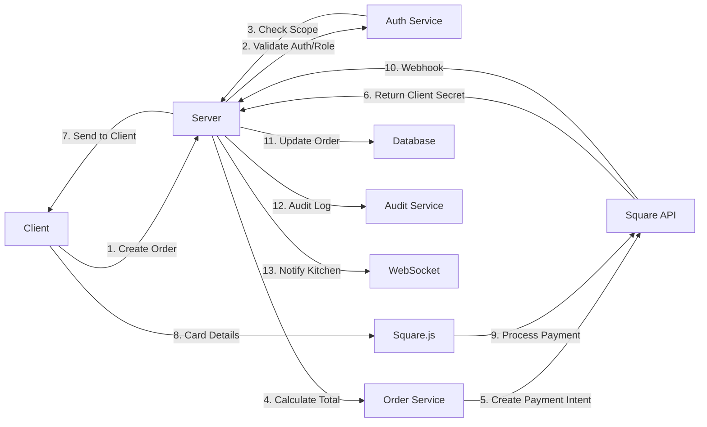

# Payments & Testing Strategy

## Executive Summary

This document outlines the comprehensive strategy for implementing production-ready payment processing in Restaurant OS v6.0.3. With authentication and RBAC now complete, payments represent the final critical component for production readiness.

### Purpose

- Define secure payment processing architecture
- Establish testing requirements for payment flows
- Document role-based payment permissions
- Plan migration from Square Sandbox to Production
- Ensure PCI compliance and security best practices

### Why Payments are Critical

- **Revenue Processing**: Core business function for restaurants
- **Trust & Security**: Handling financial data requires highest security
- **Compliance**: PCI DSS requirements must be met
- **User Experience**: Fast, reliable payments are essential for operations

---

## Current State (v6.0.2)

### What Exists Now

- **Square Sandbox Integration**: Basic payment processing in test mode
- **Server-side Validation**: Amount calculation and validation on backend
- **Basic Audit Logging**: Payment attempts logged without user context
- **CSRF Protection**: httpOnly cookies with token validation
- **Auth & RBAC Complete**: Full authentication system with role-based permissions

### Recent Achievements

- JWT authentication via Supabase (RS256 signed)
- PIN authentication for staff (bcrypt + pepper)
- Session management (8h managers, 12h staff)
- Role-based API scopes implemented
- Comprehensive audit logging with user_id tracking

---

## Payment Flow (Target v6.0.3)

### Step-by-Step Flow



### Server-side Recalculation

```javascript
// Always recalculate totals server-side
async function createPaymentIntent(orderId, userId, restaurantId) {
  // Fetch order from database
  const order = await getOrder(orderId, restaurantId);
  
  // Recalculate total (never trust client)
  const subtotal = order.items.reduce((sum, item) => 
    sum + (item.price * item.quantity), 0
  );
  const tax = subtotal * getTaxRate(restaurantId);
  const total = subtotal + tax + (order.tip || 0);
  
  // Validate against client-provided amount
  if (Math.abs(total - order.requestedAmount) > 0.01) {
    throw new Error('Amount mismatch');
  }
  
  // Create payment with Square
  return await square.paymentsApi.createPayment({
    sourceId: order.paymentToken,
    amountMoney: {
      amount: Math.round(total * 100), // Convert to cents
      currency: 'USD'
    },
    idempotencyKey: generateIdempotencyKey(orderId)
  });
}
```

### Idempotency Key Handling

- Generate deterministic keys: `${orderId}-${timestamp}-${attemptNumber}`
- Store in database with payment status
- Prevent duplicate charges on retry
- Clean up old keys after 24 hours

### Error Handling & Retries

```javascript
class PaymentService {
  async processPayment(order, maxRetries = 3) {
    let attempt = 0;
    let lastError;
    
    while (attempt < maxRetries) {
      try {
        const result = await this.attemptPayment(order);
        await this.auditLog('payment.success', { 
          orderId: order.id,
          amount: result.amount,
          attempt: attempt + 1
        });
        return result;
      } catch (error) {
        lastError = error;
        attempt++;
        
        await this.auditLog('payment.failed', {
          orderId: order.id,
          error: error.message,
          attempt
        });
        
        if (this.isRetryableError(error)) {
          await this.delay(Math.pow(2, attempt) * 1000); // Exponential backoff
        } else {
          throw error; // Non-retryable error
        }
      }
    }
    
    throw new Error(`Payment failed after ${maxRetries} attempts: ${lastError.message}`);
  }
}
```

---

## Role-Based Permissions

### Payment Scopes

| Scope | Description | Allowed Roles |
|-------|-------------|---------------|
| `payment:process` | Process new payments | Manager, Server, Cashier |
| `payment:refund` | Issue refunds | Manager only |
| `payment:void` | Void transactions | Manager only |
| `payment:report` | View payment reports | Owner, Manager |
| `payment:adjust_tip` | Modify tip amounts | Manager, Server |

### Implementation

```javascript
// Middleware for payment endpoints
app.post('/api/v1/payments/process', 
  requireAuth(),
  requireScope('payment:process'),
  validateRestaurantContext(),
  async (req, res) => {
    const { orderId } = req.body;
    const { userId, restaurantId } = req.user;
    
    // Process payment with user context
    const result = await paymentService.process(orderId, userId, restaurantId);
    res.json(result);
  }
);

app.post('/api/v1/payments/refund',
  requireAuth(),
  requireScope('payment:refund'), // Manager only
  validateRestaurantContext(),
  async (req, res) => {
    // Refund logic
  }
);
```

---

## Audit Logging

### Required Log Fields

```javascript
interface PaymentAuditLog {
  // Core fields
  event_type: 'payment.attempt' | 'payment.success' | 'payment.failed' | 'payment.refund';
  timestamp: string; // ISO-8601
  
  // Context
  order_id: string;
  user_id: string;
  restaurant_id: string;
  
  // Payment details
  amount: number;
  currency: string;
  payment_method: 'card' | 'cash' | 'terminal';
  
  // Status
  status: 'pending' | 'completed' | 'failed' | 'refunded';
  error_message?: string;
  
  // Metadata
  ip_address: string;
  user_agent: string;
  square_payment_id?: string;
  idempotency_key: string;
}
```

### Storage & Retention

- **Storage**: PostgreSQL audit_logs table with indexes
- **Retention**: 7 years for payment logs (regulatory requirement)
- **Backup**: Daily encrypted backups to S3
- **Access**: Read-only for compliance team
- **Export**: Monthly reports for accounting

---

## Security Requirements

### Server-side Only

- Square production keys never exposed to client
- All payment processing server-side
- Client receives only tokenized payment methods
- Amount validation always on server

### Secrets Management

```javascript
// Environment variables (production)
SQUARE_ACCESS_TOKEN=prod_***  // Never in code
SQUARE_ENVIRONMENT=production
SQUARE_WEBHOOK_SECRET=***

// Runtime validation
if (process.env.NODE_ENV === 'production') {
  if (!process.env.SQUARE_ACCESS_TOKEN?.startsWith('prod_')) {
    throw new Error('Invalid production credentials');
  }
}
```

### PCI Compliance

- **No Card Storage**: Never store card numbers
- **Tokenization**: Use Square's tokenization
- **TLS Only**: All payment APIs over HTTPS
- **Network Segmentation**: Payment service isolated
- **Access Logs**: All payment data access logged
- **Regular Audits**: Quarterly security reviews

### Rate Limiting

```javascript
const paymentLimits = {
  'payment:process': {
    window: 60 * 1000, // 1 minute
    max: 30 // 30 payments per minute max
  },
  'payment:refund': {
    window: 60 * 60 * 1000, // 1 hour
    max: 10 // 10 refunds per hour max
  }
};
```

### Monitoring & Alerting

- **Success Rate**: Alert if <95% over 5 minutes
- **Response Time**: Alert if >2s p95
- **Failed Payments**: Alert on 3+ consecutive failures
- **Large Transactions**: Alert on amounts >$1000
- **Refund Patterns**: Alert on unusual refund activity

---

## Testing Plan

### Unit Tests (Payment Service)

```javascript
describe('PaymentService', () => {
  it('should calculate correct total with tax', async () => {
    const order = createMockOrder({ subtotal: 100 });
    const total = await paymentService.calculateTotal(order);
    expect(total).toBe(108); // 100 + 8% tax
  });
  
  it('should reject mismatched amounts', async () => {
    const order = createMockOrder({ 
      subtotal: 100,
      requestedAmount: 50 // Wrong amount
    });
    await expect(paymentService.validate(order))
      .rejects.toThrow('Amount mismatch');
  });
  
  it('should enforce role permissions', async () => {
    const user = createMockUser({ role: 'Kitchen' });
    await expect(paymentService.process(order, user))
      .rejects.toThrow('Insufficient permissions');
  });
});
```

### Integration Tests (Order → Payment → Kitchen)

```javascript
describe('Payment Flow Integration', () => {
  it('should complete full order cycle', async () => {
    // 1. Create order
    const order = await orderService.create(orderData);
    
    // 2. Process payment
    const payment = await paymentService.process(order.id);
    expect(payment.status).toBe('completed');
    
    // 3. Verify kitchen notification
    const kitchenOrder = await kitchenService.getOrder(order.id);
    expect(kitchenOrder.status).toBe('preparing');
    
    // 4. Check audit log
    const logs = await auditService.getPaymentLogs(order.id);
    expect(logs).toHaveLength(1);
    expect(logs[0].event_type).toBe('payment.success');
  });
});
```

### Negative Tests

- Refund without `payment:refund` permission
- Process payment with expired session
- Attempt payment with wrong restaurant context
- Double-charge prevention with idempotency
- Network failure handling
- Square API timeout scenarios

### E2E Tests with Square Sandbox

```javascript
describe('Square Sandbox E2E', () => {
  const testCards = {
    success: '4111 1111 1111 1111',
    declined: '4000 0000 0000 0002',
    expired: '4000 0000 0000 0069'
  };
  
  it('should handle successful payment', async () => {
    const result = await processTestPayment(testCards.success);
    expect(result.status).toBe('COMPLETED');
  });
  
  it('should handle declined card', async () => {
    const result = await processTestPayment(testCards.declined);
    expect(result.status).toBe('FAILED');
    expect(result.error).toContain('declined');
  });
});
```

---

## Load Testing Plan

### Target Metrics

- **Concurrent Users**: 100
- **Requests per Second**: 50 payment attempts
- **Response Time**: <500ms p95
- **Success Rate**: >95%
- **Error Rate**: <1%

### Tools & Setup

```javascript
// k6 load test script
import http from 'k6/http';
import { check, sleep } from 'k6';

export const options = {
  stages: [
    { duration: '2m', target: 10 },  // Ramp up
    { duration: '5m', target: 100 }, // Stay at 100 users
    { duration: '2m', target: 0 },   // Ramp down
  ],
  thresholds: {
    http_req_duration: ['p(95)<500'], // 95% under 500ms
    http_req_failed: ['rate<0.05'],   // Error rate under 5%
  },
};

export default function() {
  const payload = JSON.stringify({
    orderId: generateOrderId(),
    amount: Math.random() * 100 + 10,
    paymentToken: 'test_token'
  });
  
  const response = http.post(
    'https://staging.restaurant-os.com/api/v1/payments/process',
    payload,
    {
      headers: {
        'Content-Type': 'application/json',
        'Authorization': `Bearer ${__ENV.AUTH_TOKEN}`,
        'X-Restaurant-ID': __ENV.RESTAURANT_ID
      }
    }
  );
  
  check(response, {
    'status is 200': (r) => r.status === 200,
    'payment successful': (r) => JSON.parse(r.body).status === 'completed',
    'response time OK': (r) => r.timings.duration < 500,
  });
  
  sleep(1);
}
```

### Monitoring During Load Test

- CPU and memory usage
- Database connection pool
- Square API rate limits
- WebSocket connection stability
- Error logs and stack traces

---

## Rollout Plan

### Step 1: Configure Production Square Credentials

```bash
# Environment setup
export SQUARE_ENVIRONMENT=production
export SQUARE_ACCESS_TOKEN=${SQUARE_PROD_TOKEN}
export SQUARE_WEBHOOK_SECRET=${SQUARE_WEBHOOK_SECRET}

# Validate configuration
npm run validate:payments
```

### Step 2: Run End-to-End Tests

1. Deploy to staging environment
2. Configure production Square account in test mode
3. Run full test suite with real card numbers
4. Verify webhook handling
5. Test refund flows

### Step 3: Update Documentation

- Update PRODUCTION_DEPLOYMENT_STATUS.md
- Update API documentation
- Create payment troubleshooting guide
- Document rollback procedures

### Step 4: Enable Production Mode

```javascript
// Feature flag for gradual rollout
const useProductionPayments = async (restaurantId) => {
  const enabledRestaurants = await getFeatureFlag('production_payments');
  return enabledRestaurants.includes(restaurantId);
};

// Gradual rollout
// Day 1: 1 restaurant (pilot)
// Day 7: 10% of restaurants
// Day 14: 50% of restaurants
// Day 21: 100% rollout
```

---

## Deliverables

### Week 2 Deliverables

1. **Updated Server Payment Service**
   - [x] User context in all payment operations
   - [x] Role-based permission checks
   - [ ] Production Square configuration
   - [ ] Enhanced error handling with retries
   - [ ] Idempotency key management

2. **Updated Client Checkout Flow**
   - [ ] Secure token handling
   - [ ] Loading states during processing
   - [ ] Error message display
   - [ ] Receipt generation

3. **Extended Audit Logging**
   - [x] User ID tracking
   - [x] Restaurant ID validation
   - [ ] Payment-specific event types
   - [ ] Compliance report generation

4. **Load Testing Results**
   - [ ] Test execution report
   - [ ] Performance metrics analysis
   - [ ] Bottleneck identification
   - [ ] Optimization recommendations

5. **Documentation Updates**
   - [x] PAYMENTS_STRATEGY.md created
   - [ ] API docs with payment endpoints
   - [ ] Deployment guide updates
   - [ ] Troubleshooting guide

---

## Risk Assessment

### Technical Risks

| Risk | Impact | Likelihood | Mitigation |
|------|--------|------------|------------|
| Square API downtime | High | Low | Implement fallback to manual entry |
| Payment double-charge | High | Medium | Idempotency keys + duplicate detection |
| Security breach | Critical | Low | PCI compliance + encryption |
| Performance degradation | Medium | Medium | Load testing + monitoring |

### Business Risks

| Risk | Impact | Likelihood | Mitigation |
|------|--------|------------|------------|
| Transaction fees | Medium | Certain | Negotiate rates with Square |
| Chargebacks | Medium | Medium | Clear refund policy + dispute process |
| Compliance violation | High | Low | Regular audits + training |

---

## Success Criteria

### Phase 1 (Week 2)
- [ ] 100% payment success rate in testing
- [ ] All payment tests passing
- [ ] Load test achieving target metrics
- [ ] Zero security vulnerabilities
- [ ] Complete audit trail for all payments

### Production Launch
- [ ] First restaurant processing live payments
- [ ] <2% error rate in first week
- [ ] No critical bugs reported
- [ ] Positive user feedback
- [ ] Compliance requirements met

---

## Appendix

### Square API Reference
- [Square Payments API](https://developer.squareup.com/reference/square/payments-api)
- [Square Webhooks](https://developer.squareup.com/docs/webhooks)
- [PCI Compliance Guide](https://squareup.com/us/en/pci-compliance)

### Internal Resources
- Payment Service: `/server/src/services/payment.service.ts`
- Audit Service: `/server/src/services/audit.service.ts`
- Checkout Component: `/client/src/components/Checkout.tsx`
- Test Suite: `/server/src/tests/payments.test.ts`

---

*Document Version: 1.0*  
*Last Updated: February 1, 2025*  
*Author: Restaurant OS Architecture Team*