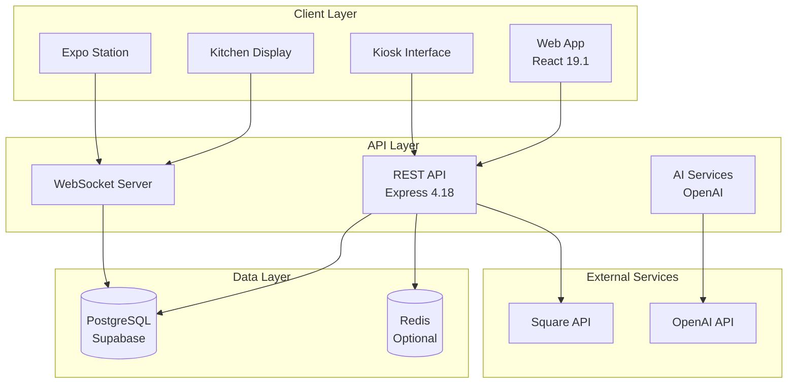
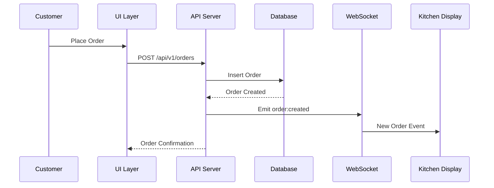
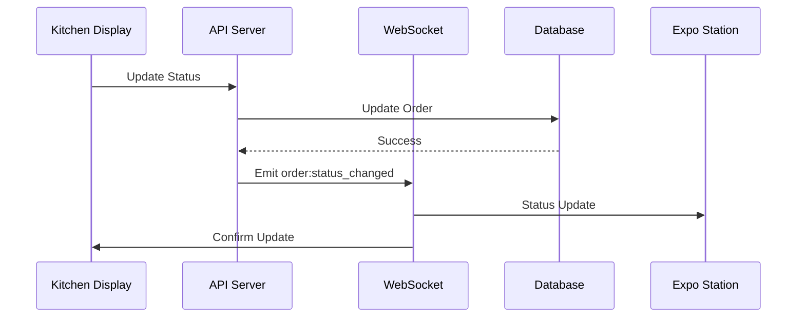
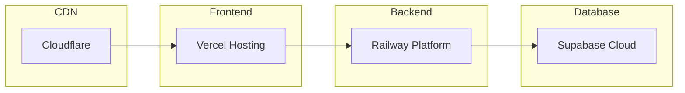

# System Architecture

## Overview

Restaurant OS 6.0 is a modern, scalable restaurant management system built with a microservices-oriented architecture. The system consists of three main layers: Frontend (React), Backend (Express), and Database (Supabase).



## Technology Stack

### Frontend

- **Framework**: React 19.1.0 with TypeScript 5.8.3
- **Build Tool**: Vite 5.4.19
- **Styling**: TailwindCSS 3.4
- **State Management**: React Context + Hooks
- **Real-time**: WebSocket client
- **Routing**: React Router v6
- **UI Components**: Custom component library

### Backend

- **Runtime**: Node.js 18+
- **Framework**: Express 4.18.2
- **Language**: TypeScript 5.3.3
- **Real-time**: WebSocket (ws)
- **Authentication**: JWT + Supabase Auth
- **AI Integration**: OpenAI SDK

### Database

- **Primary**: PostgreSQL (via Supabase)
- **ORM**: Knex.js
- **Caching**: Redis (optional)
- **File Storage**: Supabase Storage

## Core Modules

### 1. Order Management System

```typescript
interface OrderSystem {
  creation: OrderCreation
  processing: KitchenProcessing
  fulfillment: ExpoStation
  payment: PaymentProcessing
  tracking: RealTimeTracking
}
```

**Components**:

- Order creation (Web, Kiosk, Voice)
- Status management (7-state workflow)
- Real-time updates (WebSocket)
- Payment processing (Square)

### 2. Kitchen Display System (KDS)

```typescript
interface KitchenDisplay {
  orders: ActiveOrder[]
  stations: Station[]
  urgency: UrgencyManagement
  grouping: TableConsolidation
}
```

**Features**:

- Virtual scrolling for 1000+ orders
- Table-based consolidation
- Station completion tracking
- Urgency indicators

### 3. Voice Ordering System

```typescript
interface VoiceSystem {
  input: WebRTCAudio
  processing: OpenAIRealtime
  nlp: OrderParsing
  feedback: AudioResponse
}
```

**Architecture**:

- WebRTC for audio capture
- OpenAI Realtime API for processing
- Natural language understanding
- Context-aware responses

### 4. Payment Processing

```typescript
interface PaymentSystem {
  methods: ['cash', 'card', 'terminal', 'mobile']
  processors: {
    square: SquareSDK
    terminal: SquareTerminal
  }
  security: PCICompliance
}
```

**Integration**:

- Square Web Payments SDK
- Square Terminal API
- Tokenization for security
- PCI compliance maintained

## Data Flow Architecture

### 1. Order Creation Flow



### 2. Real-time Update Flow



## Security Architecture

### Authentication Flow

```typescript
interface AuthFlow {
  methods: {
    supabase: SupabaseAuth // Full users
    jwt: JWTAuth // API access
    demo: DemoAuth // Friends & family
  }
  validation: {
    token: TokenValidation
    restaurant: ContextValidation
    permissions: RoleBasedAccess
  }
}
```

### Security Layers

1. **Transport Security**
   - HTTPS enforced
   - WSS for WebSocket
   - CORS configuration

2. **Application Security**
   - JWT token validation
   - Restaurant context isolation
   - Rate limiting

3. **Data Security**
   - Input sanitization
   - SQL injection prevention
   - XSS protection

## Performance Architecture

### Optimization Strategies

1. **Code Splitting**

   ```typescript
   // Lazy loading routes
   const KitchenDisplay = lazy(() => import('./pages/KitchenDisplay'))
   ```

2. **Virtual Scrolling**

   ```typescript
   // React Window for large lists
   <FixedSizeList
     height={600}
     itemCount={orders.length}
     itemSize={120}
   >
   ```

3. **Caching Strategy**
   - HTTP cache headers
   - Redis for session data
   - Browser localStorage
   - Service Worker (PWA)

### Performance Metrics

| Metric                 | Target | Current |
| ---------------------- | ------ | ------- |
| First Contentful Paint | <1.5s  | 1.2s    |
| Time to Interactive    | <3s    | 2.8s    |
| Bundle Size            | <100KB | 97KB    |
| Memory Usage           | <4GB   | 4GB     |
| API Response           | <200ms | 150ms   |

## Deployment Architecture

### Environment Configuration

```yaml
environments:
  development:
    api: http://localhost:3001
    client: http://localhost:5173

  staging:
    api: https://api-staging.restaurant-os.com
    client: https://staging.restaurant-os.com

  production:
    api: https://api.restaurant-os.com
    client: https://app.restaurant-os.com
```

### Infrastructure



## Scalability Considerations

### Horizontal Scaling

1. **Stateless Services**
   - No server-side sessions
   - JWT for authentication
   - Redis for shared state

2. **Load Balancing**
   - Multiple API instances
   - WebSocket sticky sessions
   - Database connection pooling

3. **Microservices Ready**
   - Modular architecture
   - Service boundaries defined
   - API gateway pattern

### Vertical Scaling

1. **Database Optimization**
   - Indexed queries
   - Connection pooling
   - Read replicas

2. **Caching Layers**
   - CDN for static assets
   - Redis for hot data
   - Browser caching

## Monitoring & Observability

### Logging Strategy

```typescript
interface LoggingSystem {
  levels: ['info', 'warn', 'error', 'debug']
  outputs: {
    console: ConsoleTransport
    file: FileTransport
    service: LoggingService // DataDog, etc
  }
  correlation: RequestIdTracking
}
```

### Metrics Collection

1. **Application Metrics**
   - Request/response times
   - Error rates
   - WebSocket connections

2. **Business Metrics**
   - Orders per hour
   - Average prep time
   - Payment success rate

3. **Infrastructure Metrics**
   - CPU/Memory usage
   - Database connections
   - Network latency

## Error Handling Architecture

### Client-Side

```typescript
// Error boundaries at multiple levels
<ErrorBoundary level="app">
  <ErrorBoundary level="page">
    <ErrorBoundary level="section">
      <Component />
    </ErrorBoundary>
  </ErrorBoundary>
</ErrorBoundary>
```

### Server-Side

```typescript
// Centralized error handling
app.use(
  errorHandler({
    log: true,
    notify: process.env.NODE_ENV === 'production',
    fallback: genericErrorResponse,
  })
)
```

## Testing Architecture

### Testing Pyramid

```
         /\
        /UI\        E2E Tests (10%)
       /----\
      /Integr\      Integration Tests (30%)
     /--------\
    /   Unit   \    Unit Tests (60%)
   /____________\
```

### Test Coverage Requirements

- Statements: 60% minimum
- Branches: 50% minimum
- Functions: 60% minimum
- Lines: 60% minimum

## Future Architecture Considerations

### Planned Enhancements

1. **Event Sourcing**
   - Complete audit trail
   - Time-travel debugging
   - Event replay capability

2. **CQRS Pattern**
   - Separate read/write models
   - Optimized queries
   - Better scalability

3. **GraphQL Gateway**
   - Flexible queries
   - Reduced overfetching
   - Better mobile support

4. **Kubernetes Deployment**
   - Container orchestration
   - Auto-scaling
   - Self-healing

## Architecture Decisions Records (ADRs)

### ADR-001: React for Frontend

**Status**: Accepted  
**Context**: Need modern, maintainable UI framework  
**Decision**: Use React 19 with TypeScript  
**Consequences**: Large ecosystem, good performance, learning curve

### ADR-002: WebSocket for Real-time

**Status**: Accepted  
**Context**: Need real-time order updates  
**Decision**: Use native WebSocket with reconnection  
**Consequences**: Lower latency, complexity in connection management

### ADR-003: Supabase for Database

**Status**: Accepted  
**Context**: Need managed PostgreSQL with auth  
**Decision**: Use Supabase cloud platform  
**Consequences**: Reduced ops overhead, vendor lock-in

### ADR-004: Square for Payments

**Status**: Accepted  
**Context**: Need PCI-compliant payment processing  
**Decision**: Integrate Square SDK  
**Consequences**: Reliable payments, transaction fees
