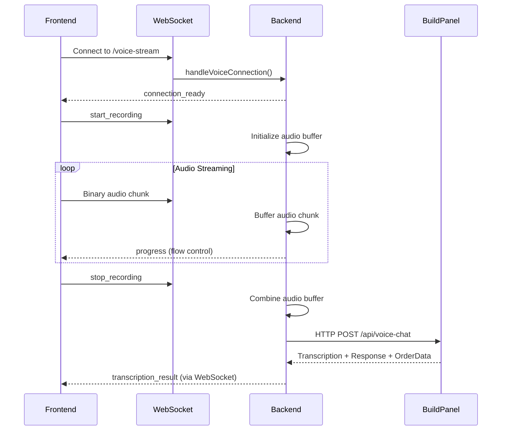

# WebSocket-to-REST Bridge Pattern

## Overview

The Rebuild 6.0 voice ordering system implements a unique **WebSocket-to-REST Bridge Pattern** that combines the benefits of real-time WebSocket communication with the reliability and context management of RESTful API calls to the BuildPanel service.

## Architecture Pattern

```
┌─────────────┐    WebSocket     ┌─────────────┐    HTTP/REST    ┌─────────────┐
│   Frontend  │ ───streaming──▶  │   Backend   │ ───request───▶  │ BuildPanel  │
│   (Audio)   │                  │  (Buffer)   │                 │  Service    │
└─────────────┘                  └─────────────┘                 └─────────────┘
```

## Why This Pattern?

### WebSocket Benefits
- **Real-time Feedback**: Immediate connection status and progress updates
- **Low Latency**: Audio chunks streamed without HTTP overhead
- **Flow Control**: Backpressure management for audio streaming
- **Connection State**: Persistent connection for recording sessions

### REST Benefits
- **Reliability**: HTTP retry logic and error handling
- **Context Management**: Restaurant context easily passed in headers
- **Service Integration**: Standard HTTP client libraries
- **Monitoring**: HTTP status codes and logging

### Combined Advantages
- **Best of Both**: Real-time streaming + reliable processing
- **Scalability**: WebSocket for UI, HTTP for heavy AI processing
- **Flexibility**: Easy to swap AI services without changing WebSocket protocol
- **Debugging**: Clear separation between streaming and processing layers

## Implementation Details

### Frontend: WebSocket Streaming

```typescript
class UnifiedVoiceRecorder {
  private ws: WebSocket;
  private mediaRecorder: MediaRecorder;
  
  startRecording() {
    // 1. Send control message via WebSocket
    this.ws.send(JSON.stringify({ type: 'start_recording' }));
    
    // 2. Stream audio chunks in real-time
    this.mediaRecorder.ondataavailable = (event) => {
      if (event.data.size > 0) {
        this.ws.send(event.data); // Binary WebSocket frame
      }
    };
  }
  
  stopRecording() {
    // 3. Signal end of recording
    this.ws.send(JSON.stringify({ type: 'stop_recording' }));
    
    // 4. Wait for transcription result via WebSocket
    this.ws.onmessage = (event) => {
      const data = JSON.parse(event.data);
      if (data.type === 'transcription_result') {
        this.handleTranscription(data);
      }
    };
  }
}
```

### Backend: Buffer and Bridge

```typescript
class AIService {
  private connections: Map<string, ConnectionState>;
  
  handleVoiceConnection(ws: WebSocket, connectionId: string) {
    // 1. Initialize connection state
    this.connections.set(connectionId, {
      isRecording: false,
      audioBuffer: [],
      startTime: null
    });
    
    ws.on('message', async (data) => {
      if (data instanceof Buffer) {
        // 2. Buffer audio chunks from WebSocket
        await this.processAudioStream(connectionId, data);
      } else {
        // 3. Handle control messages
        const message = JSON.parse(data.toString());
        if (message.type === 'stop_recording') {
          // 4. Bridge to REST API
          const result = await this.stopRecording(connectionId);
          ws.send(JSON.stringify(result));
        }
      }
    });
  }
  
  async stopRecording(connectionId: string): Promise<TranscriptionResult> {
    const state = this.connections.get(connectionId);
    
    // 5. Combine buffered chunks
    const audioBuffer = Buffer.concat(state.audioBuffer);
    
    // 6. Make HTTP call to BuildPanel
    const response = await this.buildPanel.processVoice(
      audioBuffer,
      'audio/webm',
      restaurantId
    );
    
    return {
      type: 'transcription_result',
      success: true,
      text: response.transcription,
      response: response.response,
      orderData: response.orderData
    };
  }
}
```

### BuildPanel Service: HTTP Processing

```typescript
// BuildPanel receives complete audio via HTTP POST
app.post('/api/voice-chat', upload.single('audio'), async (req, res) => {
  const { file, body } = req;
  const { restaurantId, userId } = body;
  
  try {
    // 1. Process complete audio file
    const transcription = await whisperService.transcribe(file.buffer);
    
    // 2. Generate AI response with restaurant context
    const response = await chatService.generateResponse(
      transcription,
      restaurantId,
      userId
    );
    
    // 3. Parse order data if detected
    const orderData = await orderParser.parse(
      transcription,
      restaurantId
    );
    
    // 4. Return complete result
    res.json({
      transcription,
      response,
      orderData,
      audioUrl: response.ttsUrl // Optional TTS response
    });
  } catch (error) {
    res.status(500).json({ error: error.message });
  }
});
```

## Message Flow Sequence



## Error Handling Strategy

### WebSocket Layer Errors
```typescript
// Connection failures
ws.on('error', (error) => {
  logger.error('WebSocket error:', error);
  // Attempt reconnection with exponential backoff
});

// Flow control errors
if (unacknowledgedChunks > maxUnacknowledged) {
  logger.warn('Flow control: dropping audio chunk');
  return false; // Drop chunk to prevent buffer overflow
}
```

### HTTP Layer Errors
```typescript
// BuildPanel service errors
try {
  const response = await buildPanel.processVoice(audioBuffer, mimeType, restaurantId);
} catch (error) {
  if (error.code === 'ECONNREFUSED') {
    return { 
      success: false, 
      error: 'BuildPanel service unavailable' 
    };
  }
  throw error; // Re-throw other errors
}
```

### Graceful Degradation
```typescript
// Fallback strategies
const result = await this.stopRecording(connectionId, restaurantId);
if (!result.success) {
  // Option 1: Return error for manual entry
  ws.send(JSON.stringify({
    type: 'transcription_result',
    success: false,
    error: 'Voice processing failed. Please type your order.',
    fallback: 'manual_entry'
  }));
  
  // Option 2: Save audio for later processing
  await this.saveAudioForRetry(audioBuffer, connectionId);
}
```

## Performance Characteristics

### Latency Analysis
- **WebSocket Connection**: ~50ms initial handshake
- **Audio Streaming**: ~100ms per chunk (real-time)
- **Buffer Processing**: ~10ms to combine chunks
- **HTTP to BuildPanel**: ~1-3s for AI processing
- **Total Voice-to-Text**: ~1.5-3.5s end-to-end

### Memory Management
```typescript
// Bounded buffer sizes
const MAX_BUFFER_SIZE = 5 * 1024 * 1024; // 5MB max audio
const MAX_CHUNKS = 300; // ~5 minutes at 1-second chunks

if (state.audioBuffer.length > MAX_CHUNKS) {
  logger.warn('Audio buffer overflow, dropping oldest chunks');
  state.audioBuffer = state.audioBuffer.slice(-MAX_CHUNKS);
}
```

### Resource Cleanup
```typescript
// Clean up on connection close
ws.on('close', () => {
  // Clear audio buffers
  const state = this.connections.get(connectionId);
  if (state) {
    state.audioBuffer = null;
    this.connections.delete(connectionId);
  }
  
  // Cancel any pending BuildPanel requests
  if (state.pendingRequest) {
    state.pendingRequest.abort();
  }
});
```

## Testing Strategy

### Unit Tests
```typescript
describe('WebSocket-to-REST Bridge', () => {
  it('should buffer audio chunks correctly', async () => {
    const chunks = [Buffer.from('chunk1'), Buffer.from('chunk2')];
    await aiService.processAudioStream(connectionId, chunks[0]);
    await aiService.processAudioStream(connectionId, chunks[1]);
    
    const combined = await aiService.getCombinedAudio(connectionId);
    expect(combined).toEqual(Buffer.concat(chunks));
  });
  
  it('should make HTTP call to BuildPanel on stop', async () => {
    mockBuildPanel.processVoice.mockResolvedValue({
      transcription: 'test transcription',
      response: 'test response'
    });
    
    const result = await aiService.stopRecording(connectionId, 'restaurant1');
    
    expect(mockBuildPanel.processVoice).toHaveBeenCalledWith(
      expect.any(Buffer),
      'audio/webm',
      'restaurant1'
    );
    expect(result.success).toBe(true);
  });
});
```

### Integration Tests
```typescript
describe('Voice Order Integration', () => {
  it('should complete full voice order flow', async () => {
    // 1. Connect WebSocket
    const ws = new WebSocket('ws://localhost:3001/voice-stream');
    await waitForConnection(ws);
    
    // 2. Send start recording
    ws.send(JSON.stringify({ type: 'start_recording' }));
    
    // 3. Send audio chunks
    const audioData = await loadTestAudio('burger-order.webm');
    for (const chunk of audioData.chunks) {
      ws.send(chunk);
      await waitForAck(ws);
    }
    
    // 4. Stop recording and verify result
    ws.send(JSON.stringify({ type: 'stop_recording' }));
    const result = await waitForMessage(ws, 'transcription_result');
    
    expect(result.success).toBe(true);
    expect(result.text).toContain('burger');
    expect(result.orderData).toBeDefined();
  });
});
```

## Best Practices

### 1. Connection Management
- Use connection pooling for HTTP requests to BuildPanel
- Implement proper WebSocket connection lifecycle management
- Add heartbeat/ping-pong for connection health monitoring

### 2. Buffer Management
- Set reasonable limits on audio buffer size
- Implement flow control to prevent memory exhaustion
- Clean up buffers promptly after processing

### 3. Error Recovery
- Implement retry logic for HTTP requests to BuildPanel
- Provide fallback options when AI processing fails
- Log errors with sufficient context for debugging

### 4. Security
- Validate all WebSocket messages before processing
- Sanitize audio data before sending to external services
- Include restaurant context in all external API calls

### 5. Monitoring
- Track WebSocket connection counts and duration
- Monitor HTTP request success rates to BuildPanel
- Alert on high error rates or service unavailability

## Alternatives Considered

### Pure WebSocket
- **Pros**: Single protocol, lower latency
- **Cons**: Complex state management, harder to scale AI services
- **Verdict**: Rejected due to AI service integration complexity

### Pure REST
- **Pros**: Simple, standard HTTP patterns
- **Cons**: No real-time feedback, file upload complexity
- **Verdict**: Rejected due to poor user experience for voice

### gRPC Streaming
- **Pros**: Efficient binary protocol, built-in streaming
- **Cons**: Additional complexity, client support issues
- **Verdict**: Overkill for current requirements

## Future Enhancements

### Planned Improvements
1. **Compression**: Implement audio compression before HTTP transfer
2. **Caching**: Cache BuildPanel responses for repeated queries
3. **Load Balancing**: Support multiple BuildPanel instances
4. **Metrics**: Add detailed performance monitoring

### Scalability Considerations
- **Horizontal Scaling**: Multiple backend instances can share BuildPanel
- **Geographic Distribution**: Regional BuildPanel deployments
- **Service Mesh**: Integration with service discovery and load balancing

## References

- [AI_REALTIME_SYSTEMS.md](./AI_REALTIME_SYSTEMS.md) - Overall AI architecture
- [VOICE_ORDERING_GUIDE.md](./VOICE_ORDERING_GUIDE.md) - User-facing documentation
- [MIGRATION_BUILDPANEL.md](./MIGRATION_BUILDPANEL.md) - Migration from OpenAI direct integration
- [WebSocket MDN Documentation](https://developer.mozilla.org/en-US/docs/Web/API/WebSockets_API)
- [BuildPanel API Documentation](https://buildpanel.dev/docs/api)