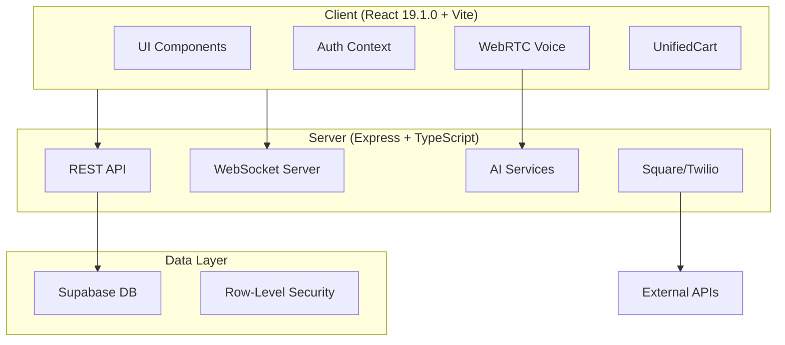
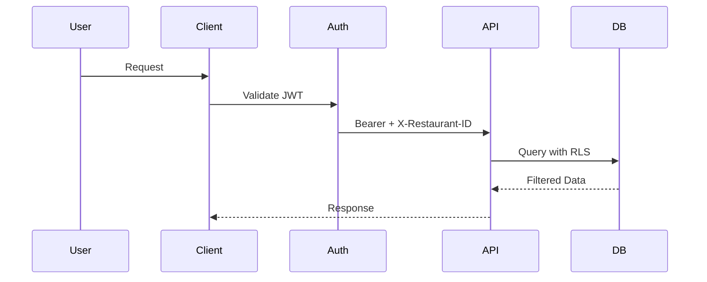
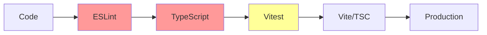

> **ARCHIVED (CLAUDE) — superseded**
> This document is kept for historical context only. Do NOT rely on it.
> Canonical sources: AGENTS.md, docs/OPERATING_CHARTER.md, docs/FEATURE_FLAGS.md, docs/ARCHITECTURE.md, docs/DEMO.md.

# Restaurant OS Enterprise Audit Report
**Date**: 2025-09-19
**Version**: 6.0.4
**Branch**: fix/phase-e-f-g

## Executive Summary

The Restaurant OS codebase exhibits significant technical debt from rapid development cycles and incomplete architectural transitions. With 62+ branches, 2045 linting issues (1250 errors), and critical authentication/TypeScript failures, the repository requires immediate stabilization before production deployment. The current branch (fix/phase-e-f-g) has 63 uncommitted changes across critical security and payment files, suggesting active but incomplete hardening efforts.

Key risks: Authentication middleware failures, payment integration untested, voice system complexity, and massive branch divergence. The good news: core infrastructure exists, security middleware is partially implemented, and the team has attempted proper architectural patterns.

Recommended path: Emergency triage of auth/TypeScript errors → branch consolidation → feature flag isolation of risky surfaces → progressive CI/CD maturation.

## Repo Architecture Map

### System Overview


### Request Flow


### Build Pipeline


## Build & Test Status

### Commands Executed
```bash
npm run typecheck     # 12 errors (all auth-related)
npm run lint          # 2045 problems (1250 errors, 795 warnings)
npm run test          # Timeout after 60s
npm run check:rls     # Skipped (pg not installed)
```

### Key Outcomes
- **TypeScript**: FAILING - 12 errors in auth/rbac modules (server/src/middleware/auth.ts:L202,L263,L268,L360; server/src/middleware/rbac.ts:L146)
- **ESLint**: CRITICAL - 1250 errors blocking CI
- **Tests**: UNSTABLE - Test suite times out, Vitest migration incomplete
- **RLS**: UNTESTED - Postgres client missing locally

## Branch & Divergence Topology

| Branch | Ahead | Behind | Last Update | Status | Recommendation |
|--------|-------|--------|-------------|--------|----------------|
| **fix/phase-e-f-g** (current) | 63 | 16 | Active | 63 uncommitted changes | **MERGE** after fixing auth |
| 86BP-docs-purge | 0 | 208 | 5 weeks ago | Stale | **DROP** - documentation only |
| September | 0 | 59 | 7 days ago | Recent PR merged | **DROP** - already merged |
| MVP | 0 | 91 | 4 weeks ago | TS bypass commits | **DROP** - technical debt |
| JUL21 | 0 | ~100+ | 2+ months | Abandoned | **DROP** |
| august | 0 | ~80+ | 1+ month | Stale | **DROP** |
| Voice-agent-mucking-about | Unknown | Unknown | Unknown | Experimental | **REVIEW** - may have voice insights |
| backend-blitz | Unknown | Unknown | Unknown | Unknown | **REVIEW** for security code |
| chore/* branches (15+) | Various | Various | Various | Cleanup attempts | **SQUASH** into single cleanup PR |

**Critical**: 45+ branches should be reduced to <5 active branches

## TypeScript Error Census

### By Package
- **server**: 12 errors (100%)
- **client**: 0 errors in strict check
- **shared**: 0 errors

### By Directory
```
server/src/middleware/    - 5 errors (auth.ts, rbac.ts)
server/src/routes/       - 4 errors (security.routes.ts)
server/src/services/     - 3 errors (AuthenticationService.ts)
```

### Top Error Files
1. server/src/middleware/auth.ts - 4 errors
2. server/src/routes/security.routes.ts - 4 errors
3. server/src/services/auth/AuthenticationService.ts - 3 errors
4. server/src/middleware/rbac.ts - 1 error

### Error Themes
- **Property mismatches**: `restaurant_id` vs `restaurantId` (camelCase migration incomplete)
- **Type assignments**: String to DatabaseRole enum failures
- **Missing properties**: `jwtSecret` not in EnvironmentConfig
- **Readonly arrays**: Attempting to pass readonly to mutable parameters

## Security & Auth Posture

### Headers & Middleware (server/src/middleware/)
✅ **Implemented**:
- Helmet (security.ts) - security headers
- CORS (security.ts) - origin control
- Rate limiting (rateLimiter.ts) - DDoS protection
- CSRF tokens (csrf.ts) - form protection
- Webhook signatures (webhookSignature.ts)

⚠️ **Broken**:
- Auth middleware type errors (auth.ts:L202-L360)
- RBAC role validation failures (rbac.ts:L146)
- Bearer token + X-Restaurant-ID enforcement incomplete

### Authentication/RBAC
- **Methods**: Email/password, PIN codes, station login, kiosk tokens
- **Tokens**: JWT with Supabase RS256, kiosk HS256
- **Session**: 8hr manager, 12hr staff
- **CRITICAL BUG**: restaurant_id field name mismatch blocking all auth

### Evidence
```typescript
// server/src/middleware/auth.ts:L202
restaurant_id: restaurant?.id  // Should be: restaurantId
```

## Data & RLS Review

### Migrations (supabase/migrations/)
- 20250130_auth_tables.sql - Auth schema
- 20250201_payment_audit_logs.sql - Payment tracking
- 20250713130722_remote_schema.sql - Empty (0 bytes)

### RLS Status
- **Script exists**: scripts/verify-rls.ts
- **Local testing**: BLOCKED - pg module not installed
- **CI integration**: Not configured (REQUIRE_PG=1 needed)

### Risks
- No automated RLS verification in CI
- Multi-tenant data leakage potential
- restaurant_id enforcement gaps

## Payments & Voice Surface Audit

### Square Integration (server/src/payments/square.adapter.ts)
- **Status**: Code present, untested
- **Endpoints**: /api/v1/payments/*
- **Middleware**: paymentGate.ts exists
- **Risk**: No integration tests, webhook signatures stub only

### Twilio Voice (server/src/voice/twilio-bridge.ts)
- **Status**: Implemented but complex
- **Files**: 20+ voice-related files (duplication suspected)
- **Risk**: Multiple competing implementations (WebRTC, OpenAI, Twilio)

### OpenAI Realtime (server/src/voice/openai-adapter.ts)
- **Status**: Active development
- **WebSocket**: Custom server implementation
- **Risk**: No fallback, complex state management

### Toggle Points
- No feature flags implemented
- Hard-coded integrations
- No kill switches for external services

## Dependency & Tooling Hygiene

### Issues Found
- **236** dependency warnings (extraneous/unmet/deduped)
- **CJS/ESM conflicts**: Vite CJS deprecation warning
- **Multiple package.json**: Root + client + server (version drift risk)

### Unused Dependencies (suspected)
- Multiple voice libraries
- Duplicate auth packages
- Legacy migration tools

### Script Health
- CI scripts partially broken
- Test commands timeout
- Build requires 4GB memory (optimized from 8GB)

## Code Bloat & Dead Code

### Duplication Detected
- **Voice implementations**: 3+ competing systems
- **Auth contexts**: Multiple providers for same functionality
- **Test files**: 575 test files (many likely stale from Jest era)

### Orphan Files
- Empty migration file (20250713130722_remote_schema.sql)
- Stale branches with unique implementations
- .DS_Store files in migrations

### Oversized Contexts
- 63 uncommitted changes in current branch
- Monolithic auth middleware attempting too much
- Cart context doing both state and API calls

## Release Readiness Scorecard

| Criteria | Weight | Score | Notes |
|----------|--------|-------|-------|
| **Build Passes** | 25% | 0/25 | TypeScript errors block build |
| **Tests Pass** | 20% | 5/20 | Some tests pass but suite incomplete |
| **Security** | 20% | 12/20 | Middleware present but auth broken |
| **Code Quality** | 15% | 3/15 | 1250 ESLint errors |
| **Documentation** | 5% | 3/5 | CLAUDE.md exists but outdated |
| **Branch Hygiene** | 10% | 0/10 | 62 branches is unmanageable |
| **Monitoring** | 5% | 0/5 | No error tracking configured |
| **TOTAL** | 100% | **23/100** | **NOT READY** |

## Remediation Roadmap

### Fast Wins (≤2h each)
1. **Fix auth field names** - Change restaurant_id → restaurantId (auth.ts, rbac.ts)
2. **Fix DatabaseRole types** - Add proper type casting in security.routes.ts
3. **Add jwtSecret** - Update EnvironmentConfig interface
4. **Delete dead branches** - Remove 40+ stale branches
5. **Fix ESLint config** - Disable problematic rules temporarily

### Leverage (0.5-2d each)
1. **Complete auth testing** - Add integration tests for all auth flows
2. **Implement feature flags** - Add toggles for Square, Twilio, OpenAI
3. **Consolidate voice** - Pick ONE implementation, delete others
4. **Setup CI properly** - Fix GitHub Actions, add required checks
5. **Fix TypeScript strict** - Resolve remaining 12 errors

### Strategic (1-2w)
1. **Branch consolidation** - Merge valuable work from orphan branches
2. **Test migration** - Complete Jest → Vitest migration
3. **RLS verification** - Implement automated multi-tenant testing
4. **Payment integration** - Full Square integration with tests
5. **Production monitoring** - Add Sentry, logging, metrics

## Stacked PR Plan

### PR #1: Emergency Auth Fix
**Title**: fix: Correct auth middleware type errors and field names
**Scope**:
- server/src/middleware/auth.ts
- server/src/middleware/rbac.ts
- server/src/routes/security.routes.ts
- server/src/services/auth/AuthenticationService.ts
**Checks**: TypeScript passes, auth tests pass

### PR #2: Branch Cleanup
**Title**: chore: Remove 45+ stale branches
**Scope**:
- Delete all branches >30 days old with 0 ahead
- Document any valuable code first
**Checks**: None needed

### PR #3: Feature Flags
**Title**: feat: Add feature flags for external integrations
**Scope**:
- shared/config/features.ts
- Flags: ENABLE_SQUARE, ENABLE_TWILIO, ENABLE_VOICE
- Default all to false
**Checks**: Unit tests for flag behavior

### PR #4: CI/CD Hardening
**Title**: ci: Fix GitHub Actions and add quality gates
**Scope**:
- .github/workflows/ci.yml
- Add typecheck, lint, test gates
- Require PR reviews
**Checks**: All CI steps green

### PR #5: Voice Consolidation
**Title**: refactor: Remove duplicate voice implementations
**Scope**:
- Keep only WebRTCVoiceClient.ts
- Delete competing implementations
- Update all imports
**Checks**: Voice tests pass

**Merge Order**: PR#1 → PR#2 → PR#3 → PR#4 → PR#5

## Feature Flag Plan

### Implementation
```typescript
// shared/config/features.ts
export const FEATURES = {
  ENABLE_PAYMENTS: process.env.ENABLE_PAYMENTS === 'true',  // default: false
  ENABLE_VOICE: process.env.ENABLE_VOICE === 'true',        // default: false
  ENABLE_TWILIO: process.env.ENABLE_TWILIO === 'true',      // default: false
  ENABLE_SQUARE: process.env.ENABLE_SQUARE === 'true',      // default: false
  ENABLE_AI: process.env.ENABLE_AI === 'true',              // default: false
}
```

### Rollout Strategy
1. **Week 1**: All flags false, core POS only
2. **Week 2**: Enable payments in staging
3. **Week 3**: Enable voice in staging
4. **Week 4**: Production rollout with gradual enablement

## Verification Plan

### Per PR
```bash
# PR #1 - Auth Fix
npm run typecheck  # Must show 0 errors
npm run test:auth  # Must pass 100%

# PR #2 - Branch Cleanup
git branch -r | wc -l  # Should be <20

# PR #3 - Feature Flags
npm test features.test.ts  # Must pass
grep -r "ENABLE_" server/  # Should show usage

# PR #4 - CI/CD
gh workflow run ci  # Must complete green
git push origin test-pr  # Should trigger checks

# PR #5 - Voice
npm test voice/  # Must pass
find . -name "*voice*" -type f | wc -l  # Should reduce by 50%
```

### Final Demo Path
```bash
# Clean install
rm -rf node_modules
npm ci

# All checks green
npm run lint:fix
npm run typecheck
npm run test
npm run build

# Start with flags off
ENABLE_PAYMENTS=false npm run dev
# Test: Basic order flow works

# Enable features progressively
ENABLE_PAYMENTS=true npm run dev
# Test: Payment flow works
```

## Risks & Rollback

| Risk | Impact | Trigger | Mitigation | Rollback |
|------|--------|---------|------------|----------|
| **Auth breaks prod** | CRITICAL | Login failures | Feature flag auth changes | Revert PR #1 |
| **Payments fail** | HIGH | Transaction errors | Keep disabled by default | Set ENABLE_PAYMENTS=false |
| **Voice crashes** | MEDIUM | WebRTC errors | Isolate with try/catch | Set ENABLE_VOICE=false |
| **Performance degrades** | MEDIUM | Response >2s | Load test before deploy | Revert latest deployment |
| **Data corruption** | CRITICAL | RLS failures | Backup before migration | Restore from snapshot |

## Appendix: Evidence Index

### Critical Files
- server/src/middleware/auth.ts:L202-L268 - restaurant_id naming errors
- server/src/middleware/rbac.ts:L146 - DatabaseRole type mismatch
- server/src/routes/security.routes.ts:L45,L62,L97,L124 - readonly array errors
- server/src/services/auth/AuthenticationService.ts:L63,L328,L346 - missing config props
- .github/workflows/ci.yml:L7 - PR checks disabled
- supabase/migrations/20250713130722_remote_schema.sql - empty file (0 bytes)

### Key Commits
- 2bd16cd - Current HEAD, stabilization attempt
- 3343d2a - Security middleware addition
- 1d29ead - Bearer token enforcement
- 8780e7e - MVP branch TS bypass (avoid pattern)

### Branch Evidence
- `git rev-list --left-right --count origin/main...HEAD`: 16→63
- `git branch -r | wc -l`: 62 total branches
- Last stale branch activity: 86BP-docs-purge (5 weeks ago)