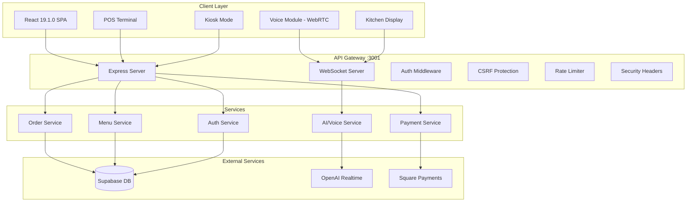

# Restaurant OS Architecture v6.0.3

**Last Updated**: September 2, 2025

## System Overview

Restaurant OS is a modern, production-ready restaurant management system with AI-powered voice ordering, real-time kitchen display, and comprehensive POS capabilities.

## Architecture Principles

### 1. Unified Backend (Port 3001)
- **Single Express Server**: ALL services consolidated
- **No Microservices**: Monolithic for simplicity
- **No Port 3002**: Everything on 3001

### 2. Tech Stack

| Layer | Technology | Version |
|-------|------------|---------|
| Frontend | React | 19.1.0 |
| Language | TypeScript | 5.8.3 (client) / 5.3.3 (server) |
| Build Tool | Vite | 5.4.19 |
| Backend | Express | 4.18.2 |
| Database | Supabase | 2.50.5 (client) / 2.39.7 (server) |
| AI/Voice | OpenAI Realtime | Latest |
| WebSocket | ws | 8.18.0 |

### 3. Critical Rules
- ✅ Handle all 7 order statuses (new, pending, confirmed, preparing, ready, completed, cancelled)
- ✅ Include restaurant_id in all operations
- ✅ Never expose API keys to client
- ✅ Always validate input
- ✅ Use UnifiedCartContext for all cart operations

## System Architecture Diagram



## Component Architecture

### Frontend Structure
```
client/
├── src/
│   ├── components/     # Reusable UI components
│   ├── contexts/       # React contexts (Auth, Cart, Restaurant)
│   ├── hooks/         # Custom React hooks
│   ├── modules/       # Feature modules
│   │   ├── voice/     # Voice ordering system
│   │   ├── kds/       # Kitchen display
│   │   ├── pos/       # Point of sale
│   │   └── kiosk/     # Self-service kiosk
│   ├── pages/         # Route components
│   ├── services/      # API clients
│   └── utils/         # Utilities
```

### Backend Structure
```
server/
├── src/
│   ├── api/          # API routes
│   ├── auth/         # Authentication
│   ├── middleware/   # Express middleware
│   ├── services/     # Business logic
│   ├── websocket/    # WebSocket handlers
│   └── utils/        # Server utilities
```

### Shared Code
```
shared/
├── types/           # TypeScript types
├── constants/       # Shared constants
└── utils/          # Shared utilities
```

## Authentication Architecture

### Authentication Methods
1. **JWT Token (Managers/Owners)**
   - RS256 signed via Supabase
   - 8-hour expiration
   - MFA support

2. **PIN Authentication (Staff)**
   - bcrypt with pepper
   - 12-hour expiration
   - Rate limited

3. **Station Token (Kitchen/Expo)**
   - Device-bound tokens
   - No expiration
   - Shared device support

4. **Session Cookie (Customers)**
   - HttpOnly, Secure, SameSite
   - Anonymous sessions
   - Auto-renewal

### Role-Based Access Control (RBAC)

| Role | Access Level | Authentication |
|------|-------------|----------------|
| Owner | Full system access | Email + MFA |
| Manager | Restaurant operations | Email + optional MFA |
| Server | Order & payment processing | PIN |
| Cashier | Payment processing | PIN |
| Kitchen | Kitchen display only | Station |
| Expo | Expo display | Station |
| Customer | Self-service ordering | Anonymous |

## Data Flow

### Order Lifecycle
```
1. Order Creation
   Customer → Frontend → API → Order Service → Database

2. Payment Processing
   Frontend → Payment API → Square → Webhook → Database

3. Kitchen Notification
   Database → WebSocket → Kitchen Display

4. Status Updates
   Kitchen → WebSocket → Database → Customer Display

5. Order Completion
   Kitchen → Status Update → Database → Analytics
```

### Real-time Updates
- WebSocket connection for live updates
- Event-driven architecture
- Multi-tenant isolation via restaurant_id
- Automatic reconnection with exponential backoff

## Security Architecture

### API Security
- JWT authentication (RS256)
- CSRF protection (double-submit cookies)
- Rate limiting (per-endpoint limits)
- Input validation (Joi schemas)
- SQL injection prevention (parameterized queries)
- XSS prevention (CSP headers)

### Infrastructure Security
- HTTPS enforced (HSTS)
- Environment variables for secrets
- Dependency scanning (npm audit)
- Access logging with user context
- Suspicious activity detection
- Security event monitoring

### Payment Security
- PCI compliance via Square
- No credit card storage
- Tokenization for all payments
- Idempotency keys for transactions
- Audit logging for all payment events

## Performance Optimization

### Frontend Optimization
- Code splitting with React.lazy()
- Bundle size: Main chunk <100KB
- Image optimization
- Service worker caching
- Virtual scrolling for lists

### Backend Optimization
- Connection pooling
- Query optimization
- Response caching
- Gzip compression
- Rate limiting

### Memory Management
- Build memory: 4GB max (optimized from 12GB)
- Cleanup utilities for long-running components
- WebSocket connection management
- Proper useEffect cleanup

## Deployment Architecture

### Development
```bash
npm run dev  # Starts both client (:5173) and server (:3001)
```

### Production
```bash
npm run build  # Creates optimized production build
npm start      # Starts production server
```

### Environment Configuration
- `.env.development` - Local development
- `.env.production` - Production settings
- `.env.test` - Test environment

### CI/CD Pipeline
1. GitHub Actions on PR
2. Run tests (Jest + Vitest)
3. TypeScript validation
4. ESLint checks
5. Bundle size analysis
6. Deploy to staging
7. Smoke tests
8. Deploy to production

## Monitoring & Observability

### Health Checks
- `/api/v1/health` - System health
- `/api/v1/metrics` - Prometheus metrics
- `/api/v1/security/stats` - Security metrics

### Logging
- Structured JSON logging
- User context in all logs
- Audit trail for sensitive operations
- Error tracking with stack traces

### Alerting
- Uptime monitoring
- Error rate thresholds
- Payment failure alerts
- Security event notifications

## Scalability Considerations

### Current Capacity
- 100+ concurrent users
- 500+ orders/hour
- 10+ restaurants

### Future Scaling
- Redis for session storage
- CDN for static assets
- Database read replicas
- WebSocket clustering
- Horizontal scaling ready

## Key Architectural Decisions

### ADR-001: Authentication Strategy
- Chose JWT over sessions for stateless scaling
- PIN authentication for quick staff access
- Station tokens for shared devices

### ADR-007: Order Status Alignment
- Standardized on 7 status values
- Database enum enforcement
- Frontend validation required
- Fallback handling mandatory

### Cart System Unification
- Single UnifiedCartContext for all cart operations
- No duplicate cart providers
- Direct imports from `@/contexts/UnifiedCartContext`

## Development Guidelines

### Code Standards
- TypeScript strict mode
- ESLint configuration enforced
- Prettier formatting
- No hardcoded values
- Comprehensive error handling

### Testing Requirements
- Unit tests: 60% coverage
- Integration tests for critical paths
- E2E tests with Puppeteer
- Load testing before deployment

### Documentation Standards
- API documentation required
- Code comments for complex logic
- README files in feature folders
- Architecture decision records

## Migration & Upgrade Path

### Database Migrations
- Supabase migrations in `supabase/migrations/`
- Rollback scripts required
- Test migrations in staging

### Version Upgrades
- Semantic versioning
- Breaking changes in major versions
- Deprecation warnings
- Migration guides

## Support & Maintenance

### Monitoring Tools
- Application: Custom dashboard
- Infrastructure: CloudWatch/Datadog
- Errors: Sentry
- Analytics: Internal metrics

### Support Channels
- GitHub Issues
- security@restaurant-os.com
- Internal documentation wiki

---

## Related Documentation
- [API Reference](/docs/api/README.md)
- [Security Policy](/SECURITY.md)
- [Deployment Guide](/docs/DEPLOYMENT_GUIDE.md)
- [Testing Guide](/docs/TESTING_GUIDE.md)