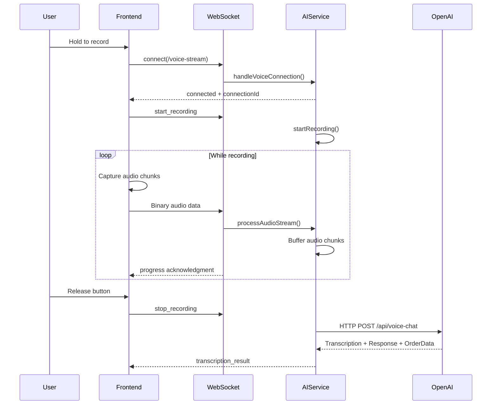

# AI & Real-time Systems Documentation

## Overview

The Rebuild 6.0 restaurant OS integrates voice order capture, AI-powered transcription and parsing through OpenAI service, and WebSocket-based real-time updates in a unified backend architecture. The backend runs on port 3001 and communicates with OpenAI service on port 3003 for all AI operations.

## Table of Contents

1. [Architecture Overview](#architecture-overview)
2. [Voice Order Flow](#voice-order-flow)
3. [WebSocket Protocol](#websocket-protocol)
4. [Audio Streaming Architecture](#audio-streaming-architecture)
5. [OpenAI Service Integration](#buildpanel-service-integration)
6. [Real-time Updates](#real-time-updates)
7. [Security Considerations](#security-considerations)
8. [Error Handling & Recovery](#error-handling--recovery)

## Architecture Overview

### Current Implementation (WebRTC - December 2024)

```
┌─────────────────┐     ┌──────────────────────────────┐     ┌─────────────────┐
│                 │     │   Unified Backend (3001)     │     │                 │
│  Frontend       │────▶│                              │────▶│  OpenAI         │
│  (React/Vite)   │     │  ┌────────────────────┐     │     │  Realtime API   │
│                 │     │  │  Express.js API    │     │     │                 │
└─────────────────┘     │  │  - /api/v1/*       │     │     └─────────────────┘
         │              │  │  - /api/v1/realtime│     │            ▲
         │              │  └────────────────────┘     │            │
         │              │                              │       WebRTC (Direct)
         └─────────────▶│  ┌────────────────────┐     │            │
      WebSocket         │  │  WebSocket Server  │     │     ┌─────────────────┐
      (Orders)          │  │  - /ws (orders)    │     │     │   Browser       │
                        │  │  - /voice-stream   │     │────▶│   (WebRTC)      │
                        │  └────────────────────┘     │     └─────────────────┘
                        │                              │
                        └──────────────────────────────┘

Note: WebRTC provides ~50% lower latency than WebSocket for voice
```

## Voice Order Flow

### 1. Voice Capture Initialization

```typescript
// Client: VoiceSocketManager connects to WebSocket
const manager = VoiceSocketManager.getInstance('ws://localhost:3001/voice-stream');
manager.connect();
```

### 2. Audio Recording & Streaming



### 3. Order Parsing & Creation

```typescript
// Client: Parse transcription to order
const voiceOrder = parseVoiceOrder(transcription);

// Submit to API
const order = await api.submitOrder({
  tableNumber: 'K1', // Kiosk identifier
  items: voiceOrder.items,
  totalAmount: calculateTotal(voiceOrder.items),
  orderType: voiceOrder.orderType
});
```

## WebSocket Protocol

### Connection Types

1. **Voice Stream WebSocket** (`/voice-stream`)
   - Purpose: Real-time audio streaming for voice orders
   - Authentication: Token-based via query parameters
   - Protocol: Binary audio chunks + JSON control messages

2. **Order Updates WebSocket** (`/ws`)
   - Purpose: Real-time order status updates
   - Authentication: JWT token verification
   - Protocol: JSON messages only

### Voice WebSocket Messages

#### Client → Server

```typescript
// Control Messages (JSON)
{ type: 'start_recording' }
{ type: 'stop_recording' }
{ type: 'ping' }
{ type: 'pong' }

// Audio Data (Binary)
// WebM audio chunks sent as binary frames
```

#### Server → Client

```typescript
// Connection established
{
  type: 'connected',
  connectionId: string,
  message: 'Voice stream ready'
}

// Recording started
{
  type: 'recording_started',
  timestamp: number
}

// Progress acknowledgment (flow control)
{
  type: 'progress',
  bytesReceived: number,
  totalBytesReceived: number
}

// Transcription result
{
  type: 'transcription_result',
  success: boolean,
  text?: string,
  error?: string,
  duration?: number
}

// Error messages
{
  type: 'error',
  message: string,
  unacknowledgedChunks?: number
}

// Heartbeat
{ type: 'ping', timestamp: number }
```

### Order Updates WebSocket Messages

```typescript
// New order created
{
  type: 'new-order',
  order: Order,
  timestamp: string
}

// Order status updated
{
  type: 'order-updated',
  order: Order,
  timestamp: string
}

// Join restaurant room
{
  type: 'join-restaurant',
  data: { restaurantId: string }
}
```

## Audio Streaming Architecture

### Flow Control Mechanism

The system implements a sophisticated flow control mechanism to prevent audio buffer overruns:

```typescript
// Client-side flow control
class VoiceSocketManager {
  private unacknowledgedChunks = 0;
  private maxUnacknowledgedChunks = 3;
  private messageQueue: (string | ArrayBuffer | Blob)[] = [];
  
  // Queue audio chunks when too many unacknowledged
  send(data: ArrayBuffer | Blob): boolean {
    if (this.unacknowledgedChunks >= this.maxUnacknowledgedChunks) {
      console.warn('Flow control: dropping audio chunk');
      return false;
    }
    this.messageQueue.push(data);
    this.processMessageQueue();
    return true;
  }
}
```

### Audio Processing Pipeline

1. **Capture**: MediaRecorder API captures audio at 48kHz
2. **Encoding**: WebM/Opus format for efficient streaming
3. **Chunking**: 1-second chunks for real-time transmission
4. **Buffering**: Server buffers chunks until recording stops
5. **Transcription**: Complete audio sent to OpenAI for AI processing

### Connection Resilience

- Automatic reconnection with exponential backoff
- Connection state tracking and recovery
- Message queue preservation during disconnections
- Heartbeat mechanism (30-second intervals)

## OpenAI Service Integration

### Menu Context Loading

```typescript
// Menu data is managed by OpenAI service
// Backend syncs menu with OpenAI on startup
await aiService.syncMenuFromOpenAI(restaurantId);

// OpenAI maintains restaurant-specific context
const menu = await buildPanel.getMenu(restaurantId);
```

### Voice Processing Pipeline

```typescript
// WebSocket audio streams converted to REST calls
const voiceResponse = await buildPanel.processVoice(
  audioBuffer,          // Audio data from WebSocket
  'audio/webm',         // MIME type  
  restaurantId,         // Restaurant context
  userId                // Optional user context
);

// Returns complete AI response
interface VoiceResponse {
  transcription: string;    // Speech-to-text result
  response: string;         // AI chatbot response
  audioUrl?: string;        // Optional TTS audio URL
  audioBuffer?: Buffer;     // Optional TTS audio data
  orderData?: any;          // Structured order data if detected
}
```

### Chat Processing

```typescript
// Text-based chat processing through OpenAI
const chatResponse = await buildPanel.processChat(
  message,              // User's text message
  restaurantId,         // Restaurant context
  userId                // Optional user context
);

interface ChatResponse {
  message: string;          // AI response text
  suggestions?: string[];   // Suggested follow-up questions
  orderData?: any;          // Order data if order detected
}
```

## Real-time Updates

### Order Lifecycle Events

1. **Order Created**: Broadcast to all restaurant clients
2. **Status Updates**: Real-time kitchen display sync
3. **Order Ready**: Notification to service staff
4. **Order Completed**: Update all connected clients

### Broadcasting Mechanism

```typescript
// Server-side broadcasting
export function broadcastOrderUpdate(
  wss: WebSocketServer,
  order: Order
): void {
  broadcastToRestaurant(wss, order.restaurant_id, {
    type: 'order-updated',
    order,
    timestamp: new Date().toISOString()
  });
}
```

### Client-side Subscription

```typescript
// Subscribe to order updates
webSocketService.subscribe('order-updated', (order) => {
  updateOrderDisplay(order);
});
```

## Security Considerations

### 1. Authentication & Authorization

- **WebSocket Authentication**: JWT tokens validated on connection
- **Restaurant Context**: All operations scoped to authenticated restaurant
- **Role-based Access**: Menu upload requires admin/manager role
- **API Rate Limiting**: Protection against abuse

### 2. Data Validation

```typescript
// Input validation for all AI endpoints
router.post('/parse-order', 
  authenticate,
  validateRequest(parseOrderSchema),
  async (req, res) => {
    // Process validated input
  }
);
```

### 3. Connection Security

- **Per-IP Connection Limits**: Max 2 connections per IP
- **Total Connection Limit**: 100 concurrent connections
- **Message Size Limits**: 5MB max payload
- **CORS Configuration**: Strict origin validation

### 4. OpenAI Service Security

- **No API Keys**: No sensitive AI service keys in Rebuild backend
- **Service Isolation**: OpenAI runs as separate service with own security
- **Request Logging**: Audit trail for all AI operations
- **Restaurant Context**: All requests include restaurant_id for proper scoping

## Error Handling & Recovery

### Connection Failures

```typescript
// Automatic reconnection with backoff
class VoiceSocketManager {
  private reconnectDelay = 3000;
  private maxReconnectDelay = 30000;
  
  private scheduleReconnect(): void {
    const delay = Math.min(
      this.reconnectDelay * Math.pow(2, this.reconnectAttempts - 1),
      this.maxReconnectDelay
    );
    
    setTimeout(() => this.connect(), delay);
  }
}
```

### Audio Processing Failures

1. **Buffer Overrun**: Drop chunks and notify client
2. **OpenAI Service Down**: Return error with fallback message
3. **Transcription Failure**: Return error with details from OpenAI
4. **Network Issues**: Queue messages for retry with OpenAI service

### Monitoring & Metrics

```typescript
// Prometheus metrics for monitoring
global.voiceMetrics = {
  voiceChunksTotal: new Counter({ name: 'voice_chunks_total' }),
  voiceOverrunTotal: new Counter({ name: 'voice_overrun_total' }),
  voiceActiveConnections: new Gauge({ name: 'voice_active_connections' })
};
```

### Error Recovery Strategies

1. **Client-side Retry**: Automatic reconnection attempts
2. **Server-side Buffering**: Preserve audio during interruptions
3. **Graceful Degradation**: Fallback to file upload
4. **User Feedback**: Clear error messages and recovery options

## Best Practices

### 1. Voice Recording
- Request microphone permission early
- Provide visual feedback during recording
- Handle permission denials gracefully
- Support both hold-to-record and toggle modes

### 2. Network Optimization
- Use binary frames for audio data
- Implement flow control to prevent overruns
- Batch control messages when possible
- Monitor connection health with heartbeats

### 3. AI Integration
- Cache menu data for faster parsing
- Use appropriate temperature settings
- Provide context-aware prompts
- Handle partial matches gracefully

### 4. User Experience
- Show real-time transcription progress
- Provide order confirmation before submission
- Allow editing of parsed orders
- Support voice command corrections

## Testing Considerations

### 1. Unit Tests
- WebSocket message handling
- Audio buffer management
- Order parsing logic
- Error scenarios

### 2. Integration Tests
- End-to-end voice flow
- WebSocket reconnection
- Multi-client broadcasting
- Rate limiting

### 3. Load Testing
- Concurrent voice sessions
- Audio streaming performance
- WebSocket scalability
- AI service throughput

### 4. Security Testing
- Authentication bypass attempts
- Input validation edge cases
- Rate limit effectiveness
- Cross-restaurant isolation