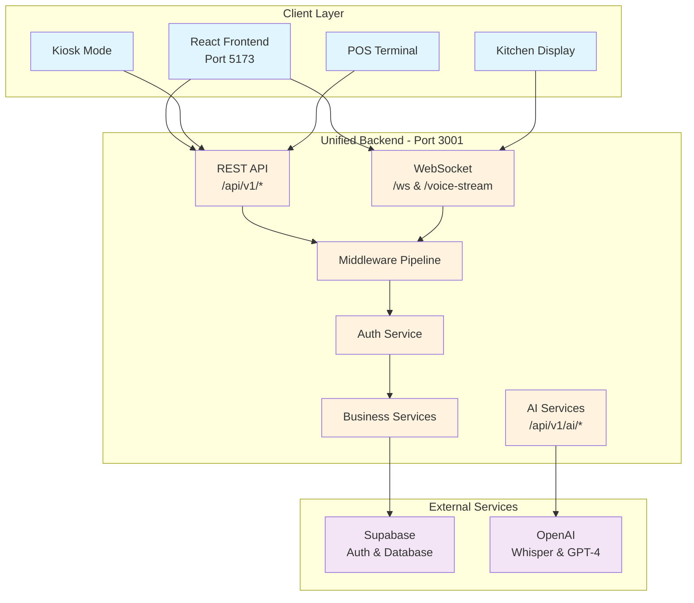
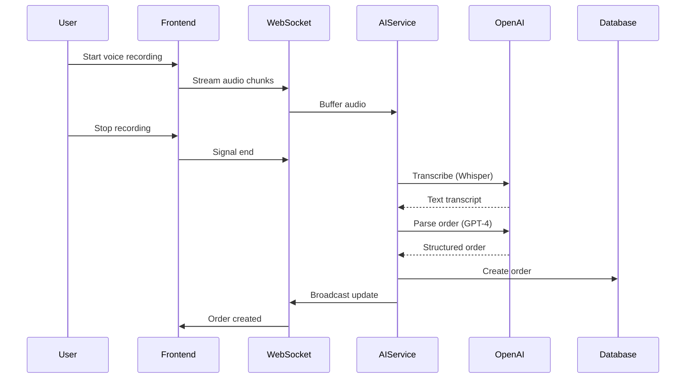
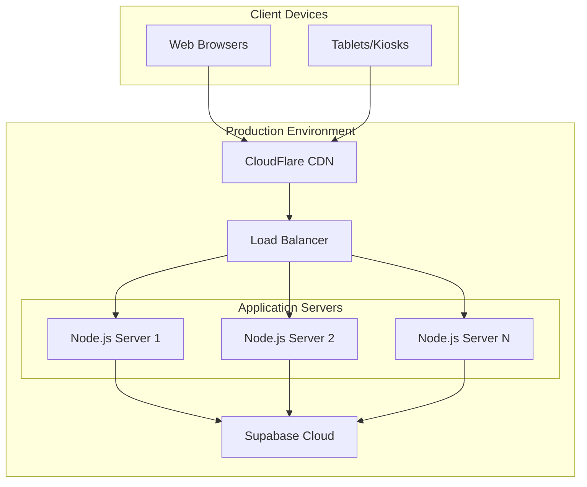
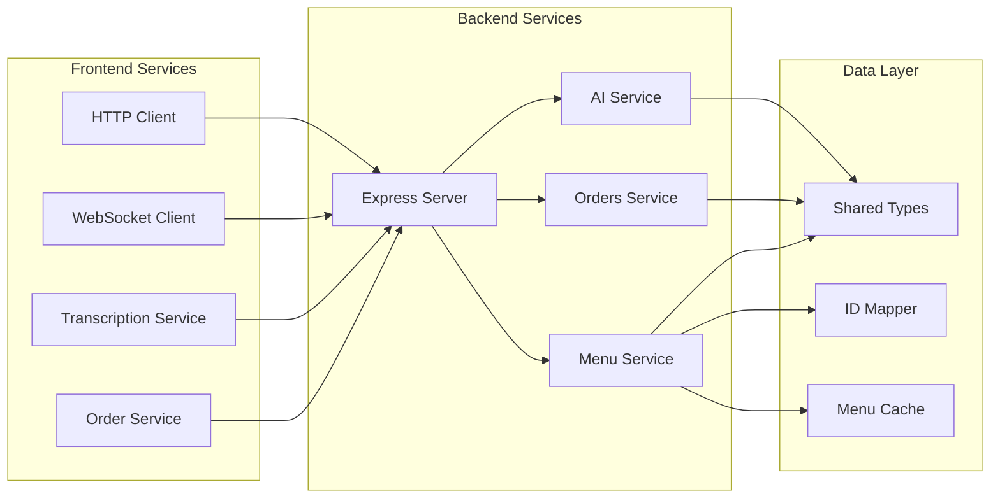

# Rebuild 6.0 - Complete System Architecture Overview

> **Lead Architect's Synthesis Document**  
> _Compiled from comprehensive analysis by specialized documentation agents_

## Executive Summary

Rebuild 6.0 is a modern Restaurant Operating System built with a **unified backend architecture**. The system provides AI-powered voice ordering, real-time kitchen management, and multi-tenant support through a single Express.js backend service (port 3001) and React frontend (port 5173).

### Key Architectural Decisions

1. **Unified Backend**: All services (API, AI, WebSocket) run on a single Express.js server
2. **No Microservices**: Simplified architecture reduces complexity
3. **Cloud-First**: Direct Supabase integration without local Docker
4. **Type Safety**: Shared types module ensures consistency
5. **Security-First**: OpenAI isolated to backend, JWT authentication throughout

## System Architecture



## Core Components

### 1. Frontend Architecture

The React frontend provides multiple user interfaces:

- **Customer Interfaces**: Kiosk ordering, drive-thru
- **Staff Interfaces**: Kitchen display, POS terminal, server view
- **Admin Interfaces**: Dashboard, analytics, configuration

**Key Technologies**:

- React 19.1.0 with TypeScript 5.8.3
- Vite for build tooling
- Tailwind CSS for styling
- Context API for state management
- WebSocket for real-time updates

### 2. Backend Services

The unified Express.js backend handles all server-side operations:

**API Endpoints**:

- `/api/v1/menu` - Menu management
- `/api/v1/orders` - Order processing
- `/api/v1/tables` - Table management
- `/api/v1/ai/*` - AI services (transcription, parsing)
- `/api/v1/health` - System monitoring

**WebSocket Paths**:

- `/ws` - Real-time order updates
- `/voice-stream` - Binary audio streaming

### 3. AI & Voice Processing

Voice ordering follows this flow:



### 4. Data Flow & Integration

The system uses a shared types module (`@rebuild/shared`) ensuring type safety across all layers:

```typescript
// Example: Order flow with consistent types
import { Order, OrderStatus } from '@rebuild/shared'

// Frontend
const submitOrder = async (order: Order) => {
  return await orderService.create(order)
}

// Backend
router.post('/orders', async (req: Request<{}, {}, Order>) => {
  const order = await ordersService.createOrder(req.body)
  return res.json(order)
})
```

### 5. Security Architecture

Multi-layered security approach:

1. **Authentication**: Supabase JWT tokens
2. **Authorization**: Role-based access control
3. **Multi-tenancy**: Restaurant context isolation
4. **API Security**: Rate limiting, input validation
5. **AI Security**: Server-side only, no client exposure

## Key User Flows

### Voice Order Flow

1. Customer initiates voice recording
2. Audio streams via WebSocket to backend
3. Backend transcribes using OpenAI Whisper
4. GPT-4 parses natural language to structured order
5. Order created in database
6. Real-time update sent to kitchen display
7. Customer sees confirmation

### Kitchen Operation Flow

1. Orders appear on kitchen display in real-time
2. Kitchen staff update order status
3. Status changes broadcast via WebSocket
4. Customer and server interfaces update automatically
5. Completion triggers notifications

## Deployment Architecture



## Development & Operations

### Quick Start

```bash
# Clone and install
git clone <repository>
cd rebuild-6.0
npm install

# Configure environment
cp .env.example .env
# Edit .env with your credentials

# Start development
npm run dev
```

### Key Commands

- `npm run dev` - Start frontend and backend
- `npm test` - Run all tests
- `npm run build` - Production build
- `npm run lint:fix` - Fix code style
- `npm run typecheck` - Verify types

### Monitoring & Observability

- **Frontend**: Web Vitals, performance metrics
- **Backend**: Prometheus metrics, structured logging
- **Health Checks**: `/api/v1/health` endpoints
- **Real-time Monitoring**: WebSocket connection stats

## Technical Specifications

### Performance Targets

- Page Load: < 2 seconds
- Voice Response: < 3 seconds
- Order Update: < 100ms
- API Response: < 200ms

### Scalability

- Horizontal scaling via load balancer
- WebSocket sticky sessions
- Database connection pooling
- CDN for static assets

### Browser Support

- Chrome/Edge 90+
- Safari 14+
- Firefox 88+
- Mobile browsers (iOS Safari, Chrome Android)

## System Integration Map



## Conclusion

Rebuild 6.0 demonstrates a modern approach to restaurant management systems with:

- **Simplified Architecture**: Unified backend reduces complexity
- **Real-time Capabilities**: WebSocket for instant updates
- **AI Integration**: Voice ordering with natural language processing
- **Type Safety**: Shared types ensure consistency
- **Security First**: Proper isolation of sensitive operations
- **Developer Experience**: Clear structure and documentation

The system is production-ready with comprehensive monitoring, security measures, and operational procedures in place.

---

_For detailed documentation on specific components, refer to:_

- [Frontend Architecture](./FRONTEND_ARCHITECTURE.md)
- [Backend Services](./BACKEND_SERVICES.md)
- [AI & Real-time Systems](./AI_REALTIME_SYSTEMS.md)
- [Data Flow & Integration](./DATA_FLOW_INTEGRATION.md)
- [Operations & Infrastructure](./OPERATIONS_INFRASTRUCTURE.md)
- [Voice Ordering](./VOICE_ORDERING.md)
- [Kitchen Display System](./KITCHEN_DISPLAY.md)
- [API Documentation](./API.md)
