> **⚠️ ARCHIVED DOCUMENTATION**
> **Date Archived:** October 15, 2025
> **Reason:** Historical incident report
> **See Instead:** [Post-Mortem (Active Stub)](../../POST_MORTEM_PAYMENT_CREDENTIALS_2025-10-14.md)
> **This archive preserved for:** Full incident details and lessons learned

# Post-Mortem: Square Payment Integration Credential Mismatch (ARCHIVED)

**Date**: October 14, 2025
**Severity**: High (Payment processing failure in production)
**Duration**: ~4 hours debugging
**Status**: Resolved
**Root Cause**: Single-character typo in `SQUARE_LOCATION_ID` environment variable

---

## Executive Summary

Payment processing failed in production due to a misconfigured `SQUARE_LOCATION_ID` environment variable. The location ID configured was `L3V8KTKZN0DHD` but the correct ID for our Square sandbox access token is `L1V8KTKZN0DHD` (note the `1` instead of `3`).

This error was masked by legitimate SDK API errors that were fixed sequentially, leading to several hours of symptom-driven debugging before the root cause was discovered.

**Impact**: All payment attempts failed from deployment until fix was applied (~4 hours).

**Financial Impact**: None (sandbox environment).

**User Impact**: Demo users unable to complete checkout flow.

---

## Timeline

### 2025-10-14 13:00 (Start)
- **Event**: Payment endpoint returns 500 Internal Server Error
- **Error**: `paymentsApi.createPayment is not a function`
- **Root Cause**: Legacy Square SDK v3 method names
- **Action**: Updated to Square SDK v43 API (changed `createPayment()` to `create()`)
- **Result**: Fixed ✅ - Uncovered next error

### 2025-10-14 14:00
- **Event**: Payment endpoint returns 401 UNAUTHORIZED
- **Error**: `This request could not be authorized`
- **Root Cause**: Wrong authentication property in SquareClient initialization
- **Action**: Changed from `accessToken` to `token` property
- **Result**: Fixed ✅ - Uncovered next error

### 2025-10-14 15:00
- **Event**: Payment endpoint returns 400 VALUE_TOO_LONG
- **Error**: `idempotency_key field must not be greater than 45 length`
- **Root Cause**: Generated 93-character idempotency keys
- **Action**: Shortened from `order-{uuid}-{timestamp}-{uuid}` (93 chars) to `{order_id_suffix}-{timestamp}` (26 chars)
- **Result**: Fixed ✅ - Uncovered root cause

### 2025-10-14 17:00 (Root Cause Identified)
- **Event**: Payment endpoint returns 400 BAD_REQUEST
- **Error**: `Not authorized to take payments with location_id=L3V8KTKZN0DHD`
- **Root Cause**: **CREDENTIAL MISMATCH** - typo in location ID (`L3` instead of `L1`)
- **Action**: Updated `SQUARE_LOCATION_ID=L1V8KTKZN0DHD` in Render environment
- **Result**: Resolved ✅

---

## Root Cause Analysis

### What Happened

A single-character typo in the `SQUARE_LOCATION_ID` environment variable caused Square API to reject all payment requests.

```bash
# Configured (WRONG):
SQUARE_LOCATION_ID=L3V8KTKZN0DHD  ← The "3" is incorrect

# Correct value:
SQUARE_LOCATION_ID=L1V8KTKZN0DHD  ← Should be "1"
```

### Why It Happened

1. **Manual Environment Configuration**: Location ID was manually typed into Render dashboard
2. **No Validation**: No startup validation to verify credentials belong together
3. **No Pre-Deployment Testing**: Credentials weren't tested before deploying to production
4. **Symptom-Driven Debugging**: Fixed legitimate API errors sequentially instead of validating credentials first

### Why It Took So Long

The credential mismatch was masked by three **legitimate** errors:

1. ✅ SDK v3 → v43 API method name changes (createPayment → create)
2. ✅ SDK v43 authentication format change (accessToken → token)
3. ✅ Square 45-character idempotency key limit

Each error was **real** and **needed fixing**, but fixing them revealed the underlying credential issue that should have been caught during initial setup.

---

## What Went Wrong

### Process Failures

1. **No Credential Validation**
   - Environment variables trusted without verification
   - No startup validation to check credentials match
   - No pre-deployment testing script

2. **Manual Configuration**
   - Location ID copied manually (prone to typos)
   - No automated credential extraction from Square dashboard

3. **Incomplete Documentation**
   - Square integration docs didn't include validation steps
   - No checklist for verifying credential relationships

4. **Reactive Debugging**
   - Fixed symptoms sequentially instead of hypothesis-driven investigation
   - Didn't validate assumptions about environment configuration early

---

## What Went Right

1. **Structured Error Handling**
   - Clear error messages from Square API
   - Comprehensive logging at each step
   - Error details preserved for debugging

2. **Git History**
   - Each fix committed separately
   - Clear commit messages documented progression
   - Easy to track what was tried

3. **Code Quality**
   - TypeScript caught type errors early
   - Linting enforced code standards
   - No syntax errors despite multiple changes

---

## Resolution

### Immediate Fix (5 minutes)

Update Render environment variable:

```bash
SQUARE_LOCATION_ID=L1V8KTKZN0DHD  # Changed from L3V8KTKZN0DHD
```

Redeploy backend → Payments working immediately ✅

### Long-Term Fixes Implemented

#### 1. Credential Validation Script

Created `/scripts/validate-square-credentials.sh`:
- Validates access token by fetching locations
- Verifies configured location ID exists for that token
- Tests payment API permissions
- Can be run via `npm run validate:square`

#### 2. Startup Validation

Added to `/server/src/routes/payments.routes.ts`:
- Runs automatically when server starts
- Fetches available locations for access token
- Compares with configured `SQUARE_LOCATION_ID`
- Logs clear error if mismatch detected
- Server continues running (allows other services to work) but logs prominent warning

#### 3. Documentation

This post-mortem documents:
- What happened and why
- How to prevent recurrence
- Validation procedures for Square credentials

---

## Action Items

### Completed ✅

- [x] Update `SQUARE_LOCATION_ID` in Render environment
- [x] Create credential validation script (`scripts/validate-square-credentials.sh`)
- [x] Add startup validation to `payments.routes.ts`
- [x] Add `npm run validate:square` command
- [x] Document incident in post-mortem

### To Do

- [ ] Add pre-deployment credential validation to CI/CD pipeline
- [ ] Update Square integration documentation with validation steps
- [ ] Create deployment checklist including credential validation
- [ ] Consider automated credential extraction from Square API
- [ ] Add credential validation to other external services (Supabase, Vercel, etc.)

---

## Lessons Learned

### For Future Deployments

**DO**:
1. ✅ Validate external service credentials **before** deployment
2. ✅ Run validation scripts as part of pre-deployment checklist
3. ✅ Test end-to-end flows in staging with production-like credentials
4. ✅ Add startup validation for critical external dependencies
5. ✅ Document credential relationships (which IDs belong together)

**DON'T**:
1. ❌ Trust manually-entered environment variables without validation
2. ❌ Deploy without testing external service integrations
3. ❌ Fix symptoms without validating root assumptions
4. ❌ Skip pre-deployment checklists to save time

### General Principles

1. **Validate Early**: Check credentials match before fixing API syntax
2. **Automate**: Manual entry = typos. Extract credentials programmatically when possible.
3. **Test First**: Validate integration before deploying
4. **Hypothesis-Driven**: Test assumptions (e.g., "credentials are correct") before symptom-driven debugging

---

## Prevention Measures

### 1. Pre-Deployment Checklist

```bash
# Before deploying to production/staging:
✓ Run npm run validate:square
✓ Check Render logs for "✅ Square credentials validated"
✓ Test payment flow in sandbox
✓ Verify SQUARE_ENVIRONMENT matches token type
✓ Confirm SQUARE_LOCATION_ID matches access token
```

### 2. CI/CD Pipeline Integration

```yaml
# Add to .github/workflows/deploy.yml
- name: Validate Square Credentials
  run: |
    npm run validate:square
  env:
    SQUARE_ACCESS_TOKEN: ${{ secrets.SQUARE_ACCESS_TOKEN }}
    SQUARE_LOCATION_ID: ${{ secrets.SQUARE_LOCATION_ID }}
    SQUARE_ENVIRONMENT: ${{ secrets.SQUARE_ENVIRONMENT }}
```

### 3. Startup Validation (Already Implemented)

Server logs on startup:
```
✅ Square credentials validated successfully
   Location ID: L1V8KTKZN0DHD
   Location Name: Default Test Account
   Environment: sandbox
```

Or:
```
❌ SQUARE CREDENTIAL MISMATCH DETECTED
   Configured: L3V8KTKZN0DHD
   Available: L1V8KTKZN0DHD
   PAYMENT PROCESSING WILL FAIL
```

### 4. Documentation Updates

Update `/docs/SQUARE_INTEGRATION.md`:
- Add credential validation section
- Document relationship between token and location ID
- Include validation script usage
- Provide troubleshooting guide

---

## Technical Details

### Error Progression

```mermaid
graph TD
    A[Deploy with L3V8KTKZN0DHD] --> B[500: createPayment not a function]
    B --> C[Fix: Update to SDK v43 API]
    C --> D[401: UNAUTHORIZED]
    D --> E[Fix: Change accessToken → token]
    E --> F[400: VALUE_TOO_LONG idempotency_key]
    F --> G[Fix: Shorten key to 26 chars]
    G --> H[400: Not authorized for location_id]
    H --> I[Root Cause: L3 → L1 typo]
    I --> J[Fix: Update SQUARE_LOCATION_ID]
    J --> K[✅ Payments Working]
```



### Validation Script Usage

```bash
# Validate credentials before deployment
export SQUARE_ACCESS_TOKEN="EAAAl0B9Dc8dvpuk5G3gpAHxHiShdBDHB3EvjPwh8nr-7VUB5IwVLC-2DJ899X_0"
export SQUARE_LOCATION_ID="L1V8KTKZN0DHD"  # Correct
export SQUARE_ENVIRONMENT="sandbox"

npm run validate:square
```

Expected output:
```
🔍 Square Credentials Validation
━━━━━━━━━━━━━━━━━━━━━━━━━━━━━━━
Environment: sandbox

📍 Test 1: Fetching locations for access token...
✅ Access token is valid
   Found 1 location(s)

📍 Test 2: Validating SQUARE_LOCATION_ID...
✅ Location ID matches: L1V8KTKZN0DHD
   Location Name: Default Test Account
   Merchant ID: MLA23NBJXS2KB

💳 Test 3: Testing payment creation permissions...
✅ Payment API accessible

✅ All Square credentials validated successfully!
```

---

## Cost Analysis

### Time Investment

- **Debugging**: ~4 hours
- **Fixes Applied**: 3 legitimate SDK issues + 1 config issue
- **Prevention Measures**: ~2 hours (validation script + startup checks + docs)
- **Total**: ~6 hours

### Business Impact

- **Revenue Loss**: $0 (sandbox environment)
- **User Impact**: Demo users unable to checkout
- **Reputation Impact**: Minimal (pre-release testing)

### ROI of Prevention

- **Validation Script Runtime**: 10 seconds
- **Saved Future Debugging Time**: 4+ hours per incident
- **Prevented Production Downtime**: Hours to days
- **Financial Risk Mitigation**: Prevents payment routing errors in production

**Conclusion**: 2 hours invested in prevention saves 4+ hours of debugging and prevents catastrophic production payment failures.

---

## References

### Related Files

- `/server/src/routes/payments.routes.ts` - Payment endpoint with startup validation
- `/server/src/services/payment.service.ts` - Idempotency key generation
- `/scripts/validate-square-credentials.sh` - Credential validation script
- `/package.json` - Added `validate:square` npm script

### Related Commits

- `482253f` - Fix Square SDK v43 authentication format
- `81b8b56` - Shorten idempotency keys to meet Square 45-char limit
- `[pending]` - Add Square credential validation safeguards

### External Documentation

- [Square Payments API Reference](https://developer.squareup.com/reference/square/payments-api)
- [Square SDK v43 Migration Guide](https://github.com/square/square-nodejs-sdk/releases)
- [Square Location ID Documentation](https://developer.squareup.com/docs/locations-api/what-it-does)

---

## Sign-Off

**Incident Owner**: Development Team
**Reviewer**: [Team Lead Name]
**Date Reviewed**: [Date]
**Approved**: [Yes/No]

**Status**: ✅ Resolved with preventive measures implemented

---

## Appendix: Square Credential Relationships

### How Square Credentials Work Together

```
Square Account
  └─ Application (sandbox-sq0idb-xddZeNDVhaqu2ob89RMd1w)
      ├─ Access Token (EAAAl0B9Dc8dvpuk5G3gpAHxHiShdBDHB3EvjPwh8nr...)
      │   └─ Authorizes access to specific locations
      └─ Locations
          └─ Location 1 (L1V8KTKZN0DHD) ✅ "Default Test Account"
              ├─ Merchant ID: MLA23NBJXS2KB
              └─ Status: ACTIVE
```

**Key Insight**: Each access token grants access to **specific locations**. The `SQUARE_LOCATION_ID` must be one of the locations that the access token authorizes.

**Our Error**: We configured `L3V8KTKZN0DHD` (which doesn't exist) instead of `L1V8KTKZN0DHD` (which does exist for our token).

---

**End of Post-Mortem**
