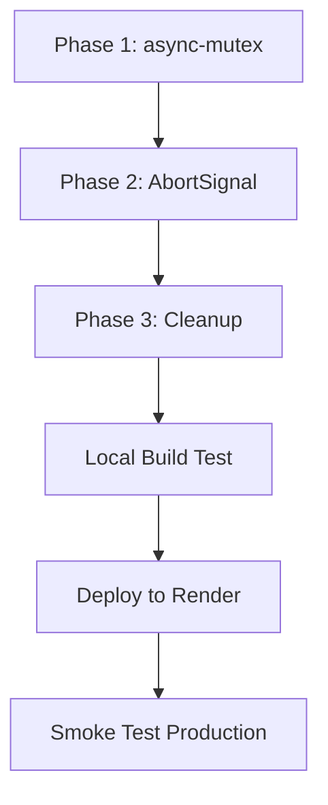

# Fix: Render Deployment TypeScript Build Errors

**Type:** Bug Fix
**Priority:** Critical (Production Blocked)
**Date:** 2025-11-25
**Affected Version:** 6.0.14

---

## Overview

The Render production deployment is failing due to two TypeScript compilation errors during the server build phase. Both errors stem from **workspace dependency isolation issues** in our monorepo structure.

### Error Summary

| Error | File | Line | Root Cause |
|-------|------|------|------------|
| TS2307 | `realtime-menu-tools.ts` | 5 | `async-mutex` missing from server dependencies |
| TS2322 | `realtime.routes.ts` | 434 | `AbortSignal` type mismatch (node-fetch v2 vs v3) |

---

## Problem Statement

### Error 1: Cannot find module 'async-mutex'

```
src/ai/functions/realtime-menu-tools.ts(5,23): error TS2307: Cannot find module 'async-mutex' or its corresponding type declarations.
```

**Root Cause:**
- `async-mutex@^0.5.0` was added to **root** `package.json` (line 176) during commit `a2dc2805` (Nov 25, 2025)
- The package is **NOT** listed in `server/package.json`
- Works locally due to npm workspace hoisting
- Fails on Render because server workspace builds in isolation

**Code Location:** `server/src/ai/functions/realtime-menu-tools.ts:5`
```typescript
import { Mutex } from 'async-mutex';
```

### Error 2: AbortSignal Type Incompatibility

```
src/routes/realtime.routes.ts(434,9): error TS2322: Type 'AbortSignal' is not assignable to type 'import(".../node_modules/@types/node-fetch/externals").AbortSignal'.
```

**Root Cause:**
- Code uses Node.js native `AbortController` (global, line 405)
- Code imports `fetch` from `node-fetch` (line 4)
- `node-fetch@2.7.0` (via `openai` package) expects its own `AbortSignal` type
- Node.js 18+ global `AbortSignal` is incompatible with `@types/node-fetch@2.6.13`

**Code Location:** `server/src/routes/realtime.routes.ts:434`
```typescript
signal: controller.signal,  // Native AbortController.signal passed to node-fetch
```

---

## Technical Analysis

### Dependency Landscape

```
Root package.json:
├── async-mutex: ^0.5.0      ← Used by server, but not in server deps
├── node-fetch: ^3.3.2       ← NOT used (stale dependency)
└── ...

Server package.json:
├── openai: ^4.104.0
│   └── node-fetch: 2.7.0    ← Internal dependency
│   └── @types/node-fetch: 2.6.13
├── @types/node: 20.11.5     ← Native AbortSignal types
└── async-mutex: MISSING ❌

Conflict:
  Node.js global AbortSignal ≠ @types/node-fetch AbortSignal
```

### Build Flow on Render

```
1. npm ci --workspaces
2. npm run -w shared build     ← ✅ Succeeds
3. npm run -w server build     ← ❌ Fails
   └── tsc -p tsconfig.build.json
       ├── Error: async-mutex not found
       └── Error: AbortSignal type mismatch
```

### Why It Works Locally

- npm workspace hoisting makes root `node_modules/async-mutex` available
- Local TypeScript can resolve types from hoisted packages
- Render's isolated workspace builds don't have this luxury

---

## Proposed Solution

### Phase 1: Fix async-mutex Dependency (Critical)

**Tasks:**
- [ ] Add `async-mutex` to `server/package.json` dependencies
- [ ] Remove `async-mutex` from root `package.json` (cleanup)
- [ ] Verify import resolves in isolated server build

**Files to Modify:**
- `server/package.json` - Add dependency
- `package.json` (root) - Remove dependency (optional cleanup)

**Implementation:**
```bash
# Add to server workspace
cd server
npm install async-mutex@^0.5.0

# Optional: Remove from root
cd ..
npm uninstall async-mutex
```

### Phase 2: Fix AbortSignal Type Mismatch (Critical)

**Option A: Use node-fetch's AbortController (Recommended)**

Cast or import the correct types to satisfy TypeScript.

**Files to Modify:**
- `server/src/routes/realtime.routes.ts`

**Implementation:**
```typescript
// Option A1: Type assertion (minimal change)
signal: controller.signal as any,

// Option A2: Use @ts-expect-error with explanation
// @ts-expect-error - Node.js AbortSignal is compatible at runtime with node-fetch
signal: controller.signal,
```

**Option B: Use Native fetch (Node.js 18+)**

Remove `node-fetch` import and use native `fetch` (Node.js 18+ built-in).

**Files to Modify:**
- `server/src/routes/realtime.routes.ts`

**Implementation:**
```typescript
// Remove this import
// import fetch, { AbortError } from 'node-fetch';

// Use native fetch (available in Node.js 18+)
// Native fetch works seamlessly with native AbortController
```

**Trade-offs:**
| Approach | Pros | Cons |
|----------|------|------|
| Type assertion | Minimal change, quick fix | Suppresses type checking |
| Native fetch | Cleaner, no type conflicts | Requires verifying Node.js 18+ on Render |

**Recommendation:** Option B (native fetch) since Render uses Node.js 20.19.6

### Phase 3: Cleanup & Verification

**Tasks:**
- [ ] Remove unused `node-fetch@^3.3.2` from root `package.json`
- [ ] Verify local build passes: `npm run build:render`
- [ ] Verify isolated server build: `cd server && npm ci && npm run build`
- [ ] Test deployment to Render staging (if available)

---

## Acceptance Criteria

### Functional Requirements
- [ ] `npm run build:render` succeeds without TypeScript errors
- [ ] Server starts successfully in production mode
- [ ] Voice ordering (realtime) functionality works end-to-end
- [ ] Cart operations use mutex locking correctly

### Non-Functional Requirements
- [ ] No runtime dependency on root `node_modules`
- [ ] TypeScript strict mode remains enabled
- [ ] No new npm audit vulnerabilities introduced

### Quality Gates
- [ ] All existing tests pass (`npm test`)
- [ ] Typecheck passes (`npm run typecheck`)
- [ ] Production build completes in < 60s

---

## Risk Analysis

| Risk | Likelihood | Impact | Mitigation |
|------|------------|--------|------------|
| async-mutex version mismatch | Low | Medium | Pin exact version from root |
| Native fetch behavior differs | Low | High | Test AbortError handling |
| Other hidden dependency issues | Medium | Medium | Run full isolated build test |
| Render caching old dependencies | Low | Medium | Clear build cache on Render |

---

## Implementation Order



**Estimated Changes:**
- 2 files modified (`server/package.json`, `server/src/routes/realtime.routes.ts`)
- 1 file optionally cleaned (`package.json` root)
- ~10 lines of code changed

---

## References

### Internal Documentation
- Lesson Learned: `/.claude/lessons/CL-BUILD-001-vercel-production-flag.md` - Similar devDependencies issue
- ADR: `/docs/explanation/architecture-decisions/ADR-016-module-system-commonjs.md` - Module system decisions
- Deployment Guide: `/docs/reference/config/VERCEL_RENDER_DEPLOYMENT.md`
- Archive: `/docs/archive/2025-11/deployment/RENDER_DEPLOYMENT_FIXED.md` - Previous Render fixes

### Affected Files
- `server/src/ai/functions/realtime-menu-tools.ts:5` - async-mutex import
- `server/src/routes/realtime.routes.ts:4,405,434` - node-fetch and AbortSignal usage
- `server/package.json` - Dependencies
- `package.json` (root) - Misplaced dependencies

### Git History
- Commit `a2dc2805` (2025-11-25): Added async-mutex to root (cause of Error 1)
- Commit `0de76848` (2025-11-25): Latest main branch commit

### External Resources
- [node-fetch v2 to v3 migration](https://github.com/node-fetch/node-fetch/blob/main/docs/v3-UPGRADE-GUIDE.md)
- [Node.js 18 native fetch](https://nodejs.org/docs/latest-v18.x/api/globals.html#fetch)
- [async-mutex npm](https://www.npmjs.com/package/async-mutex)

---

## Future Considerations

1. **Dependency Audit Script:** Create a pre-commit hook that verifies all server imports are in `server/package.json`
2. **Isolated Build CI Step:** Add GitHub Action that tests isolated workspace builds
3. **Remove node-fetch Entirely:** Since Node.js 18+ has native fetch, consider removing node-fetch dependency from openai package usage

---

*Plan created: 2025-11-25*
