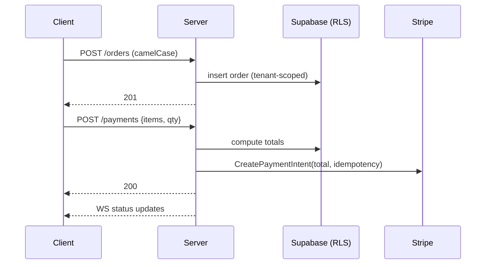

# Architecture Overview


**Last Updated:** 2025-11-06

[Home](../../../index.md) > [Docs](../../README.md) > [Explanation](../README.md) > [Architecture](../../../README.md) > Architecture Overview

**Last Updated:** October 30, 2025
**Version:** 6.0.14

**For detailed authentication and security architecture, see:**
- [AUTHENTICATION_ARCHITECTURE.md](./AUTHENTICATION_ARCHITECTURE.md) - Complete auth flows, session management, RLS
- [SECURITY.md](../../../SECURITY.md) - Security measures, compliance, agent safety

## Architecture Diagrams

- [C4 Context Diagram](./diagrams/c4-context.md) - System in context
- [C4 Container Diagram](./diagrams/c4-container.md) - Technical architecture
- [Authentication Flows](./diagrams/auth-flow.md) - Dual auth pattern
- [Voice Ordering Architecture](./diagrams/voice-ordering.md) - Service decomposition
- [Payment Flow](./diagrams/payment-flow.md) - Server-side validation

---

## System
```mermaid
graph LR
  subgraph Client[client (React+Vite)]
    UI[POS/KDS/Checkout]
    Voice[Voice Controls]
  end
  subgraph Server[server (Express+TS)]
    API[/REST/]
    WS[/WebSocket/]
    RT[/Realtime/]
    Pay[/Stripe Adapter/]
  end
  subgraph Supabase[DB+Auth+RLS]
    RLS[(Policies)]
    JWT[(Auth)]
  end
  UI --> API
  UI --> WS
  Voice --> RT
  API --> Supabase
  API --> Pay
  Pay --> Stripe[(Stripe)]
Order→Pay→KDS
```



---

## Request Processing Pipeline

The server uses a middleware pipeline to process incoming requests. Middleware components execute in sequence, each performing a specific transformation or validation.

### Middleware Stack

```
Incoming Request
      ↓
1. Body Parser (express.json)
      ↓
2. Sanitization (sanitizeRequest)
      ↓
3. Slug Resolver (slugResolver)  ← NEW (v6.0.9)
      ↓
4. Authentication (auth/optionalAuth)
      ↓
5. Route Handlers
      ↓
Response
```

### Slug Resolution Middleware

**Purpose**: Transparently convert human-friendly restaurant slugs to UUIDs without breaking existing business logic.

**Location**: `server/src/middleware/slugResolver.ts`

**Behavior**:
1. Inspects `x-restaurant-id` header
2. Detects UUID vs slug format using regex
3. If slug detected:
   - Check in-memory cache (5-minute TTL)
   - Query database if cache miss
   - Replace header value with resolved UUID
4. If UUID detected: pass through unchanged

**Example**:
```typescript
// Client sends
Headers: { 'x-restaurant-id': 'grow' }

// Middleware resolves
Headers: { 'x-restaurant-id': '11111111-1111-1111-1111-111111111111' }

// Route handlers see UUID (no changes needed)
```

**Performance**:
- Cache hit: ~1ms overhead
- Cache miss: ~50ms (database query)
- Cache TTL: 5 minutes
- Automatic cache invalidation on slug changes

See [ADR-008: Slug-Based Restaurant Routing](../architecture-decisions/ADR-008-slug-based-routing.md) for detailed rationale and implementation.

---

## Voice Ordering Architecture

The voice ordering system follows a **Service-Oriented Architecture** with clear separation of concerns. Previously implemented as a 1,312-line "God Class", the system was refactored into four focused services that communicate via event-driven patterns.

### Architecture Overview

```
Voice Ordering Service Architecture
├── WebRTCVoiceClient (396 lines - Orchestrator)
│   └── Coordinates 3 specialized services
├── VoiceSessionConfig (374 lines)
│   └── Token management, AI instructions, session configuration
├── WebRTCConnection (536 lines)
│   └── WebRTC lifecycle, media streams, connection management
└── VoiceEventHandler (744 lines)
    └── Event routing, transcript accumulation, order detection
```

### Service Responsibilities

#### 1. WebRTCVoiceClient (Orchestrator)
**Role**: High-level orchestration and public API
- Provides simplified interface for voice session management
- Coordinates lifecycle across all services
- Delegates specialized work to focused services
- Maintains backward compatibility with existing consumers
- **Lines**: 396 (down from 1,312)

**Key Methods**:
- `connect()` - Initialize voice session
- `disconnect()` - Clean teardown
- `sendMessage()` - Text communication
- Event subscription management

#### 2. VoiceSessionConfig
**Role**: Configuration and authentication management
- Ephemeral token acquisition and refresh
- AI instruction generation (menu context, tenant settings)
- Session initialization parameters
- Environment-specific configuration
- **Lines**: 374

**Responsibilities**:
- Fetch session tokens from `/api/ai/realtime/session`
- Build context-aware AI instructions
- Manage OpenAI Realtime API configuration
- Handle voice detection parameters

#### 3. WebRTCConnection
**Role**: WebRTC protocol implementation
- Peer connection lifecycle management
- Media stream handling (audio input/output)
- Connection state monitoring
- Network resilience (reconnection, error recovery)
- **Lines**: 536

**Key Features**:
- Automatic audio track management
- Connection state event emission
- ICE candidate handling
- Cleanup and resource disposal

#### 4. VoiceEventHandler
**Role**: Event routing and business logic
- Real-time event processing from OpenAI Realtime API
- Transcript accumulation and formatting
- Order detection and validation
- Event normalization and dispatch
- **Lines**: 744

**Event Types Handled**:
- `conversation.item.created` - New transcript items
- `response.done` - AI response completion
- `input_audio_buffer.speech_started` - User speaking
- `input_audio_buffer.speech_stopped` - User finished
- Error and connection events

### Communication Pattern

Services communicate via **event emitters** and **dependency injection**:

```typescript
// Orchestrator pattern
class WebRTCVoiceClient extends EventEmitter {
  private config: VoiceSessionConfig;
  private connection: WebRTCConnection;
  private eventHandler: VoiceEventHandler;

  constructor(deps: VoiceClientDependencies) {
    // Services injected, not instantiated
    this.config = deps.config;
    this.connection = deps.connection;
    this.eventHandler = deps.eventHandler;

    // Wire up event forwarding
    this.connection.on('stateChange', (state) => this.emit('stateChange', state));
    this.eventHandler.on('orderDetected', (order) => this.emit('orderDetected', order));
  }
}
```

### Benefits of Service Decomposition

1. **Single Responsibility Principle**
   - Each service has one clear purpose
   - Easier to understand and modify
   - Reduced cognitive load

2. **Testability**
   - 118 unit tests ensure service isolation
   - Mock dependencies easily
   - Test services in isolation

3. **Maintainability**
   - Smaller, focused modules
   - Clear boundaries between concerns
   - Easier debugging and troubleshooting

4. **Reusability**
   - Services can be used independently
   - Compose services in different ways
   - Extract common patterns

5. **Backward Compatibility**
   - Orchestrator maintains same public API
   - Existing consumers unaffected
   - Incremental migration path

### Testing Strategy

The voice ordering system employs comprehensive unit testing:

- **118 total unit tests** across all services
- **Service isolation**: Each service tested independently with mocked dependencies
- **Event validation**: Verify event emission and handling
- **State management**: Test connection states and transitions
- **Error scenarios**: Validate error handling and recovery
- **Integration**: Orchestrator tests verify service coordination

### Integration Points

The voice ordering system integrates with:

1. **OpenAI Realtime API**
   - WebRTC data channel for real-time communication
   - Ephemeral token authentication
   - Event-driven transcript streaming

2. **Backend AI Service** (`/api/ai/realtime/session`)
   - Session token provisioning
   - Menu context injection
   - Tenant-specific configuration

3. **Order Management System**
   - `orderDetected` events trigger order creation
   - Natural language parsing to structured order data
   - Validation against menu availability

4. **UI Components**
   - React hooks consume voice client events
   - Real-time transcript display
   - Connection state indicators

### Future Enhancements

Potential architectural improvements:

- **State Machine**: Formalize connection states with XState
- **Message Queue**: Buffer events during network interruptions
- **Analytics**: Track voice session metrics and success rates
- **Multi-language**: Extend AI instructions for internationalization
- **Voice Biometrics**: User identification via voice patterns

---

## Related Documentation

- [Authentication Architecture](./AUTHENTICATION_ARCHITECTURE.md) - Auth flows and security
- [ADR-005: Client-Side Voice Ordering](../architecture-decisions/ADR-005-client-side-voice-ordering.md) - Voice ordering decision
- [ADR-008: Slug-Based Restaurant Routing](../architecture-decisions/ADR-008-slug-based-routing.md) - Slug resolution middleware
- [Voice Ordering Explained](../../voice/VOICE_ORDERING_EXPLAINED.md) - Voice implementation details
- [Deployment Guide](../../how-to/operations/DEPLOYMENT.md) - Production deployment
- [Database Schema](../../reference/schema/DATABASE.md) - Data model and RLS
