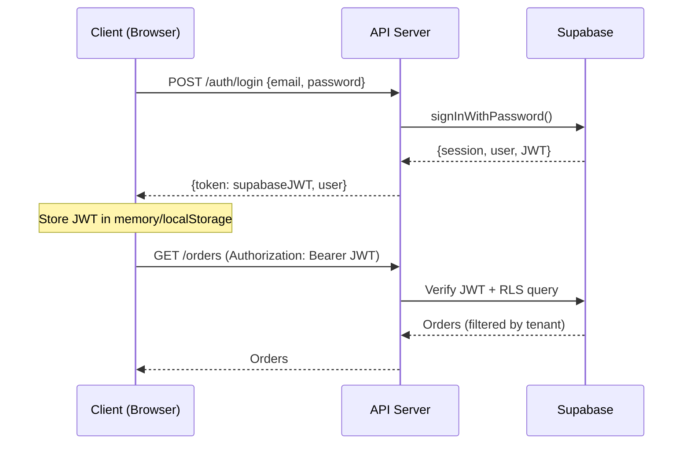
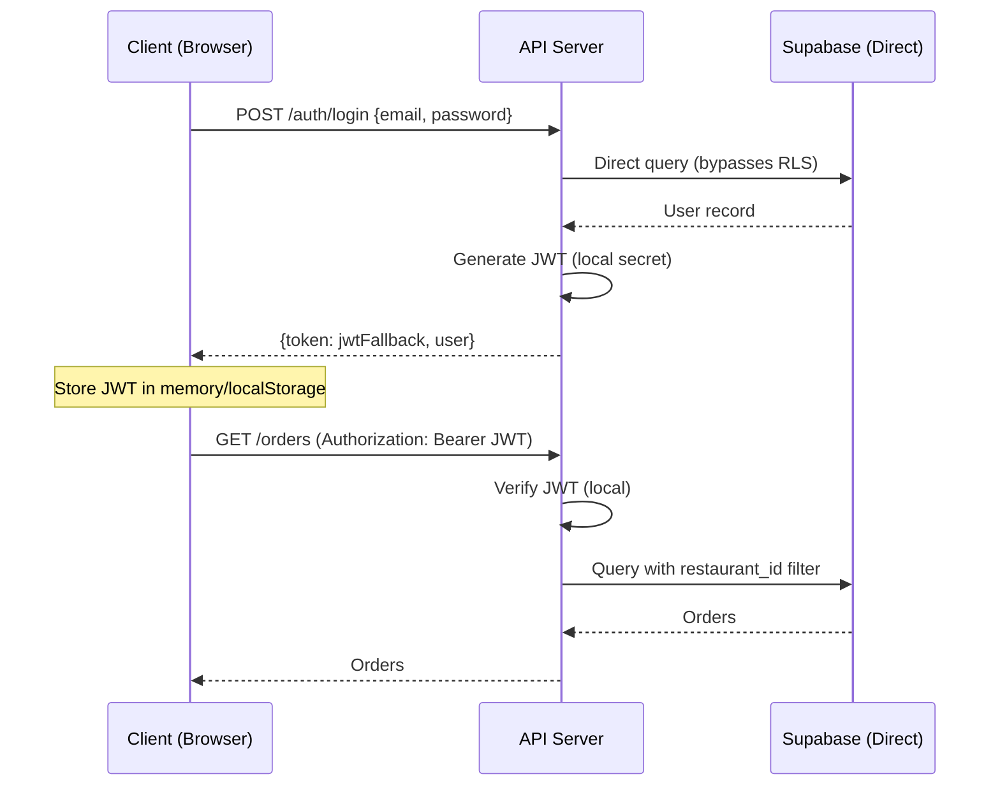

# Authentication Flow Diagrams

## Production Authentication (Supabase JWT)

## Development Authentication (JWT Fallback)

**Key Differences:**
- Production: Supabase handles auth, RLS enforced at database level
- Development: API server handles auth, filtering done in application code
- See [ADR-006](../../ADR-006-dual-authentication-pattern.md) for migration strategy
