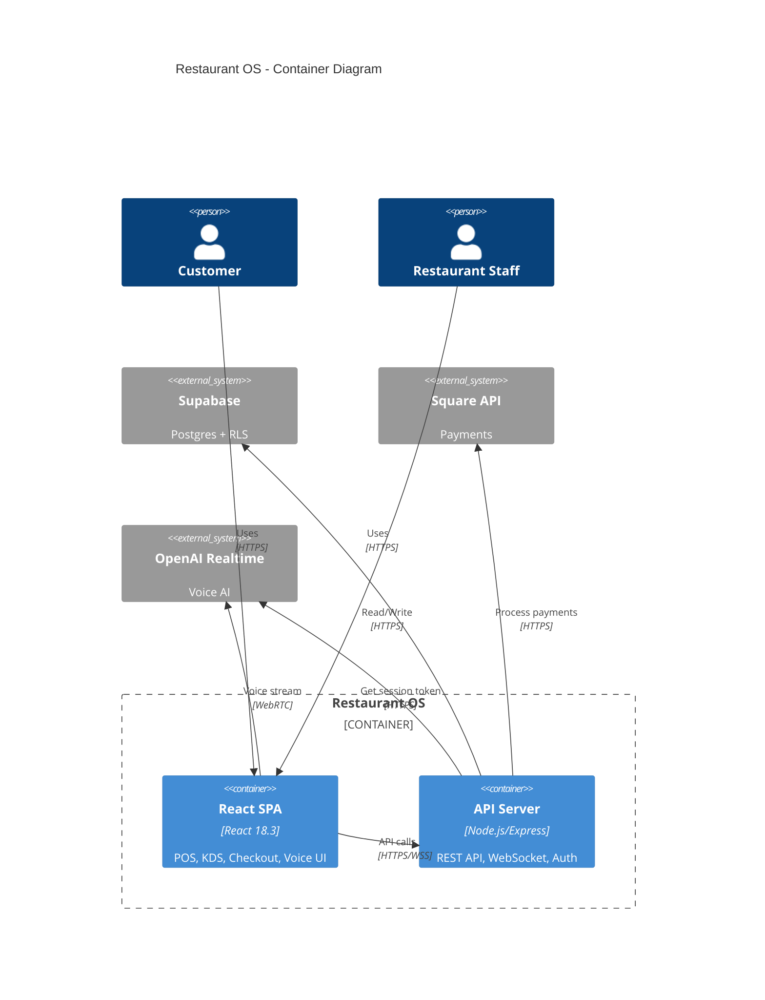

# C4 Container Diagram - Restaurant OS

**Level**: Container (Level 2)
**Purpose**: Shows high-level technical architecture

**Architecture Notes:**
- **React SPA**: Client-side application with multiple modules (POS, KDS, Checkout, Voice)
- **API Server**: Node.js backend with Express, handles business logic and integrations
- **Supabase**: Postgres database with Row-Level Security (RLS) for multi-tenancy
- **Direct WebRTC**: Client connects directly to OpenAI for low-latency voice
