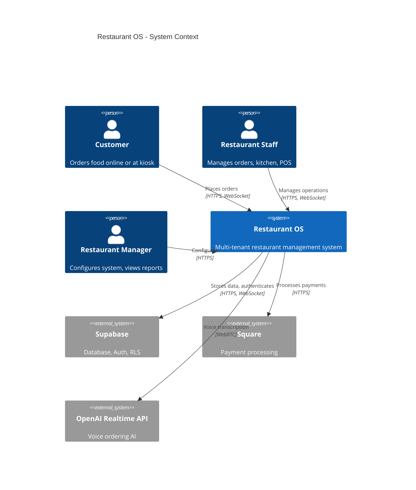

# C4 Context Diagram - Restaurant OS

**Last Updated:** 2025-10-31

**Level**: Context (Level 1)
**Purpose**: Shows Restaurant OS in context of users and external systems

**Key Relationships:**
- Customers interact via web/kiosk for ordering
- Staff uses POS and KDS interfaces
- Managers configure menus and settings
- System integrates with Supabase (data), Square (payments), OpenAI (voice)
