# CI/CD Deployment Pipeline

**Last Updated:** 2025-11-08
**Related:** [CI/CD Workflows](../../how-to/development/CI_CD_WORKFLOWS.md) | [Migration Workflow](./migration-workflow.md) | [Deployment Guide](../../how-to/operations/DEPLOYMENT.md)

## Complete Deployment Pipeline Architecture

This diagram shows the complete CI/CD pipeline orchestration from code push through production deployment, including parallel workflow execution, migration deployment, and failure handling.

**Key Components:**
- **Parallel Workflows**: Quality Gates, Auth Guards, Migration Deploy run concurrently
- **Sequential Deployment**: Database migrations deploy before code (dependency chain)
- **Failure Isolation**: Each workflow can fail independently without blocking others
- **Auto-Recovery**: Failed migrations create GitHub issues and block code deployment

```mermaid
flowchart TD
    Start([Developer Pushes to Main]) --> GitHubDetect{GitHub Actions<br/>Trigger Detection}

    GitHubDetect --> ParallelStart{Launch Parallel<br/>Workflows}

    ParallelStart -.->|Concurrent| QualityGates[Quality Gates Workflow]
    ParallelStart -.->|Concurrent| AuthGuards[Auth Guards Workflow]
    ParallelStart -.->|Concurrent| MigrationCheck{Detect Migration<br/>Changes}

    QualityGates --> TypeCheck[TypeScript Check<br/>npm run typecheck]
    QualityGates --> Lint[ESLint Check<br/>npm run lint]
    QualityGates --> TestQuick[Quick Tests<br/>npm run test:quick]

    TypeCheck --> QualityResult{All Checks Pass?}
    Lint --> QualityResult
    TestQuick --> QualityResult

    QualityResult -->|Fail| QualityFail[Block Deployment<br/>Create Annotations]
    QualityResult -->|Pass| QualitySuccess[Quality: ✅ PASS]

    AuthGuards --> AuthTest[Auth Integration Tests<br/>12 tests]
    AuthGuards --> RoleTest[Role Scope Tests]
    AuthGuards --> StrictAuthTest[STRICT_AUTH Tests]

    AuthTest --> AuthResult{All Tests Pass?}
    RoleTest --> AuthResult
    StrictAuthTest --> AuthResult

    AuthResult -->|Fail| AuthFail[Block Deployment<br/>Security Issue]
    AuthResult -->|Pass| AuthSuccess[Auth: ✅ PASS]

    MigrationCheck -->|No .sql changes| NoMigration[Skip Migration Deploy]
    MigrationCheck -->|.sql files changed| DetectMigrations[git diff HEAD~1 HEAD<br/>--name-only migrations/*.sql]

    DetectMigrations --> ForEachMigration[For Each Migration File]

    ForEachMigration --> CheckApplied{Already Applied?<br/>schema_migrations table}

    CheckApplied -->|Yes| SkipMigration[Skip - Idempotent<br/>Exit Code 2]
    CheckApplied -->|No| DeployMigration[Deploy Migration<br/>./scripts/deploy-migration.sh]

    DeployMigration --> DeployResult{Deployment<br/>Success?}

    DeployResult -->|Fail| MigrationFail[Add to FAILED list<br/>Log SQL Errors]
    DeployResult -->|Pass| MigrationSuccess[Add to SUCCESSFUL list<br/>Verify Applied]

    SkipMigration --> NextMigration{More Migrations?}
    MigrationSuccess --> NextMigration
    MigrationFail --> NextMigration

    NextMigration -->|Yes| ForEachMigration
    NextMigration -->|No| CheckFailures{Any Migration<br/>Failures?}

    CheckFailures -->|Yes| CreateIssue[Create GitHub Issue<br/>Label: migration-failure<br/>Include: Rollback Steps]
    CheckFailures -->|No| SyncPrisma[Sync Prisma Schema<br/>./scripts/post-migration-sync.sh]

    CreateIssue --> MigrationFailNotify[Migration: ❌ FAIL<br/>BLOCK Code Deploy]

    SyncPrisma --> MigrationSuccessNotify[Migration: ✅ PASS<br/>ALLOW Code Deploy]

    QualitySuccess --> DeployGate{All Workflows<br/>Complete?}
    AuthSuccess --> DeployGate
    MigrationSuccessNotify --> DeployGate
    NoMigration --> DeployGate

    QualityFail --> BlockDeploy[DEPLOYMENT BLOCKED]
    AuthFail --> BlockDeploy
    MigrationFailNotify --> BlockDeploy

    DeployGate -->|All Pass| TriggerDeploy{Trigger Platform<br/>Deployments}

    TriggerDeploy -.->|Concurrent| VercelDeploy[Vercel Build & Deploy<br/>Frontend]
    TriggerDeploy -.->|Concurrent| RenderDeploy[Render Build & Deploy<br/>Backend]

    VercelDeploy --> VercelSteps[1. Install Dependencies<br/>2. npm run build:client<br/>3. Deploy to CDN<br/>~3-5 minutes]

    RenderDeploy --> RenderSteps[1. Install Dependencies<br/>2. npm run build:server<br/>3. Deploy to Container<br/>~3-5 minutes]

    VercelSteps --> VercelResult{Build Success?}
    RenderSteps --> RenderResult{Build Success?}

    VercelResult -->|Fail| VercelFailure[Vercel: ❌ FAIL<br/>Rollback to Previous]
    VercelResult -->|Pass| VercelSuccess[Vercel: ✅ DEPLOYED]

    RenderResult -->|Fail| RenderFailure[Render: ❌ FAIL<br/>Rollback to Previous]
    RenderResult -->|Pass| RenderSuccess[Render: ✅ DEPLOYED]

    VercelSuccess --> HealthChecks{Health Check<br/>Validation}
    RenderSuccess --> HealthChecks

    HealthChecks --> FrontendHealth[GET /<br/>200 OK?]
    HealthChecks --> BackendHealth[GET /health<br/>200 OK?]
    HealthChecks --> DatabaseHealth[Database Connected?]

    FrontendHealth --> FinalResult{All Healthy?}
    BackendHealth --> FinalResult
    DatabaseHealth --> FinalResult

    FinalResult -->|Fail| HealthFailure[Health Check Failed<br/>Alert Team]
    FinalResult -->|Pass| DeploymentComplete([✅ DEPLOYMENT COMPLETE<br/>Production Live])

    VercelFailure --> ManualIntervention[Manual Investigation<br/>Check Build Logs]
    RenderFailure --> ManualIntervention
    HealthFailure --> ManualIntervention
    BlockDeploy --> ManualIntervention

    ManualIntervention --> FixIssue{Fix Available?}

    FixIssue -->|Yes| FixAndPush[Fix Code/Migration<br/>Push to Main]
    FixIssue -->|Rollback| RollbackDeploy[Revert Commit<br/>git revert HEAD]

    FixAndPush --> Start
    RollbackDeploy --> DocumentIncident([Document Post-Mortem<br/>Update Runbook])

    style Start fill:#e1f5ff
    style DeploymentComplete fill:#d4edda
    style DocumentIncident fill:#d4edda
    style QualitySuccess fill:#d4edda
    style AuthSuccess fill:#d4edda
    style MigrationSuccessNotify fill:#d4edda
    style VercelSuccess fill:#d4edda
    style RenderSuccess fill:#d4edda
    style QualityFail fill:#f8d7da
    style AuthFail fill:#f8d7da
    style MigrationFailNotify fill:#f8d7da
    style BlockDeploy fill:#f8d7da
    style VercelFailure fill:#f8d7da
    style RenderFailure fill:#f8d7da
    style HealthFailure fill:#f8d7da
    style CreateIssue fill:#fff3cd
    style ManualIntervention fill:#fff3cd
    style DeployGate fill:#e7f3ff
    style HealthChecks fill:#e7f3ff
    style FinalResult fill:#e7f3ff
```

## Pipeline Stages Explained

### 1. Trigger Detection
- Push to `main` branch triggers GitHub Actions
- Detects file changes via `git diff HEAD~1 HEAD`
- Routes to appropriate workflows based on changed files

### 2. Parallel Workflow Execution (Concurrent)
Three workflows run simultaneously for speed:

**Quality Gates:**
- TypeScript compilation check
- ESLint static analysis
- Quick unit/integration tests
- **Failure:** Blocks deployment, creates annotations

**Auth Guards:**
- Authentication integration tests (12 tests)
- Role scope validation tests
- STRICT_AUTH enforcement tests
- **Failure:** Blocks deployment as security issue

**Migration Deploy:**
- Detects .sql file changes
- Deploys to production Supabase sequentially
- Tracks successful/skipped/failed migrations
- **Failure:** Creates GitHub issue, blocks code deployment

### 3. Deployment Gate
All three workflows MUST pass before code deployment:
- Quality Gates: ✅ PASS
- Auth Guards: ✅ PASS
- Migration Deploy: ✅ PASS (or no migrations)

**ANY failure blocks code deployment to prevent:**
- Deploying broken code (quality fail)
- Deploying security vulnerabilities (auth fail)
- Code/schema mismatch (migration fail)

### 4. Platform Deployments (Concurrent)
Once gate passes, both platforms deploy in parallel:

**Vercel (Frontend):**
1. Install dependencies
2. Build client: `npm run build:client`
3. Deploy to Vercel CDN
4. ~3-5 minutes

**Render (Backend):**
1. Install dependencies
2. Build server: `npm run build:server`
3. Deploy to container
4. ~3-5 minutes

### 5. Health Check Validation
Post-deployment validation ensures services are operational:
- Frontend: `GET /` returns 200 OK
- Backend: `GET /health` returns 200 OK
- Database: Connection successful

**Failure:** Automatic rollback to previous deployment

## Key Architectural Decisions

| Decision | Rationale | Impact |
|----------|-----------|--------|
| Parallel Workflows | Reduce CI/CD time from 15min → 8min | Faster feedback loop |
| Migration Before Code | Prevent schema mismatch errors | Zero-downtime deployments |
| Idempotent Migrations | Allow safe re-runs and retries | Exit code 2 for already-applied |
| Automatic GitHub Issues | Track failures without manual monitoring | Ensures visibility |
| Health Check Validation | Catch deployment issues immediately | Auto-rollback on failure |

## Failure Handling Matrix

| Failure Type | Automatic Action | Manual Action Required |
|--------------|------------------|------------------------|
| Quality Gates Fail | Block deployment, annotate PR | Fix code, push again |
| Auth Tests Fail | Block deployment, security alert | Fix auth logic, verify tests |
| Migration Fail | Create GitHub issue, block deploy | Fix SQL, manual deploy or rollback |
| Vercel Build Fail | Rollback to previous | Check build logs, fix dependencies |
| Render Build Fail | Rollback to previous | Check build logs, fix dependencies |
| Health Check Fail | Rollback to previous | Investigate service health |

## Related Workflows

- `.github/workflows/quality-gates.yml` - Type checking, linting, tests
- `.github/workflows/auth-guards.yml` - Authentication integration tests
- `.github/workflows/deploy-migrations.yml` - Database migration deployment
- `scripts/deploy-migration.sh` - Migration deployment script
- `scripts/post-migration-sync.sh` - Prisma schema sync

## See Also

- [Migration Workflow Diagram](./migration-workflow.md) - Detailed migration flow
- [CI/CD Workflows Documentation](../../how-to/development/CI_CD_WORKFLOWS.md) - Workflow configuration
- [Deployment Guide](../../how-to/operations/DEPLOYMENT.md) - Manual deployment procedures
- [Deployment Checklist](../../how-to/operations/DEPLOYMENT_CHECKLIST.md) - Pre-deployment verification
