# Documentation Navigation Decision Tree

**Last Updated:** 2025-11-08
**Related:** [Documentation Index](../../README.md) | [Getting Started](../../../tutorials/GETTING_STARTED.md)

## Finding the Right Documentation

This decision tree helps you quickly navigate to the correct documentation based on your task, question, or role.

```mermaid
flowchart TD
    Start([What do you need?]) --> MainChoice{Choose Your Path}

    MainChoice -->|I'm new here| NewDev[New Developer]
    MainChoice -->|I need to do something| TaskBased[Task-Based]
    MainChoice -->|I need to understand| Learning[Understanding]
    MainChoice -->|I need reference info| Reference[Reference Lookup]

    %% NEW DEVELOPER PATH
    NewDev --> NewDevStart{First time or returning?}
    NewDevStart -->|First Time| GetStarted[📘 Getting Started<br/>../../tutorials/GETTING_STARTED.md]
    NewDevStart -->|Returning Setup| EnvSetup[📘 Environment Configuration<br/>../../reference/config/ENVIRONMENT.md]

    GetStarted --> NewDevNext{What's next?}
    NewDevNext -->|Understand Architecture| ArchOverview[📘 Architecture Overview<br/>../architecture/ARCHITECTURE.md]
    NewDevNext -->|Start Coding| DevProcess[📘 Development Process<br/>../../how-to/development/DEVELOPMENT_PROCESS.md]
    NewDevNext -->|Explore Features| FeatureList[📘 Feature Documentation<br/>../../../../explanation/concepts/]

    %% TASK-BASED PATH
    TaskBased --> TaskType{What task?}

    TaskType -->|Database Changes| DBTask{Database Task Type}
    TaskType -->|Deploy to Production| DeployTask{Deployment Task Type}
    TaskType -->|Fix a Bug| DebugTask{Debugging Task Type}
    TaskType -->|Add New Feature| FeatureTask{Feature Task Type}
    TaskType -->|Configure Environment| ConfigTask[📘 Environment Setup<br/>../../reference/config/ENVIRONMENT.md]

    %% DATABASE TASKS
    DBTask -->|Create Migration| MigrationGuide[📘 Supabase Connection Guide<br/>../../SUPABASE_CONNECTION_GUIDE.md<br/>Section: Creating Migrations]
    DBTask -->|Fix Schema Drift| SchemaDrift[📘 Supabase Connection Guide<br/>../../SUPABASE_CONNECTION_GUIDE.md<br/>Section: Schema Drift]
    DBTask -->|Understand DB Architecture| DBArchitecture[📘 Database Schema<br/>../../reference/schema/DATABASE.md]
    DBTask -->|Migration Workflow| MigrationWorkflow[📘 Migration Workflow Diagram<br/>./migration-workflow.md]

    MigrationGuide --> MigrationNext{Need more detail?}
    MigrationNext -->|Visual Workflow| MigrationWorkflow
    MigrationNext -->|Source of Truth| RemoteSOT[📘 ADR-010<br/>../../../../explanation/architecture-decisions/ADR-010-remote-database-source-of-truth.md]
    MigrationNext -->|Testing Locally| DeployScript[📘 Migration Deployment<br/>../../../supabase/migrations/README.md]

    %% DEPLOYMENT TASKS
    DeployTask -->|First Time Deploy| DeployGuide[📘 Deployment Guide<br/>../../how-to/operations/DEPLOYMENT.md]
    DeployTask -->|Pre-Deploy Checklist| DeployChecklist[📘 Deployment Checklist<br/>../../how-to/operations/DEPLOYMENT_CHECKLIST.md]
    DeployTask -->|CI/CD Pipeline| CICDWorkflow[📘 CI/CD Workflows<br/>../../how-to/development/CI_CD_WORKFLOWS.md]
    DeployTask -->|Visual Pipeline| PipelineDiagram[📘 Deployment Pipeline Diagram<br/>../../explanation/architecture/diagrams/deployment-pipeline.md]

    DeployGuide --> DeployNext{Deployment Status?}
    DeployNext -->|Migration Failed| MigrationTrouble[📘 Migration Troubleshooting<br/>../../SUPABASE_CONNECTION_GUIDE.md<br/>Section: Common Issues]
    DeployNext -->|Build Failed| BuildTrouble[📘 Troubleshooting Guide<br/>../../how-to/troubleshooting/TROUBLESHOOTING.md]
    DeployNext -->|Need Rollback| RollbackGuide[📘 Rollback Procedures<br/>../../SUPABASE_CONNECTION_GUIDE.md<br/>Section: Rollback]

    %% DEBUGGING TASKS
    DebugTask -->|Auth Issues| AuthDebug[📘 Authentication Architecture<br/>../architecture/AUTHENTICATION_ARCHITECTURE.md]
    DebugTask -->|Order Flow Issues| OrderDebug[📘 Order Flow<br/>../../../../explanation/concepts/ORDER_FLOW.md]
    DebugTask -->|KDS Issues| KDSDebug[📘 KDS Bible<br/>../../how-to/operations/KDS-BIBLE.md]
    DebugTask -->|Voice Ordering Issues| VoiceDebug[📘 Voice Ordering<br/>../../../../explanation/concepts/VOICE_ORDERING_EXPLAINED.md]
    DebugTask -->|General Issues| TroubleshootingGuide[📘 Troubleshooting Guide<br/>../../how-to/troubleshooting/TROUBLESHOOTING.md]

    %% FEATURE TASKS
    FeatureTask -->|Add Auth Feature| AuthArch[📘 Authentication Architecture<br/>../architecture/AUTHENTICATION_ARCHITECTURE.md]
    FeatureTask -->|Modify Menu System| MenuSystem[📘 Menu System<br/>../../../../explanation/concepts/MENU_SYSTEM.md]
    FeatureTask -->|Modify Orders| OrderConcepts[📘 Order Flow<br/>../../../../explanation/concepts/ORDER_FLOW.md]
    FeatureTask -->|Add Payment Method| PaymentGuide[📘 Square API Setup<br/>../../../../reference/api/api/SQUARE_API_SETUP.md]

    %% LEARNING PATH
    Learning --> LearnWhat{What do you want to understand?}

    LearnWhat -->|System Architecture| SystemArch[📘 Architecture Overview<br/>../architecture/ARCHITECTURE.md]
    LearnWhat -->|How Feature Works| ConceptDocs[📘 Concepts<br/>../../../../explanation/concepts/]
    LearnWhat -->|Why Decision Made| ADRDocs[📘 Architecture Decisions<br/>../../../../explanation/architecture-decisions/]
    LearnWhat -->|API Contracts| APIDocs[📘 API Documentation<br/>../../../../reference/api/api/README.md]

    SystemArch --> ArchNext{Deep Dive Into?}
    ArchNext -->|Authentication| AuthArchDetail[📘 Authentication Architecture<br/>AUTHENTICATION_ARCHITECTURE.md]
    ArchNext -->|Database| DBArchDetail[📘 Database Schema<br/>../../reference/schema/DATABASE.md]
    ArchNext -->|Deployment| DeployArch[📘 Deployment Architecture<br/>../../how-to/operations/DEPLOYMENT.md]

    ConceptDocs --> ConceptChoice{Which Concept?}
    ConceptChoice -->|Menu System| MenuConcept[📘 Menu System<br/>../../../../explanation/concepts/MENU_SYSTEM.md]
    ConceptChoice -->|Order Flow| OrderConcept[📘 Order Flow<br/>../../../../explanation/concepts/ORDER_FLOW.md]
    ConceptChoice -->|Voice Ordering| VoiceConcept[📘 Voice Ordering<br/>../../../../explanation/concepts/VOICE_ORDERING_EXPLAINED.md]

    %% REFERENCE PATH
    Reference --> RefType{What Reference?}

    RefType -->|Environment Variables| EnvRef[📘 Environment Configuration<br/>../../reference/config/ENVIRONMENT.md]
    RefType -->|Database Schema| DBRef[📘 Database Schema<br/>../../reference/schema/DATABASE.md]
    RefType -->|API Endpoints| APIRef[📘 API Documentation<br/>../../../../reference/api/api/README.md]
    RefType -->|Error Codes| ErrorRef[📘 Troubleshooting Guide<br/>../../how-to/troubleshooting/TROUBLESHOOTING.md]

    APIRef --> APINext{Which API?}
    APINext -->|REST API| RESTDocs[📘 OpenAPI Spec<br/>../../reference/api/openapi.yaml]
    APINext -->|Square Integration| SquareAPI[📘 Square API Setup<br/>../../../../reference/api/api/SQUARE_API_SETUP.md]
    APINext -->|WebSocket Events| WebSocketDocs[📘 WebSocket Events<br/>../../../../explanation/concepts/WEBSOCKET_EVENTS.md]

    %% TERMINAL NODES - SUCCESS STATES
    ArchOverview --> Success([✅ Found Documentation])
    DevProcess --> Success
    FeatureList --> Success
    MigrationWorkflow --> Success
    RemoteSOT --> Success
    DeployScript --> Success
    PipelineDiagram --> Success
    MigrationTrouble --> Success
    BuildTrouble --> Success
    RollbackGuide --> Success
    AuthDebug --> Success
    OrderDebug --> Success
    KDSDebug --> Success
    VoiceDebug --> Success
    TroubleshootingGuide --> Success
    AuthArch --> Success
    MenuSystem --> Success
    OrderConcepts --> Success
    PaymentGuide --> Success
    ADRDocs --> Success
    APIDocs --> Success
    AuthArchDetail --> Success
    DBArchDetail --> Success
    DeployArch --> Success
    MenuConcept --> Success
    OrderConcept --> Success
    VoiceConcept --> Success
    EnvRef --> Success
    DBRef --> Success
    RESTDocs --> Success
    SquareAPI --> Success
    WebSocketDocs --> Success
    EnvSetup --> Success
    ConfigTask --> Success
    CICDWorkflow --> Success
    DeployChecklist --> Success
    MigrationGuide --> Success
    SchemaDrift --> Success
    DBArchitecture --> Success
    DeployGuide --> Success
    ErrorRef --> Success

    %% STYLING
    style Start fill:#e1f5ff
    style Success fill:#d4edda
    style MainChoice fill:#fff3cd
    style NewDevStart fill:#e7f3ff
    style TaskType fill:#e7f3ff
    style DBTask fill:#e7f3ff
    style DeployTask fill:#e7f3ff
    style DebugTask fill:#e7f3ff
    style FeatureTask fill:#e7f3ff
    style LearnWhat fill:#e7f3ff
    style RefType fill:#e7f3ff
```

## Quick Reference by Role

### New Developer
**Start Here:**
1. [Getting Started](../../../tutorials/GETTING_STARTED.md) - Setup and first run
2. [Architecture Overview](../../architecture/ARCHITECTURE.md) - System understanding
3. [Development Process](../../../how-to/development/DEVELOPMENT_PROCESS.md) - Daily workflow

### Backend Developer
**Common Tasks:**
- Database changes → [Supabase Connection Guide](../../../SUPABASE_CONNECTION_GUIDE.md)
- API modifications → [API Documentation](../../../reference/api/api/README.md)
- Auth implementation → [Authentication Architecture](../../architecture/AUTHENTICATION_ARCHITECTURE.md)

### Frontend Developer
**Common Tasks:**
- Environment setup → [Environment Configuration](../../../reference/config/ENVIRONMENT.md)
- Order flow → [Order Flow Concepts](../../concepts/ORDER_FLOW.md)
- Menu system → [Menu System Concepts](../../concepts/MENU_SYSTEM.md)

### DevOps / Operations
**Common Tasks:**
- Deployment → [Deployment Guide](../../../how-to/operations/DEPLOYMENT.md) + [Checklist](../../../how-to/operations/DEPLOYMENT_CHECKLIST.md)
- CI/CD pipeline → [CI/CD Workflows](../../../how-to/development/CI_CD_WORKFLOWS.md) + [Pipeline Diagram](./deployment-pipeline.md)
- Troubleshooting → [Troubleshooting Guide](../../../how-to/troubleshooting/TROUBLESHOOTING.md)

## Documentation Structure (Diátaxis Framework)

Our documentation follows the [Diátaxis framework](https://diataxis.fr/):

| Type | Purpose | Example |
|------|---------|---------|
| **Tutorials** | Learning-oriented | [Getting Started](../../../tutorials/GETTING_STARTED.md) |
| **How-To Guides** | Task-oriented | [Deployment Guide](../../../how-to/operations/DEPLOYMENT.md) |
| **Explanation** | Understanding-oriented | [Architecture](../../architecture/ARCHITECTURE.md) |
| **Reference** | Information-oriented | [API Docs](../../../reference/api/api/README.md) |

## Common Navigation Paths

### "I need to deploy a database migration"
1. [Supabase Connection Guide](../../../SUPABASE_CONNECTION_GUIDE.md) - Create migration
2. [Migration Workflow Diagram](./migration-workflow.md) - Understand flow
3. [Deployment Checklist](../../../how-to/operations/DEPLOYMENT_CHECKLIST.md) - Pre-deploy verification
4. [ADR-010](../../architecture-decisions/ADR-010-remote-database-source-of-truth.md) - Understand architecture

### "I need to fix an auth issue"
1. [Authentication Architecture](../../architecture/AUTHENTICATION_ARCHITECTURE.md) - System overview
2. [Troubleshooting Guide](../../../how-to/troubleshooting/TROUBLESHOOTING.md) - Common auth issues
3. [Environment Configuration](../../../reference/config/ENVIRONMENT.md) - Auth environment variables

### "I need to understand the order flow"
1. [Order Flow Concepts](../../concepts/ORDER_FLOW.md) - Conceptual understanding
2. [API Documentation](../../../reference/api/api/README.md) - API endpoints
3. [Database Schema](../../../reference/schema/DATABASE.md) - Data model

### "The deployment pipeline failed"
1. [Deployment Pipeline Diagram](./deployment-pipeline.md) - Understand pipeline
2. [CI/CD Workflows](../../../how-to/development/CI_CD_WORKFLOWS.md) - Workflow configuration
3. [Troubleshooting Guide](../../../how-to/troubleshooting/TROUBLESHOOTING.md) - Common failures
4. [Migration Workflow](./migration-workflow.md) - If migration-related

## Still Can't Find What You Need?

1. **Check the main index:** [docs/README.md](../../README.md)
2. **Search GitHub:** Use repository search for keywords
3. **Check ADRs:** [Architecture Decision Records](../architecture-decisions/) document important decisions
4. **Review recent commits:** `git log --all --grep="keyword"`

## See Also

- [Documentation Index](../../README.md) - Complete documentation map
- [Architecture Overview](../../architecture/ARCHITECTURE.md) - System design
- [Getting Started](../../../tutorials/GETTING_STARTED.md) - First-time setup
