# Database Migration Workflow

**Last Updated:** 2025-11-08
**Related:** [CI/CD Workflows](../../../how-to/development/CI_CD_WORKFLOWS.md) | [Deployment Guide](../../../how-to/operations/DEPLOYMENT.md) | [Supabase Connection Guide](../../../SUPABASE_CONNECTION_GUIDE.md)

## Complete Migration Flow: Local to Production

This diagram shows the entire database migration workflow from local development through CI/CD deployment, including error handling, drift detection, and conflict resolution paths.

**Key Flows:**
- **Happy Path** (Green): Create → Test → Commit → Push → Auto-Deploy → Success
- **Failure Recovery** (Red): Migration fails → Manual investigation → Fix or rollback
- **Drift Detection** (Yellow): Schema mismatch → Investigate → Resolve conflict
- **Idempotent Handling** (Blue): Already applied → Skip safely

```mermaid
flowchart TD
    Start([Developer Creates Migration]) --> Local{Test Locally?}

    Local -->|Recommended| CreateFile[Create Migration File<br/>../../../supabase/migrations/YYYYMMDD_*.sql]
    Local -->|Skip at own risk| CreateFile

    CreateFile --> TestLocal[./scripts/deploy-migration.sh migration.sql]

    TestLocal --> CheckApplied{Already Applied?}
    CheckApplied -->|Yes| SkipLocal[Skip - Idempotent<br/>Exit Code 2]
    CheckApplied -->|No| ApplyLocal[Apply to DATABASE_URL]

    ApplyLocal --> LocalSuccess{Success?}
    LocalSuccess -->|No| LocalFail[Fix Migration SQL<br/>Check Error Logs]
    LocalFail --> TestLocal

    LocalSuccess -->|Yes| SyncPrisma[./scripts/post-migration-sync.sh]
    SkipLocal --> SyncPrisma

    SyncPrisma --> PrismaSteps[1. npx prisma db pull<br/>2. Patch @ignore attrs<br/>3. npx prisma generate]

    PrismaSteps --> CommitChanges[git add migrations/ prisma/<br/>git commit -m 'feat: migration']

    CommitChanges --> PushMain[git push origin main]

    PushMain --> GitHubTrigger{GitHub Actions<br/>Detects Changes}

    GitHubTrigger -->|migrations/*.sql changed| DetectNew[Detect New Migrations<br/>git diff HEAD~1 HEAD]
    GitHubTrigger -->|No migration changes| EndNoOp([No Action - Skip])

    DetectNew --> CountMigrations{Migrations Found?}
    CountMigrations -->|count=0| EndNoOp
    CountMigrations -->|count>0| DeployLoop[For Each Migration]

    DeployLoop --> CICheckApplied{Check schema_migrations<br/>Table}

    CICheckApplied -->|Applied| CISkip[Skip - Exit Code 2<br/>Add to SKIPPED list]
    CICheckApplied -->|Not Applied| CIDeploy[Deploy via psql $DATABASE_URL]

    CIDeploy --> CISuccess{Deployment<br/>Success?}

    CISuccess -->|No| CIFailed[Add to FAILED list<br/>Log Error Output]
    CISuccess -->|Yes| CISuccessful[Add to SUCCESSFUL list<br/>Verify in schema_migrations]

    CISkip --> NextMigration{More Migrations?}
    CISuccessful --> NextMigration
    CIFailed --> NextMigration

    NextMigration -->|Yes| DeployLoop
    NextMigration -->|No| CheckFailures{Any Failures?}

    CheckFailures -->|Yes| CreateIssue[Create GitHub Issue<br/>Label: migration-failure, urgent<br/>Include: rollback steps]
    CheckFailures -->|No| CISyncPrisma[Run post-migration-sync.sh<br/>Update Prisma Schema]

    CreateIssue --> FailureNotify[Workflow Fails<br/>Block Code Deploy]

    CISyncPrisma --> Summary[Create Deployment Summary<br/>Successful/Skipped/Failed counts]

    Summary --> SuccessNotify[Post Success Notification<br/>Database Ready for Code Deploy]

    SuccessNotify --> CodeDeploy{Vercel/Render<br/>Auto-Deploy}

    CodeDeploy --> VercelDeploy[Vercel Deploys Frontend<br/>~3-5 minutes]
    CodeDeploy --> RenderDeploy[Render Deploys Backend<br/>~3-5 minutes]

    VercelDeploy --> Monitor([Monitor Logs])
    RenderDeploy --> Monitor

    FailureNotify --> ManualFix{Manual Investigation}

    ManualFix -->|Fix Migration| FixAndPush[Update SQL File<br/>Push to Main]
    ManualFix -->|Rollback| Rollback[./scripts/rollback-migration.sh<br/>OR Restore from Supabase Backup]

    FixAndPush --> PushMain
    Rollback --> DocumentIncident([Document in Incident Report])

    Monitor --> DriftCheck{Schema Drift<br/>Detected?}

    DriftCheck -->|Yes| InvestigateDrift[Check Applied Migrations:<br/>supabase migration list --linked]
    DriftCheck -->|No| Success([Deployment Complete])

    InvestigateDrift --> DriftType{Drift Type?}

    DriftType -->|Migration Not Applied| ManualDeploy[Manual Deploy:<br/>./scripts/deploy-migration.sh]
    DriftType -->|Dashboard Changes| PullSchema[supabase db pull<br/>Commit Generated Migration]
    DriftType -->|Conflict| ResolveConflict{Resolution Strategy}

    ResolveConflict -->|Remote Correct| ArchiveLocal[Archive Local to .archive/<br/>Document in README]
    ResolveConflict -->|Local Correct| FixRemote[Fix Remote via Dashboard<br/>Then Pull Changes]
    ResolveConflict -->|Merge Both| ModifyMigration[Modify Local with IF NOT EXISTS<br/>Deploy Complement]

    ManualDeploy --> Success
    PullSchema --> Success
    ArchiveLocal --> Success
    FixRemote --> Success
    ModifyMigration --> Success

    style Start fill:#e1f5ff
    style Success fill:#d4edda
    style Monitor fill:#d4edda
    style DocumentIncident fill:#d4edda
    style LocalFail fill:#f8d7da
    style CIFailed fill:#f8d7da
    style FailureNotify fill:#f8d7da
    style CreateIssue fill:#fff3cd
    style ManualFix fill:#fff3cd
    style DriftCheck fill:#fff3cd
    style CheckApplied fill:#e7f3ff
    style CICheckApplied fill:#e7f3ff
    style CheckFailures fill:#e7f3ff
    style DriftType fill:#e7f3ff
    style ResolveConflict fill:#e7f3ff
```

## Flow Explanation

### Local Development Phase
1. Developer creates migration SQL file following naming convention (`YYYYMMDDHHmmss_verb_object.sql`)
2. Tests locally using `./scripts/deploy-migration.sh`
3. Script checks if already applied (idempotent via `schema_migrations` table)
4. Syncs Prisma schema via `./scripts/post-migration-sync.sh`
5. Commits both migration file and updated Prisma schema

### CI/CD Automation Phase
1. Push to main triggers GitHub Actions
2. Detects new/modified migrations via `git diff HEAD~1 HEAD`
3. Deploys each migration to production Supabase sequentially
4. Tracks successful, skipped, and failed migrations
5. On success: Syncs Prisma schema, triggers code deploy
6. On failure: Creates GitHub issue with rollback instructions, blocks deployment

### Failure Recovery Paths
- **Migration SQL Error**: Fix SQL syntax, push again
- **Schema Conflict**: Choose resolution strategy (archive, fix remote, or merge)
- **Partial Application**: Check `schema_migrations` table, manual deploy if needed
- **Database Issue**: Rollback via script or Supabase point-in-time restore

### Drift Detection & Resolution
- **Not Applied**: Manually run `deploy-migration.sh`
- **Dashboard Changes**: Pull schema changes via `supabase db pull`
- **Conflict**: Analyze remote vs local, choose authoritative source
- **Remote is Truth**: Archive local migration, document decision in `.archive/README.md`
- **Local is Truth**: Fix remote via Dashboard, then pull changes

## Key Decision Points

| Decision | Criteria | Action |
|----------|----------|--------|
| Test Locally? | Always recommended | Catches errors before CI/CD |
| Already Applied? | Check `schema_migrations` table | Skip idempotently (exit code 2) |
| Deployment Success? | psql exit code + verification | Continue or fail workflow |
| Schema Drift? | Prisma introspection vs DB | Investigate and resolve |
| Conflict Resolution? | Remote is source of truth | Modify local to match |

## Related Scripts

- `scripts/deploy-migration.sh` - Local and CI deployment
- `scripts/post-migration-sync.sh` - Prisma schema sync
- `.github/workflows/deploy-migrations.yml` - CI/CD automation
- `scripts/rollback-migration.sh` - Emergency rollback

## See Also

- [../../SUPABASE_CONNECTION_GUIDE.md](../../../SUPABASE_CONNECTION_GUIDE.md) - Connection methods and troubleshooting
- [../../../supabase/migrations/README.md](../../../supabase/migrations/README.md) - Migration file conventions
- [ADR-010](../../../explanation/architecture-decisions/ADR-010-remote-database-source-of-truth.md) - Source of truth architecture
- [CI/CD Workflows](../../../how-to/development/CI_CD_WORKFLOWS.md) - Automation details
