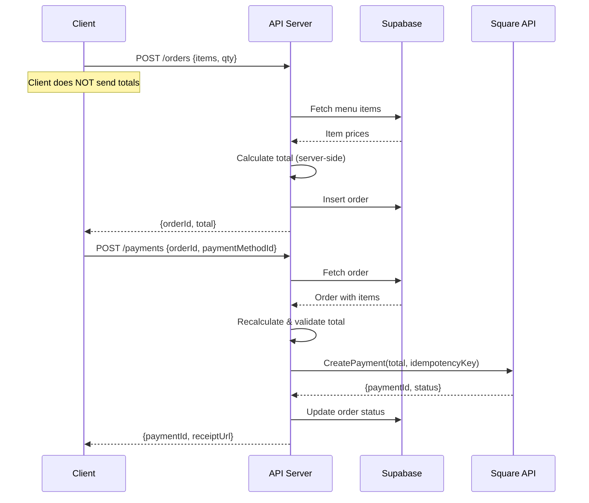

# Payment Processing Flow

## Server-Side Amount Validation

**Security Design:**
- Clients send items + quantities only
- Server calculates totals from authoritative menu prices
- Prevents client-side price manipulation
- Idempotency keys prevent duplicate charges
