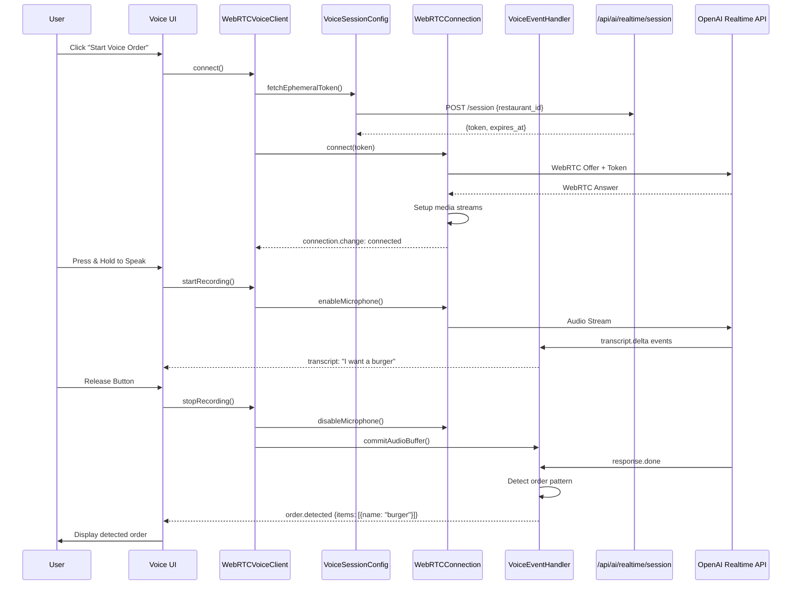

# Voice Ordering Architecture

**Last Updated:** 2025-10-31

## Service-Based Architecture (v6.0.14)

```mermaid
graph TB
    subgraph "Client Browser"
        UI[Voice UI Component]
        Orchestrator[WebRTCVoiceClient<br/>396 lines<br/>Orchestrator]

        Config[VoiceSessionConfig<br/>374 lines<br/>Token & Config Management]
        Connection[WebRTCConnection<br/>536 lines<br/>WebRTC Lifecycle]
        EventHandler[VoiceEventHandler<br/>744 lines<br/>Event Processing]

        UI-->Orchestrator
        Orchestrator-->Config
        Orchestrator-->Connection
        Orchestrator-->EventHandler
    end

    subgraph "API Server"
        SessionAPI[/api/ai/realtime/session<br/>Ephemeral Token Provider]
    end

    subgraph "OpenAI"
        Realtime[Realtime API<br/>GPT-4o realtime<br/>Voice + Function Calling]
    end

    Config-->|1. Fetch Token|SessionAPI
    Connection-->|2. WebRTC Handshake|Realtime
    EventHandler-->|3. Audio Stream|Realtime
    Realtime-->|4. Transcript Events|EventHandler
    EventHandler-->|5. Order Detected|UI

    style Orchestrator fill:#e1f5e1
    style Config fill:#fff3cd
    style Connection fill:#cfe2ff
    style EventHandler fill:#f8d7da
```

**Architecture Evolution:**
- **Before (v6.0.13)**: 1,312-line God Class
- **After (v6.0.14)**: 4 focused services (70% complexity reduction)
- **Benefits**: Single Responsibility, Testability (155 tests), Maintainability

## Voice Ordering Flow



**Key Features:**
- Push-to-talk interaction (prevents false triggers)
- Real-time transcript streaming
- Order detection via pattern matching
- Memory leak prevention (6 cleanup tests)
