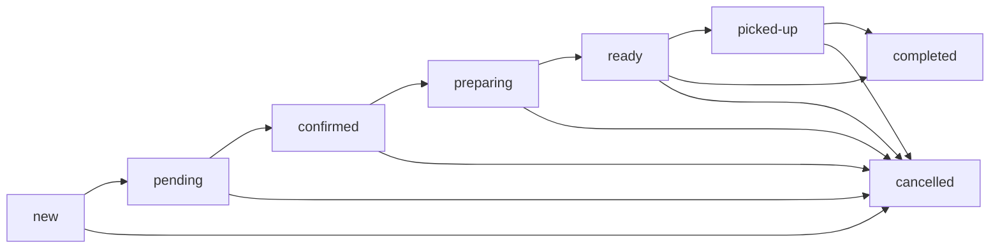

# Order Flow Documentation

**Last Updated**: 2025-11-24
**Epic**: Epic 2 - Order Status Flow Consolidation
**Version**: 6.0.14
**Status**: ✅ Production Ready

## Overview

The Restaurant OS 6.0 order flow is designed to handle the complete lifecycle of an order from creation through fulfillment. This document outlines the technical implementation and data flow for all order channels: online ordering, kiosk, voice ordering, and in-person.

**Key Change (Epic 2)**: As of v6.0.14, order status transitions are **strictly enforced** by the state machine (`orderStateMachine.ts`). All status updates validate transitions server-side to guarantee data integrity.

## Table of Contents

- [Order Status States (Canonical)](#order-status-states-canonical)
- [State Machine Enforcement](#state-machine-enforcement)
- [Order Lifecycle](#order-lifecycle)
- [API Endpoints](#api-endpoints)
- [Kitchen Display System (KDS)](#kitchen-display-system-kds)
- [Expo Station](#expo-station)
- [WebSocket Events](#websocket-events)
- [Error Handling](#error-handling)
- [Testing](#testing)

---

## Order Status States (Canonical)

### 8-State Flow (Single Source of Truth)

**Type Definition**: `shared/types/order.types.ts`

```typescript
type OrderStatus =
  | 'new'        // Order just created, not yet acknowledged
  | 'pending'    // Order received, awaiting confirmation
  | 'confirmed'  // Order confirmed, ready for preparation
  | 'preparing'  // Kitchen actively preparing order
  | 'ready'      // Order ready for pickup/delivery
  | 'picked-up'  // Order picked up by customer/driver
  | 'completed'  // Order fulfilled and closed
  | 'cancelled'  // Order cancelled at any stage
```

### State Groups (Operational Views)

**Helper Functions**: `shared/utils/orderStatus.ts`

```typescript
export const STATUS_GROUPS = {
  // Orders actively being worked on (Kitchen Display focus)
  ACTIVE: ['new', 'pending', 'confirmed', 'preparing'] as const,

  // Orders ready for fulfillment (Expo focus)
  READY: ['ready', 'picked-up'] as const,

  // Orders that are finished
  FINISHED: ['completed', 'cancelled'] as const,

  // Orders visible to kitchen staff
  KITCHEN_VISIBLE: ['new', 'pending', 'confirmed', 'preparing', 'ready'] as const,

  // Orders visible to expo staff
  EXPO_VISIBLE: ['new', 'pending', 'confirmed', 'preparing', 'ready', 'picked-up'] as const,
} as const;
```

**Usage Example**:
```typescript
import { isStatusInGroup } from '@rebuild/shared/utils/orderStatus';

// Filter orders for kitchen display
const activeOrders = orders.filter(o => isStatusInGroup(o.status, 'ACTIVE'));

// Filter orders for expo station
const readyOrders = orders.filter(o => isStatusInGroup(o.status, 'READY'));
```

### Display Helpers

```typescript
import { getStatusLabel, getStatusColor } from '@rebuild/shared/utils/orderStatus';

// Get human-readable label
getStatusLabel('preparing'); // Returns: "Preparing"

// Get Tailwind CSS classes for badge display
getStatusColor('preparing'); // Returns: "bg-purple-100 text-purple-800"
```

---

## State Machine Enforcement

### Transition Rules (Authoritative)

**State Machine**: `server/src/services/orderStateMachine.ts`

```typescript
const VALID_TRANSITIONS: Record<OrderStatus, OrderStatus[]> = {
  new: ['pending', 'cancelled'],
  pending: ['confirmed', 'cancelled'],
  confirmed: ['preparing', 'cancelled'],
  preparing: ['ready', 'cancelled'],
  ready: ['picked-up', 'completed', 'cancelled'],
  'picked-up': ['completed', 'cancelled'],
  completed: [], // Final state - no transitions allowed
  cancelled: [], // Final state - no transitions allowed
};
```

### Visual Flow Diagram



### Enforcement Points (Epic 2)

All status updates are validated **server-side** before being applied:

#### 1. **orders.service.ts** (Lines 378-392)
```typescript
// Fetch current order state
const { data: currentOrder } = await supabase
  .from('orders')
  .select('status')
  .eq('id', orderId)
  .eq('restaurant_id', restaurantId)
  .single();

// EPIC 2: Enforce state machine transition validation
if (!OrderStateMachine.canTransition(currentOrder.status, newStatus)) {
  const validNextStatuses = OrderStateMachine.getNextValidStatuses(currentOrder.status);
  throw new Error(
    `Invalid state transition: ${currentOrder.status} → ${newStatus}. ` +
    `Valid next states: ${validNextStatuses.join(', ')}`
  );
}
```

#### 2. **scheduledOrders.service.ts** (Lines 59-68)
```typescript
// Auto-fire scheduled orders with validation
const updates = ordersToFire
  .filter((order: Order) => {
    // Validate transition is allowed
    if (!OrderStateMachine.canTransition(order.status, 'preparing')) {
      logger.warn('Cannot auto-fire scheduled order: invalid transition', {
        orderId: order.id,
        currentStatus: order.status,
        attemptedStatus: 'preparing',
        restaurantId
      });
      return false; // Skip this order
    }
    return true; // Proceed with fire
  })
  .map((order: Order) =>
    supabase
      .from('orders')
      .update({ status: 'preparing', is_scheduled: false, updated_at: now })
      .eq('id', order.id)
      .eq('restaurant_id', restaurantId)
  );
```

#### 3. **Client-Side Validation** (UI Only)
```typescript
import { isValidStatusTransition } from '@rebuild/shared/utils/orderStatus';

// Show/hide buttons based on valid transitions
const canMarkReady = isValidStatusTransition(order.status, 'ready');

<Button disabled={!canMarkReady} onClick={() => updateStatus('ready')}>
  Mark Ready
</Button>
```

**IMPORTANT**: Client-side validation is **UI-only**. Server ALWAYS enforces the authoritative state machine.

### Why Server-Side Enforcement?

1. **Data Integrity**: Prevents invalid state transitions (e.g., `completed → pending`)
2. **Trust Boundary**: Client code can be modified - server is authoritative
3. **Audit Trail**: All state changes logged with validation results
4. **Multi-Client Support**: Different UIs (KDS, Expo, Admin) all use same rules

---

## Order Lifecycle

### 1. Order Creation

**Endpoint**: `POST /api/v1/orders`

**Initial Status**: `new` or `pending` (depending on payment method)

```typescript
// Client request
POST /api/v1/orders
{
  restaurant_id: "11111111-1111-1111-1111-111111111111",
  items: [
    {
      menu_item_id: "uuid",
      name: "Fried Chicken Sandwich",
      quantity: 2,
      price: 12.99,
      modifiers: ["No pickles", "Extra cheese"]
    }
  ],
  type: "takeout", // 'dine-in' | 'takeout' | 'delivery'
  customer_name: "John Doe",
  customer_email: "john@example.com",
  customer_phone: "555-123-4567"
}

// Server response
{
  id: "order-uuid",
  order_number: "1234",
  status: "pending", // Initial state
  type: "takeout",
  total: 29.99,
  created_at: "2025-11-24T18:30:00Z"
}
```

### 2. Kitchen Preparation

**Transition**: `pending → confirmed → preparing → ready`

**Location**: Kitchen Display System (`/kitchen`)

```typescript
// Kitchen staff marks order as preparing
PATCH /api/v1/orders/:id/status
{
  status: "preparing"
}

// Server validates transition: confirmed → preparing ✅
// Server broadcasts WebSocket event
socket.emit('order:status_changed', {
  order_id: "order-uuid",
  status: "preparing",
  timestamp: "2025-11-24T18:35:00Z"
});
```

### 3. Expo Fulfillment

**Transition**: `ready → picked-up → completed`

**Location**: Expo Station (`/expo`)

```typescript
// Expo staff marks order as picked up
PATCH /api/v1/orders/:id/status
{
  status: "picked-up"
}

// Later: Mark as completed
PATCH /api/v1/orders/:id/status
{
  status: "completed"
}
```

### 4. Cancellation

**Transition**: Any non-final state → `cancelled`

```typescript
// Cancel from any active state
DELETE /api/v1/orders/:id
{
  reason: "Customer requested cancellation"
}

// Server updates status to 'cancelled'
// Server broadcasts WebSocket event
```

---

## API Endpoints

### Order Management

| Method | Endpoint | Description | Auth Required |
|--------|----------|-------------|---------------|
| `GET` | `/api/v1/orders` | List orders with filters | ✅ |
| `GET` | `/api/v1/orders/:id` | Get single order | ✅ |
| `POST` | `/api/v1/orders` | Create new order | ✅ (optional for customer orders) |
| `PATCH` | `/api/v1/orders/:id/status` | Update order status | ✅ |
| `DELETE` | `/api/v1/orders/:id` | Cancel order | ✅ |
| `POST` | `/api/v1/orders/voice` | Process voice order | ✅ |

### Status Update Examples

**Success Response**:
```json
{
  "id": "order-uuid",
  "status": "ready",
  "updated_at": "2025-11-24T18:40:00Z"
}
```

**Error Response (Invalid Transition)**:
```json
{
  "error": "Invalid state transition: completed → pending. Valid next states: []",
  "current_status": "completed",
  "attempted_status": "pending",
  "valid_next_statuses": []
}
```

---

## Kitchen Display System (KDS)

**Location**: `/kitchen`

**Component**: `client/src/pages/KitchenPage.tsx`

**Responsibilities**:
- Display active orders (`new`, `pending`, `confirmed`, `preparing`)
- Allow status updates (`preparing → ready`)
- Show urgency indicators (time-based)
- Group orders by table (optional view)

**Key Features**:
1. **Real-time Updates**: WebSocket subscription for `order:created`, `order:updated`, `order:status_changed`
2. **Filtering**: Only shows `ACTIVE` and `READY` status groups
3. **State Machine Aware**: Buttons disabled for invalid transitions

**Example Component**:
```tsx
import { useKitchenOrdersRealtime } from '@/hooks/useKitchenOrdersRealtime';
import { isStatusInGroup } from '@rebuild/shared/utils/orderStatus';

function KitchenDisplay() {
  const { orders, updateOrderStatus } = useKitchenOrdersRealtime();

  // Filter for active orders only
  const activeOrders = orders.filter(o => isStatusInGroup(o.status, 'ACTIVE'));

  const handleMarkReady = async (orderId: string) => {
    await updateOrderStatus(orderId, 'ready'); // Validated by server
  };

  return (
    <div>
      {activeOrders.map(order => (
        <OrderCard
          key={order.id}
          order={order}
          onStatusChange={handleMarkReady}
        />
      ))}
    </div>
  );
}
```

---

## Expo Station

**Location**: `/expo`

**Component**: `client/src/pages/ExpoPage.tsx`

**Responsibilities**:
- Display ready orders (`ready`, `picked-up`)
- Mark orders as picked up
- Mark orders as completed
- Track fulfillment timing

**Two-Panel Layout**:
1. **Left Panel**: Kitchen Activity (read-only view of active orders)
2. **Right Panel**: Ready Orders (interactive - mark as picked up/completed)

**Example Component**:
```tsx
import { useKitchenOrdersRealtime } from '@/hooks/useKitchenOrdersRealtime';
import { isStatusInGroup } from '@rebuild/shared/utils/orderStatus';

function ExpoPage() {
  const { orders, updateOrderStatus } = useKitchenOrdersRealtime();

  // Filter orders by status group
  const activeOrders = orders.filter(o => isStatusInGroup(o.status, 'ACTIVE'));
  const readyOrders = orders.filter(o => isStatusInGroup(o.status, 'READY'));

  const handleMarkPickedUp = async (orderId: string) => {
    await updateOrderStatus(orderId, 'picked-up');
  };

  const handleMarkCompleted = async (orderId: string) => {
    await updateOrderStatus(orderId, 'completed');
  };

  return (
    <div className="grid grid-cols-2 gap-6">
      {/* Kitchen Overview */}
      <div>
        <h2>Kitchen Activity ({activeOrders.length})</h2>
        {activeOrders.map(order => (
          <OrderCard key={order.id} order={order} readOnly />
        ))}
      </div>

      {/* Ready Orders */}
      <div>
        <h2>Ready for Fulfillment ({readyOrders.length})</h2>
        {readyOrders.map(order => (
          <ReadyOrderCard
            key={order.id}
            order={order}
            onPickedUp={handleMarkPickedUp}
            onCompleted={handleMarkCompleted}
          />
        ))}
      </div>
    </div>
  );
}
```

---

## WebSocket Events

### Connection Establishment

```typescript
// Client connects to WebSocket
const webSocketService = new WebSocketService();
await webSocketService.connect();

// Authenticate with restaurant context
socket.emit('authenticate', {
  token: authToken,
  restaurant_id: restaurantId,
});
```

### Order Events

| Event | Trigger | Payload |
|-------|---------|---------|
| `order:created` | New order submitted | `{ order: Order }` |
| `order:updated` | Order details changed | `{ order: Order }` |
| `order:status_changed` | Status transition | `{ order_id: string, status: OrderStatus, previous_status: OrderStatus }` |
| `order:cancelled` | Order cancelled | `{ order_id: string, reason: string }` |

**Example Event Handler**:
```typescript
import { logger } from 'utils/logger';

webSocketService.on('order:status_changed', (data) => {
  logger.info(`Order ${data.order_id} changed: ${data.previous_status} → ${data.status}`);

  // Update local state
  setOrders(prev => prev.map(o =>
    o.id === data.order_id ? { ...o, status: data.status } : o
  ));
});
```

---

## Error Handling

### Invalid Transition Errors

**Server Response**:
```json
{
  "error": "Invalid state transition: completed → pending. Valid next states: []",
  "current_status": "completed",
  "attempted_status": "pending",
  "valid_next_statuses": []
}
```

**Client Handling**:
```typescript
try {
  await updateOrderStatus(orderId, 'pending');
} catch (error) {
  if (error.message.includes('Invalid state transition')) {
    // Show user-friendly error
    toast.error('Cannot revert a completed order. Please create a new order.');
  }
}
```

### Scheduled Order Validation

**Auto-Fire Failures** (scheduledOrders.service.ts:59-68):
```typescript
// Orders in invalid states are skipped with warnings
if (!OrderStateMachine.canTransition(order.status, 'preparing')) {
  logger.warn('Cannot auto-fire scheduled order: invalid transition', {
    orderId: order.id,
    currentStatus: order.status,
    attemptedStatus: 'preparing',
    restaurantId
  });
  return false; // Skip this order
}
```

---

## Testing

### Manual Testing Workflow

1. **Create Order**
   - Navigate to `/order/:restaurantId` or `/kiosk`
   - Add items to cart
   - Submit order (status: `pending`)

2. **Kitchen Processing**
   - Navigate to `/kitchen`
   - Verify order appears in active orders
   - Mark as `preparing`
   - Mark as `ready`

3. **Expo Fulfillment**
   - Navigate to `/expo`
   - Verify order appears in ready orders
   - Mark as `picked-up`
   - Mark as `completed`
   - Verify order removed from display

### Automated Testing

```bash
# Run order flow tests
npm run test:server -- orders.service.test.ts

# Test state machine validation
npm run test:server -- orderStateMachine.test.ts

# Test WebSocket events
npm run test:e2e -- order-flow.spec.ts
```

### Testing Invalid Transitions

```typescript
// Test: Cannot transition completed → pending
const order = await createOrder(restaurantId, orderData);
await updateOrderStatus(order.id, 'completed'); // Valid

// This should throw error
await expect(
  updateOrderStatus(order.id, 'pending')
).rejects.toThrow('Invalid state transition: completed → pending');
```

---

## Migration Notes (Epic 2)

### What Changed

1. **Consolidation**: 6 status definitions → 1 canonical (shared/types/order.types.ts)
2. **Enforcement**: All status updates validate transitions via orderStateMachine
3. **Helpers**: Centralized display helpers in shared/utils/orderStatus.ts
4. **Removed**: Deprecated 7-state flow, defensive status normalization

### Breaking Changes

**None** - This is an internal refactoring. The 8-state flow was already in use; Epic 2 just enforces it properly.

### Rollback Plan

If issues arise:
1. Revert to commit before Epic 2: `git revert 4b6bd36e`
2. Restore hardcoded validation in orders.routes.ts
3. Re-enable defensive getSafeOrderStatus() in ExpoPage.tsx

---

## References

- **Type Definition**: `shared/types/order.types.ts` (OrderStatus)
- **State Machine**: `server/src/services/orderStateMachine.ts` (transition rules)
- **Display Helpers**: `shared/utils/orderStatus.ts` (labels, colors, groups)
- **API Routes**: `server/src/routes/orders.routes.ts` (endpoints)
- **Order Service**: `server/src/services/orders.service.ts` (business logic)
- **Scheduled Orders**: `server/src/services/scheduledOrders.service.ts` (auto-fire logic)
- **Kitchen Page**: `client/src/pages/KitchenPage.tsx` (KDS UI)
- **Expo Page**: `client/src/pages/ExpoPage.tsx` (Expo UI)

---

**Last Updated**: 2025-11-24
**Epic 2 Status**: ✅ Complete (Phases 1-2: Consolidation & Enforcement)
