# Restaurant OS Architecture Narrative

## System Overview

The Restaurant OS is a multi-tenant point-of-sale and management system built on a React/TypeScript frontend (port 5173) and Express/TypeScript backend (port 3001). The system supports multiple authentication strategies and real-time order management through WebSockets.

## Core Architecture Flow

```mermaid
graph TB
    subgraph "Frontend (React/Vite)"
        UI[UI Components]
        VC[Voice Client<br/>WebRTC + OpenAI]
        UC[UnifiedCart<br/>Context]
    end
    
    subgraph "Backend (Express)"
        MW[Auth Middleware]
        AS[AuthenticationService]
        WS[WebSocket Handler]
        API[REST APIs]
    end
    
    subgraph "Data Layer"
        SB[Supabase<br/>PostgreSQL]
        RLS[RLS Policies<br/>⚠️ Missing]
    end
    
    UI --> UC
    UC --> API
    VC --> WS
    API --> MW
    WS --> AS
    MW --> AS
    AS --> SB
    API --> SB
    WS --> SB
```



## Authentication Flows

### Employee Flow


### Customer/Kiosk Flow


## Voice System Architecture

The voice system uses a **single implementation**: WebRTC + OpenAI Realtime API.

```mermaid
graph LR
    subgraph "Client"
        VB[Voice Button]
        WRC[WebRTCVoiceClient]
        PC[RTCPeerConnection]
    end
    
    subgraph "Server"
        RT[/realtime/session]
        OAI[OpenAI<br/>Realtime API]
    end
    
    VB --> WRC
    WRC --> PC
    PC <--> RT
    RT <--> OAI
```

**Key Points:**
- No alternate voice stacks (confirmed by audit)
- Stable React hooks using ref pattern
- 17 event types properly handled
- Clean disconnection on unmount

## Order Processing Pipeline


## Critical Integration Points

### Field Transformation Boundaries
- **Client**: Uses camelCase internally
- **API**: Expects camelCase
- **Database**: Uses snake_case
- **Transform Points**: Only at API boundaries (should be)
- **Reality**: Ad-hoc transforms scattered throughout (15+ locations)

### Restaurant Context Flow
- Stored in React Context on login
- Added to API headers
- Validated by middleware
- **Gap**: Kiosk mode uses env var only

### KDS Status Handling
**Required**: `new`, `pending`, `confirmed`, `preparing`, `ready`, `completed`, `cancelled`

**Missing Handlers**:
- StationStatusBar.tsx: Missing 'cancelled'
- useTableGrouping.tsx: Missing 'new', 'pending', 'cancelled'
- Validation schemas: Missing 'new' and 'confirmed'

## WebSocket Architecture

```mermaid
graph TB
    subgraph "Connection Lifecycle"
        C[Connect]
        A[Authenticate]
        S[Subscribe]
        B[Broadcast]
        D[Disconnect]
    end
    
    C --> A
    A --> S
    S --> B
    B --> D
    
    Note over A: Uses same AuthService.validateToken()
```

**Parity Confirmed**: HTTP and WebSocket use identical authentication path.

## Payment Flow


**Note**: Split payment backend exists but frontend UI missing.

## Data Model Relationships


## System Health Summary

### ✅ Working Well
- Unified authentication service
- HTTP↔WebSocket auth parity
- Single voice implementation
- React lazy loading
- No circular dependencies

### ⚠️ Issues Found
- Missing RLS on business tables
- KDS status validation gaps
- Field transform inconsistencies
- Memory leaks in WebSocket/WebRTC
- 58 failing tests (18.4%)

### 🔴 Critical Blockers
- Validation schemas missing statuses
- Restaurant_id gaps in kiosk mode
- Node.js crypto in client code
- Split payment UI not implemented

## Deployment Architecture

The system runs as a unified backend on port 3001 serving both API and static files in production, with Vite dev server on 5173 for development only.