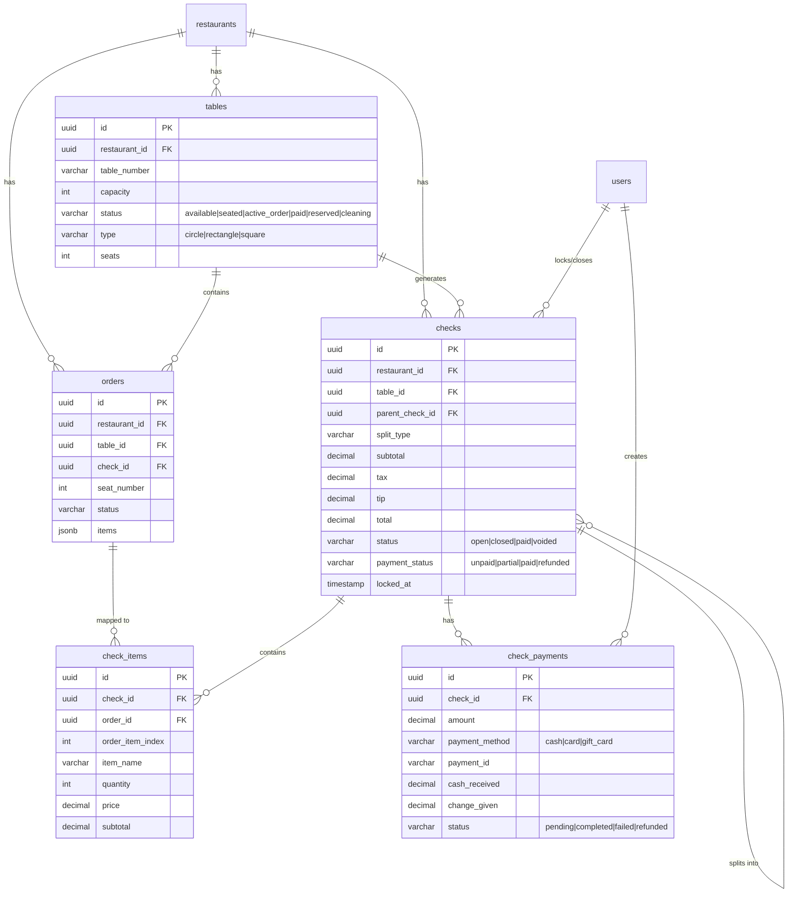

# feat: POS Seat Selection & Payment Workflow Enhancement

> **Issue Type:** Enhancement (Major Feature)
> **Estimated Effort:** 13-15 days
> **Priority:** P0/P1 (Critical for Server Operations)
> **Created:** 2025-11-28

---

## Overview

Transform the server ordering experience with a redesigned seat selection flow that visually mirrors table layouts, automated table status color coding, and a complete payment workflow supporting split checks, tips, and card/cash payments. This brings the POS system to parity with industry leaders like Toast, Square, and Lightspeed.

---

## Problem Statement / Motivation

### Current Issues

1. **Seat Selection Modal** - Generic 3-column grid doesn't match table shape, causing cognitive friction for servers
2. **No Table Status Automation** - Tables don't visually change when orders are placed or paid
3. **Disconnected Ordering Flow** - "Touch Order" screen loses table/seat context
4. **Limited Payment Options** - No split check support, no tip entry UI, no cash payment flow
5. **Manual Table Management** - Servers must manually track which tables have active orders

### Business Impact

- **Server Efficiency**: 15-20% slower table turnover vs. competitors
- **Training Overhead**: New staff confusion about table status
- **Revenue Leakage**: No tip tracking for cash payments
- **Customer Experience**: Split check requests cause delays

---

## Proposed Solution

### High-Level Architecture

```
TableLayoutView → ZoomedSeatPicker → OrderScreen → CheckManagement → Payment
       ↓                ↓                 ↓              ↓              ↓
  (zoom anim)    (seat selection)  (context header)  (split checks)  (card/cash)
```

### Component Architecture

```
client/src/
├── components/
│   └── pos/
│       ├── tables/
│       │   ├── TableStatusLegend.tsx       # Status color legend
│       │   └── TableActionsModal.tsx       # Add guests/items/payment
│       ├── seats/
│       │   ├── ZoomedTableSeatPicker.tsx   # Main zoomed seat picker
│       │   ├── SeatHotspot.tsx             # Individual seat button
│       │   └── SeatStatusIndicator.tsx     # Occupied/ordered/available
│       ├── orders/
│       │   └── OrderContextHeader.tsx      # Persistent table/seat context
│       └── payments/
│           ├── TenderSelection.tsx         # Card/Cash selector
│           ├── CashPaymentForm.tsx         # Fast cash buttons
│           ├── TipSelector.tsx             # Percentage presets
│           ├── SplitCheckModal.tsx         # Split by seat/item/equal
│           └── CheckCard.tsx               # Individual check display
├── contexts/
│   └── TableOrderFlowContext.tsx           # Multi-step flow state
└── hooks/
    ├── useLongPress.ts                     # Long-press detection
    └── useTabletOrientation.ts             # Portrait/landscape

server/src/
├── services/
│   └── check.service.ts                    # Check management logic
├── routes/
│   └── checks.routes.ts                    # Check API endpoints
└── models/
    └── (Prisma schema updates)

shared/types/
└── check.types.ts                          # Check, CheckItem, CheckPayment
```

---

## Technical Approach

### Phase 1: Data Models & Database (2 days)

#### New Tables

**`checks` table** - Master check record

```sql
-- supabase/migrations/YYYYMMDD_create_checks_table.sql
CREATE TABLE checks (
  id UUID PRIMARY KEY DEFAULT gen_random_uuid(),
  restaurant_id UUID NOT NULL REFERENCES restaurants(id),
  table_id UUID REFERENCES tables(id),
  table_number VARCHAR(20),

  -- Split metadata
  is_split_check BOOLEAN DEFAULT false,
  parent_check_id UUID REFERENCES checks(id),
  split_type VARCHAR(20), -- 'seat', 'item', 'equal', 'custom'
  split_number INT,

  -- Financial
  subtotal DECIMAL(10,2) NOT NULL DEFAULT 0,
  tax DECIMAL(10,2) NOT NULL DEFAULT 0,
  tip DECIMAL(10,2) DEFAULT 0,
  total DECIMAL(10,2) NOT NULL DEFAULT 0,

  -- Status
  status VARCHAR(20) DEFAULT 'open',
  payment_status VARCHAR(20) DEFAULT 'unpaid',
  locked_at TIMESTAMP,
  locked_by_user_id UUID REFERENCES users(id),

  -- Audit
  created_at TIMESTAMP DEFAULT NOW(),
  updated_at TIMESTAMP DEFAULT NOW(),
  closed_at TIMESTAMP,
  closed_by_user_id UUID REFERENCES users(id),

  CONSTRAINT check_status_valid CHECK (status IN ('open', 'closed', 'paid', 'voided')),
  CONSTRAINT payment_status_valid CHECK (payment_status IN ('unpaid', 'partial', 'paid', 'refunded'))
);

CREATE INDEX idx_checks_restaurant ON checks(restaurant_id);
CREATE INDEX idx_checks_table ON checks(table_id);
CREATE INDEX idx_checks_status ON checks(status);
```

**`check_items` table** - Order items to checks mapping

```sql
CREATE TABLE check_items (
  id UUID PRIMARY KEY DEFAULT gen_random_uuid(),
  check_id UUID NOT NULL REFERENCES checks(id) ON DELETE CASCADE,
  order_id UUID NOT NULL REFERENCES orders(id),
  order_item_index INT NOT NULL,
  item_name VARCHAR(255),
  quantity INT NOT NULL,
  price DECIMAL(10,2),
  subtotal DECIMAL(10,2),
  created_at TIMESTAMP DEFAULT NOW(),
  UNIQUE(check_id, order_id, order_item_index)
);
```

**`check_payments` table** - Multi-payment support

```sql
CREATE TABLE check_payments (
  id UUID PRIMARY KEY DEFAULT gen_random_uuid(),
  check_id UUID NOT NULL REFERENCES checks(id) ON DELETE CASCADE,
  amount DECIMAL(10,2) NOT NULL,
  payment_method VARCHAR(20) NOT NULL,
  payment_id VARCHAR(255),
  cash_received DECIMAL(10,2),
  change_given DECIMAL(10,2),
  status VARCHAR(20) DEFAULT 'pending',
  created_at TIMESTAMP DEFAULT NOW(),
  created_by_user_id UUID REFERENCES users(id)
);
```

**Extend `tables.status`**

```sql
ALTER TABLE tables
  DROP CONSTRAINT IF EXISTS tables_status_check,
  ADD CONSTRAINT tables_status_check
    CHECK (status IN ('available', 'seated', 'active_order', 'paid', 'reserved', 'cleaning'));
```

#### TypeScript Types

**`shared/types/check.types.ts`**

```typescript
export type CheckStatus = 'open' | 'closed' | 'paid' | 'voided';
export type CheckPaymentStatus = 'unpaid' | 'partial' | 'paid' | 'refunded';
export type SplitType = 'seat' | 'item' | 'equal' | 'custom';

export interface Check {
  id: string;
  restaurant_id: string;
  table_id?: string;
  table_number?: string;
  is_split_check: boolean;
  parent_check_id?: string;
  split_type?: SplitType;
  subtotal: number;
  tax: number;
  tip: number;
  total: number;
  status: CheckStatus;
  payment_status: CheckPaymentStatus;
  locked_at?: string;
  created_at: string;
  updated_at: string;
  items?: CheckItem[];
  payments?: CheckPayment[];
}

export interface CheckItem {
  id: string;
  check_id: string;
  order_id: string;
  order_item_index: number;
  item_name: string;
  quantity: number;
  price: number;
  subtotal: number;
}

export interface CheckPayment {
  id: string;
  check_id: string;
  amount: number;
  payment_method: 'cash' | 'card' | 'gift_card' | 'other';
  payment_id?: string;
  cash_received?: number;
  change_given?: number;
  status: 'pending' | 'completed' | 'failed' | 'refunded';
}
```

---

### Phase 2: Backend Check Service (3 days)

#### New Service

**`server/src/services/check.service.ts`**

```typescript
export class CheckService {
  // Create check from orders
  async createCheck(dto: CreateCheckDTO): Promise<Check>;

  // Split check by seat/item/equal
  async splitCheck(check_id: string, config: SplitCheckDTO): Promise<Check[]>;

  // Add payment to check
  async addPayment(check_id: string, payment: AddPaymentDTO): Promise<CheckPayment>;

  // Lock check during payment
  async lockCheck(check_id: string, user_id: string): Promise<Check>;
  async unlockCheck(check_id: string): Promise<void>;

  // Auto-update table status
  async updateTableStatusAfterPayment(check_id: string): Promise<void>;
}
```

#### New API Endpoints

**`server/src/routes/checks.routes.ts`**

| Method | Endpoint | Purpose |
|--------|----------|---------|
| POST | `/api/v1/checks` | Create check from orders |
| GET | `/api/v1/checks/:id` | Get check with items/payments |
| POST | `/api/v1/checks/:id/split` | Split check |
| POST | `/api/v1/checks/:id/lock` | Lock for payment |
| POST | `/api/v1/checks/:id/payments` | Add payment |
| DELETE | `/api/v1/checks/:id/lock` | Unlock check |

---

### Phase 3: Sequential Seat Ordering UI (2 days)

#### Updated SeatSelectionModal

**`client/src/pages/components/SeatSelectionModal.tsx`** (refactor)

Key changes:
- Replace 3-column grid with shape-aware layout
- Add ordered seat indicators (green checkmark)
- Integrate with PostOrderPrompt for multi-seat flow

#### New ZoomedTableSeatPicker

**`client/src/components/pos/seats/ZoomedTableSeatPicker.tsx`**

```typescript
interface ZoomedTableSeatPickerProps {
  table: Table;
  ordered_seats: number[];
  selected_seat: number | null;
  onSeatSelect: (seat: number) => void;
  onContinue: () => void;
  onFinishTable: () => void;
}

// Features:
// - SVG/Canvas rendering matching table shape
// - Seats positioned around table perimeter
// - Framer Motion zoom animation from floor plan
// - Touch-optimized 56px+ seat hotspots
```

#### Seat Position Calculator

```typescript
// Calculate seat positions based on table shape
function calculateSeatPositions(table: Table): SeatPosition[] {
  switch (table.type) {
    case 'circle':
      return distributeSeatsCircular(table.seats, table.width / 2);
    case 'rectangle':
      return distributeSeatsRectangular(table.seats, table.width, table.height);
    case 'square':
      return distributeSeatsSquare(table.seats, table.width);
  }
}
```

---

### Phase 4: Table Status Automation (1 day)

#### Extended Table Status Colors

**`client/src/modules/floor-plan/components/FloorPlanCanvas.tsx`** (update)

```typescript
const TABLE_STATUS_COLORS = {
  available: {
    fill: '#ECFDF5',    // Emerald light
    stroke: '#10B981',  // Emerald
    border: '#059669'   // Emerald dark
  },
  seated: {
    fill: '#FEF9C3',    // Yellow light
    stroke: '#EAB308',  // Yellow
    border: '#CA8A04'   // Yellow dark
  },
  active_order: {
    fill: '#FEF3C7',    // Amber light
    stroke: '#F59E0B',  // Amber/Orange
    border: '#D97706'   // Amber dark
  },
  paid: {
    fill: '#D1FAE5',    // Green light
    stroke: '#34D399',  // Green
    border: '#10B981'   // Green dark
  },
  reserved: {
    fill: '#EFF6FF',    // Blue light
    stroke: '#3B82F6',  // Blue
    border: '#1D4ED8'   // Blue dark
  },
  cleaning: {
    fill: '#F5F3FF',    // Purple light
    stroke: '#8B5CF6',  // Purple
    border: '#7C3AED'   // Purple dark
  }
};
```

#### Status Legend Component

**`client/src/components/pos/tables/TableStatusLegend.tsx`**

```typescript
// Collapsible legend showing all table status colors
// Positioned in floor plan header
// Icons + colors + text for accessibility
```

#### Auto-Transition Triggers

```typescript
// In table.service.ts
async function autoUpdateTableStatus(table_id: string): Promise<void> {
  const orders = await getActiveOrdersForTable(table_id);
  const checks = await getChecksForTable(table_id);

  if (checks.every(c => c.payment_status === 'paid')) {
    await updateTableStatus(table_id, 'paid');
  } else if (orders.length > 0) {
    await updateTableStatus(table_id, 'active_order');
  }

  // Broadcast WebSocket event
  broadcastTableStatusChange(table_id);
}
```

---

### Phase 5: Payment UI (3 days)

#### TenderSelection Component

**`client/src/components/pos/payments/TenderSelection.tsx`**

```typescript
interface TenderSelectionProps {
  check: Check;
  onSelectCard: () => void;
  onSelectCash: () => void;
  onSplitCheck: () => void;
}

// Large touch targets (96px height)
// Card Payment, Cash Payment, Split Check buttons
```

#### CashPaymentForm Component

**`client/src/components/pos/payments/CashPaymentForm.tsx`**

```typescript
interface CashPaymentFormProps {
  amount_due: number;
  onComplete: (payment: CheckPayment) => void;
}

// Features:
// - Fast cash buttons: $20, $50, $100
// - Auto-calculate change
// - Optional tip entry
// - Large touch targets
```

#### TipSelector Component

**`client/src/components/pos/payments/TipSelector.tsx`**

```typescript
interface TipSelectorProps {
  subtotal: number;
  onTipChange: (tip_amount: number) => void;
}

// Features:
// - Preset percentages: 15%, 18%, 20%, 25%
// - Custom amount input
// - "No Tip" option
// - Shows dollar amount next to percentage
```

#### SplitCheckModal Component

**`client/src/components/pos/payments/SplitCheckModal.tsx`**

```typescript
interface SplitCheckModalProps {
  check: Check;
  onSplit: (config: SplitCheckDTO) => void;
}

// Split methods:
// 1. By Seat - Auto based on order.seat_number
// 2. By Item - Drag-drop items to checks
// 3. Equally - Divide by N guests
```

---

### Phase 6: Order Context Header (1 day)

**`client/src/components/pos/orders/OrderContextHeader.tsx`**

```typescript
interface OrderContextHeaderProps {
  table: Table;
  seat_number?: number;
  check_status?: string;
  guest_count: number;
}

// Persistent header showing:
// "Table 12 · Seat 3 · New Check"
// Always visible during ordering
```

---

## Acceptance Criteria

### Functional Requirements

- [ ] Seat picker visually matches table shape (circle, rectangle, square)
- [ ] Seats positioned around table perimeter, not in generic grid
- [ ] Zoom animation when opening seat picker from floor plan
- [ ] Ordered seats show green checkmark indicator
- [ ] "Add Next Seat" / "Finish Table" buttons after each order
- [ ] Table color changes: available → seated → active_order → paid
- [ ] Status legend visible on floor plan
- [ ] Split check by seat, item, or equal
- [ ] Tip selector with 15/18/20/25% presets + custom
- [ ] Cash payment with fast buttons and change calculation
- [ ] Card payment via existing Stripe integration
- [ ] Persistent context header during ordering

### Non-Functional Requirements

- [ ] Touch targets minimum 56px for restaurant environment
- [ ] Portrait and landscape tablet support
- [ ] Sub-200ms response for status updates
- [ ] Offline-resilient payment (queue for retry)
- [ ] Multi-tenant isolation (restaurant_id filter on all queries)

### Quality Gates

- [ ] Unit tests for CheckService (80%+ coverage)
- [ ] Integration tests for check splitting logic
- [ ] E2E tests for multi-seat ordering flow
- [ ] E2E tests for payment flow (card + cash)
- [ ] Performance test: 100 concurrent seat selections

---

## Success Metrics

| Metric | Current | Target |
|--------|---------|--------|
| Average table turnover time | Unknown | -15% |
| Server training time | Unknown | -30% |
| Payment errors (splits) | Manual | 0 errors |
| Tip tracking accuracy | No cash tips | 100% |

---

## Dependencies & Prerequisites

### Required Before Starting

1. **Stripe Integration** - Already complete (payment.service.ts)
2. **WebSocket Infrastructure** - Already complete (table:status_changed events)
3. **Order seat_number** - Already in DB (migration 20251029145721)
4. **Payment audit logs** - Already in place

### Blocking Dependencies

- None identified

### External Dependencies

- Stripe API (card payments)
- Supabase (database)

---

## Risk Analysis & Mitigation

| Risk | Probability | Impact | Mitigation |
|------|-------------|--------|------------|
| Concurrent seat selection conflicts | Medium | High | Use optimistic locking with version field |
| Payment failure during split | Medium | High | Two-phase commit with idempotency keys |
| Performance degradation with many checks | Low | Medium | Proper indexing, query optimization |
| Complex split-by-item UX | Medium | Medium | Start with seat/equal splits, add item later |

---

## Implementation Phases

### Phase 1: Data Models & Migrations (2 days)
- [ ] Create `checks` table migration
- [ ] Create `check_items` table migration
- [ ] Create `check_payments` table migration
- [ ] Extend `tables.status` enum
- [ ] Add `orders.check_id` column
- [ ] Create TypeScript types in `shared/types/check.types.ts`
- [ ] Update Prisma schema via `npx prisma db pull`

### Phase 2: Backend Check Service (3 days)
- [ ] Implement `CheckService` class
- [ ] Create check CRUD operations
- [ ] Implement check splitting algorithms
- [ ] Add check locking mechanism
- [ ] Create `checks.routes.ts` endpoints
- [ ] Add validation middleware
- [ ] Write unit tests

### Phase 3: Sequential Seat Ordering UI (2 days)
- [ ] Create `ZoomedTableSeatPicker.tsx`
- [ ] Implement seat position calculator
- [ ] Add zoom animation with Framer Motion
- [ ] Update `SeatSelectionModal.tsx` with ordered indicators
- [ ] Integrate "Add Next Seat" / "Finish Table" flow
- [ ] Test multi-seat ordering E2E

### Phase 4: Table Status Automation (1 day)
- [ ] Extend `TABLE_STATUS_COLORS` in FloorPlanCanvas
- [ ] Create `TableStatusLegend.tsx`
- [ ] Implement auto-transition triggers
- [ ] Add WebSocket broadcasts for status changes
- [ ] Update `table.service.ts` with status validation

### Phase 5: Payment UI (3 days)
- [ ] Create `TenderSelection.tsx`
- [ ] Create `CashPaymentForm.tsx`
- [ ] Create `TipSelector.tsx`
- [ ] Create `SplitCheckModal.tsx` (seat + equal only initially)
- [ ] Create `CheckCard.tsx`
- [ ] Integrate with existing Stripe flow
- [ ] Test payment flows E2E

### Phase 6: Polish & Integration (2 days)
- [ ] Create `OrderContextHeader.tsx`
- [ ] Full E2E test suite
- [ ] Performance testing
- [ ] Documentation updates
- [ ] Bug fixes from testing

---

## Alternative Approaches Considered

### 1. Generic Modal vs Zoomed Table Shape
**Rejected:** Generic modal (current approach) causes cognitive friction. Industry leaders all use table-mirroring UX.

### 2. Separate Check Table vs Order Extension
**Chosen:** Separate `checks` table provides:
- Clean data model for split checks
- Multi-payment support
- Independent of order status lifecycle
- Better audit trail

### 3. Client-Side vs Server-Side Split Calculation
**Chosen:** Server-side for:
- Multi-tenant isolation enforcement
- Audit logging
- Transaction consistency
- Tax calculation accuracy

---

## Future Considerations

### Not in Scope (Future Enhancements)

1. **Split by Item** - Complex drag-drop UI, add in v2
2. **Coursing** - Fire courses separately, future enhancement
3. **Print Bill** - Physical receipt integration, hardware dependent
4. **Gift Cards** - Additional payment method, future phase
5. **House Accounts** - Business account charging, future phase

### Extensibility Points

- `CheckService.splitCheck()` designed for additional split types
- `TABLE_STATUS_COLORS` easily extendable
- Payment method enum allows future additions

---

## Documentation Plan

### Updates Required

- [ ] Update CLAUDE.md with new table statuses
- [ ] Add ADR for Check model decision
- [ ] Update TEST_DEBUGGING.md with new E2E tests
- [ ] Create runbook for payment failure recovery

---

## ERD Diagram



---

## References

### Internal References

- `client/src/pages/components/SeatSelectionModal.tsx:1-208` - Current seat selection
- `client/src/modules/floor-plan/components/FloorPlanCanvas.tsx:153-174` - Current status colors
- `server/src/services/payment.service.ts:157-206` - Existing payment validation
- `server/src/routes/payments.routes.ts:1-500` - Existing Stripe integration
- `shared/types/order.types.ts:1-103` - Order types with seat_number
- `docs/plans/pos-seat-selection-payment-flow-research.md` - Prior research

### External References

- [Toast POS Table Management](https://pos.toasttab.com/products/toast-tables)
- [Square Split Check Documentation](https://squareup.com/help/us/en/article/8165-split-a-payment-and-check-with-square-for-restaurants)
- [WCAG Touch Target Guidelines](https://www.w3.org/WAI/WCAG22/Understanding/target-size-minimum.html)
- [Stripe Payment Element](https://docs.stripe.com/payments/payment-element)
- [Framer Motion Layout Animations](https://motion.dev/docs/react-layout-animations)

### Related Work

- Previous research: `docs/plans/pos-seat-selection-payment-flow-research.md`
- ADR-001: Snake case convention
- ADR-006: Dual authentication pattern
- ADR-007: Tax rate per restaurant

---

## Test Scenarios

### E2E: Multi-Seat Ordering

```gherkin
Scenario: Server orders for 4-seat table
  Given I am logged in as Server
  And Table 8 has 4 seats and status "seated"
  When I tap Table 8
  Then I should see the zoomed seat picker
  When I select Seat 1 and place order "Burger, Fries"
  Then I should see "Add Next Seat" and "Finish Table"
  When I tap "Add Next Seat" and order for Seat 2
  And I tap "Finish Table"
  Then Table 8 status should be "active_order"
  And kitchen should receive 2 orders
```

### E2E: Split Check by Seat

```gherkin
Scenario: Split 4-seat table into individual checks
  Given Table 10 has orders for 4 seats
  When I navigate to payment and tap "Split by Seat"
  Then I should see 4 separate checks
  When I process cash payment $50 for Check 1 ($48.60)
  Then I should see change $1.40
  And Check 1 should be "paid"
```

### E2E: Cash Payment

```gherkin
Scenario: Cash payment with change
  Given a check with total $32.50
  When I select Cash Payment
  And I tap $50 fast cash button
  Then I should see change $17.50
  When I complete payment
  Then check should be paid
  And table should update to "paid" status
```

---

## Appendix: Component Pseudo-Code

### ZoomedTableSeatPicker.tsx

```tsx
export function ZoomedTableSeatPicker({
  table,
  ordered_seats,
  selected_seat,
  onSeatSelect,
  onContinue,
  onFinishTable
}: ZoomedTableSeatPickerProps) {
  const seat_positions = useMemo(
    () => calculateSeatPositions(table),
    [table]
  );

  return (
    <motion.div
      layoutId={`table-${table.id}`}
      className="bg-white rounded-2xl p-8"
    >
      {/* Header with context */}
      <div className="mb-6">
        <h2 className="text-2xl font-bold">Table {table.table_number}</h2>
        <p className="text-neutral-600">
          {ordered_seats.length} of {table.seats} seats ordered
        </p>
      </div>

      {/* Table shape with seats */}
      <div className="relative w-80 h-80 mx-auto">
        <TableShape table={table} />
        {seat_positions.map((pos, idx) => (
          <SeatHotspot
            key={idx}
            seat_number={idx + 1}
            position={pos}
            is_ordered={ordered_seats.includes(idx + 1)}
            is_selected={selected_seat === idx + 1}
            onClick={() => onSeatSelect(idx + 1)}
          />
        ))}
      </div>

      {/* Actions */}
      <div className="flex gap-4 mt-8">
        <Button onClick={onContinue} disabled={!selected_seat}>
          Continue to Order
        </Button>
        {ordered_seats.length > 0 && (
          <Button variant="success" onClick={onFinishTable}>
            Finish Table
          </Button>
        )}
      </div>
    </motion.div>
  );
}
```

### TenderSelection.tsx

```tsx
export function TenderSelection({
  check,
  onSelectCard,
  onSelectCash,
  onSplitCheck
}: TenderSelectionProps) {
  return (
    <div className="space-y-4">
      <div className="text-center mb-6">
        <p className="text-sm text-neutral-600">Amount Due</p>
        <p className="text-4xl font-bold">${check.total.toFixed(2)}</p>
      </div>

      <TenderOption
        icon={CreditCard}
        title="Card Payment"
        subtitle="Credit or Debit"
        onClick={onSelectCard}
      />

      <TenderOption
        icon={Banknote}
        title="Cash Payment"
        subtitle="Calculate change"
        onClick={onSelectCash}
      />

      <TenderOption
        icon={Split}
        title="Split Check"
        subtitle="By seat or equally"
        onClick={onSplitCheck}
      />
    </div>
  );
}
```

### CashPaymentForm.tsx

```tsx
const FAST_CASH = [20, 50, 100];

export function CashPaymentForm({
  amount_due,
  onComplete
}: CashPaymentFormProps) {
  const [cash_received, setCashReceived] = useState(0);
  const change = cash_received - amount_due;

  return (
    <div className="space-y-6">
      <div className="text-center">
        <p className="text-sm">Amount Due</p>
        <p className="text-3xl font-bold">${amount_due.toFixed(2)}</p>
      </div>

      {/* Fast cash buttons */}
      <div className="grid grid-cols-3 gap-4">
        {FAST_CASH.map((amount) => (
          <Button
            key={amount}
            size="lg"
            onClick={() => setCashReceived(amount)}
            variant={cash_received === amount ? 'primary' : 'outline'}
          >
            ${amount}
          </Button>
        ))}
      </div>

      {/* Custom amount */}
      <Input
        type="number"
        label="Custom Amount"
        value={cash_received || ''}
        onChange={(e) => setCashReceived(parseFloat(e.target.value))}
      />

      {/* Change display */}
      {cash_received >= amount_due && (
        <div className="bg-green-50 p-4 rounded-xl text-center">
          <p className="text-sm text-green-600">Change Due</p>
          <p className="text-2xl font-bold text-green-700">
            ${change.toFixed(2)}
          </p>
        </div>
      )}

      <Button
        size="lg"
        className="w-full"
        disabled={cash_received < amount_due}
        onClick={() => onComplete({
          amount: amount_due,
          payment_method: 'cash',
          cash_received,
          change_given: change,
          status: 'completed'
        })}
      >
        Complete Payment
      </Button>
    </div>
  );
}
```

---

*Generated with Claude Code workflows:plan*
