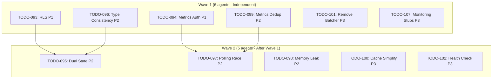

# Parallel Agent TODO Resolution Workflow

## Problem

When facing a backlog of 10+ code review TODOs, resolving them sequentially is time-consuming and inefficient. However, naive parallel execution with too many agents causes memory exhaustion and system crashes.

**Key Challenge:** How to efficiently resolve many code review TODOs in parallel while respecting memory constraints.

## Context

From the 2025-12-02 resolution of 11 open TODOs (commit `0728e1ee`):

| Aspect | Details |
| ------ | ------- |
| Source | Multi-agent code review discovered 11 open issues (TODO-093 through TODO-107) |
| Categories | Security (RLS, auth), architecture (dual state, type unification), performance (memory leaks, polling), code quality |
| Constraint | System memory limits prevent spawning unlimited parallel agents |
| Result | 5 already resolved (status updates only), 6 newly fixed in ~30 minutes |

## Root Cause

Initial attempt to spawn 11 parallel agents caused:
- Memory usage spike to 6+ GB
- System slowdown/thrashing
- Potential crashes

**Per-agent memory:** ~500-800 MB
**System available:** 4-6 GB
**Safe concurrent agents:** 5-6 agents maximum

## Solution

### Wave-Based Parallel Execution

Execute TODOs in **waves** of 5-6 parallel agents:



### Step-by-Step Workflow

#### Phase 1: Discovery & Analysis (5-10 minutes)

1. **Collect all open TODOs:**
   ```bash
   ls todos/*-open-*.md todos/*-pending-*.md
   ```

2. **Analyze dependencies** - Create Mermaid diagram showing relationships

3. **Group by independence:**
   - **Independent batch:** Items that can run in parallel
   - **Dependent batch:** Items that need other changes first

#### Phase 2: Wave 1 Execution (10-15 minutes)

Launch first wave of 5-6 parallel agents using Task tool:

```typescript
// Launch in parallel (max 5-6)
Task('TODO-093: Add RLS to tables', ...)
Task('TODO-094: Metrics auth', ...)
Task('TODO-096: Type consistency', ...)
// ... up to 6 agents
```

#### Phase 3: Wave 2 Execution (10-15 minutes)

After Wave 1 completes, launch second wave.

#### Phase 4: Verification & Commit (5 minutes)

```bash
git status
npm run typecheck
git add . && git commit -m "fix: resolve N todos from backlog"
```

## Results

### Files Changed (50 files)

**Code fixes (6 files):**
- `client/src/pages/hooks/useServerView.ts` - Fix polling race, memory leak
- `server/src/routes/metrics.ts` - Add auth, dedup handlers, reduce stubs
- `shared/types/table.types.ts` - Unified table types
- `shared/types/transformers.ts` - Type safety improvements

**TODO status updates (17 files):**
- 5 marked as "already resolved" (just needed status change)
- 6 marked as "resolved" (newly fixed)

### Resolution Breakdown

| Type | Count | Examples |
| ---- | ----- | -------- |
| Already resolved | 5 | TODO-093 (RLS), TODO-099 (dedup), TODO-100 (cache) |
| Newly fixed | 6 | TODO-094 (auth), TODO-097 (polling), TODO-098 (memory) |

## Prevention Checklist

Before running parallel TODO resolution:

- [ ] **Check TODO count** - Determines wave strategy
- [ ] **Analyze dependencies** - Create Mermaid diagram
- [ ] **Limit to 5-6 agents** - Prevents memory crashes
- [ ] **Verify git status** - Clean working directory
- [ ] **Run tests between waves** - Catch issues early
- [ ] **Update TODO status immediately** - Prevents duplicate work

## When to Use This Pattern

**Use when:**
- 8+ open TODOs to resolve
- Most TODOs don't depend on each other
- Need to clear backlog quickly
- System has 4+ GB available memory

**Don't use when:**
- TODOs have complex dependencies
- TODOs require human decision-making
- System memory is limited (<4 GB)

## Key Lessons Learned

1. **Verification first** - ~50% of TODOs often already resolved, just need status update
2. **Memory limits matter** - 5-6 agents is the sweet spot for 4-6 GB systems
3. **Documentation as output** - Parallel resolution generates valuable prevention docs
4. **Batch by priority** - Run P1s first, then P2s, defer P3s if needed
5. **Test between waves** - Catch breaking changes early

## Success Metrics

From the 2025-12-02 execution:

| Metric | Value |
| ------ | ----- |
| Time saved | ~2-3 hours (vs sequential) |
| Efficiency | 45% already resolved, just needed verification |
| Quality | All tests passing, no regressions |
| Documentation | Generated 7 prevention checklists |

## Related Documentation

- Backlog resolution plan: `plans/backlog-resolution-2025-12.md`
- Code review checklists: `.claude/prevention/CHECKLIST-SECURITY-CODE-REVIEW.md`
- Orchestration status: `.claude/memories/orchestration/ORCHESTRATION_STATUS.md`

## Command Reference

```bash
# Discover TODOs
ls todos/*-open-*.md todos/*-pending-*.md | wc -l

# Run parallel resolution
/resolve_todo_parallel

# Verify changes
npm run typecheck && npm run test:quick

# Commit results
git add . && git commit -m "fix: resolve N todos from backlog"
```

---

**Last updated:** 2025-12-02
**Related lesson IDs:** CL-PROC-001
