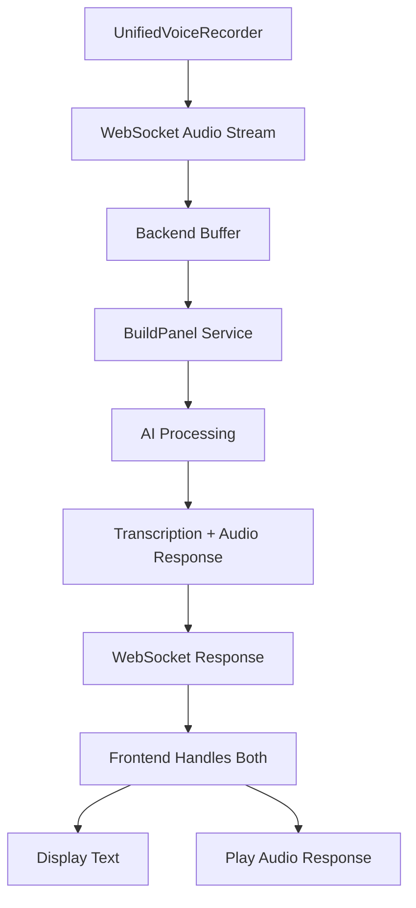

# Unified Components Guide

## BaseOrderCard

Replaces: OrderCard, OrderCardKDS, CompactOrderCard, OrderListItem

```tsx
import { BaseOrderCard } from '@/components/orders/BaseOrderCard';

// Standard order management
<BaseOrderCard 
  order={order}
  variant="standard"
  onStatusChange={handleStatusChange}
/>

// Kitchen display
<BaseOrderCard 
  order={order}
  variant="kds"
  showTimer={true}
  showItemGroups={true}
/>

// Compact list view
<BaseOrderCard 
  order={order}
  variant="compact"
  layout="list"
/>
```

## UnifiedVoiceRecorder

Replaces: VoiceControl, VoiceCapture, VoiceButton

```tsx
import { UnifiedVoiceRecorder } from '@/components/voice/UnifiedVoiceRecorder';

// Hold-to-talk mode
<UnifiedVoiceRecorder 
  mode="hold-to-talk"
  onTranscriptionComplete={handleTranscript}
/>

// Tap-to-toggle mode with order processing via BuildPanel
<UnifiedVoiceRecorder 
  mode="tap-to-toggle"
  autoProcessOrder={true}
  onOrderProcessed={handleOrder}
  onAudioResponse={handleAudioPlayback}
/>
```

## Shared UI Components

Located in `/client/src/components/shared/`:

- **LoadingSpinner**: Consistent loading states
- **EmptyState**: Empty data displays
- **ErrorDisplay**: User-friendly error messages
- **IconButton**: Accessible icon buttons
- **StatusBadge**: Order status indicators
- **ElapsedTimer**: Time tracking displays

## BuildPanel Integration

The unified components now handle BuildPanel responses:

### Voice Component Data Flow


### Audio Response Handling
- BuildPanel responses include both transcription text and optional audio
- Components automatically handle audio playback via Web Audio API
- Audio responses can be muted via user preference
- Error handling for both transcription and audio playback failures

## Migration Examples

### Before (Multiple Components)
```tsx
// Different components for different views
{view === 'kds' ? <OrderCardKDS order={order} /> : 
 view === 'list' ? <CompactOrderCard order={order} /> :
 <OrderCard order={order} />}
```

### After (Single Component)
```tsx
// One component with variants
<BaseOrderCard 
  order={order} 
  variant={view === 'kds' ? 'kds' : view === 'list' ? 'compact' : 'standard'}
  layout={view === 'list' ? 'list' : 'card'}
/>
```