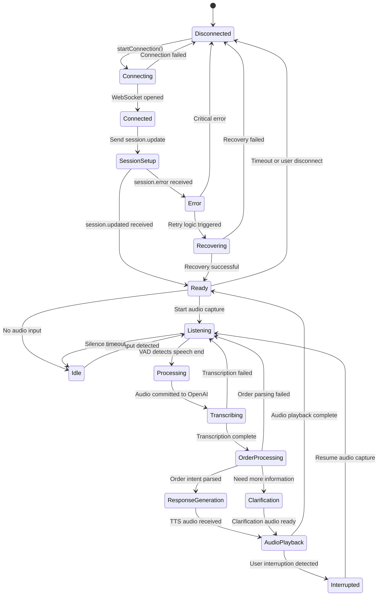
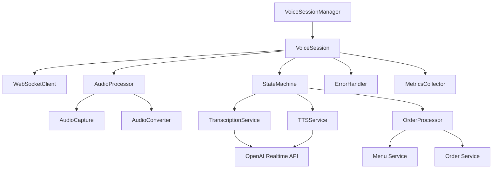

# Realtime Voice System Architecture

**Version:** 1.0  
**Last Updated:** January 14, 2025  
**Status:** Design Specification

## Overview

This document defines the architecture for the WebSocket-based realtime voice MVP for restaurant ordering, integrating OpenAI Realtime API with our unified backend architecture.

## Event Schema Definitions (v1)

### Core Event Types

```typescript
import { z } from 'zod';

// Session Management Events
export const SessionEventSchema = z.object({
  type: z.enum(['session.created', 'session.updated', 'session.error']),
  sessionId: z.string(),
  timestamp: z.number(),
  data: z.object({
    model: z.string(),
    capabilities: z.array(z.string()),
    config: z.record(z.unknown()).optional(),
  }),
});

// Audio Stream Events  
export const AudioEventSchema = z.object({
  type: z.enum(['audio.input', 'audio.output', 'audio.delta', 'audio.complete']),
  sessionId: z.string(),
  sequenceNumber: z.number(),
  timestamp: z.number(),
  data: z.object({
    format: z.enum(['pcm16', 'mulaw']),
    sampleRate: z.number(),
    channels: z.literal(1),
    payload: z.string(), // base64 encoded
    duration?: z.number(),
  }),
});

// Transcription Events
export const TranscriptionEventSchema = z.object({
  type: z.enum(['transcription.partial', 'transcription.complete', 'transcription.error']),
  sessionId: z.string(),
  timestamp: z.number(),
  data: z.object({
    text: z.string(),
    confidence: z.number().min(0).max(1),
    language: z.string().default('en-US'),
    isFinal: z.boolean(),
  }),
});

// Order Processing Events
export const OrderEventSchema = z.object({
  type: z.enum(['order.intent', 'order.processing', 'order.complete', 'order.error']),
  sessionId: z.string(),
  orderId: z.string().optional(),
  timestamp: z.number(),
  data: z.object({
    intent: z.string(),
    items: z.array(z.object({
      menuItemId: z.string(),
      quantity: z.number(),
      modifications: z.array(z.string()).default([]),
      confidence: z.number().min(0).max(1),
    })).default([]),
    totalAmount: z.number().optional(),
    status: z.enum(['pending', 'confirmed', 'failed']).optional(),
  }),
});

// Voice Activity Detection Events
export const VADEventSchema = z.object({
  type: z.enum(['vad.speech_start', 'vad.speech_end', 'vad.silence']),
  sessionId: z.string(),
  timestamp: z.number(),
  data: z.object({
    audioStartMs: z.number(),
    audioEndMs: z.number().optional(),
    confidence: z.number().min(0).max(1),
  }),
});

// Error Events
export const ErrorEventSchema = z.object({
  type: z.literal('error'),
  sessionId: z.string(),
  timestamp: z.number(),
  error: z.object({
    code: z.string(),
    message: z.string(),
    category: z.enum(['connection', 'audio', 'api', 'business_logic']),
    severity: z.enum(['low', 'medium', 'high', 'critical']),
    retry: z.boolean(),
    context: z.record(z.unknown()).optional(),
  }),
});

// Union type for all events
export type VoiceEvent = 
  | z.infer<typeof SessionEventSchema>
  | z.infer<typeof AudioEventSchema>
  | z.infer<typeof TranscriptionEventSchema>
  | z.infer<typeof OrderEventSchema>
  | z.infer<typeof VADEventSchema>
  | z.infer<typeof ErrorEventSchema>;
```

### Event Validation Utilities

```typescript
export class EventValidator {
  static validate(event: unknown): VoiceEvent {
    // Try each schema in order of likelihood
    const schemas = [
      AudioEventSchema,
      TranscriptionEventSchema,
      OrderEventSchema,
      VADEventSchema,
      SessionEventSchema,
      ErrorEventSchema,
    ];

    for (const schema of schemas) {
      const result = schema.safeParse(event);
      if (result.success) {
        return result.data;
      }
    }

    throw new Error('Invalid event format');
  }

  static isErrorEvent(event: VoiceEvent): event is z.infer<typeof ErrorEventSchema> {
    return event.type === 'error';
  }

  static requiresRetry(event: VoiceEvent): boolean {
    return this.isErrorEvent(event) && event.error.retry;
  }
}
```

## State Machine Diagram



### State Definitions

```typescript
export enum VoiceSessionState {
  DISCONNECTED = 'disconnected',
  CONNECTING = 'connecting',
  CONNECTED = 'connected',
  SESSION_SETUP = 'session_setup',
  READY = 'ready',
  IDLE = 'idle',
  LISTENING = 'listening',
  PROCESSING = 'processing',
  TRANSCRIBING = 'transcribing',
  ORDER_PROCESSING = 'order_processing',
  RESPONSE_GENERATION = 'response_generation',
  CLARIFICATION = 'clarification',
  AUDIO_PLAYBACK = 'audio_playback',
  INTERRUPTED = 'interrupted',
  ERROR = 'error',
  RECOVERING = 'recovering',
}

export interface StateTransition {
  from: VoiceSessionState;
  to: VoiceSessionState;
  trigger: string;
  guard?: (context: VoiceSessionContext) => boolean;
  action?: (context: VoiceSessionContext, event: VoiceEvent) => void;
}
```

## Error Taxonomy

### Error Categories

```typescript
export enum ErrorCategory {
  CONNECTION = 'connection',
  AUDIO = 'audio',
  API = 'api',
  BUSINESS_LOGIC = 'business_logic',
}

export enum ErrorSeverity {
  LOW = 'low',           // Log and continue
  MEDIUM = 'medium',     // User notification
  HIGH = 'high',         // Retry with backoff
  CRITICAL = 'critical', // Disconnect and restart
}
```

### Specific Error Types

```typescript
// Connection Errors
export const ConnectionErrors = {
  WEBSOCKET_FAILED: {
    code: 'WS_CONNECTION_FAILED',
    category: ErrorCategory.CONNECTION,
    severity: ErrorSeverity.HIGH,
    retry: true,
    message: 'WebSocket connection failed',
  },
  API_KEY_INVALID: {
    code: 'API_KEY_INVALID',
    category: ErrorCategory.CONNECTION,
    severity: ErrorSeverity.CRITICAL,
    retry: false,
    message: 'Invalid OpenAI API key',
  },
  RATE_LIMITED: {
    code: 'RATE_LIMITED',
    category: ErrorCategory.CONNECTION,
    severity: ErrorSeverity.HIGH,
    retry: true,
    message: 'API rate limit exceeded',
  },
} as const;

// Audio Errors
export const AudioErrors = {
  MICROPHONE_ACCESS_DENIED: {
    code: 'MIC_ACCESS_DENIED',
    category: ErrorCategory.AUDIO,
    severity: ErrorSeverity.CRITICAL,
    retry: false,
    message: 'Microphone access denied',
  },
  AUDIO_FORMAT_UNSUPPORTED: {
    code: 'AUDIO_FORMAT_ERROR',
    category: ErrorCategory.AUDIO,
    severity: ErrorSeverity.HIGH,
    retry: false,
    message: 'Unsupported audio format',
  },
  BUFFER_OVERFLOW: {
    code: 'AUDIO_BUFFER_OVERFLOW',
    category: ErrorCategory.AUDIO,
    severity: ErrorSeverity.MEDIUM,
    retry: true,
    message: 'Audio buffer overflow',
  },
} as const;

// API Errors
export const APIErrors = {
  TRANSCRIPTION_FAILED: {
    code: 'TRANSCRIPTION_FAILED',
    category: ErrorCategory.API,
    severity: ErrorSeverity.MEDIUM,
    retry: true,
    message: 'Speech transcription failed',
  },
  TTS_FAILED: {
    code: 'TTS_FAILED',
    category: ErrorCategory.API,
    severity: ErrorSeverity.MEDIUM,
    retry: true,
    message: 'Text-to-speech generation failed',
  },
  MODEL_OVERLOADED: {
    code: 'MODEL_OVERLOADED',
    category: ErrorCategory.API,
    severity: ErrorSeverity.HIGH,
    retry: true,
    message: 'OpenAI model temporarily overloaded',
  },
} as const;

// Business Logic Errors
export const BusinessLogicErrors = {
  ORDER_PARSING_FAILED: {
    code: 'ORDER_PARSE_ERROR',
    category: ErrorCategory.BUSINESS_LOGIC,
    severity: ErrorSeverity.LOW,
    retry: true,
    message: 'Could not parse order from speech',
  },
  MENU_ITEM_NOT_FOUND: {
    code: 'MENU_ITEM_NOT_FOUND',
    category: ErrorCategory.BUSINESS_LOGIC,
    severity: ErrorSeverity.LOW,
    retry: false,
    message: 'Requested menu item not available',
  },
  INCOMPLETE_ORDER: {
    code: 'INCOMPLETE_ORDER',
    category: ErrorCategory.BUSINESS_LOGIC,
    severity: ErrorSeverity.LOW,
    retry: false,
    message: 'Order requires additional information',
  },
} as const;
```

### Error Recovery Strategies

```typescript
export interface RecoveryStrategy {
  maxRetries: number;
  backoffStrategy: 'linear' | 'exponential';
  baseDelayMs: number;
  maxDelayMs: number;
  fallbackAction?: () => void;
}

export const RecoveryStrategies: Record<ErrorCategory, RecoveryStrategy> = {
  [ErrorCategory.CONNECTION]: {
    maxRetries: 3,
    backoffStrategy: 'exponential',
    baseDelayMs: 1000,
    maxDelayMs: 10000,
    fallbackAction: () => console.log('Switching to text-only mode'),
  },
  [ErrorCategory.AUDIO]: {
    maxRetries: 2,
    backoffStrategy: 'linear',
    baseDelayMs: 500,
    maxDelayMs: 2000,
    fallbackAction: () => console.log('Prompting for microphone permission'),
  },
  [ErrorCategory.API]: {
    maxRetries: 5,
    backoffStrategy: 'exponential',
    baseDelayMs: 2000,
    maxDelayMs: 30000,
  },
  [ErrorCategory.BUSINESS_LOGIC]: {
    maxRetries: 1,
    backoffStrategy: 'linear',
    baseDelayMs: 0,
    maxDelayMs: 1000,
    fallbackAction: () => console.log('Requesting clarification from user'),
  },
};
```

## Module Boundaries and Interfaces

### Core Module Structure

```typescript
// Core Interfaces
export interface VoiceSessionManager {
  createSession(restaurantId: string): Promise<VoiceSession>;
  getSession(sessionId: string): VoiceSession | null;
  destroySession(sessionId: string): Promise<void>;
}

export interface VoiceSession {
  readonly id: string;
  readonly state: VoiceSessionState;
  readonly restaurantId: string;
  
  connect(): Promise<void>;
  disconnect(): Promise<void>;
  startListening(): Promise<void>;
  stopListening(): Promise<void>;
  
  on(event: string, handler: (data: VoiceEvent) => void): void;
  off(event: string, handler: (data: VoiceEvent) => void): void;
}

export interface AudioProcessor {
  startCapture(): Promise<MediaStream>;
  stopCapture(): Promise<void>;
  processAudioChunk(chunk: ArrayBuffer): string; // returns base64
  convertFormat(audio: string, from: AudioFormat, to: AudioFormat): string;
}

export interface TranscriptionService {
  transcribe(audio: string): Promise<TranscriptionResult>;
  streamTranscribe(audioStream: AsyncIterator<string>): AsyncIterator<PartialTranscription>;
}

export interface OrderProcessor {
  parseOrderIntent(transcript: string, context: OrderContext): Promise<OrderIntent>;
  validateOrder(order: OrderIntent, menu: MenuData): Promise<OrderValidation>;
  generateResponse(intent: OrderIntent, validation: OrderValidation): Promise<string>;
}

export interface TTSService {
  synthesize(text: string, voice?: string): Promise<string>; // returns base64 audio
  streamSynthesize(textStream: AsyncIterator<string>): AsyncIterator<string>;
}
```

### Module Dependencies



### Interface Implementations

```typescript
// WebSocket Client Interface
export interface WebSocketClient {
  connect(url: string, headers: Record<string, string>): Promise<void>;
  send(data: string): Promise<void>;
  close(): Promise<void>;
  
  onOpen(handler: () => void): void;
  onMessage(handler: (data: string) => void): void;
  onClose(handler: (code: number, reason: string) => void): void;
  onError(handler: (error: Error) => void): void;
}

// State Machine Interface
export interface StateMachine {
  readonly currentState: VoiceSessionState;
  
  transition(trigger: string, event?: VoiceEvent): Promise<void>;
  canTransition(from: VoiceSessionState, trigger: string): boolean;
  
  onStateChange(handler: (from: VoiceSessionState, to: VoiceSessionState) => void): void;
  onTransitionError(handler: (error: Error, context: StateContext) => void): void;
}

// Metrics Collection Interface
export interface MetricsCollector {
  recordLatency(operation: string, durationMs: number): void;
  recordError(error: ErrorEvent): void;
  recordAudioQuality(metrics: AudioQualityMetrics): void;
  
  getMetrics(): VoiceSystemMetrics;
  reset(): void;
}
```

## Key Metrics to Track

### Performance Metrics

```typescript
export interface PerformanceMetrics {
  // Latency Measurements
  connectionLatency: number;        // WebSocket connection time
  firstResponseLatency: number;     // Time to first audio output (TTFP)
  audioProcessingLatency: number;   // Audio encode/decode time
  transcriptionLatency: number;     // Speech-to-text processing time
  orderProcessingLatency: number;   // NLP and business logic time
  ttsLatency: number;              // Text-to-speech generation time
  endToEndLatency: number;         // Complete conversation turn time
  
  // Audio Quality
  audioDropoutRate: number;        // Percentage of dropped audio chunks
  audioBufferUnderrunRate: number; // Buffer starvation events
  transcriptionAccuracy: number;   // Word error rate (WER)
  
  // System Health  
  connectionUptime: number;        // Percentage of successful connection time
  errorRate: number;              // Errors per minute
  retryRate: number;              // Retry attempts per session
  sessionDuration: number;        // Average session length
}

export interface BusinessMetrics {
  // Order Processing
  orderCompletionRate: number;     // Successful orders / total attempts
  averageItemsPerOrder: number;    // Menu items per completed order
  clarificationRate: number;       // Orders requiring clarification
  orderModificationRate: number;   // Orders requiring changes
  
  // User Experience
  sessionAbandonmentRate: number;  // Users who disconnect early
  userInterruptionRate: number;    // Frequency of user interruptions
  repeatRequestRate: number;       // "Can you repeat that?" requests
  
  // Operational
  peakConcurrentSessions: number;  // Maximum simultaneous sessions
  averageSessionsPerMinute: number; // Load patterns
  systemAvailability: number;     // Uptime percentage
}
```

### Metric Collection Points

```typescript
export class MetricsCollector {
  // Latency tracking
  public recordConnectionStart(): string; // returns correlation ID
  public recordConnectionComplete(correlationId: string): void;
  
  public recordAudioCaptureStart(): string;
  public recordAudioCaptureComplete(correlationId: string): void;
  
  public recordTranscriptionStart(): string;
  public recordTranscriptionComplete(correlationId: string, accuracy: number): void;
  
  public recordOrderProcessingStart(): string;
  public recordOrderProcessingComplete(correlationId: string, success: boolean): void;
  
  public recordTTSStart(): string;
  public recordTTSComplete(correlationId: string): void;
  
  // Error tracking
  public recordError(error: VoiceError, context: ErrorContext): void;
  public recordRetry(errorCode: string, attempt: number): void;
  
  // Business events
  public recordOrderAttempt(sessionId: string): void;
  public recordOrderSuccess(sessionId: string, itemCount: number): void;
  public recordUserInterruption(sessionId: string): void;
  public recordSessionAbandonment(sessionId: string, reason: string): void;
}
```

### Performance Targets

```typescript
export const PerformanceTargets = {
  // Latency Targets (95th percentile)
  CONNECTION_LATENCY_MS: 1000,
  FIRST_RESPONSE_LATENCY_MS: 500,   // TTFP target
  END_TO_END_LATENCY_MS: 2000,      // Complete conversation turn
  
  // Quality Targets
  TRANSCRIPTION_ACCURACY_MIN: 0.95,  // 95% word accuracy
  AUDIO_DROPOUT_RATE_MAX: 0.01,      // <1% audio loss
  
  // Reliability Targets
  CONNECTION_UPTIME_MIN: 0.999,      // 99.9% uptime
  ERROR_RATE_MAX: 0.05,              // <5% error rate
  
  // Business Targets  
  ORDER_COMPLETION_RATE_MIN: 0.85,   // 85% successful orders
  SESSION_ABANDONMENT_RATE_MAX: 0.15, // <15% early disconnect
} as const;
```

## Implementation Guidelines

### Critical Success Factors

1. **Low Latency Architecture**
   - Minimize buffer sizes while maintaining stability
   - Use connection pooling for WebSocket management
   - Implement audio streaming with minimal buffering

2. **Robust Error Handling**
   - Graceful degradation for all error categories
   - Automatic retry with exponential backoff
   - User-friendly error messages and recovery paths

3. **State Management**
   - Clear state transitions with comprehensive logging
   - Atomic state changes to prevent race conditions
   - Recovery mechanisms for unexpected state transitions

4. **Audio Quality**
   - Real-time audio processing without blocking
   - Format conversion between different audio codecs
   - Dynamic quality adjustment based on network conditions

5. **Monitoring and Observability**
   - Comprehensive metrics collection at all integration points
   - Real-time dashboards for system health monitoring
   - Alerting on performance degradation or error spikes

### Integration Points

1. **Frontend Integration**
   - React hooks for voice session management
   - Audio visualization components
   - Error boundary handling for voice failures

2. **Backend Integration**
   - Express.js middleware for WebSocket upgrade
   - Restaurant context integration for multi-tenancy
   - Order service integration for business logic

3. **External Services**
   - OpenAI Realtime API client with retry logic
   - Menu service for order validation
   - Analytics service for metrics collection

### Security Considerations

1. **API Key Management**
   - Secure storage of OpenAI API keys
   - Rotation policies and access monitoring
   - Environment-specific key isolation

2. **Audio Data Privacy**
   - No persistent storage of voice data
   - Encryption in transit for audio streams
   - Compliance with privacy regulations (GDPR, CCPA)

3. **Session Security**
   - Secure session token generation
   - Protection against session hijacking
   - Rate limiting and abuse prevention

---

**Next Implementation Steps:**
1. Create `VoiceSessionManager` with basic state machine
2. Implement `WebSocketClient` with OpenAI integration
3. Build `AudioProcessor` with format conversion
4. Add comprehensive error handling and recovery
5. Implement metrics collection and monitoring
6. Create frontend React hooks and components