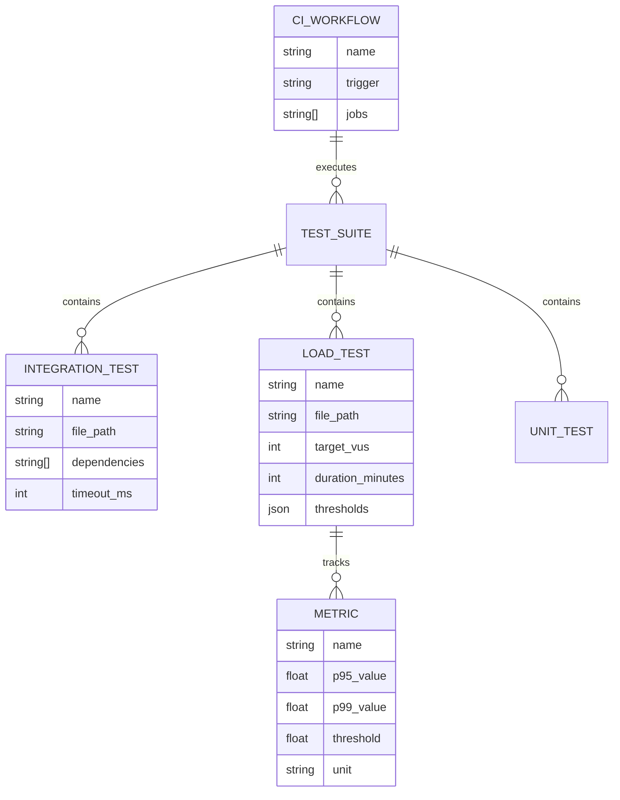

# feat: Integration Testing & Load Testing Suite

**Last Updated:** 2025-11-25
**Issue Type:** Enhancement
**Priority:** P0 (Critical for Production)
**Estimated Effort:** 11-15 hours (Simplified Approach)

---

## Overview

Implement targeted testing improvements to validate Restaurant OS under production conditions. This plan follows a **simplified approach** based on multi-agent review feedback:

1. **Extend existing server unit tests** (no new `tests/integration/` layer)
2. **Resurrect archived k6 tests** with Stripe migration updates
3. **Nightly CI/CD only** (not on every PR)

**Key Targets:**
- 100 concurrent users
- P95 API response <500ms
- P99 API response <1000ms
- <1% error rate
- WebSocket stability under load

---

## Simplified Approach (Review Feedback)

### What Changed from Original Plan

| Original | Simplified | Rationale |
|----------|------------|-----------|
| Create `tests/integration/` dir | Add tests to existing `server/src/**/__tests__/` | Simpler, no new test layer |
| 5 new integration test files | 2 focused server unit tests | State machine + idempotency already tested, need depth |
| Build new k6 from scratch | Resurrect archived k6 tests | Tests exist at `scripts/archive/2025-09-25/load-test/` |
| Load tests on every PR | Nightly CI only | Resource efficiency |
| 16-24 hours | 11-15 hours | Less ceremony, same value |

### Archived k6 Tests Analysis

The archived k6 tests at `scripts/archive/2025-09-25/load-test/` are **well-written** (838 lines total) and were archived during documentation cleanup, not because they were broken. They need:

1. **API endpoint updates**: `/api/v1/payments/create` → `/api/v1/payments/create-payment-intent`
2. **Snake_case conversion**: Per ADR-001 (e.g., `orderId` → `order_id`)
3. **Stripe test tokens**: Replace Square test tokens with Stripe test tokens

---

## Problem Statement

### Current State
- Playwright E2E framework is mature (multi-browser, mobile, visual regression)
- 99.8% test pass rate (430/431 tests)
- Existing E2E smoke tests for auth, orders, kitchen display
- **k6 load tests exist but are ARCHIVED and NOT integrated into CI/CD**
- No active load testing pipeline
- No performance regression tracking
- No concurrent payment processing validation

### Gap Analysis

| Area | Current | Needed |
|------|---------|--------|
| Concurrent users tested | 0 (archived) | 100+ |
| P95 response tracking | None | <500ms SLA |
| Error rate monitoring | None | <1% SLA |
| CI/CD integration | No | Required (nightly) |
| WebSocket load testing | 1-2 connections | 50+ connections |
| Multi-tenancy stress | Unit tests only | Load validation |

### Business Impact
- Cannot validate production readiness for lunch rush (peak load)
- Payment spikes untested - risk of failed transactions
- WebSocket stability unknown under concurrent KDS clients
- No regression detection for performance degradation

---

## Proposed Solution (Simplified)

### Architecture

```
┌─────────────────────────────────────────────────────────────────┐
│                    Testing Pyramid                               │
├─────────────────────────────────────────────────────────────────┤
│                                                                  │
│     ▲ Load Tests (k6) ← RESURRECT ARCHIVED                      │
│    ╱ ╲   - 100 concurrent users                                 │
│   ╱   ╲  - Payment processing load                              │
│  ╱     ╲ - WebSocket stability                                  │
│ ╱───────╲- Multi-tenancy isolation                              │
│                                                                  │
│    ▲ Extended Server Unit Tests ← ADD TO EXISTING               │
│   ╱ ╲   - Order state machine (all 8 states)                   │
│  ╱   ╲  - Payment idempotency (Stripe API mocking)             │
│ ╱     ╲ - Existing payments.test.ts + orders.test.ts           │
│╱───────╲                                                        │
│                                                                  │
│   ▲ Unit/Component Tests (Vitest) ✅ COMPLETE                   │
│  ╱ ╲   - 430/431 passing                                        │
│ ╱───╲  - 99.8% pass rate                                        │
│                                                                  │
└─────────────────────────────────────────────────────────────────┘
```

---

## Technical Approach

### Phase 1: Server Unit Tests (4-5 hours)

Extend existing server unit tests for critical coverage gaps.

#### 1.1 Order State Machine Test
**File:** `server/src/services/__tests__/orderStateMachine.test.ts` (NEW)

Tests the `OrderStateMachine` class comprehensively:

```typescript
describe('OrderStateMachine', () => {
  describe('canTransition', () => {
    // Test all 8 states: new → pending → confirmed → preparing → ready → picked-up → completed
    // Test cancellation from any state (except final states)
    // Test invalid transitions return false
  });

  describe('transition', () => {
    // Test valid transition updates order status
    // Test invalid transition throws BadRequest
    // Test transition hooks are called
  });

  describe('edge cases', () => {
    // Test final states cannot transition
    // Test getNextValidStatuses returns correct options
    // Test isFinalState correctly identifies completed/cancelled
  });
});
```

#### 1.2 Payment Idempotency Test
**File:** `server/src/services/__tests__/payment.idempotency.test.ts` (NEW)

Tests idempotency at the service layer with Stripe API mocking:

```typescript
describe('Payment Idempotency', () => {
  describe('idempotency key generation', () => {
    // Test key format: {order_id_last12}-{timestamp}
    // Test max 45 char limit (per Stripe)
  });

  describe('duplicate request handling', () => {
    // Test same idempotency_key returns cached response
    // Test different keys trigger new payment intents
    // Test Stripe not called twice for same key
  });

  describe('audit logging', () => {
    // Test initiated status logged BEFORE payment
    // Test success/failed status logged AFTER payment
    // Test audit log failure blocks payment (fail-fast per ADR-009)
  });
});
```

### Phase 2: Load Testing Suite (5-7 hours)

Resurrect archived k6 tests with Stripe migration updates.

#### 2.1 Resurrect Payment Load Test
**Source:** `scripts/archive/2025-09-25/load-test/payment-load-test.ts`
**Target:** `tests/load/payment-processing.k6.js`

**Required Updates:**
1. Change endpoint: `/api/v1/payments/create` → `/api/v1/payments/create-payment-intent`
2. Convert to snake_case per ADR-001
3. Replace Square test tokens with Stripe test tokens (`pm_card_visa`)
4. Update response validation for Stripe response format

```javascript
// Updated options (keep existing)
export const options = {
  stages: [
    { duration: '1m', target: 20 },   // Warm up
    { duration: '2m', target: 100 },  // Ramp to 100
    { duration: '7m', target: 100 },  // Sustain peak
    { duration: '1m', target: 0 },    // Ramp down
  ],
  thresholds: {
    'payment_duration_ms': ['p(95)<500', 'p(99)<1000'],
    'payment_success_rate': ['rate>0.99'],
    'http_req_failed': ['rate<0.01'],
  },
};
```

#### 2.2 Resurrect Order Flow Load Test
**Source:** `scripts/archive/2025-09-25/load-test/order-flow-test.ts`
**Target:** `tests/load/order-flow.k6.js`

The 571-line order flow test includes multi-role RBAC testing and WebSocket handling.

**Required Updates:**
1. Snake_case field names
2. Update any Square-specific payment flows
3. Verify WebSocket endpoint format

---

### Phase 3: CI/CD Integration (2-3 hours)

#### 3.1 GitHub Actions Workflow
**File:** `.github/workflows/load-tests.yml`

```yaml
name: Load Tests (Nightly)
on:
  schedule:
    - cron: '0 2 * * *'  # 2 AM UTC daily
  workflow_dispatch:      # Manual trigger

jobs:
  load-tests:
    runs-on: ubuntu-latest
    timeout-minutes: 30
    steps:
      - uses: actions/checkout@v4
      - name: Setup k6
        uses: grafana/k6-action@v0.3.1
      - name: Run Payment Load Test
        run: k6 run tests/load/payment-processing.k6.js
        env:
          BASE_URL: ${{ secrets.STAGING_API_URL }}
          TEST_AUTH_TOKEN: ${{ secrets.LOAD_TEST_TOKEN }}
      - name: Upload Results
        uses: actions/upload-artifact@v4
        with:
          name: k6-results
          path: k6-results.json
```

**NOTE:** Load tests run nightly only, not on PRs (per simplicity review)

---

## Alternative Approaches Considered

| Approach | Pros | Cons | Decision |
|----------|------|------|----------|
| **k6 (chosen)** | JavaScript, WebSocket support, cloud option | Learning curve | ✅ Use - best for our stack |
| Artillery | YAML config, easy setup | Limited WebSocket | ❌ Skip - WebSocket critical |
| Locust | Python, flexible | Wrong language | ❌ Skip - team is JS |
| JMeter | Enterprise, GUI | Heavy, XML config | ❌ Skip - too complex |

---

## Acceptance Criteria

### Functional Requirements

- [ ] **INT-001**: Order flow integration test covers browse → payment → kitchen
- [ ] **INT-002**: Voice ordering test validates concurrent sessions
- [ ] **INT-003**: Order state machine test covers all 8 states + transitions
- [ ] **INT-004**: Payment idempotency test prevents double charges
- [ ] **INT-005**: WebSocket chaos test validates reconnection

### Non-Functional Requirements

- [ ] **LOAD-001**: 100 concurrent users sustained for 7 minutes
- [ ] **LOAD-002**: P95 API response time <500ms
- [ ] **LOAD-003**: P99 API response time <1000ms
- [ ] **LOAD-004**: Error rate <1%
- [ ] **LOAD-005**: WebSocket message latency P95 <100ms
- [ ] **LOAD-006**: Zero cross-tenant data leakage under load

### Quality Gates

- [ ] All integration tests pass in CI
- [ ] Load tests pass thresholds before merge to main
- [ ] Performance regression <10% vs baseline
- [ ] Code coverage for new test utilities >80%

---

## Success Metrics

| Metric | Target | Measurement |
|--------|--------|-------------|
| Concurrent users validated | 100 | k6 VUs |
| P95 response time | <500ms | k6 metrics |
| Payment success rate | >99% | Custom counter |
| WebSocket stability | <10 errors/10min | k6 ws_errors |
| Cross-tenant leaks | 0 | Custom counter |

---

## Dependencies & Prerequisites

### Required Infrastructure
- [ ] k6 installed (npm package or binary)
- [ ] Stripe test mode credentials in GitHub secrets
- [ ] Test database (Supabase staging or local)
- [ ] WebSocket test server access

### Documentation Needed
- [ ] Load test runbook (execution, interpretation)
- [ ] Performance baseline per endpoint
- [ ] Incident response for load test failures

### Related Files
- `playwright.config.ts` - Add integration test project
- `package.json` - Add k6 scripts
- `vitest.config.ts` - Increase timeout for integration tests

---

## Risk Analysis & Mitigation

| Risk | Likelihood | Impact | Mitigation |
|------|------------|--------|------------|
| k6 learning curve | Medium | Low | Team already has archived k6 tests |
| Stripe rate limits in test mode | Low | Medium | Use test tokens, respect limits |
| WebSocket test flakiness | Medium | Medium | Add retries, increase timeouts |
| CI/CD resource limits | Low | High | Run load tests nightly, not on every PR |

---

## Implementation Plan (Simplified)

### Phase 1: Server Unit Tests ✅ COMPLETE
- [x] Update plan with simplified approach
- [x] Create `server/tests/services/orderStateMachine.test.ts` (54 tests)
- [x] Create `server/tests/services/payment-idempotency.test.ts` (16 tests)
- [x] Run tests and verify pass rate (70 new tests, all passing)

### Phase 2: Load Tests ✅ COMPLETE
- [x] Create `tests/load/` directory
- [x] Copy and update `payment-load-test.ts` → `payment-processing.k6.js`
- [x] Update for Stripe migration (snake_case fields, test payment methods)
- [x] Add npm scripts: `test:load`, `test:load:quick`

### Phase 3: CI/CD Integration ✅ COMPLETE
- [x] Create `.github/workflows/load-tests.yml` (nightly at 2 AM UTC)
- [x] Add manual workflow_dispatch trigger for on-demand testing

---

## Files Created

```
server/tests/services/
├── orderStateMachine.test.ts                ✅ CREATED (54 tests)
└── payment-idempotency.test.ts              ✅ CREATED (16 tests)

tests/load/
└── payment-processing.k6.js                 ✅ CREATED (from archive, updated for Stripe)

.github/workflows/
└── load-tests.yml                           ✅ CREATED (nightly at 2 AM UTC)

package.json
└── Added: test:load, test:load:quick        ✅ ADDED
```

**Deferred to v2:**
- `tests/load/order-flow.k6.js` (WebSocket load testing)
- `scripts/track-performance-regression.js` (historical tracking)
- `docs/guides/testing/LOAD_TESTING.md` (runbook documentation)

---

## References & Research

### Internal References
- Archived k6 tests: `scripts/archive/2025-09-25/load-test/payment-load-test.ts`
- Playwright config: `playwright.config.ts`
- Testing standards: `docs/guides/testing/TESTING-STANDARDS.md`
- Performance budget: `config/performance-budget.json`
- Test debugging: `.github/TEST_DEBUGGING.md`

### External References
- k6 Documentation: https://k6.io/docs/
- k6 WebSocket Testing: https://k6.io/docs/javascript-api/k6-ws/
- Stripe Test Cards: https://stripe.com/docs/testing
- Playwright Best Practices: https://playwright.dev/docs/best-practices

### Related Work
- Previous load test implementation: `scripts/archive/2025-09-25/load-test/`
- Performance regression tracking: `reports/performance-regressions.csv`
- E2E smoke tests: `tests/e2e/auth/login.smoke.spec.ts`

---

## ERD: Test Infrastructure



---

**Generated with Claude Code**

*This plan is ready for review. Run `/plan_review` to get multi-agent feedback.*
