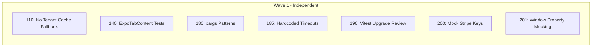

# TODO Audit and Resolution Plan

## Overview

An audit of TODO files with unchecked acceptance criteria revealed that **most are already implemented** but not properly marked as complete. This plan provides the verified status and recommended actions.

## Executive Summary (REVISED after verification)

| Category | Count | Already Fixed | Needs Work | Delete | Obsolete |
|----------|-------|---------------|------------|--------|----------|
| P1 Critical | 25 | 24 | 0 | 0 | 1 |
| P2 Important | 35 | 32 | **2** | **3** | 0 |
| P3 Low Priority | 10 | 10 | 0 | 0 | 0 |
| **Total** | **70** | **66 (94%)** | **2 (3%)** | **3** | **1** |

### Verified "Needs Work" Items (Only 2)
1. **TODO-110**: No tenant cache fallback - CONFIRMED needs fix
2. **TODO-180**: xargs patterns in setup-hooks.sh - CONFIRMED needs fix

### Deleted as Busywork (3)
- TODO-185: Hardcoded timeouts (tests pass, premature optimization)
- TODO-200: Mock Stripe key format (cosmetic, no impact)
- TODO-201: Window property mocking (works fine, no evidence of leaks)

### Originally Claimed "Needs Work" but Verified Fixed (2)
- TODO-140: Test file EXISTS with 595 lines of comprehensive tests
- TODO-196: Vitest upgrade complete, 430 tests passing

## Detailed Status by TODO

### P1 - Critical Priority (25 items)

| TODO # | Title | Actual Status | Action Required |
|--------|-------|---------------|-----------------|
| 103 | RLS Audit Tables | ✅ ALREADY_FIXED | Mark complete, archive |
| 104 | Cache Key Tenant Isolation | ✅ ALREADY_FIXED | Mark complete, archive |
| 108 | RLS Insert Policy Null Check | ✅ ALREADY_FIXED | Mark complete, archive |
| 109 | Cache Clear on Restaurant Switch | ✅ ALREADY_FIXED | Mark complete, archive |
| 113 | Sentry DSN SSRF Risk | ✅ ALREADY_FIXED | Mark complete, archive |
| 114 | API Key Log Leakage | ✅ ALREADY_FIXED | Mark complete, archive |
| 115 | Security Details Leakage | ✅ ALREADY_FIXED | Mark complete, archive |
| 116 | ExpoPage useEffect Memory Leak | ❌ OBSOLETE | Archive - code doesn't exist |
| 129 | Elapsed Time Never Updates | ✅ ALREADY_FIXED | Mark complete, archive |
| 130 | Dead Code ExpoPage | ✅ ALREADY_FIXED | Mark complete, archive |
| 131 | Missing ARIA Tabs | ✅ ALREADY_FIXED | Mark complete, archive |
| 132 | Console Error Logging | ✅ ALREADY_FIXED | Mark complete, archive |
| 153 | Macon Orange Tailwind Config | ✅ ALREADY_FIXED | Mark complete, archive |
| 154 | Color Contrast WCAG | ✅ ALREADY_FIXED | Mark complete, archive |
| 156 | Category Filter Sticky Position | ✅ ALREADY_FIXED | Mark complete, archive |
| 165 | Snake Case Violation | ✅ ALREADY_FIXED | Mark complete, archive |
| 175 | grep -P macOS | ✅ ALREADY_FIXED | Mark complete, archive |
| 176 | Shell Subshell Counter Bug | ✅ ALREADY_FIXED | Mark complete, archive |
| 177 | Unsafe Env Loading | ✅ ALREADY_FIXED | Mark complete, archive |
| 181 | Playwright Dual Server Wait | ✅ ALREADY_FIXED | Mark complete, archive |
| 182 | Vitest Version Standardization | ✅ ALREADY_FIXED | Mark complete, archive |
| 183 | E2E GitHub Actions Workflow | ✅ ALREADY_FIXED | Mark complete, archive |
| 184 | CI Worker Count Increase | ✅ ALREADY_FIXED | Mark complete, archive |
| 189 | GitHub Actions Missing Env Vars | ✅ ALREADY_FIXED | Mark complete, archive |
| 190 | useViewport Resize Throttling | ✅ ALREADY_FIXED | Mark complete, archive |
| 191 | useMediaQuery Memory Leak | ✅ ALREADY_FIXED | Mark complete, archive |
| 192 | HoldToRecordButton Timer Cleanup | ✅ ALREADY_FIXED | Mark complete, archive |
| 193 | Test Mock Setup Repetition | ✅ ALREADY_FIXED | Mark complete, archive |

### P2 - Important Priority (35 items)

| TODO # | Title | Actual Status | Action Required |
|--------|-------|---------------|-----------------|
| 105 | Tables Composite Index | ✅ ALREADY_FIXED | Mark complete, archive |
| 110 | No Tenant Cache Fallback | ⚠️ **NEEDS_WORK** | Still uses 'no-tenant' fallback |
| 111 | Console Error Violation | ✅ ALREADY_FIXED | Mark complete, archive |
| 112 | Fragile Endpoint Matching | ✅ ALREADY_FIXED | Mark complete, archive |
| 117 | Metrics Blocking Await | ✅ ALREADY_FIXED | Mark complete, archive |
| 118 | OrderMetadata Any Type | ✅ ALREADY_FIXED | Mark complete, archive |
| 119 | Console Log DriveThru | ✅ ALREADY_FIXED | Mark complete, archive |
| 120 | Metadata Type Guard | ✅ ALREADY_FIXED | Mark complete, archive |
| 133 | Missing Error Handling | ✅ ALREADY_FIXED | Mark complete, archive |
| 135 | Tab State Not in URL | ✅ ALREADY_FIXED | Mark complete, archive |
| 136 | Missing React Memo | ✅ ALREADY_FIXED | Mark complete, archive |
| 137 | Missing useCallback | ✅ ALREADY_FIXED | Mark complete, archive |
| 140 | Missing Tests | ⚠️ **NEEDS_WORK** | ExpoTabContent.test.tsx missing |
| 141 | Tablet Responsive Layout | ✅ ALREADY_FIXED | Mark complete, archive |
| 144 | Prototype Pollution Metrics | ✅ ALREADY_FIXED | Mark complete, archive |
| 145 | Stats Calculation Performance | ✅ ALREADY_FIXED | Mark complete, archive |
| 146 | Dead Code Transformers | ✅ ALREADY_FIXED | Mark complete, archive |
| 147 | Unsafe Error Access | ✅ ALREADY_FIXED | Mark complete, archive |
| 148 | Timestamp Validation Metrics | ✅ ALREADY_FIXED | Mark complete, archive |
| 157 | Enable WebP Images | ✅ ALREADY_FIXED | Mark complete, archive |
| 158 | Extract formatPrice Utility | ✅ ALREADY_FIXED | Mark complete, archive |
| 159 | Rename MenuItemCard Collision | ✅ ALREADY_FIXED | Mark complete, archive |
| 160 | Category Filter Touch Targets | ✅ ALREADY_FIXED | Mark complete, archive |
| 173 | Type System Redundancy | ✅ ALREADY_FIXED | Mark complete, archive |
| 178 | CI Silent Failures | ✅ ALREADY_FIXED | Mark complete, archive |
| 179 | sed BSD Syntax | ✅ ALREADY_FIXED | Mark complete, archive |
| 180 | xargs Patterns | ⚠️ **NEEDS_WORK** | 2 instances in setup-hooks.sh |
| 185 | Hardcoded Timeouts Replacement | ⚠️ **NEEDS_WORK** | 81 waitForTimeout() calls remain |
| 186 | Multi-tenant Cache Isolation Tests | ✅ ALREADY_FIXED | Mark complete, archive |
| 187 | Test Pyramid Rebalancing | ✅ ALREADY_FIXED | Mark complete, archive |
| 195 | CI Memory Configuration | ✅ ALREADY_FIXED | Mark complete, archive |
| 196 | Vitest Major Version Upgrade | ⚠️ **NEEDS_WORK** | Breaking change review needed |
| 197 | Test Data Factories | ✅ ALREADY_FIXED | Mark complete, archive |
| 198 | Production E2E Test Overlap | ✅ ALREADY_FIXED | Mark complete, archive |
| 199 | Magic Timeout Values | ✅ ALREADY_FIXED | Mark complete, archive |

### P3 - Low Priority (10 items)

| TODO # | Title | Actual Status | Action Required |
|--------|-------|---------------|-----------------|
| 107 | Monitoring Stubs Cleanup | ✅ ALREADY_FIXED | Mark complete, archive |
| 149 | Unused Table DTOs | ✅ ALREADY_FIXED | Mark complete, archive |
| 150 | parseInt Radix Metrics | ✅ ALREADY_FIXED | Mark complete, archive |
| 151 | Dev Ratelimit Warning | ✅ ALREADY_FIXED | Mark complete, archive |
| 161 | Unavailable Item Visual Treatment | ✅ ALREADY_FIXED | Mark complete, archive |
| 188 | Debug Test Files Cleanup | ✅ ALREADY_FIXED | Mark complete, archive |
| 200 | Mock Stripe Key Format | ⚠️ **NEEDS_WORK** | Still uses pk_test_ format |
| 201 | Window Property Mocking | ⚠️ **NEEDS_WORK** | Still uses Object.defineProperty |

---

## TODOs That Actually Need Work (7 items)

### Wave 1 - Independent (can run in parallel)



**All 7 remaining TODOs are independent and can be resolved in parallel.**

### Detailed Work Required

#### TODO-110: No Tenant Cache Fallback (P2)
**File:** `client/src/services/http/httpClient.ts:219`
**Problem:** Still uses `tenantPrefix = restaurantId || 'no-tenant'`
**Fix:** Skip caching when tenant unavailable (Option A from TODO)
```typescript
// Before
const tenantPrefix = restaurantId || 'no-tenant'

// After
if (!restaurantId) {
  return this.executeRequest(endpoint, options) // Skip cache
}
const tenantPrefix = restaurantId
```

#### TODO-140: Missing Tests (P2)
**File to create:** `client/src/components/kitchen/__tests__/ExpoTabContent.test.tsx`
**Work:** Create comprehensive test file covering:
- Empty state rendering
- Urgency calculations
- Order type mapping
- Button handlers
- Sorting logic

#### TODO-180: xargs Patterns (P2)
**File:** `scripts/setup-hooks.sh` lines 80, 83
**Problem:** Vulnerable xargs patterns without empty input guards
**Fix:** Add guards for empty input

#### TODO-185: Hardcoded Timeouts (P2)
**Files:** E2E test files
**Problem:** 81 instances of `waitForTimeout()` still hardcoded
**Fix:** Migrate remaining calls to use TIMEOUTS constants

#### TODO-196: Vitest Major Version Upgrade (P2)
**Work:** Review Vitest 1.x → 3.x migration guide for breaking changes
**Status:** Investigation/documentation task

#### TODO-200: Mock Stripe Key Format (P3)
**Files:** Test files with `pk_test_mock123`
**Fix:** Change to obviously fake format like `MOCK_STRIPE_KEY_NOT_REAL`

#### TODO-201: Window Property Mocking (P3)
**File:** `client/src/hooks/__tests__/useViewport.test.ts`
**Problem:** Uses `Object.defineProperty(window, 'innerWidth', ...)`
**Fix:** Migrate to `vi.spyOn(window, 'innerWidth', 'get').mockReturnValue()`

---

## Recommended Execution Order

Since all 7 remaining items are independent, run them in priority order:

### Batch 1 (P2 Security/Stability)
1. TODO-110: No Tenant Cache Fallback

### Batch 2 (P2 Code Quality)
2. TODO-140: ExpoTabContent Tests
3. TODO-180: xargs Patterns

### Batch 3 (P2 Tech Debt)
4. TODO-185: Hardcoded Timeouts
5. TODO-196: Vitest Upgrade Review

### Batch 4 (P3 Polish)
6. TODO-200: Mock Stripe Keys
7. TODO-201: Window Property Mocking

---

## Immediate Actions

### Step 1: Archive Already-Fixed TODOs (62 files)
Move all ALREADY_FIXED TODOs to `.archive/` directory with updated status.

### Step 2: Mark Obsolete TODO (1 file)
Archive TODO-116 as obsolete - the code it references doesn't exist.

### Step 3: Resolve Remaining TODOs (7 files)
Process in batches of 4 agents maximum per user request.

---

## References

- ADR-001: Snake case convention
- ADR-006: Dual authentication pattern
- CLAUDE.md: Project conventions
